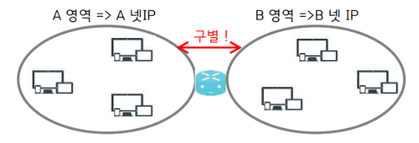

# 01

> **IPv4**
> 

> BIT/BYTE
> 

| **Bit** | Binary Digit 비트아라비아숫자(0-9)를 2진수(Binary)로 변환 표현할때 표현되는 한자리 |
| --- | --- |
| Byte(또는 Octet(옥텟) | 8bit의 1묶음 |

> 참고
> 

| 1bit | 2^1 | 2 (0~1) |
| --- | --- | --- |
| 2bit | 2^2 | 4 (0~3) |
| 3bit | 2^3 | 8 (0~7) |
| 4bit | 2^4 | 16 (0~15) |
| 5bit | 2^5 | 32 (0~31) |
| 6bit | 2^6 | 64 (0~63) |
| 7bit | 2^7 | 128 (0~127) |
| 8bit | 2^8 | 256 (0~255) |

> 문제
> 

```jsx
<진법변환 문제>

0	1	0	0	0	1	0	0	(8bit)

10진 변환값 : 64 + 4 =68

0	1	0	0	1	1	0	0	(8bit)

10진 변환값 : 64 + 8 + 4 = 76

0	1	1	0	1	1	0	0	(8bit)

10진 변환값 : 64 + 32 + 8 + 4 =108			

1	0	0	0	0	1	0	0	(8bit)

10진 변환값 : 128 + 4 =  132

1	0	0	0	0	1	1	1	(8bit)

10진 변환값 : 128 + 4 + 2 + 1 =  135

```

```jsx
1100 1100 = 128 + 64 + 8 + 4 = 204
1010 1010 = 128 + 32 + 8 + 2 = 170
1110 0111 = 128 + 64 + 32 + 4 + 2 + 1 = 231
1100 1101 = 128 + 64 + 8 + 4 + 1 = 205
0110 1101 = 64 + 32 + 8 + 4 + 1 = 109
```

> 참고
> 

```jsx
Nibble(니블)
  - 4bit의 1 묶음

Word(워드)
    32비트 아키텍처의 경우: 4바이트
    64비트 아키텍처의 경우: 8바이트

Half word:
    32비트 아키텍처의 경우: 2바이트
    64비트 아키텍처의 경우: 4바이트

Double word:
    32비트 아키텍처의 경우: 8바이트
    64비트 아키텍처의 경우: 16바이트

Character(문자)
  - 통상 ASCII 방식으로 1문자를 1byte로 표현
```

> **NETWORK IP**
> 



```jsx
네트워크 영역 식별 IP
```

> **HOST IP**
> 


```jsx
개체 간 식별 IP
```

> **SUBNET MASK**
> 

```jsx
네트워크IP/호스트IP를 지정하기 위해 사용되는 마스크
32bit로 구성
1 : 네트워크 IP(Prefix)
0 : 호스트 자리(UnPrefix)
```

> 문제
> 

```jsx
문제
-------------------------------------------------------------------------------
서브넷마스크당 네트워크IP / 호스트IP / 호스트IP 할당 범위를 구하세요

----------------------------------------------------------
IP : 10.5.4.9
----------------------------------------------------------
-------------------------------
255.0.0.0 
-------------------------------
네트워크 IP	: 10.0.0.0
사용 호스트 IP 	: 10.5.4.9
호스트범위	: 10.0.0.1 - 10.255.255.254

-------------------------------
255.255.0.0 
-------------------------------
네트워크 IP	: 10.5.0.0
사용 호스트 IP 	: 10.5.4.9
호스트범위	: 10.5.0.1 ~ 10.5.255.254

-------------------------------
255.255.255.0 
-------------------------------
네트워크 IP	: 10.5.4.0
사용 호스트 IP 	: 10.5.4.9
호스트범위	: 10.5.4.1 ~ 10.5.4.254 

----------------------------------------------------------
IP : 179.65.4.1
----------------------------------------------------------
-------------------------------
255.0.0.0 
-------------------------------
네트워크 IP	: 179.0.0.0
사용 호스트 IP : 179.65.4.1
호스트범위	: 179.0.0.1 ~ 179.255.255.254

-------------------------------
255.255.0.0 
-------------------------------
네트워크 IP	: 179.65.0.0
사용 호스트 IP : 179.65.4.1
호스트범위	: 179.65.0.1 ~ 179.65.255.254

-------------------------------
255.255.255.0 
-------------------------------
네트워크 IP	: 179.65.4.0
사용 호스트 IP : 179.65.4.1
호스트범위	: 179.65.4.1 ~ 179.65.4.254

----------------------------------------------------------
IP : 199.89.67.5
----------------------------------------------------------
-------------------------------
255.0.0.0 
-------------------------------
네트워크 IP	: 10.0.0.0
사용 호스트 IP 	: 10.5.4.9
호스트범위	: 10.0.0.1 ~ 10.255.255.254

-------------------------------
255.255.0.0 
-------------------------------
네트워크 IP	: 10.5.0.0
사용 호스트 IP 	: 10.5.4.9
호스트범위	: 10.5.0.1 ~ 10.5.255.254

-------------------------------
255.255.255.0 
-------------------------------
네트워크 IP	: 10.5.4.0
사용 호스트 IP 	: 10.5.4.9
호스트범위	: 10.5.4.1 ~ 10.5.4.254
```

> **클래스풀**
> 

**클래스풀**


> 클래스풀 (Classful)
> 

```jsx
인터넷 상의 IP 주소를 규격화된 크기별(클래스별)로 구분시키는 방식
```

> 클래스리스 (CLassless)
> 

```jsx
Class 라는 규격화된 구분없이 비트(bit) 단위별로 IP 주소 범위를 가변적으로 구현
```

> 클래스풀 정리
> 


> 문제
> 

```jsx
Classful 문제

------------------------------------------------------------------------

192.168.10.100
Class : C
Subnet Mask : 255.255.255.0 
Network 주소 : 192.168.10.0
할당 가능한 IP 주소 : 192.168.10.1 ~ 192.168.10.254
Broadcast 주소 : 192.168.10.255

------------------------------------------------------------------------

2.1.1.250
Class : A
Subnet Mask : 255.0.0.0 
Network 주소 : 2.0.0.0 
할당 가능한 IP 주소 : 2.0.0.1 ~ 2.255.255.254
Broadcast 주소 : 2.255.255.255

------------------------------------------------------------------------

154.123.67.8
Class : B
Subnet Mask : 255.255.0.0
Network 주소 : 154.123.0.0
할당 가능한 IP 주소 : 154.123.0.1 ~ 154.123.255.254
Broadcast 주소 : 154.123.255.255

------------------------------------------------------------------------

223.16.192.33
Class : C
Subnet Mask : 255.255.255.0 
Network 주소 : 223.16.192.0
할당 가능한 IP 주소 : 223.16.192.1 ~ 223.16.192.254
Broadcast 주소 : 223.16.192.255

------------------------------------------------------------------------

111.111.111.111
Class : A
Subnet Mask : 255.0.0.0 
Network 주소 : 111.0.0.0
할당 가능한 IP 주소 : 111.0.0.1 ~ 111.255.255.254
Broadcast 주소 :  111.255.255.255

------------------------------------------------------------------------

189.18.119.20
Class : B
Subnet Mask : 255.255.0.0 
Network 주소 : 189.18.0.0
할당 가능한 IP 주소 : 189.18.0.1 ~ 189.18.255.254
Broadcast 주소 : 189.18.255.255

------------------------------------------------------------------------

54.40.50.94
Class : A
Subnet Mask : 255.0.0.0 
Network 주소 : 54.0.0.0
할당 가능한 IP 주소 : 54.0.0.1 ~ 54.255.255.254
Broadcast 주소 :  54.255.255.255

------------------------------------------------------------------------

148.45.14.99
Class : B
Subnet Mask : 255.255.0.0
Network 주소 : 148.45.0.0
할당 가능한 IP 주소 : 148.45.0.1 ~ 148.45.255.254
Broadcast 주소 : 148.45.255.255

------------------------------------------------------------------------
```

> **IPv4 통신방식**
> 


```jsx
Unicast (1:1): 한 컴퓨터에서 다른 하나의 컴퓨터로 정보를 보냅니다.
ex) 내가 친구에게 메시지를 보내는 것처럼, 정확하게 1:1로 정보를 전달.

Broadcast (1:모두): 한 컴퓨터에서 네트워크에 있는 모든 컴퓨터로 정보를 보냅니다.
ex) 내가 방 안에 있는 모든 사람에게 메시지를 보내는 것처럼, 모든 사람에게 정보를 전달.

Multicast (1:선택된 다수): 한 컴퓨터에서 특정한 여러 컴퓨터로 정보를 보냅니다.
ex) 내가 몇몇 친구들에게만 메시지를 보내는 것처럼, 선택된 사람들만 정보 받기.
```