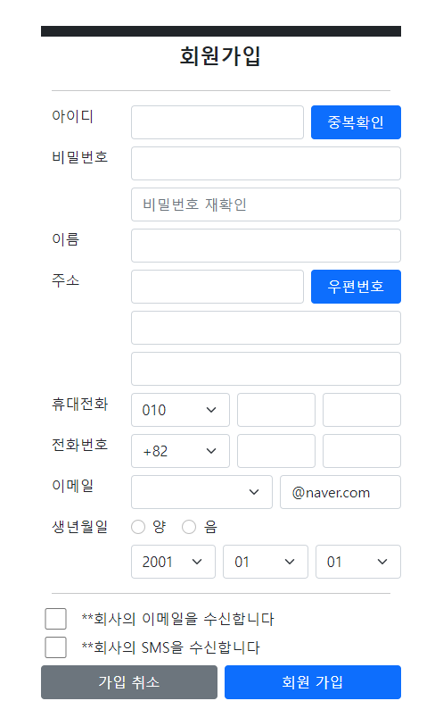

# 01

> **12Video.html**
> 

```jsx
<!DOCTYPE html>
<html lang="en">

<head>
    <meta charset="UTF-8">
    <meta name="viewport" content="width=device-width, initial-scale=1.0">
    <title>Document</title>

    <style>
        body {
            margin: 0;
        }
        .bg-video{
            position : absolute;
            left : 0;
            top : 0;
            width : 100vw;
            height: 100vh;
            z-index : -2;
            opacity: .8;
        }
        .bg-video>video{
            width: 100%;
            height: 100%;
            object-fit: cover;
        }
        body::-webkit-scrollbar{
            display: none;
        }
    </style>
</head>

<body>
    <div class="bg-video">
        <video autoplay muted loop>
            <source src="./video/earth.mp4 " type="video/mp4">
        </video>
    </div>
</body>

</html>
```

---

> **13Video.html**
> 

```jsx
<!DOCTYPE html>
<html lang="en">

<head>
    <meta charset="UTF-8">
    <meta name="viewport" content="width=device-width, initial-scale=1.0">
    <title>Document</title>
</head>

<body>
    <iframe width="560" height="315" src="https://www.youtube.com/embed/8mt5oWcs_9M?si=4USiUQrIVSTLyb0F&autoplay=1&mute=1"
        title="YouTube video player" frameborder="0" allow="accelerometer; autoplay; clipboard-write;
      encrypted-media; gyroscope; picture-in-picture; web-share" referrerpolicy="strict-origin-when-cross-origin"
        allowfullscreen></iframe>
</body>

</html>
```

---

> **14Form.html**
> 

```jsx
<!DOCTYPE html>
<html lang="en">

<head>
    <meta charset="UTF-8">
    <meta name="viewport" content="width=device-width, initial-scale=1.0">
    <title>Document</title>
</head>

<body>
    <!-- 
    form : 사용자로부터 특정정보를 받아 서버로 전달하는데 사용되는 태그
    action Attribute : 전달받는 서버 URI
    method Attribute : 서버로 요청하는 방식
        - GET        : 사용자 요청 정보를 Query String으로 전달(Default)
        - GET        : 사용자 요청 정보를 Request body(payload)으로 전달(Default)
        - PUT        :
        - PATCH      :
        - DELETE     :
    -->
    <form action="/test.jsp" method="get">
        <div>
            <label for="">아이디</label>
            <input type="text" name="userid">
            <!-- javascript:void(0)를 해야 새로고침 꺼지게하는 기능 -->
            <a href="javascript:void(0)">중복확인</a>
        </div>
        <div>
            <label for="">비밀번호</label>
            <!-- type ="password" = "*" 표시됨  -->
            <input type="password" name="password">
        </div>
        <div>
            <label for=""></label>
            <!-- placeholder="비밀번호 재확인" = 박스안에 적힘 -->
            <input type="password" name="re-password" placeholder="비밀번호 재확인">
        </div>
        <div>
            <label for="">이름</label>
            <input type="text" name="username">
        </div>
        <div>
            <label for="">주소</label>
            <input type="text" name="zipcode">
            <!-- javascript:void(0)를 해야 새로고침 꺼지게하는 기능 -->
            <a href="javascript:void(0)">우편번호</a>
        </div>
        <div>
            <label for=""></label>
            <input type="text" name="addr1">
        </div>
        <div>
            <label for=""></label>
            <input type="text" name="addr2">
        </div>
        <div>
            <label for="">휴대전화</label>
            <select name="phone1">
                <option value="">010</option>
                <option value="">011</option>
            </select>
            <input type="text" >
            <input type="text">
        </div>
        <div>
            <label for="">전화번호</label>
            <select name="phone2">
                <option value="">082</option>
                <option value="">053</option>
            </select>
            <input type="text">
            <input type="text">
        </div>
        <div>
            <label for="">이메일</label>
            <input type="text" name="email">
            <select>
                <option value="">@naver.com</option>
                <option value="">@daum.net</option>
            </select>
        </div>
        <div>
            <label for="">생년월일</label>
            <input type="radio" name="cal" value="1"> 양
            <input type="radio" name="cal" value="0"> 음
            <br>
            <select>
                <option value="">2001</option>
                <option value="">2002</option>
            </select>
            <select>
                <option value="">01</option>
                <option value="">12</option>
            </select>
            <select>
                <option value="">01</option>
                <option value="">30</option>
            </select>
        </div>
        <hr>
        <div>
            <input type="checkbox" name="email-recv">
            <label for="">**회사의 이메일을 수신합니다</label>
        </div>
        <div>
            <input type="checkbox" name="sns-recv">
            <label for="">**회사의 SMS을 수신합니다</label>
        </div>
        <div>
            <input type="submit" value="가입 취소">
            <button>회원 가입</button>
        </div>
    </form>
</body>

</html>
```

---

> **15Form.html**
> 

```jsx
<!DOCTYPE html>
<html lang="en">

<head>
    <style>
        /* common 설정 */
        *{
            font-size: .9r;
        }
        a {
            text-decoration: none;
            color: black;
            border: 1px solid gray;
            display: block;
            height: 100%;
            width: 100%;
            line-height: 35px;
            text-align:center;
            font-size: .8rem;
            max-width: 80px;
        }

        body {
            margin: 0;
            padding: 0;
        }
        form{
            width: 380px;
            border: 1px solid gray;
            margin: 50px auto;
            padding: 0px;
        }
        form>.row{
            margin-bottom: 10px;
            display: flex;
            justify-content: left;
            align-items: center;
            gap: 5px;
            height: 35px;
            margin-left : 10px;
            margin-right : 10px;
        }
        form>.row>label{
            min-width: 85px;
            /* border: 1px solid; */
            height: 100%;
            line-height: 35px;
        }
        form>.row>input[type="text"],
        form>.row>input[type="password"],
        form>.row>select
        {
            height: 100%;
            width: 100%;
            outline: none;
            border-radius: 0;
            border: 1px solid gray;
        }
        form>.row.header{
            height: 15px;
            border: 1px solid;
            margin: 0;
            background-color: black;
        }
        form>.row.title{
            text-align: center;
            justify-content: center;
        }
        form>.row-line{
            border: 0px solid gray;
            height: 1px;
            background-color: gray;
            margin: 10px 0;
            margin-bottom: 25px;
        }
        form>.row.agreement{
            height: 15px;
        }
        form>.row.agreement>label{
            height: 100%;
            line-height: 12px;
        }
        form>.row.btn-group{
            display: flex;
            justify-content: center;
            align-items: center;
        }
        form>.row.btn-group>button,
        form>.row.btn-group>input[type="submit"]{
            width : 100%;
            height: 100%;
            border-radius: 0;
            border: 1px solid gray;
            outline : none;
            cursor : pointer;
        }
    </style>
</head>

<body>
    <!-- 
    form : 사용자로부터 특정정보를 받아 서버로 전달하는데 사용되는 태그
    action Attribute : 전달받는 서버 URI
    method Attribute : 서버로 요청하는 방식
        - GET        : 사용자 요청 정보를 Query String으로 전달(Default)
        - GET        : 사용자 요청 정보를 Request body(payload)으로 전달(Default)
        - PUT        :
        - PATCH      :
        - DELETE     :
    -->
    <form action="/test.jsp" method="get">
        <div class="row header">
            <!-- 헤더(검정색) -->
        </div>

        <div class="row title">
            <!-- title -->
            <h4> 회원가입</h4>
        </div>
        <hr>
        <div class="row">
            <label for="">아이디</label>
            <input type="text" name="userid">
            <!-- javascript:void(0)를 해야 새로고침 꺼지게하는 기능 -->
            <a href="javascript:void(0)">중복확인</a>
        </div>
        <div class="row">
            <label for="">비밀번호</label>
            <!-- type ="password" = "*" 표시됨  -->
            <input type="password" name="password">
        </div>
        <div class="row">
            <label for=""></label>
            <!-- placeholder="비밀번호 재확인" = 박스안에 적힘 -->
            <input type="password" name="re-password" placeholder="비밀번호 재확인">
        </div>
        <div class="row">
            <label for="">이름</label>
            <input type="text" name="username">
        </div>
        <div class="row">
            <label for="">주소</label>
            <input type="text" name="zipcode">
            <!-- javascript:void(0)를 해야 새로고침 꺼지게하는 기능 -->
            <a href="javascript:void(0)">우편번호</a>
        </div>
        <div class="row">
            <label for=""></label>
            <input type="text" name="addr1">
        </div>
        <div class="row">
            <label for=""></label>
            <input type="text" name="addr2">
        </div>
        <div class="row">
            <label for="">휴대전화</label>
            <select name="phone1">
                <option value="">010</option>
                <option value="">011</option>
            </select>
            <input type="text">
            <input type="text">
        </div>
        <div class="row">
            <label for="">전화번호</label>
            <select name="phone2">
                <option value="">082</option>
                <option value="">053</option>
            </select>
            <input type="text">
            <input type="text">
        </div>
        <div class="row">
            <label for="">이메일</label>
            <input type="text" name="email">
            <select>
                <option value="">@naver.com</option>
                <option value="">@daum.net</option>
            </select>
        </div>
        <div class="row">
            <label for="">생년월일</label>
            <input type="radio" name="cal" value="1"> 양
            <input type="radio" name="cal" value="0"> 음
            <br>
            <select>
                <option value="">2001</option>
                <option value="">2002</option>
            </select>
            <select>
                <option value="">01</option>
                <option value="">12</option>
            </select>
            <select>
                <option value="">01</option>
                <option value="">30</option>
            </select>
        </div>
        <hr>
        <div class="row agreement">
            <input type="checkbox" name="email-recv">
            <label for="">**회사의 이메일을 수신합니다</label>
        </div>
        <div class="row agreement">
            <input type="checkbox" name="sns-recv">
            <label for="">**회사의 SMS을 수신합니다</label>
        </div>
        <div class="row btn-group">
            <input type="submit" value="가입 취소">
            <button>회원 가입</button>
        </div>
    </form>
</body>

</html>
```

---

> **15문제.html**
> 

```jsx
<!DOCTYPE html>
<html lang="en">

<head>
    <style>
        form>.right-position {
            float: right;
        }
        body{
            margin: 0;
            padding: 0;
        }
        form{
            width: 350px;
            border: 1px solid gray;
            margin: 50px auto;
            padding: 0;
        }
        form>.row{
            border: 1px solid gray;
            display: flex;
            justify-content: left;
            gap: 5px;
            height: 35px;
            width: 320px;
            margin-left : 15px;
            margin-right : 15px;
        }
        form>.high{
            border: 1px solid gray;
            display: flex;
            justify-content: left;
            gap: 5px;
            height: 35px;
            width: 320px;
            margin-left : 15px;
            margin-right : 15px;
        }
        form>.row>input{
            min-width: 85px;
            height: 100%;
            line-height: 35px;
        }
        form>.row>input[type="text"],
        form>.row>input[type="password"],
        form>.row>select
        {
            height: 100%;
            width: 100%;
            outline: none;
            border-radius: 0;
            border: 1px solid gray;
        }
        form>.high>input[type="text"],
        form>.high>input[type="password"],
        form>.high>select[name="phone1"],
        form>.row>select
        {
            height: 100%;
            width: 100%;
            outline: none;
            border-radius: 0;
            border: 1px solid gray;
        }
        form>.btn-group{
            display: flex;
            justify-content: center;
            align-items: center;
        }
        form>.btn-group>button{
            width : 100%;
            height: 100%;
            border-radius: 10;
            outline : none;
            cursor : pointer;
            background-color: rgb(0, 207, 0);
            
        }
    </style>
</head>

<body>
    <form action="/test1.jsp" method="get">
        <div class="logo">
            <h3>NAVER</h3>
        </div>
        <div class="right-position">
            실명 인증된 아이디로 가입
            <input type="checkbox">
        </div>
        <!-- 아이디 비밀 -->
        <div class="row">
            <input type="text" placeholder="아이디">
        </div>
        <div class="row">
            <input type="password" placeholder="비밀번호">
        </div>
        <div class="row">
            <input type="text" placeholder="[선택] 이메일주소(비밀번호 찾기 등 본인 확인용)">
        </div>
        <br>
        <!-- 사람 구성-->
         <div class="high">
            <input type="text" placeholder="이름">
         </div>
         <div class="high">
            <input type="text" placeholder="생년월일 8자리">
         </div>
         <div class="high">
            <input type="button" placeholder="남자">
            <!-- <a href="javascript:void(0)"></a> -->
         </div>
         <div class="high">
            <input type="button" placeholder="여자">
         </div>
         <div class="high">
            <input type="button" placeholder="선택안함">
         </div>
         <div class="high">
            <select name="phone1">
                <option value="">대한민국 +82</option>
                <option value="">아프리카 +18</option>
            </select>
         </div>
         <div class="high">
            <input type="text" placeholder="휴대전화번호">
         </div>
         <br>
         <div class="btn-group">
            <button>인증요청</button>
         </div>
    </form>
</body>

</html>
```

---

> **16Form.html**
> 

```jsx
<!DOCTYPE html>
<html lang="en">

<head>
    <!-- BS5 -->
    <link href="https://cdn.jsdelivr.net/npm/bootstrap@5.0.2/dist/css/bootstrap.min.css" rel="stylesheet"
        integrity="sha384-EVSTQN3/azprG1Anm3QDgpJLIm9Nao0Yz1ztcQTwFspd3yD65VohhpuuCOmLASjC" crossorigin="anonymous">
    <script src="https://cdn.jsdelivr.net/npm/bootstrap@5.0.2/dist/js/bootstrap.bundle.min.js"
        integrity="sha384-MrcW6ZMFYlzcLA8Nl+NtUVF0sA7MsXsP1UyJoMp4YLEuNSfAP+JcXn/tWtIaxVXM"
        crossorigin="anonymous"></script>

    <style>
        a.fs-custom-small {
            font-size: .8rem !important;
        }

        form {
            width: 380px !important;
            margin: 50px auto
        }
        .header{
            height: 12px;
        }
       
    </style>
</head>

<body>
    <!-- 
    form : 사용자로부터 특정정보를 받아 서버로 전달하는데 사용되는 태그
    action Attribute : 전달받는 서버 URI
    method Attribute : 서버로 요청하는 방식
        - GET        : 사용자 요청 정보를 Query String으로 전달(Default)
        - GET        : 사용자 요청 정보를 Request body(payload)으로 전달(Default)
        - PUT        :
        - PATCH      :
        - DELETE     :
    -->
    <form action="/test.jsp" method="get" class="mt-5">
        <div class="row header mb-2 bg-dark">
            <!-- 헤더(검정색) -->
        </div>

        <div class="row title mb-2">
            <!-- title -->
            <h4 class="text-center fw-bold"> 회원가입</h4>
        </div>
        <hr>
        <div class="row mb-2">
            <label for="" class="col-3">아이디</label>
            <input type="text" name="userid" class="col form-control">
            <!-- javascript:void(0)를 해야 새로고침 꺼지게하는 기능 -->
            <a href="javascript:void(0)" class="col-3 btn btn-primary ms-2">중복확인</a>
        </div>
        <div class="row mb-2">
            <label for="" class="col-3">비밀번호</label>
            <!-- type ="password" = "*" 표시됨  -->
            <input type="password" name="password" class="col form-control">
        </div>
        <div class="row mb-2">
            <label for="" class="col-3"></label>
            <!-- placeholder="비밀번호 재확인" = 박스안에 적힘 -->
            <input type="password" name="re-password" placeholder="비밀번호 재확인" class="col form-control">
        </div>
        <div class="row mb-2">
            <label for="" class="col-3">이름</label>
            <input type="text" name="username" class="col form-control">
        </div>
        <div class="row mb-2">
            <label for="" class="col-3">주소</label>
            <input type="text" name="zipcode" class="col form-control">
            <!-- javascript:void(0)를 해야 새로고침 꺼지게하는 기능 -->
            <a href="javascript:void(0)" class="col-3 btn btn-primary ms-2">우편번호</a>
        </div>
        <div class="row mb-2">
            <label for="" class="col-3"></label>
            <input type="text" name="addr1" class="col form-control">
        </div>
        <div class="row mb-2">
            <label for="" class="col-3"></label>
            <input type="text" name="addr2" class="col form-control">
        </div>
        <div class="row mb-2">
            <label for="" class="col-3">휴대전화</label>
            <select name="phone1" class="col form-select me-2">
                <option value="">010</option>
                <option value="">011</option>
            </select>
            <input type="text" class="col form-control me-2">
            <input type="text" class="col form-control">
        </div>
        <div class="row mb-2">
            <label for="" class="col-3">전화번호</label>
            <select name="phone2" class="col form-select me-2">
                <option value="082">+82</option>
                <option value="053">+53</option>
            </select>
            <input type="text" class="col form-control me-2">
            <input type="text" class="col form-control">
        </div>
        <div class="row mb-2">
            <label for="" class="col-3">이메일</label>
            <input type="text" name="email" class="col form-select me-2">
            <select class="col form-control">
                <option value="naver">@naver.com</option>
                <option value="daum">@daum.net</option>
            </select>
        </div>
        <div class="row mb-2">
            <label for="" class="col-3 form-cheak-label">생년월일</label>
            <input type="radio" name="cal" value="1" class="col-1 p-0 me-2 form-check-input">
            <label for="" class="col-1 p-0">양</label>
            <input type="radio" name="cal" value="0" class="col-1 p-0 me-2 form-check-input">
            <label for="" class="col-1 p-0">음</label>
        </div>
        <div class="row mb-2">
            <label for="" class="col-3"></label>
            <select class="col form-select me-2">
                <option value="">2001</option>
                <option value="">2002</option>
            </select>
            <select class="col form-select me-2">
                <option value="">01</option>
                <option value="">12</option>
            </select>
            <select class="col form-select">
                <option value="">01</option>
                <option value="">30</option>
            </select>
        </div>
        <hr>
        <div class="row agreement  mb-2">
            <input type="checkbox" name="email-recv" class="col-1 form-cheak-input p-0">
            <label for="" class="col">**회사의 이메일을 수신합니다</label>
        </div>
        <div class="row agreement mb-2">
            <input type="checkbox" name="sns-recv" class="col-1 form-cheak-input p-0">
            <label for="" class="col">**회사의 SMS을 수신합니다</label>
        </div>
        <div class="row mb-2">
            <div class="col p-0">
                <a class="col btn btn-secondary w-100 mb-2 fs-6" href="javascript:void(0)">가입 취소</a>
            </div>
            <div class="col ms-2 p-0">
                <button class="btn btn-primary w-100 fs-6">회원 가입</button>
            </div>
        </div>
    </form>
</body>

</html>
```



---

> **17Form.html**
> 

```jsx
<!DOCTYPE html>
<html lang="en">

<head>
    <meta charset="UTF-8">
    <meta name="viewport" content="width=device-width, initial-scale=1.0">
    <title>Document</title>

    <!-- BS5 -->
    <link href="https://cdn.jsdelivr.net/npm/bootstrap@5.0.2/dist/css/bootstrap.min.css" rel="stylesheet"
        integrity="sha384-EVSTQN3/azprG1Anm3QDgpJLIm9Nao0Yz1ztcQTwFspd3yD65VohhpuuCOmLASjC" crossorigin="anonymous">
    <script src="https://cdn.jsdelivr.net/npm/bootstrap@5.0.2/dist/js/bootstrap.bundle.min.js"
        integrity="sha384-MrcW6ZMFYlzcLA8Nl+NtUVF0sA7MsXsP1UyJoMp4YLEuNSfAP+JcXn/tWtIaxVXM"
        crossorigin="anonymous"></script>

    <style>
        * {
            box-sizing: border-box;
            font-size: .8rem;
        }

        body {
            padding: 0;
            margin: 0;
            width: 100%;
        }

        a {
            text-decoration: none;
            color: black;
        }

        /* 폼속성 */
        form {
            width: 380px !important;
            margin: 50px auto;
            text-align: center;
            /* border : 1px solid; */
        }

        /* 위치조정 아래 4개*/
        form>.right-position {
            float: right;
        }

        form>.left-position {
            float: left;
        }

        form>.container {
            float: block;
        }

        /* 버튼 투명색 */
        .transparent-button {
            background-color: transparent;
            border: 0px;
            color: #000;
            /* padding: 10px 20px; */
            cursor: pointer;
            outline: none;
        }

        .button-center {
            text-align: center;
        }
    </style>

</head>

<body>

    <form action="/test.jsp" method="get" class="m-0 p-2 ">
        <div>
            
        </div>
        <!-- 제목 -->
        <div class="row m-0 p-0 mb-5">
            <h2 class="fw-bold">로그인</h2>
        </div>
        <!-- 아이디 -->
        <div class="row  m-0 p-0 mb-2">
            <label for=""></label>
            <input type="text" name="username" placeholder="아이디를 입력해주세요" class="col form-control" />
        </div>
        <!-- 비번 -->
        <div class="row  m-0 p-0 mb-2">
            <label for=""></label>
            <input type="password" name="password" placeholder="비밀번호를 입력해주세요" class="col form-control" />
        </div>
        <!--가로 컨텐츠-->
        <div class="row m-0 p-0">
            <!-- <div class=" m-0 p-0 col-4 " >
                <input class="form-check-input" type="checkbox" id="">
                <label class="" for="">로그인 상태를 유지</label>
            </div> -->
            <div class="col-4 m-0 form-check form-switch">
                <input class="form-check-input" type="checkbox" id="flexSwitchCheckDefault">
                <label class="m-0 p-0 form-check-label" for="flexSwitchCheckDefault">로그인 상태 유지</label>
            </div>
            <div class="col-8 row m-0 p-0 d-flex justify-content-end ">
                <div class="col-4 m-0 p-0">
                    <button class="w-100 transparent-button">아이디 찾기</button>
                </div>
                <span class="col-1 m-0 p-0 ">|</span>
                <div class="col-4 m-0 p-0">
                    <button class="w-100 transparent-button">비밀번호 찾기</button>
                </div>
            </div>
        </div>
        <!-- 로그인 -->
        <div class="button-center">
            <label for=""></label>
            <button class="btn btn-primary w-100">로그인</button>
        </div>
        <!-- 회원가입 -->
        <div class="button-center">
            <label for=""></label>
            <button class="btn btn-light w-100">회원가입</button>
        </div>

    </form>

</body>

</html>
```

