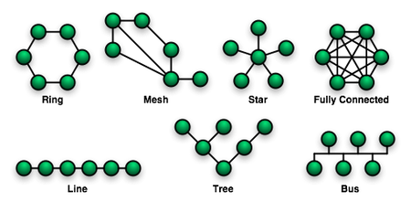

# 01

> **NETWORK**
> 

```jsx
데이터 교환을 위해 통신장치를 연결한 통신망
```

> 토폴로지 (장치를 연결하는 통로) 확인
> 



| RING형 | 장치들이 원형으로 연결되어 데이터가 한 방향으로 흐름. |
| --- | --- |
| STAR형 | 모든 장치가 중앙 허브에 연결되어 데이터가 중심을 통해 전달됨. |
| TREE형 | 여러 개의 스타형 연결이 계층적으로 연결되어 트리 모양을 만듬. |
| MESH형 | 모든 장치가 서로 직접 연결되어 데이터가 여러 경로로 흐를 수 있음. |
| BUS형 | 모든 장치가 하나의 공통된 케이블에 연결되어 데이터가 양방향으로 흐름. |

> NETWORK 종류
> 

```jsx
LAN = 근거리 통신망 (2km 내외)
WAN = 광역 통신망 (부산 - 서울, 한국 - 일본  아주 먼 거리)
```

> 인터넷(INTERNET)
> 

```
인터넷은 전 세계적으로 연결된 컴퓨터 네트워크의 집합으로, 다양한 공공 및 개인 네트워크들이 상호 연결됨
여러 종류의 통신망을 한데 묶은 거대 통신망
```

> PROTOCOL이란
> 

---

```
컴퓨터나 기기들이 서로 통신할 때 따르는 규칙이나 약속이다.
```

> 구문(Syntax)
> 

```jsx
프로토콜은 데이터의 구문적인 형식을 정의합니다.
```

> 의미(Meaning)
> 

```jsx
적절한 단어 선택이 필요하다.
```

> 타이밍(Timing)
> 

```jsx
일정한 속도로 데이터를 보내야 상대방이 받을 수 있다.
```

> 네트워크 모델
> 

```jsx
설계 도면 같은 역할하는게 네트워크 모델
```

> 네트워크 모델의 변화
> 

```jsx
공급업체들간의 각각 다른 형태의 네트워크 모델이 존재
서로 다른 장치더라도 데이터 원활히 할수 있게 하는게 OSI 7Layer.
현재는 TCP/IP를 널리 사용.
```

> OSI 모델
> 


```jsx
물리계층 : 장치간 물리적인 연결
데이터 링크 계층 : 장치간 데이터 운송방식 결정
네트워크 계층 : 경로탐색
전송 계층 : 송수신간의 데이터의 신뢰성을 확보
세션 계층 : 통신 연결을 설정하고 유지.
표현 계층 : 데이터 형식을 이해할 수 있게 변환.
응용 계층 : 사용자와 네트워크 서비스 간의 상호작용 처리.
```

> 문제
> 

```jsx
1. Network 는 무엇이며 무엇을 목적으로 하는가?
데이터 교환을 목적으로 여러 통신장치들을 연결한 통신

2. Network 의 종류는 크게 ooo/ooo 로 나눌 수 있다
LAN / WAN

3. LAN 의 특징에 대해서 서술하세요
근거리 통신망
연결된 장치간의 거리가 비교적 가까운 형태로 연결한 통신

4. WAN의 특징에 대해서 서술하세요
원거리 통신망(광역통신망)
통신장치간 거리가 비교적 먼 거리의 통신장치간의 연결형태를 가진 통신망

5. InterNet 이란
여러 종류의 통신망을 한데 묶은 거대 통신망

6. 프로토콜은 무엇인가?
컴퓨터나 기기가 통신할때 사용할 때 사용하는 약속이나 규칙

7. 네트워킹 모델의 목적은 무엇인가?
통신망 구현의 위한 지침서
하자 발생시 참고하는 지침서
이기종간 장치간 통신을 위해 미리 정의해 놓은 표준 프로토콜 모델
컴퓨터 간의 효율적인 통신을 위해 역할을 나누고, 표준화된 규칙을 제공하는 것

8. TCP/IP 모델과 OSI 7 모델의 계층을 적고 각 계층별 역할을 적으세요
TCP/IP = 전세계가 사용하는 통신 언어
물리계층 = 장치간 물리적인 연결
데이터 링크 계층 = 장치간 데이터 운송방식 결정
네트워크 계층 = 경로탐색
전송 계층 = 송수신간의 데이터의 신뢰성을 확보
```