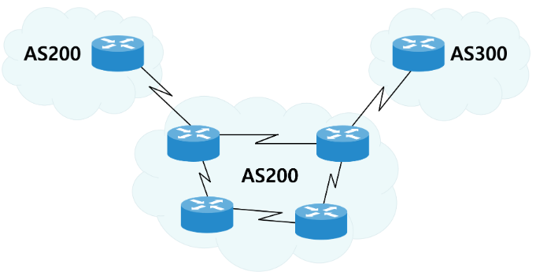

# 01

> Routing Protocol
> 

```jsx
Route : 경로
Router : 경로안내장치
Routing : 경로안내작업
Protocol : 퉁신위한 프로그램
```

> 동적
> 

```jsx
IGP - DISTANCE VECTOR : RIPv2
		-	LINK-STATE : OSPF

EGP : BGP
```

> **AS**
> 

```jsx
**AS = AUTONOMUS SYSTEM**
자치시스템 (관리자에 의해 관리되는 라우터의 집합/집단)
```



> ASBR
> 

```jsx
ASBR = AS Boundary Router
AS 가장자리에서 다른 AS를 연결할 때 사용되는 라우터
```

> Distance Vector
> 

```jsx
Distance Vector : RIPv2
전체네트워크 학습 => 최적경로 산출
```

> IGP
> 

```jsx
IGP = Interior Gateway Protocol
자치시스템 내부에서 만 이루어지는 라우팅 프로토콜
```

> EGP
> 

```jsx
EGP = Exterior Gateway Protocol
자치시스템 (AS) 상호 간에 적용되는 라우팅 프로토콜 (Inter-Domain Routing Protocol)
- 즉, 독립 운용되는 대규모 네트워크 (AS) 간에, 네트워크 정보를 교환하기 위해 주로 사용됨
```

> 링크상태 라우팅 알고리즘
> 

```jsx
(Link State Routing Algorithm)
OSPF : 네트워크 내 모든 라우터가 링크 상태 정보를 교환하여 최단 경로를 갱신하는 방법
```

> RIP
> 


> 문제
> 

