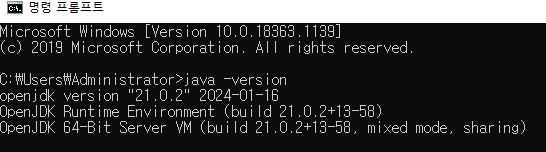

# 02

> 미들웨어
> 

```jsx
ware : 제품
hardware : CPU,RAM,DISK..부품
software : hardware 자원을 이용해서 특정 목적달성위해 사용되는 컴퓨터 프로그램
	-System Software(Operating System) : hardware자원을 관리/ Application 관리/ 
	file 관리..
	
	-APPlication : 사용자 요구사항을 만족하는 프로그램

```

---

> JAVA 삭제
> 




```jsx
JAVA_HOME 삭제
Path - JAVA 삭제
```

---

> JDK 설치
> 


---

> Tomcat 설치
> 


> Eclipse 설치
> 


---

> Eclipse + Tomcat 연동
> 


---

> 프로젝트 설정
> 


---