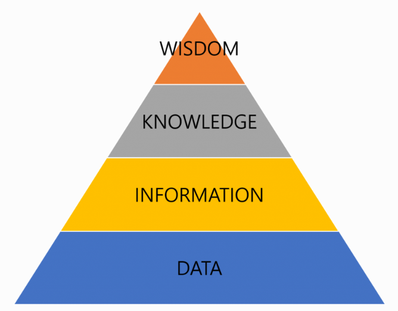

# 01

> 정보 피라미드
> 



```jsx
WISDOM = 지혜 : 지식에 유연성을 더하고, 상황과 맥락에 맞는 규칙을 적용하는 것을 의미
KNOWLEDGE = 지식 : 정보를 일반화하고 체계화하여 바로 적용·활용할 수 있도록 만든 것을 의미
ex) 날씨정보
INFORMATION = 정보 : 1차 가공된 자료 
ex) 21'C
DATA = 자료 :  관찰, 측정을 통해서 수집된 값, 수치, 문자 등을 의미. 가공되지 않은 자료
ex) 21
```

> 데이터베이스
> 

```jsx
데이터의 집합
```

> DBMS
> 


```jsx
데이터베이스를 운영하고 관리하는 소프트웨어
```

> DBMS의 종류
> 


```jsx
ex)문서를 작성하기 위해서는 한글(HWP)이나 워드(Word), 표 계산을 위해서는 엑셀(Excel)이나 
캘크(Calc), 사진을 편집하려면 포토샵(PhotoShop)이나 김프(Gimp)와 같은 소프트웨어를 설치.
```

> DBMS의 분류
> 

```jsx
계층형, 망형, 관계형, 객체지향형, 객체관계형등으로 분류.
"관계형 DBMS"가 가장많은 부분을 차지
```

> 관계형 DBMS
> 


```jsx
관계형 DBMS(Relational DBMS) = RDBMS
테이블(Table) 최소단위 구성 => 하나 이상의 열(Column)과 행(Row)
```

> SQL
> 


```jsx
구조화된 질의 언어, 관계형 데이터베이스에서 사용되는 언어
```

> MySQL 설치
> 


---

> WorkBench 설치
> 


