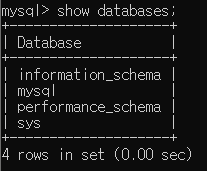

# 03

> MySQL
> 



```jsx
Information_schema : 메타데이터 제공, 데이터베이스정보제공(테이블, 열, 인덱스...등)
Performance_schema : 시스템성능 관련정보 제공(퀴리성능, 서버리소스 사용현황, 대기중인 이벤트 등)
mysql : 인증정보(사용자 정보, 권한정보 등)
sys : Information_schema, Performance_schema 의 분석을 돕기위해 만들어진 DB(여러View이 포함)
```


```jsx
ctrl + enter 사용
```

---

> DB 구축
> 


---

> 테이블 구축
> 


```jsx
스네이크 표기법 : "_" 사용 ex)user_id
카멜 표기법 : "대"문자 사용  ex)userName
```

---

> Cmd 행 추가
> 


```sql
column 추가 : alter table 테이블명 add column 컬럼명 자료형 제약조건
```

---

> Cmd 행 삭제
> 


```sql
column 삭제 : alter table 테이블명 drop 컬럼명
```

---

> Cmd 행 수정
> 


```sql
column 수정 : alter table 테이블명 change column 기존컬럼명 변경컬럼명 변경자료형 제약조건
```

---

> Cmd Insert
> 


```sql
insert into 테이블명(컬럼명) values(값);
```

---

> Cmd Update
> 


```sql
update 데이터베이스명.테이블명 set 컬럼명 = '추가 값' where 컬럼명 = '찾을 값';
```

---

> Cmd Delete
> 


```sql
delete  from 테이블 where 컬럼명 = '찾을 값';
```

---

> 문제01
> 


> 문제 02
> 


> 문제 03
> 


> 문제 04
> 


> 문제 05
> 


> 문제 06
> 


> 문제 07
> 

