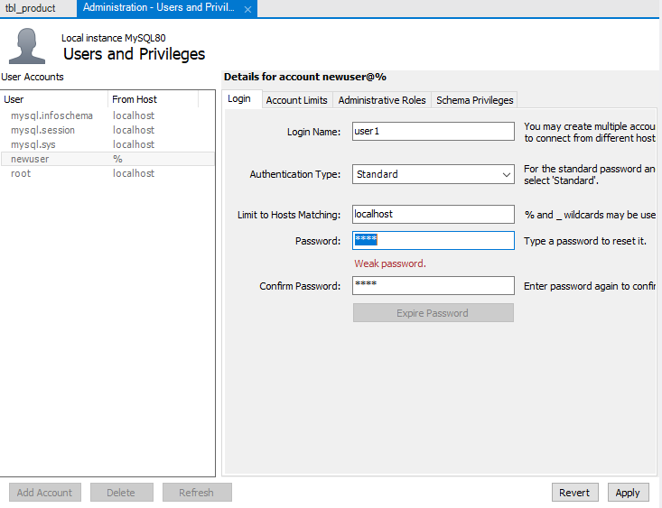

# 01

> DDL/DML
> 

```jsx
--------------------
DB조회
--------------------
show databases;

--------------------
DB위치 지정
--------------------
use mysql;

--------------------
테이블 확인
--------------------
show tables;
select * from user;

--------------------
DB 생성
--------------------
db생성(TUI)
create database testdb;
show databases;

--------------------
Table 생성
--------------------
table 생성(GUI) - 생략

table 생성(TUI)
use testdb;
show tables;
mysql> create table tbl_user(
    -> user_id varchar(10) primary key,
    -> user_password varchar(100) not null,
    -> user_name varchar(45) not null );
Query OK, 0 rows affected (0.02 sec)

mysql> show tables;
+------------------+
| Tables_in_testdb |
+------------------+
| tbl_user         |
+------------------+
1 row in set (0.00 sec)

mysql> desc tbl_user;
+---------------+--------------+------+-----+---------+-------+
| Field         | Type         | Null | Key | Default | Extra |
+---------------+--------------+------+-----+---------+-------+
| user_id       | varchar(10)  | NO   | PRI | NULL    |       |
| user_password | varchar(100) | NO   |     | NULL    |       |
| user_name     | varchar(45)  | NO   |     | NULL    |       |
+---------------+--------------+------+-----+---------+-------+
3 rows in set (0.00 sec)

--------------------
Table 생성(문제)
--------------------
테이블 생성합니다(TUI)
테이블명 : tbl_product
컬럼종류
prod_id		int 		primary,
prod_name 	varchar(100) 	not null,
prod_category 	varchar(10)	null,
prod_details	varchar(1024)	null,
reg_date	datetime	not null,
prod_price	int		not null

[참고 - create]
user testdb;
create table 테이블명(
	컬럼명 자료형 제약조건,
	컬럼명 자료형 제약조건,
	컬럼명 자료형 제약조건,
...
);
--------------------
Table 생성(정답)
--------------------
mysql> create table testdb.tbl_product(
    -> prod_id int primary key,
    -> prod_name varchar(100) not null,
    -> prod_category varchar(10) null,
    -> prod_details varchar(1024) null,
    -> reg_date datetime not null,
    -> prod_price int not null);
Query OK, 0 rows affected (0.02 sec)

--------------------
컬럼 추가 alter
--------------------
mysql> alter table tbl_user add column user_tel varchar(30) null after user_name;
mysql> desc tbl_user;
+---------------+--------------+------+-----+---------+-------+
| Field         | Type         | Null | Key | Default | Extra |
+---------------+--------------+------+-----+---------+-------+
| user_id       | varchar(10)  | NO   | PRI | NULL    |       |
| user_password | varchar(100) | NO   |     | NULL    |       |
| user_name     | varchar(45)  | NO   |     | NULL    |       |
| user_tel      | varchar(30)  | YES  |     | NULL    |       |
+---------------+--------------+------+-----+---------+-------+

--------------------
컬럼 삭제 alter
--------------------
mysql> alter table tbl_user drop user_password;
Query OK, 0 rows affected (0.01 sec)
Records: 0  Duplicates: 0  Warnings: 0
mysql> desc tbl_user;
+-----------+-------------+------+-----+---------+-------+
| Field     | Type        | Null | Key | Default | Extra |
+-----------+-------------+------+-----+---------+-------+
| user_id   | varchar(10) | NO   | PRI | NULL    |       |
| user_name | varchar(45) | NO   |     | NULL    |       |
| user_tel  | varchar(30) | YES  |     | NULL    |       |
+-----------+-------------+------+-----+---------+-------+
3 rows in set (0.00 sec)

--------------------
컬럼 수정 alter
--------------------
mysql> alter table tbl_user change column user_tel user_phone varchar(100) not null;
Query OK, 0 rows affected (0.04 sec)
Records: 0  Duplicates: 0  Warnings: 0

mysql> desc tbl_user;
+------------+--------------+------+-----+---------+-------+
| Field      | Type         | Null | Key | Default | Extra |
+------------+--------------+------+-----+---------+-------+
| user_id    | varchar(10)  | NO   | PRI | NULL    |       |
| user_name  | varchar(45)  | NO   |     | NULL    |       |
| user_phone | varchar(100) | NO   |     | NULL    |       |
+------------+--------------+------+-----+---------+-------+
3 rows in set (0.00 sec)

--------------------
alter명령어
--------------------
tbl_product 의 구조를 다음과 같이 수정하세요
Column 추가 : amount int not null 
Column 수정 : product_price -> product_price varchar(100) null
Column 삭제 : product_details

column 추가 : alter table 테이블명 add column 컬럼명 자료형 제약조건
column 수정 : alter table 테이블명 change column 기존컬럼명 변경컬럼명 변경자료형 제약조건
column 삭제 : alter table 테이블명 drop 컬럼명

--------------------
alter명령어(정답)
--------------------
mysql> alter table tbl_product add column amount int not null;
Query OK, 0 rows affected (0.01 sec)
Records: 0  Duplicates: 0  Warnings: 0

mysql> alter table tbl_product change column prod_price prod_price varchar(100) null;
Query OK, 0 rows affected (0.04 sec)
Records: 0  Duplicates: 0  Warnings: 0

mysql> alter table tbl_product drop column prod_details;
Query OK, 0 rows affected (0.01 sec)
Records: 0  Duplicates: 0  Warnings: 0

--------------------
값삽입(DML-SELECT,INSERT)
--------------------
mysql> select * from tbl_user;
Empty set (0.00 sec)

mysql> desc tbl_user;
+------------+--------------+------+-----+---------+-------+
| Field      | Type         | Null | Key | Default | Extra |
+------------+--------------+------+-----+---------+-------+
| user_id    | varchar(10)  | NO   | PRI | NULL    |       |
| user_name  | varchar(45)  | NO   |     | NULL    |       |
| user_phone | varchar(100) | NO   |     | NULL    |       |
+------------+--------------+------+-----+---------+-------+
3 rows in set (0.00 sec)

mysql> insert into testdb.tbl_user(user_id,user_name,user_phone) values('user10','홍길동','010-222-3333');
Query OK, 1 row affected (0.00 sec)

mysql> insert into testdb.tbl_user values('user20','남길동','010-555-6666');
Query OK, 1 row affected (0.00 sec)

mysql> select * from tbl_user;
+---------+-----------+--------------+
| user_id | user_name | user_phone   |
+---------+-----------+--------------+
| user10  | 홍길동    | 010-222-3333 |
| user20  | 남길동    | 010-555-6666 |
+---------+-----------+--------------+
2 rows in set (0.00 sec)

mysql> select user_id,user_name from tbl_user;
+---------+-----------+
| user_id | user_name |
+---------+-----------+
| user10  | 홍길동    |
| user20  | 남길동    |
+---------+-----------+
2 rows in set (0.00 sec)

--------------------
값수정(DML-UPDATE)
--------------------
mysql> select * from tbl_user;
+---------+-----------+--------------+
| user_id | user_name | user_phone   |
+---------+-----------+--------------+
| user10  | 홍길동    | 010-222-3333 |
| user20  | 남길동    | 010-555-6666 |
+---------+-----------+--------------+
2 rows in set (0.00 sec)

mysql> update tbl_user set user_name='철수' where user_id='user20';
Query OK, 1 row affected (0.00 sec)
Rows matched: 1  Changed: 1  Warnings: 0

mysql> select * from tbl_user;
+---------+-----------+--------------+
| user_id | user_name | user_phone   |
+---------+-----------+--------------+
| user10  | 홍길동    | 010-222-3333 |
| user20  | 철수      | 010-555-6666 |
+---------+-----------+--------------+
2 rows in set (0.00 sec)

--------------------
값삭제 (DML-DELETE)
--------------------
mysql> delete from tbl_user where user_id='user10';
Query OK, 1 row affected (0.00 sec)

mysql> select * from tbl_user;
+---------+-----------+--------------+
| user_id | user_name | user_phone   |
+---------+-----------+--------------+
| user20  | 철수      | 010-555-6666 |
+---------+-----------+--------------+
1 row in set (0.00 sec)

--------------------
DML 문제
--------------------
tbl_product안에 다음과 같은 작업을 수행하세요
[값 추가]
prod_id		prod_name	prod_category	reg_date	prod_price	amount
1111		LG_GRAM_2023	가전		2024/01/22	830,000		100	
1112		SAMSUNG_FLEX2	가전		2024/01/22	3,000,000	50
2000		대우_통돌이_01	가전		2024/01/22	590,000		25
3001		이것이리눅스다	도서		2023/01/22	30,000		1000

[값 수정]
prod_category가 '가전'인 모든행의 reg_date를 2023/01/01 로 변경하세요

[값 삭제]
prod_id가 1111인 행을 삭제하세요
```

---

> User
> 



```jsx
localhost : 현재 컴퓨터에서만
```


```jsx
DB는 무조건 만들어져 있어야함
```


---

> User Cmd 연결
> 


```jsx
파일탐색기에 CMD 입력 후 mysql -u 유저명 -p -h 아이피
Enter password: 1234
```


```sql
use test1db;
= test1db를 사용하겠다

insert into tbl_user values('전정현',23,'대구','남')
= tbl_user에 ('전정현',23,'대구','남') 값을 넣겠다.
```

---

> Cmd User 만들기
> 


```sql
mysql> grant 허용명령어 on 데이터베이스.테이블 to 계정;
```


```sql
flush privileges; = 새로고침
```


---

> DCL
> 

```jsx
------------------------------------------
MYSQL 권한부여 localhost
------------------------------------------

-----------------------
사용자 계정 확인
-----------------------
use mysql;
show tables;
select user,host from user;

-----------------------
사용자 계정 추가
-----------------------
-----------
로컬전용계정
-----------
create user user10@localhost identified by 'bsit@COM'; 	// 로컬접속 유저
create user user20@localhost identified by 'bsit@COM'; 	// 로컬접속 유저

flush privileges;					// 변경내용 적용

-----------
외부접속허용
-----------
create user user30@'%' identified by 'bsit@COM';	// 외부접근 허용 유저
create user user40@'%' identified by 'bsit@COM';	// 외부접근 허용 유저
flush privileges;					// 변경내용 적용

-----------------------
사용자 계정 삭제 
-----------------------
drop user user10@localhost;
delete from user where user='user20';

-----------------------
사용자에게 DB 권한 부여
-----------------------
-----------
계정 추가
-----------
create user user10@'%' identified by 'bsit@COM';
create user user20@'%' identified by 'bsit@COM';

-----------
읽기
-----------
grant select on test1.* to user10@'%';
flush privileges;

-----------
쓰기
-----------
grant select,insert on test1.* to user20@'%';
flush privileges;

-----------
수정
-----------
grant select,insert,update on test.% to user30@'%';
flush privileges;

-----------
모든권한
-----------
grant all privileges on test1.* to user40@'%';
flush privileges;

-----------
권한 확인
-----------
show grants for user10@'%';
show grants for user20@'%';
show grants for user30@'%';
show grants for user40@'%';

-----------------------
사용자에게 DB 권한 제거
-----------------------
revoke all on DB명.테이블명 from 사용자ID;

-----------
제거
-----------
revoke all on test1.* from  user10@localhost;

-----------
확인
-----------
show grants for user10@'%';

------------------------------------------
원격 접속 관리  
------------------------------------------
-----------------------
사용자 계정 추가
-----------------------
-생략-

기존계정 
create user user20@'%' identified by 'bsit@COM';	// select,insert	
create user user30@'%' identified by 'bsit@COM';	// select,insert,update
create user user40@'%' identified by 'bsit@COM';	// all privileges

-----------------------
DB 접속 
-----------------------
-----------
실행
-----------
실행창 -> cmd -> cd c:\program files\MariaDB10.2.7/bin\ -> 
mysql -h 192.168.1.10 -u user40 -p  --port 3306
```