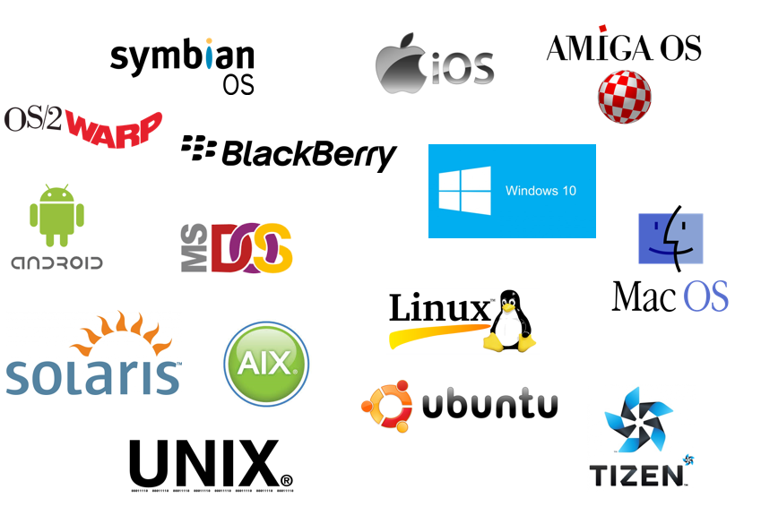

# 01

> **LINUX**
> 

> **SERVER / CLIENT**
> 

| CLIENT | SERVER | SERVICE | NETWORK |
| --- | --- | --- | --- |
| 서비스 '이용' 주체 | 서비스 '제공' 주체 | 클라이언트의 욕구를 만족시키는 것들(프로그램's) | 서버와 클라이언트를 연결 |
| 사람 | 고기집 | 항정살/가브리살/목살.. | 홀서빙직원 |
| 웹브라우저 | 서버컴퓨터(장치) | 서비스 프로그램 | 인터넷 |

---

> OS
> 



```jsx
Program : 사전에 해야 '할일' 들을 '순서'대로 적은 목록
Software : 기계(ex)가 해야할 일들을 저장한 프로그램
Hardware : Software가 특정 역할수행에 필요한 물리적인 자원들(연산장치,보조기억장치,주기억장치)

Operating System(OS)
운영 체제
컴퓨터나 다른 디지털 장치에서 소프트웨어와 하드웨어 간의 상호 작용을 관리하고 제어하는
'시스템 소프트웨어' 이는 사용자와 하드웨어 사이의 인터페이스 역할을 하며, 응용 프로그램이 
하드웨어 자원(예: CPU, 메모리, 저장 장치 등)을 사용할 수 있도록 함 일반적인 운영 체제로는
Windows, macOS, Linux 등이 있습니다

Application
운영제체에 의해 자원을 할당받아 사용자의 목적에 맞는 일처리를 도와주는 응용프로그램
```

---

> VMware 설치
> 


[https://github.com/hegdepavankumar/VMware-Workstation-Pro-17-Licence-Keys](https://github.com/hegdepavankumar/VMware-Workstation-Pro-17-Licence-Keys)


---

> VMware Network Editor
> 


```
가상머신
Bridged : 외부 인터넷 통신가능(송수신 둘다 가능)
Host-only : 호스트만 접속가능
NAT : 외부 접속가능,밖에서 안으로는 차단
```


---

> VMware Virtual Machine
> 


---

> Putty 설치
> 


---

> VMware 인터넷 설정
> 


