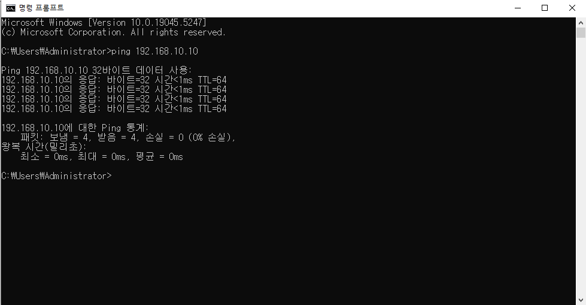

# 02

> VMware Ping 확인
> 




```
ctrl + C : 터미널 명령어 취소
```

---

> Snapshot
> 


---

> Putty 설정
> 


```
login as: root
root@192.168.10.10's password: 1

administrator vs root(리눅스)
```

---

> 패스워드 지정
> 

```jsx
# : 관리자계정
$ : 유저

[root@localhost ~]# passwd
root 사용자의 비밀 번호 변경 중
새  암호: 1234
잘못된 암호: 암호는 8 개의 문자 보다 짧습니다
새  암호 재입력: 1234
passwd: 모든 인증 토큰이 성공적으로 업데이트 되었습니다.
[root@localhost ~]# 

-user 비번 변경
[root@localhost ~]# passwd user1
user1 사용자의 비밀 번호 변경 중
새  암호:
잘못된 암호: 암호는 8 개의 문자 보다 짧습니다
새  암호 재입력:
passwd: 모든 인증 토큰이 성공적으로 업데이트 되었습니다.
[root@localhost ~]# 
```

---

> 재부팅
> 

```jsx
reboot				
shutdown -r now		
init 6	
```

---

> 종료
> 

```jsx
power off
shutdown -h now
Halt
init 0
```

---

> 리눅스 런레벨
> 

| 런레벨 | 설명 | 특징 |
| --- | --- | --- |
| 0 | Halt | 시스템 중지, 기본값으로 설정 불가 |
| 1 | Sing user mode | 단일 사용자 모드
로그인 과정 없이 root 계정으로 로그온
네트워크, 서버, 파일 공유 등과 같은 서비스 사용 안함
시스템 점검/복구, root 계정 패스워드 초기화 등에 사용
(즉, 시스템 관리적 목적으로 사용) |
| 2 | Mutiuser, without NFS | 네트워크를 사용하지 않는 다중 사용자 모드
여러 계정으로 로그온할 수 있음
Runlevel 3에서 네트워크를 사용하지 않는 것과 동일 |
| 3 | Full multiuser mode | 네트워크를 지원하는 다중 사용자 모드 |
| 4 | Unused | 사용되지 않는 런레벨이지만, 사용자가 정의해서 사용 가능 |
| 5 | X11 | X Window를 사용하는 다중 사용자 모드 (그래픽 인터페이스)
최근 배포판에서 기본값으로 사용됨 |
| 6 | Reboot | 시스템을 재기동 할 때 사용
기본값으로 설정 불가 |

---

> 명령어
> 

```
ifconfig : 네트워크 확인 명령어
pwd(Print Working Directory) : 현재 위치 확인 명령어
```

```jsx
1. 절대 경로 : /(최상위 디렉토리) 가 기준 

[실습]

cd /
pwd

cd /home/user1
pwd

cd /dev
pwd

cd /boot
pwd

2. 상대 경로 : 현재 작업중인 디렉토리가 기준

경로 /home/ 에서 시작

[실습]

cd user1 	현재 위치(/home)에서 하위디렉토리 user1 이동 (/home/user1)

cd .		현재 디렉토리 (/home/user1)

cd .. 		상위 디렉토리 이동 (/home)

cd ..		상위 디렉토리 이동 (/)

cd etc		현재 위치에서(/)에서 하위 디렉토리 etc 이동(/etc)

cd ~		현재 접속중인 사용자의 홈디렉토리로 이동

cf) 경로이동에 사용되는 특수문자
.  : 현재디렉토리
.. : 상위디렉토리
~(틸트) : 사용자의 홈디렉토리 
```

---

> 문제 01
> 

```jsx
[환경]
mkdir -p  /test/a/b/c/ /test1/f/g/h/

1. cd 명령어를 절대경로(/가 기준) 을 이용해서 이동하세요

1) /test/a 이동

2) /test1/f/g 이동

3) /test/a/b/c/ 이동

4) /test1/f/g/h 이동

```


---

> 문제 02
> 

```jsx
2. cd 명령어를 상대경로(현재 위치가 기준) 을 이용해서 이동하세요

현재위치를 cd /test/a로 이동

1) /test/a/b/c/로 이동

2) /test 로 이동

3) /test1/f 로 이동

4) /test1/f/g/h 로 이동
```

