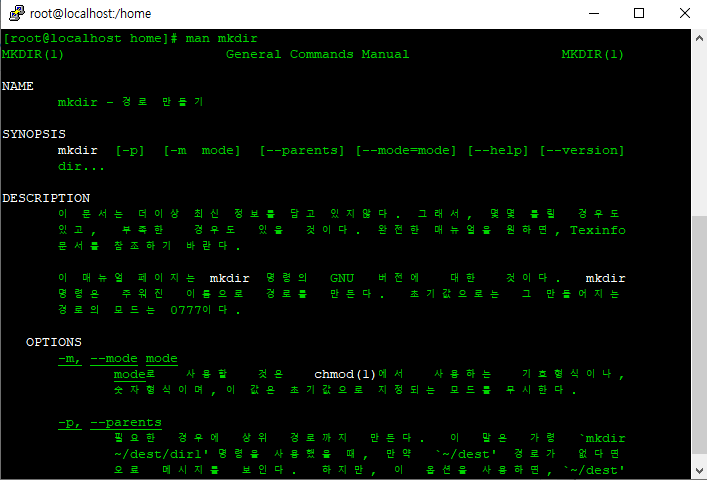

# 01

> **ls(List) : 파일&디렉토리 목록 출력**
> 

```jsx
[옵션]

-a : 모두보기
-l : 자세히 보기
-R : 하위까지 보기
-d : 디렉토리 보기

[실습]

ls /etc/
ls -l /etc/		법칙 1 [명령어][옵션][타겟]
ls -al /etc/		법칙 2	명령어의 옵션은 조합이 가능하다
ls -Ral /etc/
cd /etc
ls -l			법칙 3 상대경로에서의 작업은 생략이 가능하다.
ls -ld /etc 
```

---

> **mkdir(Make Directory) : 디렉토리 생성 명령어**
> 

```jsx
[옵션]
-p : 상위디렉토리 포함 생성

[실습]
Mkdir /home/test

Ls -l /home

Mkdir /home/heath/a/b 	(x)
Mkdir /home/heath/a 
Mkdir /home/heath/a/b

Ls -al /home/heath/a
Mkdir  /home/test/c/d	(x)
Mkdir -p /home/test/c/d/

```

---

> man(manual) : 명령어 정보 확인
> 



---

> **touch :파일생성, 파일의 시간을 변경**
> 

```jsx
[옵션]

-d 00:00 : (date time) 시간 
-t YYYYMMDDHHmmss	 : 날짜시간 변경

[환경]
mkdir /touch
cd /touch

[실습]

touch /touch/1	
touch 2			 
touch /touch/3 4 ./5	 법칙 4 띄어쓰기시 새로운 옵션 및 경로가 지정된다.	
touch -d 12:12 1
touch - t 201601010101 6	날짜시간 지정 빈파일 생성

cf) stat(파일 상태확인명령어) 6 하면  해당 파일의 변경날짜 확인 
```

> **cp(copy) : 파일 복사**
> 

```jsx
[옵션]

-i 질의(물어보는것)
-r 강제 복사
-r 디렉토리 복사
-p 보존복사

[환경]
	
mkdir /touch /cptest 
cd /cptest

```

---

> 실습
> 

```jsx
-------------------------------
[실습] - 파일복사(원본이름유지)
-------------------------------

cp /touch/1 /cptest/1		-- 파일 복사
cp /touch/2 /cptest/		-- 파일 복사(생략가능)
cp /touch/2 ~user1		-- 홈디렉토리로 복사

-------------------------------
[실습] - 파일복사(이름변경)
-------------------------------
cp /touch/3 /cptest/sam	
cp /touch/4 /cptest/sa	

-------------------------------
[실습] - 파일복사(보존복사)
-------------------------------
cp -p /touch/3 /cptest/3
cp -p /touch/4 /cptest/4
cp -p /touch/2  /cptest/test	-- 이름 변경 보존복사

-------------------------------
[실습] - 디렉토리 복사
-------------------------------

cp -r /touch 	/cptest

-------------------------------
[실습] - 질의/강제 옵션
-------------------------------

cp -i /touch/1	/cptest	- 덮어쓰기여부 질의
cp -f /touch/2  /cptest - 강제 덮어쓰기

-------------------------------
[실습] - 복수파일 복사
-------------------------------

cp -f /touch/1 2 ./3 /cptest/		법칙 5  여러 경로가 존재할 때 가장 마지막 경로가 타깃이 된다.

***cp 사용시 주의할 점

원본과 타깃의 이름이 같은경우 file/dir 명 생략가능
원본과 타깃의 이름이 다른 경우 	복사와 동시에 타깃 이름 변경
```

---

> 문제 01
> 

```jsx
1. /final 이라는 디렉토리 생성
  
2. /final 디렉토리에 12, 34, 56 이라는 파일생성

3. 34파일의 시간을 1999년 01월 01일 12:00 으로 변경

4. /back 이라는 디렉토리 생성

5. /final 의 12 ,56 파일을 /back  디렉토리에 복사

6. /final 의 34 파일을 /back 디렉토리에 보존복사
```


---

> 문제 02
> 

```jsx
1. /etc/login.defs /etc/passwd /boot/grub2/grub.cfg 파일을 확인하고
   3개의 파일 /backup 디렉토리 생성한 뒤 복사

2. /backup에 있는 3개의 파일
   /backup/test 디렉토리에 각각 login pass grub 란 이름으로 이름변경 복사

3. /backup에 test1 이라는 파일 ,
	/backup/test 에 test2 라는 파일을 한줄명령어로 생성

4. /backup/test 디렉토리를
	 /home/test/c/d/linux란 이름이 되도록  이름변경 보존 복사

5. /home으로 이동(cd /home) 한뒤
	경로를 변경하지 않고 /backup안에 있는 파일들 4개를 /home/test/c/d/linux
	 디렉토리에 한줄명령으로 보존복사 (이름변경및 디렉토리 복사 금지)
```


