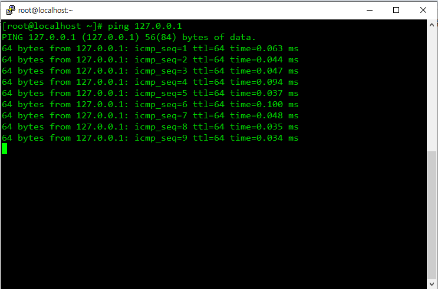

# 01

> **usermod**
> 

```jsx
------------------------------------------------------
usermod : 사용자 계정정보 변경 명령어
------------------------------------------------------

-------------------------------------
[옵션]
-------------------------------------
-d 홈디렉토리 설정 	
-m 홈디렉토리 이동

-------------------------------------
[실습]
-------------------------------------
usermod -u 2000 mod  	-u uid 변경
usermod -g heath mod	-g 주그룹 변경
usermod -G test1 mod	-G 보조그룹 변경
usermod -c linux mod	-c 계정 설정변경
usermod -s /bin/sh mod	-s 쉘변경

mkdir -p /export/home
usermod -md /export/home/mod mod
```

---

> **문제**
> 

```jsx
------------------------------------------------------
미니 문제(스냅샷 돌리고 문제푸세요)
------------------------------------------------------
useradd test1,test2,test3

1. test1,test2,test3 계정 생성
useradd test1
useradd test2
useradd test3
2. test1 의 comment 를 modtest로 변경
usermod -c modtest test1

3. test2 의 주그룹을 test1로, test2의 보조그룹을 test3으로 지정
usermod -g test1 -G test2 test3

4. test1 의 shell을 /bin/ksh 로변경
usermod -s /bin/ksh test1

5. test1의 홈디렉토리를 /test1/home 경로로, test2 홈디렉토리를 /test2/home으로 이동
mkdir /test1 /test2
uesrmod -md /test1/home test1
uesrmod -md /test1/home test2
```

---

> **userdel**
> 

```jsx
--------------------------------------------
userdel: 계정 삭제 명령어
--------------------------------------------
-------------------------------
[옵션]
-------------------------------
-r
-------------------------------
[실습]
-------------------------------

userdel mod 	-계정삭제

		/etc/passwd		삭제
		/etc/shadow		삭제
		/etc/group 		삭제
		/home/mod		존재
		/var/spool/mail/mod	존재

userdel -r itbank

		/etc/passwd		삭제
		/etc/shadow		삭제
		/etc/group 		삭제
		/home/mod		삭제
		/var/spool/mail/mod	삭제
```

---

> **프로세스**
> 

```jsx
ps : 프로세스 확인
ps -elf : 모든 프로세스 확인

UID = 누가 실행했는지 
PID : 프로세스 아이디 
PRI : 작업 우선순위(낮은 거 우선)
NI : PID를 낮추는 값
```




---

> 문제
> 

```jsx
(1)
/etc/login.defs /etc/passwd /boot/grub2/grub.cfg 파일을 확인하고 3개의 파일 /backup 디렉토리 생성한 뒤 복사

(2)
/backup에 있는 3개의 파일
/backup/test 디렉토리에 각각 login pass grub 란 이름으로 이름변경 복사

(3)
/backup에 test1 이라는 파일,/backup/test 에 test2 라는 파일을 한줄명령어로 생성

(4)
/etc/passwd 의 위에서 5번째 줄까지 출력(내용출력)

(5)
/etc/login.defs 파일을 아래서부터 12번째 줄까지 출력(내용출력)

(6)
/retest 디렉토리 생성 후 /etc안의 표시되는 디렉토리의 목록을 /retest/a에 저장하세요(리다이렉션)

(7)
/perm 디렉토리 생성, user10,20,user30 계정 생성 이후
/perm 소유자계정 user30, 소유그룹 계정 user20 으로 소유권변경 하세요 
(8)
/perm 디렉토리에 user10 은 접근가능,목록보기가능,파일생성불가 허가권부여 /perm 디렉토리에 user20 은 접근가능,목록보기불가,파일생성가능 허가권부여 /perm 디렉토리에 user30 은 접근불가,목록보기불가,파일생성불가 허가권부여 
(9)
ping 127.0.0.1을 실행할 때 프로세스의 Priority 값을 60으로 설정합니다.
```