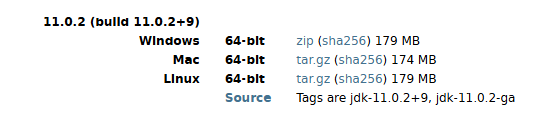

# 01

> **JDK 구버전 설치**
> 

---

> **Tomcat 설치**
> 

---

> **Eclipse**
> 

---

> **Java 버전 변동 시 설정**
> 

---

> Eclipse + TomCat
> 

---

> git 설정
> 

---

> **Github 연동**
> 

Github에서 [Read.me](http://Read.me) X

---

> import
> 

