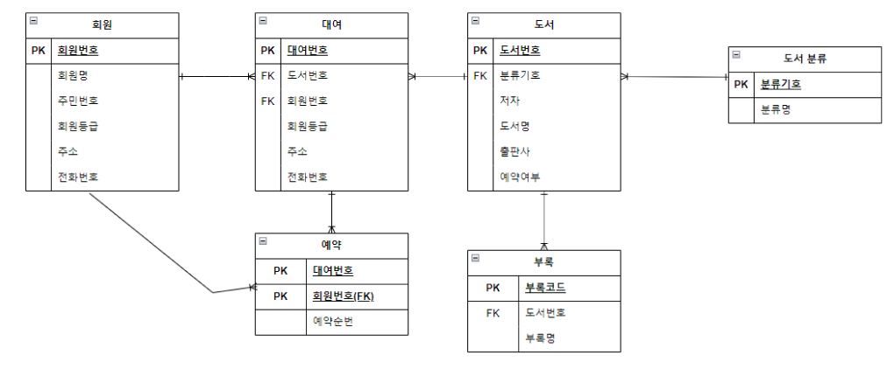

# 01

> **테이블 추가**
> 

```java
CREATE TABLE userSelfTestTbl (
    userID      VARCHAR2(10) PRIMARY KEY,
    name        VARCHAR2(50),
    birthYear   NUMBER(4),
    addr        VARCHAR2(100),
    mobile1     VARCHAR2(10),
    mobile2     VARCHAR2(20),
    height      NUMBER(3),
    mDate       DATE,
    managerID   VARCHAR2(10)  -- 자기 참조용 관리자 ID
);

INSERT INTO userSelfTestTbl VALUES ('LSG', '이승기', 1987, '서울', '011', '1111111', 182, TO_DATE('08/08/08', 'RR/MM/DD'), 'JYP');
INSERT INTO userSelfTestTbl VALUES ('KBS', '김범수', 1979, '경남', '011', '2222222', 173, TO_DATE('12/04/04', 'RR/MM/DD'), 'JYP');
INSERT INTO userSelfTestTbl VALUES ('KKH', '김경호', 1971, '전남', '019', '3333333', 177, TO_DATE('07/07/07', 'RR/MM/DD'), 'LJB');
INSERT INTO userSelfTestTbl VALUES ('JYP', '조용필', 1950, '경기', '011', '4444444', 166, TO_DATE('09/04/04', 'RR/MM/DD'), NULL); -- 최고 관리자
INSERT INTO userSelfTestTbl VALUES ('SSK', '성시경', 1979, '서울', NULL, NULL, 186, TO_DATE('13/12/12', 'RR/MM/DD'), 'LSG');
INSERT INTO userSelfTestTbl VALUES ('LJB', '임재범', 1963, '서울', '016', '6666666', 182, TO_DATE('09/09/09', 'RR/MM/DD'), 'JYP');
INSERT INTO userSelfTestTbl VALUES ('YJS', '윤종신', 1969, '경남', NULL, NULL, 170, TO_DATE('05/05/05', 'RR/MM/DD'), 'KBS');
INSERT INTO userSelfTestTbl VALUES ('EJW', '은지원', 1972, '경북', '011', '8888888', 174, TO_DATE('14/03/03', 'RR/MM/DD'), 'LSG');
INSERT INTO userSelfTestTbl VALUES ('JKW', '조관우', 1965, '경기', '018', '9999999', 172, TO_DATE('10/10/10', 'RR/MM/DD'), 'KKH');

DROP TABLE empTbl;

CREATE TABLE empTbl (
  empID     NUMBER PRIMARY KEY,
  empName   VARCHAR2(20),
  position  VARCHAR2(20),
  managerID NUMBER  -- 상사의 사번
);

-- 데이터 삽입
INSERT INTO empTbl VALUES (1, '김대표', '대표이사', NULL);
INSERT INTO empTbl VALUES (2, '이부장', '기획부장', 1);
INSERT INTO empTbl VALUES (3, '박과장', '기획과장', 2);
INSERT INTO empTbl VALUES (4, '최대리', '기획대리', 3);
INSERT INTO empTbl VALUES (5, '정부장', '영업부장', 1);
INSERT INTO empTbl VALUES (6, '홍사원', '영업사원', 5);
INSERT INTO empTbl VALUES (7, '유팀장', '개발팀장', 1);
INSERT INTO empTbl VALUES (8, '고주임', '개발주임', 7);
INSERT INTO empTbl VALUES (9, '신사원', '개발사원', 8);

COMMIT
```

---

> **테이블 조회**
> 

```java
select * from userselftesttbl;

SELECT E.name AS 직원명, M.name AS 관리자명
FROM userselftesttbl E
JOIN userselftesttbl M ON e.managerid = m.userid;

select * from emptbl;

SELECT e.empName AS 직원, M.empName AS 상사
FROM empTbl E
LEFT JOIN empTbl M 
ON e.managerid = e.empid;

select * from emptbl;
-- 부하직원이 1명 이상인 상사 목록
SELECT M.empName AS 상사, COUNT(*) AS 부하수
FROM empTbl E
JOIN empTbl M ON E.managerID = M.empID
GROUP BY M.empName;

-- 특정 상사(이부장)의 모든 직원 출력
SELECT E.empName
FROM empTbl E
JOIN empTbl M ON E.managerID = M.empID
WHERE M.empName = '이부장';

-- 대표이사의 직속 부하 직원 출력
SELECT empName
FROM empTbl
WHERE managerID = (
  SELECT empID FROM empTbl WHERE empName = '김대표'
)
```

---

> **JOIN**
> 

```java
-- INNER JOIN
-- 문제 01
select u.name, b.prodname, b.price, b.amount
from usertbl u
join buytbl b
on u.userid = b.userid;
-- 문제 02
select u.userid, sum(b.price * b.amount) as 총금액
from usertbl u join buytbl b
on u.userid = b.userid
group by u.userid
order by 총금액;
-- 문제 03
SELECT DISTINCT u.name
FROM userTbl u
JOIN buyTbl b ON u.userID = b.userID
WHERE b.prodName = '책';
-- 문제 04
SELECT u.name, u.mDate, b.prodName
FROM userTbl u
JOIN buyTbl b ON u.userID = b.userID
WHERE u.mDate >= TO_DATE('2010-01-01', 'YYYY-MM-DD');
-- 문제 05 (INNER JOIN)
SELECT * FROM (
    SELECT u.name, SUM(b.amount) AS 총수량 FROM usertbl u
    JOIN buytbl b ON u.userid = b.userid
    GROUP BY u.name ORDER BY 총수량
) 
WHERE ROWNUM <= 1;

-- OTHER JOIN
-- LEFT JOIN
-- 문제 01
SELECT u.name, b.prodName, b.price
FROM userTbl u
LEFT JOIN buyTbl b ON u.userID = b.userID;
-- 문제 02
SELECT u.name, u.userID
FROM userTbl u
LEFT JOIN buyTbl b ON u.userID = b.userID
WHERE b.userID IS NULL;
-- 문제 03
SELECT u.addr, u.name, b.amount
FROM userTbl u
LEFT JOIN buyTbl b ON u.userID = b.userID;
-- 문제 04
SELECT u.name, NVL(SUM(b.price * b.amount), 0) AS 총구매금액
FROM userTbl u
LEFT JOIN buyTbl b ON u.userID = b.userID
GROUP BY u.name;
-- 문제 05
SELECT u.name, u.height, b.prodName
FROM userTbl u
LEFT JOIN buyTbl b ON u.userID = b.userID
WHERE u.height >= 170;

-- RIGHT JOIN
-- 문제 01
SELECT u.name, b.prodName
FROM userTbl u
RIGHT JOIN buyTbl b ON u.userID = b.userID;
-- 문제 02
SELECT b.prodName, b.price
FROM userTbl u
RIGHT JOIN buyTbl b ON u.userID = b.userID
WHERE u.userID IS NULL;
-- 문제 03
SELECT b.prodName, u.height
FROM userTbl u
RIGHT JOIN buyTbl b ON u.userID = b.userID;
-- 문제 04
SELECT b.prodName, u.addr
FROM userTbl u
RIGHT JOIN buyTbl b ON u.userID = b.userID;
-- 문제 05
SELECT u.mDate, b.prodName
FROM userTbl u
RIGHT JOIN buyTbl b ON u.userID = b.userID;

```

---

> **서브쿼리**
> 

```java
-- 문제 01
서울 지역에 거주하는 회원 중, 전체 평균 키보다 큰 회원의 이름과 키를 조회하는 SQL문을 작성하시오.
SELECT name, heightFROM userTbl WHERE addr = '서울' 
AND height > (SELECT AVG(height) FROM userTbl);

-- 문제 02
물품을 한 번이라도 구매한 적이 있는 회원의 이름과 주소를 조회하는 SQL문을 작성하시오.
(단, buyTbl의 userID 기준)
SELECT name, addr
FROM userTbl
WHERE userID IN (SELECT DISTINCT userID FROM buyTbl);

-- 문제 03
‘전자’ 분류 상품 중 가장 비싼 상품을 구매한 회원의 이름과 상품명, 가격을 조회하는 SQL문을 작성하시오.
SELECT u.name, b.prodName, b.price
FROM buyTbl b
JOIN userTbl u ON b.userID = u.userID
WHERE groupName = '전자'
  AND price = (SELECT MAX(price) FROM buyTbl WHERE groupName = '전자');
  
-- 문제 04
각 회원이 구매한 총 금액(price × amount)의 평균보다 더 많이 구매한 회원의 이름과 총 구매 금액을 조회하는 SQL문을 작성하시오.
SELECT userID, total
FROM (
  SELECT userID, SUM(price * amount) AS total
  FROM buyTbl
  GROUP BY userID
)
WHERE total > (
  SELECT AVG(total_price)
  FROM (
    SELECT SUM(price * amount) AS total_price
    FROM buyTbl
    GROUP BY userID
  )
);

-- 문제 05
한 번도 물건을 구매한 적 없는 회원의 이름과 가입일을 조회하는 SQL문을 작성하시오.
SELECT name, mDate FROM userTbl
WHERE userID NOT IN (SELECT DISTINCT userID FROM buyTbl);
```

---

> Draw.io
> 



---

> **MYSQL**
> 


---

> **MySQL 스크립트**
> 

```java
-- MySQL Workbench Forward Engineering

SET @OLD_UNIQUE_CHECKS=@@UNIQUE_CHECKS, UNIQUE_CHECKS=0;
SET @OLD_FOREIGN_KEY_CHECKS=@@FOREIGN_KEY_CHECKS, FOREIGN_KEY_CHECKS=0;
SET @OLD_SQL_MODE=@@SQL_MODE, SQL_MODE='ONLY_FULL_GROUP_BY,STRICT_TRANS_TABLES,NO_ZERO_IN_DATE,NO_ZERO_DATE,ERROR_FOR_DIVISION_BY_ZERO,NO_ENGINE_SUBSTITUTION';

-- -----------------------------------------------------
-- Schema mydb
-- -----------------------------------------------------

-- -----------------------------------------------------
-- Schema mydb
-- -----------------------------------------------------
CREATE SCHEMA IF NOT EXISTS `mydb` DEFAULT CHARACTER SET utf8 ;
USE `mydb` ;

-- -----------------------------------------------------
-- Table `mydb`.`Member_Tbl`
-- -----------------------------------------------------
CREATE TABLE IF NOT EXISTS `mydb`.`Member_Tbl` (
  `Member_id` INT NOT NULL,
  `Member_name` VARCHAR2(45) NULL,
  `Member_identity` VARCHAR2(45) NULL,
  `Member_grade` VARCHAR2(45) NULL,
  `Member_addr` VARCHAR2(45) NULL,
  `Member_phone` VARCHAR2(45) NULL,
  PRIMARY KEY (`Member_id`))
ENGINE = InnoDB;

-- -----------------------------------------------------
-- Table `mydb`.`Classification_Tbl`
-- -----------------------------------------------------
CREATE TABLE IF NOT EXISTS `mydb`.`Classification_Tbl` (
  `Classification_id` INT NOT NULL,
  `Classification_name` VARCHAR2(45) NULL,
  PRIMARY KEY (`Classification_id`))
ENGINE = InnoDB;

-- -----------------------------------------------------
-- Table `mydb`.`Book_tbl`
-- -----------------------------------------------------
CREATE TABLE IF NOT EXISTS `mydb`.`Book_tbl` (
  `Book_code` INT NOT NULL,
  `Classification_id` INT NOT NULL,
  `book_author` VARCHAR(45) NULL,
  `book_name` VARCHAR(45) NULL,
  `publisher` VARCHAR(45) NULL,
  `Book_tblcol` VARCHAR(45) NULL,
  `isreserve` TINYINT NULL,
  PRIMARY KEY (`Book_code`),
  INDEX `fk_Book_tbl_Classification_tbl1_idx` (`Classification_id` ASC) VISIBLE,
  CONSTRAINT `fk_Book_tbl_Classification_tbl1`
    FOREIGN KEY (`Classification_id`)
    REFERENCES `mydb`.`Classification_Tbl` (`Classification_id`)
    ON DELETE NO ACTION
    ON UPDATE NO ACTION)
ENGINE = InnoDB;

-- -----------------------------------------------------
-- Table `mydb`.`Rental_Tbl`
-- -----------------------------------------------------
CREATE TABLE IF NOT EXISTS `mydb`.`Rental_Tbl` (
  `Rental_id` INT NOT NULL,
  `Book_code` INT NOT NULL,
  `Member_id` INT NOT NULL,
  PRIMARY KEY (`Rental_id`),
  INDEX `fk_Rental_Tbl_Member_Tbl1_idx` (`Member_id` ASC) VISIBLE,
  INDEX `fk_Rental_Tbl_Book_tbl1_idx` (`Book_code` ASC) VISIBLE,
  CONSTRAINT `fk_Rental_Tbl_Member_Tbl1`
    FOREIGN KEY (`Member_id`)
    REFERENCES `mydb`.`Member_Tbl` (`Member_id`)
    ON DELETE NO ACTION
    ON UPDATE NO ACTION,
  CONSTRAINT `fk_Rental_Tbl_Book_tbl1`
    FOREIGN KEY (`Book_code`)
    REFERENCES `mydb`.`Book_tbl` (`Book_code`)
    ON DELETE NO ACTION
    ON UPDATE NO ACTION)
ENGINE = InnoDB;

-- -----------------------------------------------------
-- Table `mydb`.`Reserve_Tbl`
-- -----------------------------------------------------
CREATE TABLE IF NOT EXISTS `mydb`.`Reserve_Tbl` (
  `Rental_id` INT NOT NULL,
  `Member_id` INT NOT NULL,
  `Reserve_order` VARCHAR(45) NULL,
  PRIMARY KEY (`Rental_id`, `Member_id`),
  INDEX `fk_Member_Tbl_has_Rental_Tbl_Rental_Tbl1_idx` (`Rental_id` ASC) VISIBLE,
  INDEX `fk_Member_Tbl_has_Rental_Tbl_Member_Tbl_idx` (`Member_id` ASC) VISIBLE,
  CONSTRAINT `fk_Member_Tbl_has_Rental_Tbl_Member_Tbl`
    FOREIGN KEY (`Member_id`)
    REFERENCES `mydb`.`Member_Tbl` (`Member_id`)
    ON DELETE NO ACTION
    ON UPDATE NO ACTION,
  CONSTRAINT `fk_Member_Tbl_has_Rental_Tbl_Rental_Tbl1`
    FOREIGN KEY (`Rental_id`)
    REFERENCES `mydb`.`Rental_Tbl` (`Rental_id`)
    ON DELETE NO ACTION
    ON UPDATE NO ACTION)
ENGINE = InnoDB;

-- -----------------------------------------------------
-- Table `mydb`.`Appendix_tbl`
-- -----------------------------------------------------
CREATE TABLE IF NOT EXISTS `mydb`.`Appendix_tbl` (
  `Appendix_id` INT NOT NULL,
  `Book_code` INT NOT NULL,
  `Appendix_name` VARCHAR(45) NULL,
  PRIMARY KEY (`Appendix_id`),
  INDEX `fk_Appendix_tbl_Book_tbl1_idx` (`Book_code` ASC) VISIBLE,
  CONSTRAINT `fk_Appendix_tbl_Book_tbl1`
    FOREIGN KEY (`Book_code`)
    REFERENCES `mydb`.`Book_tbl` (`Book_code`)
    ON DELETE NO ACTION
    ON UPDATE NO ACTION)
ENGINE = InnoDB;

SET SQL_MODE=@OLD_SQL_MODE;
SET FOREIGN_KEY_CHECKS=@OLD_FOREIGN_KEY_CHECKS;
SET UNIQUE_CHECKS=@OLD_UNIQUE_CHECKS;

```

---

> **Oracle**
> 

.png)

---