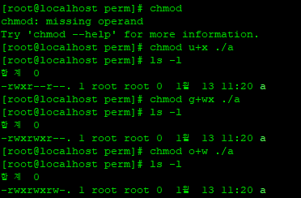

# 01

> VI
> 

```jsx
VI = 문서 편집기

-------------------------------------------------
vi 모드
-------------------------------------------------
이동 모드	(초기모드)	- 파일 내 이동 
입력 모드	(편집모드)	- 파일 내 수정 
실행 모드		(명령어 실행) 	- 파일 내외에 특정 명령어 실행
```

---

> **이동모드**
> 

```jsx
커서이동 : h(왼쪽), j(아래), k(위),l(오른쪽)
단어이동 : w, e, b
행이동 : 0, $
페이지 이동 : ctrl + f, b
마지막처음 : gg, G
삭제 : x, dd
복사/붙여넣기 : yy, p
```

---

> **편집모드**
> 

```jsx
a : 다음문자부터 편집
i : 제자리에서 편집
o : 다음칸 만들고 편집
s : 문자삭제 후 편집 
```

---

> **실행모드**
> 

```jsx
:wq : 저장 후 나가기
:q! : 강제로 나가기
/db : 데이터베이스 이동
:set number		-행번호 출력
:set nonu     -행번호 삭

```

---

> **권한**
> 

```
권한 : 권력 한계

소유권 : 허가권을 부여할 있는 권한
			 - 사용자계정/ 그룹계정/ 서비스계정 부여

허가권 : 자원(파일/ 디렉토리)에 대한 접근 제한

	      ↓r-x : other        ↓소유그룹계정(group) root / r-x
drwxr-xr-x(허가권). 2 root root(소유권) 220 10월 2 2020 yum.repos.d
 (u)(g)(o)                  ↑쇼유한 사용자(user) root / rwx
```

---

> **허가권**
> 

```jsx
r (read) : 읽기
w (write) : 쓰기
x (execute) : 실행

파일
r (내용보기) : cat, head, tail, more...
w (내용수정) : vi , >
x () : ./cmd

디렉토리
r (폴더 안 목록보기) : ls
w (폴더 내 생성, 수정, 삭제..) : touch, cp, mv, rm...
x (진입권한) : cd 

r w x
4 2 1

rwxr_xr_x : Symbolic 방식
755 : Numeric 방식

ex)
rwxr---wx : 743
--xrw--w- : 162
r--rw---x : 461

ex)
123 : --x-w--wx
456 : --r-rx-rw
771 : rwxrwx--x
```

---

> 문제
> 

```jsx
-----------
미니문제
-----------
rw_r_xr__	-> 654
rwxr__r_x	-> 745
r__rwxr__	-> 474
r_xr__r_x	-> 545
r__r_x___	-> 450

755	-> rwxr-xr-x
644	-> rw-r--r--
701	-> rwx-----x
542	-> r-xr---w-
643	-> rw-r---wx
375	-> -wxrwxr-x
```

---

> 소유권
> 




```

chmod : 허가권 변경 명령어

numeric : 숫자 형식으로 부여
ex)
	- chmod 755 a
	- chmod 566 a
	- chmod 755 a

symbolic : 문자 형식으로 부여
	- u+,- rwx : 소유권자 권한변경 
	- g+,- rwx : 소유그룹 권한 변경
	- o+- rwx  : other 권한 변경     
	- a +,- rwx  : 모두 권한 변경
ex)
	chmod o+rw a
	chmod a-x a
	chmod u+x,g+x a
```

---

> 문제
> 

```jsx
user10,user20,user30 생성상태에서 진행

1. /perm 디렉토리 생성
mkdir /perm

2. /perm 소유자계정 user30, 소유그룹 계정 user20 으로 소유권변경
chown user30:user20 /perm

3. /perm 디렉토리에 user10 은 접근가능,목록보기가능,파일생성불가 허가권부여
r-x 5

4. /perm 디렉토리에 user20 은 접근가능,목록보기불가,파일생성가능 허가권부여
-wx 3

5. /perm 디렉토리에 user30 은 접근불가,목록보기불가,파일생성불가 허가권부여
--- 0
chmod 035 /perm

6. /perm 디렉토리에 user30 이 test파일을 만들고 그안에 'testfile' 내용을 저장
chmod u=rwx /perm
cat > test
testfile
^C

7. user30계정으로 /perm/test의 파일의 허가 범위를 다음과 같이 지정
chown user20 /perm/test

user30:읽기,쓰기 가능(rw-), user20:읽기불가 쓰기가능(-w-), 나머지계정 :읽기가능 쓰기불가(r--)
chmod 624 /perm/test
```

---

> 정리
> 

|  | 파일 | 디렉토리(폴더) |
| --- | --- | --- |
| r | 문서내용보기(cat..) | 폴더 내 목록보기(ls) |
| w | 문서내용수정(vi, >) | 폴더 내 파일생성수정삭제(mkdir, touch, cp, mv, rm..) |
| x | 실행파일동작(./filename) | 폴더 진입(cd) |