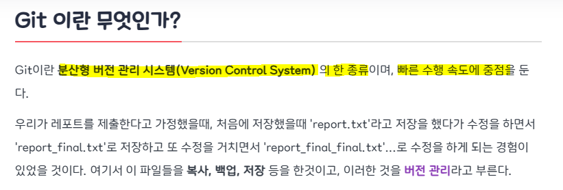

# 02

> **GIt**
> 



---

> **버전 관리**
> 


---

> **Git의 작동 구조**
> 


---

> **Git 설치**
> 


```jsx
Installing 까지 Next 계속 누르기
```


```jsx
CMD 입력
```


```jsx
git init : 초기 설정

Git
	- HEAD : 현재 작업 중인 브랜치 파일
	- config : 저장소 설정 정보 파일
	- description : 저장소의 설명을 담고 있는 파일
	- hooks : 자동으로 실행할 스크립트 파일을 담고 있는 폴더
	- info : 저장소 정보를 담고 있는 파일들을 담고 있는 폴더
	- objects : 모든 파일 버전의 내용을 압축하여 저장하는 폴더
	- refs : 브랜치, 태그 등의 참조 정보를 담고 있는 폴더
```

---

> **Git 계정 설정**
> 


```jsx
[등록]
git config --global user.email <이메일>
git config --global user.name <이름>

[확인]
git config --global --list
```

---

> **Git 로그 확인**
> 


```jsx
git log
git log --oneline (보기 편함)
```

---

> **파일 추가**
> 


```jsx
git status : 프로젝트 상태 확인
git add <추가>
git commit -m <메세지>
```

---

> Git 명령어
> 

```jsx
git config --global
git init 초기파일 생성
git add : SA에 WD 변경사항 저장
git commit -m : commit 시점 지점(버전기록)
git reset : (이전 버전으로 돌아가기)
git status : 프로젝트 상태 확인

--hard   WD(x) SA(x) Head(이동)
--soft   WD(o) SA(x) Head(이동)
--mixed  WD(o) SA(x) Head(이동)
```

---

> 문제 01
> 

```jsx
0 새폴더에서 git init 명령어 사용
git init

1 aaa.txt 파일을 추가하고 내용입력(아무거나) 
echo "aaa" > aaa.txt 

2 SA 에 추가후 Commit(message V0.0)
git add *
git commit -m "V0.0"

2 bbb.txt 파일을 추가하고 내용입력(아무거나)
echo "bbb" > bbb.txt  
3 SA 에 추가후 Commit(message V0.1)
git add *
git commit -m "V0.1"

4 ccc.txt 파일을 추가하고 내용입력(아무거나) 
echo "ccc" > ccc.txt 
5 SA 에 추가후 Commit(message V0.2)
git add *
git commit -m "V0.2"

6 V0.0 으로 --hard 옵션 이동(확인 -WD/SA/HEAD)
git log --oneline
git reset --hard dac9f19

7 V0.2 으로 복귀(reflog)
git reset --hard d051936

8 V0.1 으로 --soft 옵션 이동(확인 -WD/SA/HEAD)
git log --oneline
git reset --soft 72cb093

9 V0.2 으로 복귀(reflog)
git reset --hard d051936

10 V0.0 으로 --mixed 옵션 이동(확인 -WD/SA/HEAD)
git log --oneline
git reset --mixed dac9f19
```

---

> 문제 02
> 

```jsx
1 branch 생성 (dev,feature)
echo "aaa" > aaa.txt
git add *
git commit -m "V0.0 aaa.txt add"
git branch dev
git branch feature

2 feature branch에서 작업 진행
git switch feature

3 feature 에서 ddd.txt 파일생성후 내용입력 -> commit(V0.3)
echo ddd >ddd.txt 
git add *
git commit -m "V0.3 ddd.txt add"

4 feature 에서 dev으로 merging 작업수행
git switch dev
git merge feature

5 dev branch 에서 aaa.txt 내용 추가 -> commit(V0.4 by dev)
echo hi > aaa.txt
git add *
git commit -m "V0.4 by dev"

6 feature branch 에서 aaa.txt 내용 추가 -> commit(V0.4 feature)
git switch feature
echo Hello > aaa.txt
git add *
git commit -m "V0.4 by feature"

7 Conflict 해결 이후 dev에 병합
git swtich dev
git merge feature
메모장 수정
git add *
git merge --continue

8 dev 내용 master에 병합
git log --oneline
git switch master
git merge dev
git log --oneline
```

---

> GitHub
> 

```jsx
[GitHub 연결]

git init
txt 추가
git add *
git commit -m <메모>
git remote add origin <github>
git remote -v
git push origin
git push --set-upstream origin master

[branch]

git branch dev
git switch dev
git branch
txt 추가
git add *
git commit -m <메모>
git push origin
git push --set-upstream origin dev
```

