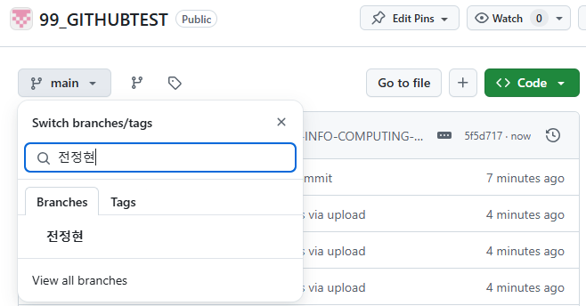

# 01

> **Github Pull requests**
> 




---

> **Git 협업 설정**
> 


---

> Git - Github 업로드
> 


```jsx
git clone <git 주소>

cd <경로>

git branch

git branch -r 
"숨겨진 브런치 확인"

git fetch origin
"업데이트"

git status
"상태 확인"

git push origin
"내보내기"
```

---

> Git Projects
> 


```jsx
누가 수정해서 올렸을 시 pull 한 이후 push
```


