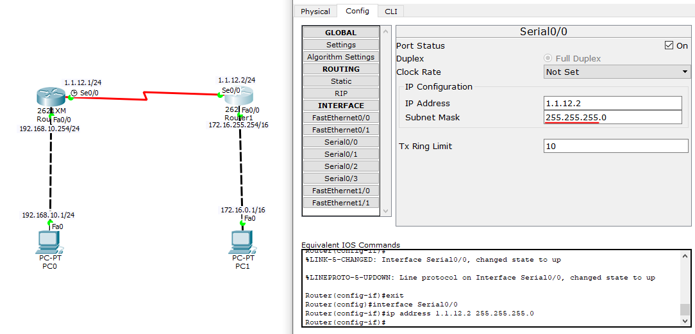

# 01

> **Static Routing**
> 

```jsx
`라우터 간에 라우팅 정보의 교환` 및 `라우팅테이블의 유지관리`를
동적으로 수행하는 프로토콜

Protocol : 통신용 프로그램
Route : 경로, 길
Router : 경로안내장치
Routing : 경로안재작업, 경로안내중.. 
```

> 정적
> 

```jsx
정적 : 관리자가 직접 목적지에 대한 방향을 정함 (수동)
			 장치부하↓, 속도↑ 네트워크 변화에 민감하게 반응

static : 수동으로 하나의 경로를 설정하는 라우팅 방식.
default : 목적지 주소에 맞는 경로가 없을 때 사용하는 기본 경로.
```

> 동적
> 

```jsx
동적 : 전체 경로를 학습하고 최적의 경로를 선택
			 정적과 반대
```

> Static Routing
> 



```jsx
1.1.12.1/24 = A클래스가 아닌 C클래스 이므로 255.255.255.0로 수정해야됨
```


```jsx
static Routes 다음으로 넘어갈 
라우터 입력후 ADD 추가
```

> 문제 01
> 


> 문제 02
> 


> 문제 03
> 


> **Default Routing**
> 


```jsx
Network  : 0.0.0.0
Mask     : 0.0.0.0
Next Hop : 다음으로 넘어갈 주소
```

> Static + Default 혼합
> 

