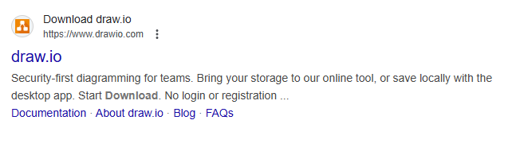

# 01

> [draw.io](http://draw.io) 설치
> 




---

> ERD 1:1 예제
> 


---

> ERD 1:N 예제
> 


---

> ERD N:M 예제
> 


---

> SQL Diagram
> 


```jsx
CASCADE : 값이 자동으로 변경됨
```


---

> 예제
> 


---

> 연습
> 


