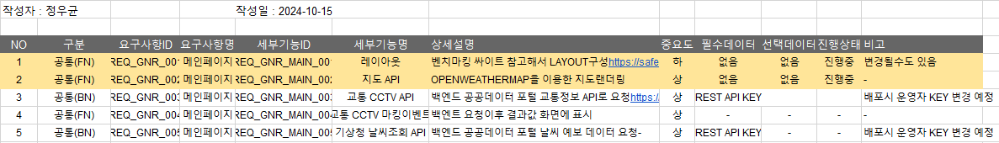

# 01

> **요구사항 정리**
> 

```jsx
사전 인터뷰를 바탕으로 우선적으로 처리해야 할 항목의 LEVEL을 정해 정리
충돌되는 요구사항에 대해서는 사전에 미리 협의
```

---

> **유스케이스**
> 

```jsx
정리된 요구사항을 기준으로 도식화된 요구사항 정리

```

---

> **기능정의서**
> 



```jsx
요구사항을 만족하는 기능들을 정리하는 작업
```

---

> **와이어프레임**
> 

```jsx
웹 페이지 구조를 전달하기 위한 화면 설계도
디자인의 기본 구조와 레이아웃을 시각적으로 표현하여 사용자 경험을 계획하기 위해 사용
최소화된 디자인 구조
```

---

> **스토리보드**
> 

```jsx
기획자와 개발자간 소통을 위해 제작되는 자료
```

---

> **구성**
> 
- TITLE
- 개정이력(HISTORY)
- 메뉴 구조
- 화면 ID 목록
- Flow Chart
- Permission
- Poliy
- UI 기능 구조
- Etc

---

> **Flowchart.draw.io**
> 


---

> **Figma**
> 


