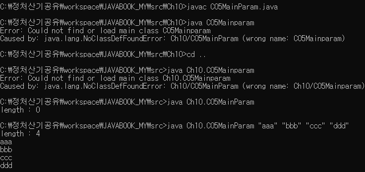

# 01

> **정리**
> 

```jsx
싱글톤 = 클래스의 인스턴스(객체)를 하나만 생성하고,전역에서 공유하는 방식 예) 설정,로그관리
private = 클래스 외부에서 접근할 수 없도록 하는 접근 제어자
static = 클래스 수준에서 공유되는 변수나 메서드로, 인스턴스화 없이 사용가능 
void =  메서드가 값을 반환하지 않음을 나타내는 키워드.

Arraylist = 여러 개의 물건을 한 번에 담을 수 있는 상자
for(object : obj ) = : 설명 = obj를 object에 하나하나 담겠다
obj.get(1) = list와 같다 0 , 1 , 2 중 1번째 값을 꺼내겠다 
```

---

> **C05MainParam**
> 

```jsx
package Ch10;

public class C05MainParam {
	public static void main(String[] args) {
		System.out.println("length : " + args.length);
		for(String param : args) {
			System.out.println(param);
		}
	}
}
```



---

> **C06Ex**
> 

```jsx
package Ch10;

import java.util.Scanner;

public class C06Ex {
	public static void main(String[] args) {
		//5개의 정수값을 입력받아 int형 배열에 저장하고
//		Scanner sc = new Scanner(System.in);
//		System.out.print("5개의 정수값을 입력해주세요 : ");
//		int[] arr1 = new int[5];
//		
//		for(int i=0;i<arr1.length;i++) {
//			arr1[i] = sc.nextInt();
//		}
//		//최대값,최소값,전체합을 출력합니다.
//		int max = -123456789;
//		int min = 123456;
//		int sum = 0;
//		for(int i=0;i<arr1.length;i++) {
//			if(arr1[i] > max) {
//				max = arr1[i];
//			}
//			if(arr1[i] < min){
//				min = arr1[i];
//			}
//			sum += arr1[i];
//		}
//		System.out.println("최대값 : " + max);
//		System.out.println("최소값 : " + min);
//		System.out.println("전체값 : " + sum);
		
		//5명의 학생에 국영수 점수를 입력받아 2차원배열 저장
		Scanner sc = new Scanner(System.in);
		int [][] arr = new int[5][3];
		
		for(int i=0;i<arr.length;i++) {
			System.out.printf("%d번째 학생의 국영수 점수를 입력 : ",i+1);
			for(int j=0;j<arr[0].length;j++) {
				arr[i][j]=sc.nextInt();
			}
		}
		int sum = 0;
		int avg = 0;
		//각 학생의 국여수 점수의 합/평균 구하고
		for(int i=0;i<arr.length;i++) {
			for(int j=0;j<arr[0].length;j++) {
				sum += arr[i][j];
			}
			avg = sum / 3;
			System.out.printf("%d번째 학생의 합 : %d\t 평균 : %d \n",i+1,sum,avg);
			sum = 0;	// sum을 초기화를 시켜야 다음 계산때 추가로 더해지지 않음
		}
		
		//각 과목당 합 / 평균 구해보세요
		int subject_sum[] = new int[3];
		for(int i=0;i<arr[i].length;i++) { //국어,영어,수학
			for(int j=0;j<arr[0].length;j++) {
				subject_sum[i] += arr[j][i];
			}
		}
		System.out.printf("국어 총점 : %d\t 국어 평균 : %.1f\n", subject_sum[0], (double)subject_sum[0]/3);
		System.out.printf("영어 총점 : %d\t 영어 평균 : %.1f\n", subject_sum[1], (double)subject_sum[1]/3);
		System.out.printf("수학 총점 : %d\t 수학 평균 : %.1f\n", subject_sum[2], (double)subject_sum[2]/3);
	}
}

```

---

> **C01StaticMain**
> 

```jsx
package Ch11;

class C01Simple {
	static int num1;
	int num2;
	
	//static : 클래스 내에 멤버에 적용하는 경우
	//해당 클래스로 객체 생성시 모든 객체간의 공유되는 멤버로 지정
	//클래스이름으로도 static멤버에 접근이 가능
	
	public C01Simple() {
		num1 = 0;
		num2 = 0;
	}
	
	public C01Simple(int num1, int num2) {
		super();
		this.num1 = num1;
		this.num2 = num2;
	}

	@Override
	public String toString() {
		return "C01Simple [num1=" + num1 + ", num2=" + num2 + "]";
	}
	
}
public class C01StaticMain {
	public static void main(String[] args) {
		C01Simple ob1 = new C01Simple();
		C01Simple ob2 = new C01Simple();
		
		C01Simple.num1=100;
		System.out.println(C01Simple.num1);
		
		System.out.println(ob1);
		System.out.println(ob2);
	}
}

```

---

> **C02StaticMain**
> 

```jsx
package Ch11;

class C02Simple{
	static int n1;
	int n2;
	
	void func1() {
		n1=100;
		n2=200;
	}
	static void func2() {
		n1=100;
		//n2=200;		// static 함수에서 사용되는 변수는, static변수 or 지역변수 선언이후 사용가능
						// 일반멤버변수로의 접근 불가능
	}
}

public class C02StaticMain {
	public static void main(String[] args) {
	
	}
}
```

---

> **C03SingletonPatton**
> 

```jsx
package Ch11;

class Company {
	int n1;
	int n2;
	
	//toStirng
	@Override
	public String toString() {
		return "Company [n1=" + n1 + ", n2=" + n2 + "]";
	}
	
	//싱글톤 패턴 구조
	private static Company instance;		// !
	private Company() {}					// !외부에서 객체생성 불가설정
	public static Company getInstance() 	// !
	{
		if(instance==null)
			instance = new Company();
		return instance;
	}
}
public class C03SingletonPatton {
	public static void main(String[] args) {
		Company com1 = Company.getInstance();
		Company com2 = Company.getInstance();
		com1.n1=100;
		com2.n2=200;
		System.out.println("com1 : " + com1);
		System.out.println("com2 : " + com2);
	}
}

```

---

> **C04Ex**
> 

```jsx
package Ch11;

//다음 2개의 static 가진 ArrayUtils 클래스를 만들어보자. 다음 코드의 실행 결과를 참고하여 concat()와 print()를 작성하여 ArrayUtil 클래스를 완성하라.

class ArrayUtils {
	public static int[] concat(int[] a, int[] b) {
		/* 배열 a와 b를 연결한 새로운 배열 리턴 */
		int c = a.length + b.length;
		int[] arr = new int[c];
		for(int i=0;i<a.length;i++) {
			arr[i] = a[i];
		}
		for(int i=a.length;i<a.length+b.length;i++) {
			arr[i] = b[i-a.length];
		}
		return arr; 
	}
	
	public static void print(int[] array3) {
		for(int i=0;i<array3.length;i++) {
			 System.out.print(array3[i]);
			 System.out.print(" ");
		}
	}
}

public class C04Ex {

	public static void main(String[] args) {
		// TODO Auto-generated method stub
		int[] array1 = { 1, 5, 7, 9 };
		int[] array2 = { 3, 6, -1, 100, 77 };
		int[] array3 = ArrayUtils.concat(array1, array2);
		ArrayUtils.print(array3);
	}
}

```

---

> **C05Ex**
> 

```jsx
package Ch11;

class ShopService{
	
	
	private static ShopService instance;
	private ShopService() {}
	public static ShopService getInstance()
	{
		if(instance==null)
			instance = new ShopService();
		return instance;
	}
}

public class C05Ex {
	public static void main(String[] args) {
		//---------------------------------------
		//Practice
		//---------------------------------------
		//shopService 객체를 싱글톤으로 만들어 보세요 
		//ShopServiceExample 클래스에서 shopService 의 getInstance() 메소드로 싱글톤을 얻을 수 있도록
		//ShopService 클래스를 작성해보세요
		
		ShopService obj1 = ShopService.getInstance();
		ShopService obj2 = ShopService.getInstance();
		if (obj1 == obj2) {
			System.out.println("같은 ShopService 객체입니다.");
		} else {
			System.out.println("다른 ShopService 객체 입니다.");
		}
	}
}

```

---

> **C00INFO**
> 

```jsx
package Ch12;

public class C00INFO {
	
	//상속(물려줌 - 계층구조)
	//상위(부모,Super)클래스의 속성과 기능을 하위(자식,sub클래스에서
	//그대로 물려받아 사용할수 있도록 허용한 문법
	
	//상위클래스로부터 속성/기능을 물려받은 하위클래스는 그외의 속성/기능을 추가할 수 있다
	//상위클래스로부터 속성/기능을 물려받은 하위클래스는 그외의 물려받은 기능을 고쳐서 사용할 수 있다
	//(오버라이딩)
	//extends 예약어 사용
	
	//상속 쓰는 이유?
	//1 확장성
	//2 유지보수
	//3 가독성
	//4 코드중복 최소화
}

```

---

> **C01InheritanceMain**
> 

```jsx
package Ch12;

class Point2D{
	int x;
	int y;
	Point2D(){
		System.out.println("Point2D 디폴트 생성자 호출!");
	}
}
class Point3D extends Point2D{
	int z;

	Point3D(){
		super();	//상위클래스 Point2D() 생성자 호출
		System.out.println("Point3D 디폴트 생성자 호출!");
	}
	
	//toString
	@Override
	public String toString() {
		return "Point3D [z=" + z + ", x=" + x + ", y=" + y + "]";
	}
}
public class C01InheritanceMain {
	public static void main(String[] args) {
		Point3D ob1 = new Point3D();
		ob1.x = 10;
		ob1.y = 20;
		ob1.z = 30;
		System.out.println(ob1);
	}
}

```

---

> **C02InheritanceMain**
> 

```jsx
package Ch12;

class Point2D{
	int x;
	int y;
	Point2D(){
		System.out.println("Point2D 디폴트 생성자 호출!");
	}
	Point2D(int x){
		this.x = x;
		System.out.println("Point2D(int x) 생성자 호출!");

	}
	Point2D(int x, int y) {
		this.x = x;
		this.y = y;
		System.out.println("Point2D(int x, int y) 생성자 호출!");
	}
}
class Point3D extends Point2D{
	int z;

	Point3D(){
		super();	//상위클래스 Point2D() 생성자 호출
		System.out.println("Point3D 디폴트 생성자 호출!");
	}
	Point3D(int x){
		super(x);	//상위클래스 Point2d(int x) 생성자 호출
		System.out.println("Point3D(int x) 생성자 호출!");

	}
	Point3D(int x, int y) {
		super(x,y);
		System.out.println("Point3D(int x, int y) 생성자 호출!");

	}
	Point3D(int x, int y,int z) {
		super(x,y);
		this.z = z;
		System.out.println("Point3D(int x, int y,int z) 생성자 호출!");

	}
	
	//toString
	@Override
	public String toString() {
		return "Point3D [z=" + z + ", x=" + x + ", y=" + y + "]";
	}
}
public class C02InheritanceMain {
	public static void main(String[] args) {
		Point3D ob1 = new Point3D(10,20,30);
		System.out.println(ob1);
	}
}

```

---

> **C03MethodOverriding**
> 

```jsx
package Ch12;

//함수재정의(Method Overriding)
//상속관계를 전제로 상위클래스의 메서드를 하위클래스가 재정의(고쳐사용)하는것을 허용한 문법
//메서드의 헤더부분은 동일하게 두고 본체({})의 로직을 수정하게끔 허용함으로 다양한 형태의 객체가
//형성될 수 있도록 유도(다향성) 
//상위클래스로 부터 동일한 메서드를 물려받더라도 각 하위클래스마다 다른기능구현의 결과물을 만들어낼 수 있다

// 오버로딩 vs 오버라이딩
// 오버로딩
// 상속전제 : x
// 함수헤더 변경(반환자료형-고정, 함수명-고정, 파라미터-변동)
// 개발자의 편의성에 중점(함수 이름 단일화)

// 오버라이딩
// 상속전제 : o
// 함수로직 변경(헤더 고정)
// 다형성을 목적으로 한 문법요소

class Animal{
	void sound() {System.out.println("소리낸다");}
}
class Dog extends Animal{
	void sound() {System.out.println("멍멍");}

}
class Cat extends Animal{

	@Override
	void sound() {
		System.out.println("야옹");
	}
	
}
public class C03MethodOverriding {
	public static void main(String[] args) {
		Animal ani = new Animal();
		ani.sound();
		Dog dog1 = new Dog();
		dog1.sound();
		Cat cat1 = new Cat();
		cat1.sound();
		
		System.out.println("--------------");
		ani = dog1;	//상위클래스 참조변수로 하위객체 Dog 연결
		ani.sound();
		ani = cat1;	//상위클래스 참조변수로 하위객체 Cat 연결
		ani.sound();
	}
}

```

---

> **C04Ex**
> 

```jsx
package Ch12;

//이것이자바다 상속문제 
//https://velog.io/@kaihojun/%EC%9D%B4%EA%B2%83%EC%9D%B4-%EC%9E%90%EB%B0%94%EB%8B%A4-%EA%B0%9C%EC%A0%95%ED%8C%90-7%EC%9E%A5-%EC%83%81%EC%86%8D-%ED%99%95%EC%9D%B8-%EB%AC%B8%EC%A0%9C-%ED%92%80%EC%9D%B4

//명품자바 상속문제
//https://cs-ssupport.tistory.com/84

//[1번] 다음 main() 메소드와 실행 결과를 참고하여 TV를 상속받은 ColorTV 클래스를 작성하라.

//출력 결과
//32인치 1024컬러
class TV{
	int size;
	TV(int size){
		this.size  = size;
	}
}
class ColorTV extends TV{
	int color;
	ColorTV(int size, int color){
		super(size);
		this.color = color;
	}
	void printProperty() {
		System.out.printf("%d인치 %d컬러\n",this.size,this.color);
	}
}
public class C04Ex {
	public static void main(String[] args) {
		   ColorTV myTV = new ColorTV(32, 1024);
		   myTV.printProperty(); // 32인치 1024컬러 가 나오면 해결!
	}
}

```

---

> **C05Ex**
> 

```jsx
package Ch12;

class Employee {
	public String name;
	private int age;
	private String addr;

	public Employee(String name, int age, String addr) {
		super();
		this.name = name;
		this.age = age;
		this.addr = addr;
	}

	public String getName() {
		return name;
	}

	public void setName(String name) {
		this.name = name;
	}

	public int getAge() {
		return age;
	}

	public void setAge(int age) {
		this.age = age;
	}

	public String getAddr() {
		return addr;
	}

	public void setAddr(String addr) {
		this.addr = addr;
	}

}

class Parttimer extends Employee {
	private int hour_pay;

	public Parttimer(String name, int age, String addr, int hour_pay) {
		super(name, age, addr);
		this.hour_pay = hour_pay;
	}

	public void setHourPay(int hour_pay) {
		this.hour_pay = hour_pay;
	}

	@Override
	public String toString() {
		return "Parttimer [hour_pay=" + hour_pay + ", name=" + name + ", age=" + getAge() + ", addr=" + getAddr() + "]";
	}

}

class Regular extends Employee {

	private int salary;

	public Regular(String name, int age, String addr, int salary) {

		super(name, age, addr);
		this.salary = salary;
	}

	public void setSalary(int salary) {
		this.salary = salary;
	}

	@Override
	public String toString() {
		return "Regular [salary=" + salary + ", name=" + name + ", age=" + getAge() + ", addr=" + getAddr() + "]";
	}
}

public class C05Ex {

	public static void main(String[] args) {
		Parttimer emp1 = new Parttimer("홍길동", 25, "대구", 20000);
		Regular emp2 = new Regular("서길동", 45, "울산", 50000000);
		System.out.println(emp1);
		System.out.println(emp2);
	}

}

```

---
