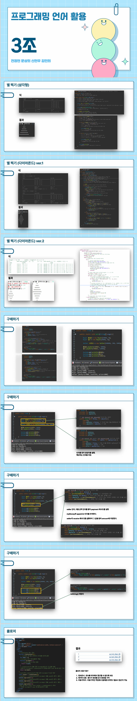

# 01

> **PPT**
> 



---

> **C01WriteMain**
> 

```java
package Ch19;

import java.io.FileWriter;
import java.io.IOException;
import java.io.Writer;

public class C01WriteMain {
	public static void main(String[] args) throws IOException {
//		Writer fout = new FileWriter("C:\\IOTEST\\test1.txt",false);
		Writer fout = new FileWriter("C:\\IOTEST\\test1.txt",true);
		fout.write("TEST1\n");
		fout.write("TEST2\n");
		fout.write("TEST3\n");
		fout.write("TEST4\n");
		
		fout.flush();
		fout.close();
	}
}

```

---

> **C02ReaderMain**
> 

```java
package Ch19;

import java.io.FileReader;
import java.io.IOException;
import java.io.Reader;

public class C02ReaderMain {
	public static void main(String[] args) throws IOException {
		Reader fin = new FileReader("C:\\IOTEST\\test1.txt");
		int data=0;

		StringBuffer buffer = new StringBuffer();
		while((data = fin.read()) != -1) {
			System.out.print((char)data);
			buffer.append((char)data);
		}
		System.out.println();
		System.out.println(buffer);
		
		fin.close();
	}
}

```

---

> **C03FileCopyMain**
> 

```java
package Ch19;

import java.io.FileReader;
import java.io.FileWriter;
import java.io.IOException;
import java.io.Reader;
import java.io.Writer;

public class C03FileCopyMain {
	private static String FileDir = "C:\\IOTEST\\";
	
	public static void main(String[] args) throws IOException {	//args[0] 원본파일 args[1] 대상파일
		for(String arg : args)
			System.out.println(arg);
		
		Reader fin = new FileReader(FileDir + args[0]);		//원본파일
		Writer fout = new FileWriter(FileDir + args[1]);	//대상파일
		
		while(true) {
			int data = fin.read();
			if(data==-1)
				break;
			fout.write((char)data);
			fout.flush();
		}
		fin.close();
		fout.close();
	}
}

```

---

> **C04FileCopyMain**
> 

```java
package Ch19;

import java.io.FileReader;
import java.io.IOException;
import java.io.Reader;

public class C04FileCopyMain {
	public static void main(String[] args) throws IOException {
		Reader fin = new FileReader("C:\\IOTEST\\test3.txt");
		int data=0;

		StringBuffer buffer = new StringBuffer();
		
		char[] buf = new char[1024];//1024byte
		fin.read(buf);
		fin.read();
		
		long startTime = System.currentTimeMillis();
		while((data = fin.read(buf)) != -1) {
//			buffer.append((char)data);
			buffer.append(buf);
		}
		long endTime = System.currentTimeMillis();
		System.out.println();
		System.out.println("소요시간 : " + (endTime - startTime) + "ms");
//		System.out.println(buffer);
		
		fin.close();
	}
}

```

---

> **C05FileInputStreamMain**
> 

```java
package Ch19;

import java.io.FileInputStream;
import java.io.IOException;
import java.io.InputStream;

public class C05FileInputStreamMain {
	public static void main(String[] args) throws IOException{
		InputStream fin = new FileInputStream("C:\\IOTEST\\data.xlsx");
		StringBuffer stringBuffer = new StringBuffer();
		
		//fin.read() 확인
//		long sTime = System.currentTimeMillis();
//		while(true) {
//			int data = fin.read();
//			if(data==-1) break;
//			
////			System.out.print((char)data);
//		}
//		long eTime = System.currentTimeMillis();
//		System.out.println("소요시간 : " + (eTime - sTime) + "ms");
//		fin.close();
		
		//read([])
		byte [] buf = new byte[200];
		long sTime = System.currentTimeMillis();
		while(true) {
			int data = fin.read(buf);
			if(data==-1) break;
			
//			System.out.print((char)data);
		}
		long eTime = System.currentTimeMillis();
		System.out.println("소요시간 : " + (eTime - sTime) + "ms");
		fin.close();
	}
}

```

---

> **C06FileOutputStreamMain**
> 

```java
package Ch19;

import java.io.FileOutputStream;
import java.io.IOException;
import java.io.OutputStream;
import java.nio.charset.StandardCharsets;

public class C06FileOutputStreamMain {
	public static void main(String[] args) throws IOException {
		OutputStream out = new FileOutputStream("C:\\IOTEST\\test4.txt");
		out.write("가".getBytes(StandardCharsets.UTF_8));
		out.write('a');
		out.write('b');
		out.write('c');
		out.flush();
		out.close();
	}
}

```

---

> **C07FileCopyMain**
> 

```java
package Ch19;

import java.io.FileInputStream;
import java.io.FileOutputStream;
import java.io.InputStream;
import java.io.OutputStream;

public class C07FileCopyMain {
	public static void main(String[] args) throws Exception{
		
		InputStream in = new FileInputStream("C:\\IOTEST\\eclipse-java-2024-12-R-win32-x86_64.zip");
		OutputStream out = new FileOutputStream("C:\\IOTEST\\eclipse.zip");
		
		//01 버퍼미사용
//		System.out.println("진행중 - ");
//		while(true) {
//			int data = in.read();
//			if(data==-1)
//				break;
//			out.write((byte)data);
//			out.flush();
//		}
//		in.close();
//		out.close();
//		System.out.println("진행완료 ! ");
		
		//02 버퍼사용
		System.out.println("진행중 - ");
		byte [] buff = new byte[4096];
		while(true) {
			int data = in.read(buff);
			if(data==-1)
				break;
//			out.write((byte)data);
			out.write(buff,0,data);
			out.flush();
		}
		in.close();
		out.close();
		System.out.println("진행완료 ! ");
	}
}

```

---

> **C08SwingEventMain**
> 

```java
package Ch19;

import java.awt.event.ActionEvent;
import java.awt.event.ActionListener;
import java.awt.event.KeyEvent;
import java.awt.event.KeyListener;
import java.awt.event.MouseEvent;
import java.awt.event.MouseListener;
import java.io.File;
import java.io.FileReader;
import java.io.FileWriter;
import java.io.IOException;
import java.io.Reader;
import java.io.Writer;

import javax.swing.JButton;
import javax.swing.JFileChooser;
import javax.swing.JFrame;
import javax.swing.JPanel;
import javax.swing.JScrollPane;
import javax.swing.JTextArea;
import javax.swing.JTextField;
import javax.swing.text.BadLocationException;

class C08GUI extends JFrame implements ActionListener, KeyListener, MouseListener {
	JButton btn1;
	JButton btn2;
	JButton btn3;
	JButton input;
	JTextField txt1;
	JTextArea area1;
	
	Writer out;
	
	C08GUI(String title) {
		// frame
		super(title);
		setBounds(100, 100, 410, 400);
		setDefaultCloseOperation(JFrame.EXIT_ON_CLOSE);

		// Panel
		JPanel panel = new JPanel();
		panel.setLayout(null);

		// Component 참조변수명
		area1 = new JTextArea(); // textarea = area1
		area1.setBounds(10, 10, 260, 280);
		// textarea's scroll = scroll1
		JScrollPane scroll1 = new JScrollPane(area1);
		scroll1.setBounds(10, 10, 250, 280);

		btn1 = new JButton("저장하기");// 파일로저장 : btn1
		btn1.setBounds(270, 10, 110, 30);

		btn2 = new JButton("불러오기");// 1:1요청 : btn2
		btn2.setBounds(270, 50, 110, 30);

		btn3 = new JButton("대화기록보기");// 대화기록보기 : btn3
		btn3.setBounds(270, 90, 110, 30);

		input = new JButton("입력"); // 입력 : input
		input.setBounds(270, 300, 110, 30);

		txt1 = new JTextField(); // textfield : txt1
		txt1.setBounds(10, 300, 250, 30);

		// event listener add
		btn1.addActionListener(this);
		btn2.addActionListener(this);
		btn3.addActionListener(this);
		input.addActionListener(this);
		txt1.addKeyListener(this);
		area1.addMouseListener(this);

		// panel(component)
//		panel.add(area1);
		panel.add(scroll1);
		panel.add(btn1);
		panel.add(btn2);
		panel.add(btn3);
		panel.add(input);
		panel.add(txt1);

		// frame(panel)
		add(panel);

		// frame
		setVisible(true);
	}

	@Override
	public void actionPerformed(ActionEvent e) {

//		System.out.println("클릭!");
		if (e.getSource() == btn1) {
			System.out.println("저장하기");
			String contents = area1.getText();
			
			//파일탐색기 열기
			JFileChooser fileChooser = new JFileChooser();
			fileChooser.setDialogTitle("파일 저장 위치를 선택하세요");
			fileChooser.setFileSelectionMode(JFileChooser.FILES_ONLY);
			
			File defaultDirPath = new File("C:\\IOTEST");
			if(defaultDirPath.exists())
				fileChooser.setCurrentDirectory(defaultDirPath);
			
			int selectedVal = fileChooser.showSaveDialog(null);
			System.out.println("selectedVal : " + selectedVal);
			
			if(selectedVal == JFileChooser.APPROVE_OPTION) {
				File selectedFile = fileChooser.getSelectedFile();
				System.out.println("selectedFile : " + selectedFile);
				
				//파일확장자 추가
				String filePath = selectedFile.toString();
				if(!selectedFile.toString().endsWith(".txt")) {
					filePath = selectedFile.toString()+".txt";
				}
				System.out.println("filePath : " + filePath);
				
//				DateTimeFormatter formatter = DateTimeFormatter.ofPattern("yyyyMMdd_HHmmss");
//				String filename = LocalDateTime.now().format(formatter);
				
				try {
					out = new FileWriter(filePath);
					out.write(contents);
					out.flush();
				}catch(Exception e1) {
					e1.printStackTrace();
				
				}finally {
					try {out.close();} catch (IOException e1) {e1.printStackTrace();}
				}
			}
					
			
		} else if (e.getSource() == btn2) {
			
			System.out.println("불러오기");
			//파일탐색기 열기
			JFileChooser fileChooser = new JFileChooser();
			fileChooser.setDialogTitle("파일을 선택하세요");
			fileChooser.setFileSelectionMode(JFileChooser.FILES_ONLY);
		 
			File defaultDirPath = new File("C:\\IOTEST");
			if(defaultDirPath.exists())
				fileChooser.setCurrentDirectory(defaultDirPath);
			
	
			int selectedVal = fileChooser.showSaveDialog(null);
			System.out.println("selectedVal : " + selectedVal);
			if(selectedVal == JFileChooser.APPROVE_OPTION) {
				File selectedFile = fileChooser.getSelectedFile();
				System.out.println("selectedFile : " + selectedFile);
				
				try {
					
					Reader fin =new FileReader(selectedFile.toString()); 
					StringBuffer buffer = new StringBuffer();
					while(true) {
						int data = fin.read();
						if(data==-1) 
							break;
						buffer.append((char)data);
					}
					area1.setText("");
					area1.append(buffer.toString());
					fin.close();
				}catch(Exception e1) {
					e1.printStackTrace();
				}
				
				
			}
			
			
			
			
		} else if (e.getSource() == btn3) {
			System.out.println("대화기록보기");
		} else if (e.getSource() == input) {
			System.out.println("입력");
		}

	}

	@Override
	public void keyTyped(KeyEvent e) {
//		System.out.println("keyTyped..."+e.getKeyChar());
//		System.out.println("keyTyped..."+e.getKeyCode());

	}

	@Override
	public void keyPressed(KeyEvent e) {
//		System.out.println("keyPressed..."+e.getKeyChar());	
//		System.out.println("keyPressed..."+e.getKeyCode());
		if (e.getSource() == txt1) {
			if (e.getKeyCode() == 10) {
				String message = txt1.getText();
				System.out.println(message);
				area1.append(message + "\n");
				txt1.setText("");
			}
		}
	}

	@Override
	public void keyReleased(KeyEvent e) {
//		System.out.println("keyReleased..."+e.getKeyChar());
//		System.out.println("keyReleased..."+e.getKeyChar());
	}

	@Override
	public void mouseClicked(MouseEvent e) {
		try {

//			System.out.println("mouseClicked..." + e.getPoint());
			int offset = area1.viewToModel(e.getPoint());
//			System.out.println("mouseClicked...offset : " + offset);
			int row = area1.getLineOfOffset(offset);
//			System.out.println("mouseClicked...row : " + row);
			int startOffset = area1.getLineStartOffset(row);
			int endOffset = area1.getLineEndOffset(row);
//			System.out.printf("%d %d\n", startOffset,endOffset);
			String str = area1.getText(startOffset,endOffset-startOffset );
			System.out.println(str);
			
			
		} catch (BadLocationException e1) {
			// TODO Auto-generated catch block
			e1.printStackTrace();
		}
		
	}

	@Override
	public void mousePressed(MouseEvent e) {
		// TODO Auto-generated method stub

	}

	@Override
	public void mouseReleased(MouseEvent e) {
		// TODO Auto-generated method stub

	}

	@Override
	public void mouseEntered(MouseEvent e) {
		// TODO Auto-generated method stub

	}

	@Override
	public void mouseExited(MouseEvent e) {
		// TODO Auto-generated method stub

	}

}

public class C08SwingEventMain {

	public static void main(String[] args) {
		// TODO Auto-generated method stub
		new C08GUI("Chatting UI");

	}

}

```

---