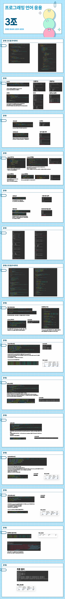

# 01

> **PPT**
> 



---

> **C01LAMDA**
> 

```java
package Ch31;

import java.util.ArrayList;
import java.util.List;

class Person{
	private String name;
	private int age;
	//생성자(디폴트,모든인자)
	Person(){}
	public Person(String name, int age) {
		super();
		this.name = name;
		this.age = age;
	}
	//getter and setter
	public String getName() {
		return name;
	}
	public void setName(String name) {
		this.name = name;
	}
	public int getAge() {
		return age;
	}
	public void setAge(int age) {
		this.age = age;
	}
	//toString
	@Override
	public String toString() {
		return "Person [name=" + name + ", age=" + age + "]";
	}
}
public class C01LAMDA {
	public static void main(String[] args) {
		List<Person> list = new ArrayList<>();
		list.add(new Person("jung",55));
		list.add(new Person("hong",22));
		list.add(new Person("bob",33));	
		
		list.forEach(System.out::println);
		System.out.println("--");
		
		//정렬
		list.sort((a,b)->{return b.getAge()-a.getAge();});		//나이순 정렬
		//
		list.forEach((item)->{System.out.println(item);});
	}
}

```

---

> **C02LAMDA**
> 

```java
package Ch31;

import java.util.Scanner;

interface Printer{
//	void print(String message);		//추상메서드
//	String print(String message);	//추상메서드
	String print();					//추상메서드
}

public class C02LAMDA {
	public static void main(String[] args) {
		//01
//		Printer printer = (message)->{System.out.println(message);};
//		printer.print("HELLOWORLD");
		
		//02
//		Printer printer = (message)->{return message + "_HELLOWORLD";};	//람다식 입력
//		Printer printer = message->message + "_HELLOWORLD";	//람다식 입력
//		String returnValue = printer.print("TEST");
//		System.out.println(returnValue);	//TEST_HELLOWORLD가 출력
		
		//03 (키보드로 입력받아 String 반환)
		Printer printer = ()->{
			Scanner sc = new Scanner(System.in);
			System.out.print("입력 : ");
			String str = sc.nextLine();
			sc.close();
			return str;
		};
		String returnValue = printer.print();
		System.out.println(returnValue);
	};
}
```

---

> **C03LAMDA**
> 

```java
package Ch31;
interface Calculator {
	int calculate(int num1, int num2);
}
public class C03LAMDA {
	public static void main(String[] args) {
		//덧셈
//		Calculator add = (num1, num2)->{int result = num1 + num2;return result;};
		Calculator add = (a,b)->a>b?a-b:b-a;
		
		//뺄셈
//		Calculator sub = (num1, num2)->{int result = num1 - num2;return result;};
		Calculator sub = (a, b)->a>b?a-b:b-a;
		//곱셈
//		Calculator mul = (num1, num2)->{int result = num1 * num2;return result;};
		Calculator mul  = (a,b)->{return a*b; };
		//나눗셈
//		Calculator div = (num1, num2)->{int result = num1 / num2;return result;};
		Calculator div  = (a,b)->{return a>b ? a/b : b/a; };

		
		//결과
		System.out.println(add.calculate(10, 20));	//덧셈
		System.out.println(sub.calculate(30, 10));	//뺄셈
		System.out.println(mul.calculate(10, 20));	//곱셈
		System.out.println(div.calculate(100, 5));	//나눗셈
	}
}

```

---

> **00INFO**
> 

```java
package Ch32;

public class C00INFO {
	//자바 스트림(Stream)은 자바 8부터 도입된 기능으로, 
	//컬렉션(Collection)을 처리하고 변환하기 위한 강력한 기능을 제공합니다. 
	//스트림을 사용하면 데이터를 효율적으로 처리하고 다양한 연산을 수행할 수 있습니다.
	//다음은 자바 스트림에서 제공하는 주요 함수 종류입니다:
	//
	//중개 연산(Intermediate operations):
	//-스트림의 요소를 변환하거나 필터링하는 작업을 수행,파이프라인에 의해 여러번 호출 가능 
	//-중개 연산만으로는 실제로 데이터가 처리되지 않으며, 최종 연산이 호출될 때까지 연산이 지연
	//
//			filter: 주어진 조건에 맞는 요소를 선택합니다.(중요!!!!!!!!!!)
//			map: 요소를 다른 형태로 변환합니다.(중요!!!!!!!!!!)
//			flatMap: 각 요소를 변환하고, 이를 하나의 스트림으로 평면화합니다.
//			distinct: 중복된 요소를 제거합니다.
//			sorted: 요소를 정렬합니다.
//			limit: 주어진 개수만큼 요소를 제한합니다.
//			skip: 처음 몇 개의 요소를 제외하고 반환합니다.
	//
	//최종 연산(Terminal operations):
//			forEach: 각 요소를 반복적으로 처리합니다.(중요!!!!)
//			collect: 요소를 수집하여 새로운 컬렉션을 생성합니다.(중요!!!!!!!)
//			reduce: 요소를 하나로 줄여서 결과를 반환합니다.(중요!!!!!!!)
//			min: 최소값을 반환합니다.
//			max: 최대값을 반환합니다.
//			count: 요소의 개수를 반환합니다.
//			anyMatch: 하나 이상의 요소가 주어진 조건과 일치하는지 검사합니다.
//			allMatch: 모든 요소가 주어진 조건과 일치하는지 검사합니다.
//			noneMatch: 모든 요소가 주어진 조건과 일치하지 않는지 검사합니다.
//			findFirst: 첫 번째 요소를 반환합니다.
//			findAny: 임의의 요소를 반환합니다.
}

```

---

> **C01StreamMain**
> 

```java
package Ch32;

import java.util.Arrays;
import java.util.List;
import java.util.stream.Collectors;
class Person{
	protected String name;
	protected int age;
	//생성자(디폴트,모든인자)
	Person(){}
	public Person(String name, int age) {
		super();
		this.name = name;
		this.age = age;
	}
	//getter and setter
	public String getName() {
		return name;
	}
	public void setName(String name) {
		this.name = name;
	}
	public int getAge() {
		return age;
	}
	public void setAge(int age) {
		this.age = age;
	}
	//toString
	@Override
	public String toString() {
		return "Person [name=" + name + ", age=" + age + "]";
	}
}
class Employee extends Person{
	String company;
	String department;
	String role;
	//toString , getter and setter , 생성자(디폴트,모든인자)
	Employee () {}
	Employee(Person person) {
		this.name = person.getName();
		this.age = person.getAge();
	}
	public Employee(String name, int age) {
		super(name,age);

	}
	public String getCompany() {
		return company;
	}
	public void setCompany(String company) {
		this.company = company;
	}
	public String getDepartment() {
		return department;
	}
	public void setDepartment(String department) {
		this.department = department;
	}
	public String getRole() {
		return role;
	}
	public void setRole(String role) {
		this.role = role;
	}
	public Employee(String company, String department, String role) {
		super();
		this.company = company;
		this.department = department;
		this.role = role;
	}
	@Override
	public String toString() {
		return "Employee [company=" + company + ", department=" + department + ", role=" + role + ", getName()="
				+ getName() + ", getAge()=" + getAge() + "]";
	}
	
}
public class C01StreamMain {
	public static void main(String[] args) {
		List<Integer> list = Arrays.asList(1,2,3,4,5);
		System.out.println(list);
		
		//filter
		List<Integer> list2 = 
		list.stream().filter((item)->{return item%2==0;})
		.collect(Collectors.toList());
		System.out.println("짝수필터링 : " + list2);
		
		//map
		List<Integer> list3 =
		list.stream().filter((item)->{return item%2==0;})
		.map((item)->{return item*item;})
		.collect(Collectors.toList());
		System.out.println("MAP적용 : " + list3);
		
		//
		List<Person> list4 = Arrays.asList(
				new Person("부리부리대마왕",55),
				new Person("신짱구",35),
				new Person("액션가면",45),
				new Person("안철수",25));
		List<Integer> list5=
		list4.stream()
//		.map((person)->{return person.getAge();})
//		.map(person->person.getAge())
		.map(Person::getAge)			//메서드 참고(::)이용
		.sorted((a,b)->{return b-a;})	//내림차순
		.collect(Collectors.toList());
		System.out.println(list5);
		
		List<Integer> list6 =
		list4.stream()
		.map(Person::getName)
		.map(String::length)
		.sorted((a,b)->b-a)
		.collect(Collectors.toList());
		System.out.println(list6);
		
		List<Employee> list7 =
		list4.stream()
//		.map((person)->{return new Employee(person.getName(),person.getAge());})
		.map(Employee::new)
		.collect(Collectors.toList());
		
		list7.forEach(System.out::println);
	}
}

```

---

> **C02FlatMap**
> 

```java
package Ch32;

import java.util.Arrays;
import java.util.List;
import java.util.stream.Collectors;

public class C02FlatMap {
	
	public static void main(String[] args) {
	
		List<List<Integer>> numbers = Arrays.asList(
				Arrays.asList(1,2,3),
				Arrays.asList(4,5,6),
				Arrays.asList(7,8,9)
			);
		
		List<Integer> list =  numbers.stream()
				//.flatMap((li)->li.stream())
				.flatMap(List::stream)
				.collect(Collectors.toList());
		
		System.out.println(numbers);
		System.out.println(list);
	}
	
}

```

---

> **C03Distinct**
> 

```java
package Ch32;

import java.util.Arrays;
import java.util.List;
import java.util.stream.Collectors;

public class C03Distinct {

	public static void main(String[] args) {
		
		List<Integer> list = Arrays.asList(1,2,2,3,3,3,4,5,5);
		System.out.println(list);
		
		List<Integer> distinctedList = 
		list.stream().distinct().collect(Collectors.toList());
		
		System.out.println(distinctedList);
		
	}
	
}

```

---

> **C04Sorted**
> 

```java
package Ch32;

import java.util.Arrays;
import java.util.List;
import java.util.stream.Collectors;

public class C04Sorted {
	public static void main(String[] args) {
		
		//Sorted
		List<Integer> numbers2 = Arrays.asList(5, 2, 8, 1, 4);
		List<Integer> sortedNumbers = numbers2.stream()
		                                     .sorted()
		                                     .collect(Collectors.toList());
		System.out.println(sortedNumbers); // 출력: [1, 2, 4, 5, 8]
	}
}

```

---

> **C05Limited**
> 

```java
package Ch32;

import java.util.Arrays;
import java.util.List;
import java.util.stream.Collectors;

public class C05Limited {

	public static void main(String[] args) {
		List<Integer> numbers = Arrays.asList(1, 2, 3, 4, 5);
		List<Integer> limitedNumbers = numbers.stream()
		                                      .limit(3)
		                                      .collect(Collectors.toList());
		System.out.println(limitedNumbers); // 출력: [1, 2, 3]

	}

}

```

---

> **C06Skip**
> 

```java
package Ch32;

import java.util.Arrays;
import java.util.List;
import java.util.stream.Collectors;

public class C06Skip {
	public static void main(String[] args) {
		List<Integer> numbers = Arrays.asList(1, 2, 3, 4, 5);
		List<Integer> skippedNumbers = numbers.stream()
		                                      .skip(2)
		                                      .collect(Collectors.toList());
		System.out.println(skippedNumbers); // 출력: [3, 4, 5]
	}
}

```

---

> **C07최종연산**
> 

```java
package Ch32;

public class C07최종연산 {

	
//	//foreach
//	List<String> names = Arrays.asList("John", "Jane", "Mike");
//	names.stream()
//	     .forEach(System.out::println); // 출력: John Jane Mike

//
//	//collect
//	List<String> names = Arrays.asList("John", "Jane", "Mike");
//	Set<String> nameSet = names.stream()
//	                           .collect(Collectors.toSet());
//	System.out.println(nameSet); // 출력: [John, Jane, Mike]
//
//	//reduce
//	List<Integer> numbers = Arrays.asList(1, 2, 3, 4, 5);
//	Optional<Integer> sum = numbers.stream()
//	                               .reduce((a, b) -> a + b);
//	System.out.println(sum.orElse(0)); // 출력: 15
//
//	//min
//	List<Integer> numbers = Arrays.asList(5, 2, 8, 1, 4);
//	Optional<Integer> minNumber = numbers.stream()
//	                                     .min(Comparator.naturalOrder());
//	System.out.println(minNumber.orElse(0)); // 출력: 1
//
//	//max
//	List<Integer> numbers = Arrays.asList(5, 2, 8, 1, 4);
//	Optional<Integer> maxNumber = numbers.stream()
//	                                     .max(Comparator.naturalOrder());
//	System.out.println(maxNumber.orElse(0)); // 출력: 8
//
//	//count
//	List<Integer> numbers = Arrays.asList(1, 2, 3, 4, 5);
//	long count = numbers.stream()
//	                    .count();
//	System.out.println(count); // 출력: 5
//
//	//anyMatch
//	List<Integer> numbers = Arrays.asList(1, 2, 3, 4, 5);
//	boolean hasEvenNumber = numbers.stream()
//	                               .anyMatch(n -> n % 2 == 0);
//	System.out.println(hasEvenNumber); // 출력: true

	
	
}

```

---

> **00INFO**
> 

```java
package Ch33;

public class C00INFO {
	//함수형 프로그래밍이란 - 유튜브
	// https://www.youtube.com/watch?v=jVG5jvOzu9Y
	
	//함수형 프로그래밍
	//https://mangkyu.tistory.com/111
	
	//함수형 프로그래밍의 갖출요소
	//https://warpgate3.tistory.com/entry/%EC%9E%90%EB%B0%94%EC%BD%94%EB%93%9C%EB%A1%9C-%EB%B3%B4%EB%8A%94-%ED%95%A8%EC%88%98%ED%98%95-%ED%94%84%EB%A1%9C%EA%B7%B8%EB%9E%98%EB%B0%8D-Functional-Programming-in-Java
	
	
	//람다&스트림과 함수형 프로그래밍 : 
	//- https://wikidocs.net/157858
}
```

---

> **C01FunctionalInterfaceMain**
> 

```java
package Ch33;

@FunctionalInterface	//함수형인터페이스 선언(Compiler에게 전달)
interface Func1 {
	void say(String message);	//추상메서드
	
}

public class C01FunctionalInterfaceMain {
	public static void main(String[] args) {
		//01
		Func1 func1 = (message)->{System.out.println(message);};
		func1.say("HELLO WORLD");
		
		Func1 func1_1 = System.out::println;
		func1_1.say("HELLO WORLD");
	}
}

```

---