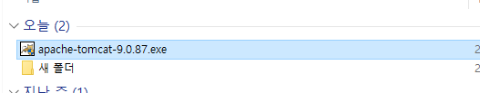

# 01

# JSP 구동환경 만들기

> **TomCat 설치**
> 

```jsx
Connector Port 8090 선택할것 !
```




---

> **Eclipse**
> 

```jsx
UTF-8 로 전부 맞추기!!
```


---

> **Eclipse 프로젝트 생성**
> 


---

> **Emmit 설치**
> 

```jsx
//Emmit 설치
http://download.emmet.io/eclipse/updates/
```


---

> **Tern 설치**
> 
```jsx
//Tern 설치
https://github.com/angelozerr/tern.java/
```


---