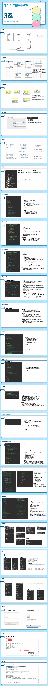

# 01

> **PPT**
> 



---

> **01선언문**
> 

```jsx
<%@page import="jdk.internal.org.jline.terminal.TerminalBuilder.SystemOutput"%>
<%@ page language="java" contentType="text/html; charset=UTF-8"
    pageEncoding="UTF-8"%>
<!DOCTYPE html>
<html>
<head>
<meta charset="UTF-8">
<title>Insert title here</title>
</head>
<body>
<!-- 
	선언문(서블릿으로 변환되는 자바파일의 속성/기능을 추가)
 -->
 
<%!
	//서블릿파일의 멤버변수(속성)
 	String name = "HONG GIL DONG";
	//서블릿파일의 멤버함수(기능)
	public String testFunc(){
	 	System.out.println("선언문 TEST");
	 	return "name : " + name;
	}
%>
<!-- 
	표현식 (SERVLET 파일(JAVA파일) 안의 값을 FRONTEND로 전달 표현할 때 사용
-->
NAME : <%=name %> <br/>
testFunc() : <%=testFunc() %><br/>

<!-- 
서블릿 파일 생성위치
C:\정처산기공유\JSP_workspace\.metadata\.plugins\org.eclipse.wst.server.core\tmp0\work\Catalina\localhost\01JSP\org\apache\jsp\C01 
-->
</body>
</html>
```

---

> **02선언문**
> 

```jsx
<%@page import="jdk.internal.org.jline.terminal.TerminalBuilder.SystemOutput"%>
<%@ page language="java" contentType="text/html; charset=UTF-8"
    pageEncoding="UTF-8"%>
<!DOCTYPE html>
<html>
<head>
<meta charset="UTF-8">
<title>Insert title here</title>
</head>
<body>

<%!
	int n = 0;
	public int countUp(){
		n++;
		return n;
	}
%>
<%=countUp()%>

</body>
</html>
```

---

> **03스트립틀릿**
> 

```jsx
<%@ page language="java" contentType="text/html; charset=UTF-8"
    pageEncoding="UTF-8"%>
<!DOCTYPE html>
<html>
<head>
<meta charset="UTF-8">
<title>Insert title here</title>
</head>
<body>

<!-- 
	Scriptlet : JSP -> Servlet파일로 변환될때 Servlet내의 Service 함수 안에서 처리되는 로직
	Service라는 함수내에서 동작하기 때문에 지역변수 선언, 반복문/분기문 처리가 가능
	하지만 함수를 벗어나면 지역변수는 소멸되기 때문에 요청시(ex 새로고침) 되면 상태값이 초기화 된다
 -->
 
 <%
 	String str1 = "HELLO1";
 	String str2 = "HELLO2";
 	String str3 = str1 + str2;
 	int a = 0;
 	for(int i=0;i<10;i++){
 		a++;
 		System.out.println(i);
 	}
 %>
 
 <%=str1 %><br>
 <%=str2 %><br>
 <%=str3 %><br>
 <%=a %><br>
</body>
</html>
```

---

> **04스트립틀릿**
> 

```jsx
<%@ page language="java" contentType="text/html; charset=UTF-8"
	pageEncoding="UTF-8"%>

<%
java.util.Scanner sc = new java.util.Scanner(System.in);
System.out.print("행 열 입력 : ");
int row = sc.nextInt();
int col = sc.nextInt();
System.out.printf("행 : %d 열 : %d\n", row, col);
%>
<!DOCTYPE html>
<html>
<head>
<meta charset="UTF-8">
<title>Insert title here</title>
</head>
<body>
	<table>
		<tbody>
			<%
			//tr태그 생성 반복
			for (int i = 0; i < row; i++) {
			%>
			<tr>
				<%
					for(int j=0;j<col;j++){
						%>
						<td><%=i+":"+j %></td>
						<%
					}
				%>
			</tr>
			<%
			}
			%>
		</tbody>
	</table>
</body>
</html>
```

---

> **05스트립틀릿**
> 

```jsx
<%@ page language="java" contentType="text/html; charset=UTF-8"
	pageEncoding="UTF-8"%>

<%
java.util.Scanner sc = new java.util.Scanner(System.in);
System.out.print("구구단 출력 : ");
int dan = sc.nextInt();
System.out.printf("구구단 출력 : %d단\n", dan);
%>
<!DOCTYPE html>
<html>
<head>
<meta charset="UTF-8">
<title>Insert title here</title>
</head>
<body>
<%
	for(int i=1;i<=9;i++){
		%>
		<td><%=dan + " X " + i + "="  + dan * i %></td>
		<% 
	}
%>
</body>
</html>
```

---

> **C01Request_Get**
> 

```jsx
<!DOCTYPE html>
<html>
<head>
<meta charset="UTF-8">
<title>Insert title here</title>
</head>
<body>
<form action="./C01Request_Process.jsp" method="get">
	<input type="text" name="username"/><br/>
	<input type="text" name="password"/><br/>
	<input type="text" name="bgColor"/><br/>
	<button>전송</button>
</form>
</body>
</html>
```

---

> **C01Request_Process**
> 

```jsx
<%@ page language="java" contentType="text/html; charset=UTF-8" pageEncoding="UTF-8"%>
<!DOCTYPE html>
<%
    // request 내장 - 요청정보값 저장(HTTP Request Protocol의 구조형태)
    String username = request.getParameter("username");
    String password = request.getParameter("password");
    String bgColor = request.getParameter("bgColor");

    // 서버 콘솔 로그
    System.out.printf("username: %s, password: %s, bgColor: %s%n", username, password, bgColor);
%>
<html>
<head>
    <meta charset="UTF-8">
    <title>사용자 정보 출력</title>
</head>
<body style="background-color:<%=bgColor.equals("")? "gray":bgColor %>">
    username : <%= username %>
    <hr/>
    password : <%= password %>
    <hr/>
    bgColor : <%= bgColor %>
</body>
</html>
```

---

> **C02Request_Post**
> 

```jsx
<!DOCTYPE html>
<html>
<head>
<meta charset="UTF-8">
<title>Insert title here</title>
</head>
<body>
<form action="./C02Request_Process.jsp" method="post">
	<input type="text" name="username"/><br/>
	<input type="text" name="password"/><br/>
	<input type="text" name="bgColor"/><br/>
	<button>전송</button>
</form>
</body>
</html>
```

---

> **C02Request_Process**
> 

```jsx
<%@ page language="java" contentType="text/html; charset=UTF-8" pageEncoding="UTF-8"%>
<!DOCTYPE html>
<%--
<%
    // request 내장 - 요청정보값 저장(HTTP Request Protocol의 구조형태)
    
    // 문자셋 설정
    request.setCharacterEncoding("UTF-8");
	response.setContentType("text/html; charset=UTF-8");
	
    String username = request.getParameter("username");
    String password = request.getParameter("password");
    String bgColor = request.getParameter("bgColor");

    // 서버 콘솔 로그
    System.out.printf("username: %s, password: %s, bgColor: %s%n", username, password, bgColor);

<html>
<head>
    <meta charset="UTF-8">
    <title>사용자 정보 출력</title>
</head>
<!-- 표현식으로 처리 -->

<body style="background-color:<%=bgColor.equals("")? "gray":bgColor %>">
    username : <%= username %>
    <hr/>
    password : <%= password %>
    <hr/>
    bgColor : <%= bgColor %>
</body>
--%>
<%
// 문자셋 설정
request.setCharacterEncoding("UTF-8");
response.setContentType("text/html; charset=UTF-8");
%>
<!-- EL -->
<html lang="ko">
<head>
	<meta charset="UTF-8" />
	<title>Document</title>
</head>
<body style="background-color:${param.bgColor}">
	EL_USERNAME : ${param.username} <br />
	EL_PASSWORD : ${param.password} <br />
</body>
</html>

```

---

> **C03JSP_TO_JS**
> 

```jsx
<%@ page language="java" contentType="text/html; charset=UTF-8"
	pageEncoding="UTF-8"%>
<!-- BankEnd 처리 코드 -->
<%
String msg1 = "HELLO 1";
String msg2 = "HELLO 2";
String msg3 = "HELLO 3";
String msg4 = "HELLO 4";
request.setAttribute("message", "TEST!!");
request.setAttribute("message2", "TEST!!");
%>
<!DOCTYPE html>
<html>
<head>
<meta charset="UTF-8">
<title>Insert title here</title>
</head>
<body>
	<script>
	<%--
		const message1 = '<%=msg1%>';
		const message2 = '<%=msg2%>';
		const message3 = '<%=msg3%>';
		const message4 = '<%=msg4%>';
	--%>
	const message1 = '${message}';		//EL
	const message2 = '${message2}';		//EL
	const message3 = `${message}`;		//보간법(JSP의 message값을 리터럴 형태로 변환)
	const message4 = '<%=msg4%>';
	
	console.log(message1);
	console.log(message2);
	console.log(message3);
	console.log(message4);
	</script>
</body>
</html>
```

---

> **C04JS_TO_JSP**
> 

```jsx
<%@ page language="java" contentType="text/html; charset=UTF-8"
    pageEncoding="UTF-8"%>
<!DOCTYPE html>
<html>
<head>
<meta charset="UTF-8">
<title>Insert title here</title>
</head>
<body>

	<%!
		boolean isInit=true;
	%>
	<%
		String username = request.getParameter("username");
		String password = request.getParameter("password");
		String role = request.getParameter("role");
		String flag = request.getParameter("flag");
		System.out.println("FLAG : " + flag);
		System.out.println("isInit = " + isInit);
		if(flag!=null && flag.equals("true")){
			isInit=false;
		}
			
	
	%>
	USERNAME :
	<%=username%><br> PASSWORD :
	<%=password%><br> ROLE :
	<%=role%><br>

	<form action="C04JStoJSP.jsp" name="myForm">
		<input name="username" type="hidden" /> 
		<input name="password" type="hidden" /> <input name="role" type="hidden" /> 
		<input name="flag" value="true" type="hidden" />
	</form>

	<script>
		const form = document.myForm;
		const flag = '<%=isInit%>';
		console.log("flag",flag);
		if(flag == 'true'){
			form.username.value = "홍길동";
			form.password.value = "1234";
			form.role.value = "ROLE_USER";
			form.submit();
		}
	</script>
	
</body>
</html>
```

---