# ⚛️ React 이벤트 처리(Event Handling) 정리

## 📌 개요 (Overview)

React에서 이벤트 처리 방식은 HTML에서의 방식과 유사하지만, **JSX 문법과 JavaScript의 특성**에 따라 몇 가지 차이점이 있습니다.

```html
<!-- HTML 방식 -->
<button onclick="activateLasers()">Activate Lasers</button>
```

```jsx
// React JSX 방식
<button onClick={activateLasers}>Activate Lasers</button>
```

- 이벤트 이름은 **camelCase**(`onClick`)로 작성
- **문자열이 아닌 함수 참조**를 전달해야 함

---

## 💡 핵심 문법 요약

| 항목 | HTML | React |
|------|------|-------|
| 이벤트 이름 | 소문자 (onclick) | 카멜케이스 (onClick) |
| 핸들러 전달 | 문자열 | 함수 참조 |
| 기본 동작 방지 | return false | `e.preventDefault()` 사용 |

---

## 🧪 기본 예제

```jsx
function MyButton() {
  function handleClick() {
    alert('Button clicked!');
  }

  return <button onClick={handleClick}>Click me</button>;
}
```

---

## 📝 기본 동작 방지 (preventDefault)

```jsx
function Form() {
  function handleSubmit(e) {
    e.preventDefault(); // submit 기본 동작 방지
    console.log('You clicked submit.');
  }

  return (
    <form onSubmit={handleSubmit}>
      <button type="submit">Submit</button>
    </form>
  );
}
```

- `e.preventDefault()`는 필수!  
  - HTML처럼 `return false`는 작동하지 않음

---

## 🧠 합성 이벤트(SyntheticEvent)

React는 브라우저 간의 호환성을 위해 W3C 명세 기반의 **SyntheticEvent**를 제공합니다.  
→ 일반 DOM 이벤트처럼 사용하지만, React가 성능 최적화를 위해 만든 래퍼 이벤트입니다.

---

## 🧩 클래스 컴포넌트에서 이벤트 처리

### 1 일반적인 바인딩 방식

```jsx
class Toggle extends React.Component {
  constructor(props) {
    super(props);
    this.state = { isToggleOn: true };
    this.handleClick = this.handleClick.bind(this); // 바인딩 필수
  }

  handleClick() {
    this.setState(prev => ({
      isToggleOn: !prev.isToggleOn,
    }));
  }

  render() {
    return (
      <button onClick={this.handleClick}>
        {this.state.isToggleOn ? 'ON' : 'OFF'}
      </button>
    );
  }
}
```

---

### 2 클래스 필드 문법 (바인딩 생략 가능)

```jsx
class LoggingButton extends React.Component {
  handleClick = () => {
    console.log('this is:', this);
  };

  render() {
    return <button onClick={this.handleClick}>Click me</button>;
  }
}
```

> 이 문법은 Create React App 등에서는 기본적으로 사용 가능 (Babel 설정 포함)

---

### 3 화살표 함수로 처리

```jsx
class LoggingButton extends React.Component {
  handleClick() {
    console.log('this is:', this);
  }

  render() {
    return (
      <button onClick={() => this.handleClick()}>
        Click me
      </button>
    );
  }
}
```

- 단점: 렌더링마다 **새로운 함수**가 생성됨  
- 하위 컴포넌트로 props 전달 시 **불필요한 리렌더링 발생 가능성**

---

## 🎯 인자 전달하기

이벤트 핸들러에 인자를 추가로 전달하는 경우:

```jsx
<button onClick={(e) => this.deleteRow(id, e)}>Delete Row</button>
<button onClick={this.deleteRow.bind(this, id)}>Delete Row</button>
```

- 두 방법 모두 `id`는 첫 번째 인자, 이벤트 객체 `e`는 두 번째 인자로 전달됨
- 첫 번째는 **화살표 함수 방식**, 두 번째는 **bind 방식**

---

## ⚠️ 주의사항 요약

| 주의점 | 설명 |
|--------|------|
| `this` 바인딩 | 클래스 메서드는 기본적으로 바인딩되지 않음 |
| preventDefault 필수 | `return false`는 작동하지 않음 |
| 성능 고려 | 화살표 함수는 매 렌더링마다 새로 생성됨 |
| SyntheticEvent | React의 합성 이벤트 객체 사용됨 |
| 브라우저 이벤트와 다름 | 이벤트 풀링 등 일부 차이 존재 (최근엔 풀링 제거됨) |

---

## 💡 팁: 여러 이벤트 처리 예시

### 입력값 추적

```jsx
function InputForm() {
  const [text, setText] = useState('');

  function handleChange(e) {
    setText(e.target.value);
  }

  return (
    <input value={text} onChange={handleChange} />
  );
}
```

---

### 마우스 이벤트

```jsx
function MouseTracker() {
  function handleMouseOver() {
    console.log("Mouse is over!");
  }

  return <div onMouseOver={handleMouseOver}>Hover me!</div>;
}
```

---

## 📃 한 줄 요약 (1-Line Summary)

React의 이벤트 처리는 HTML과 유사하지만 JSX 문법과 JavaScript의 특성(바인딩, 함수 참조 등)을 이해하는 것이 중요합니다.

## ⚛️ 실습

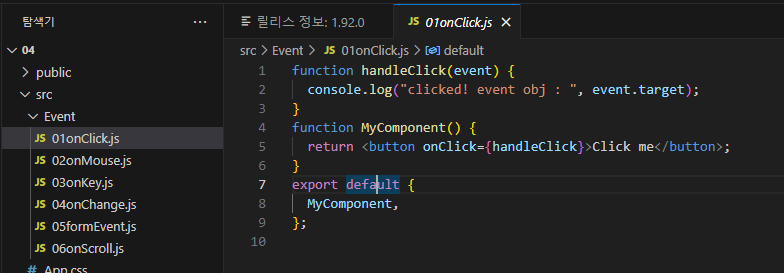
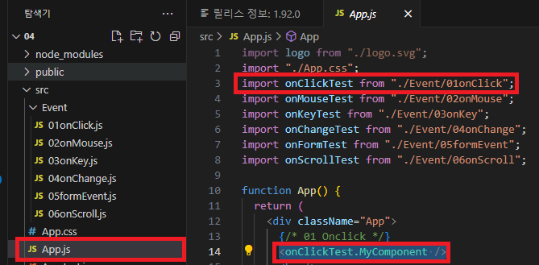
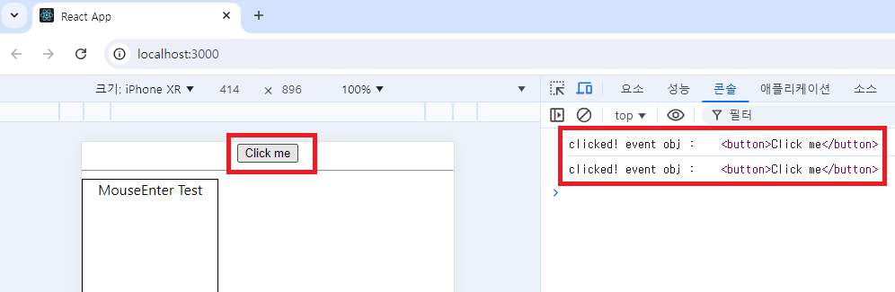
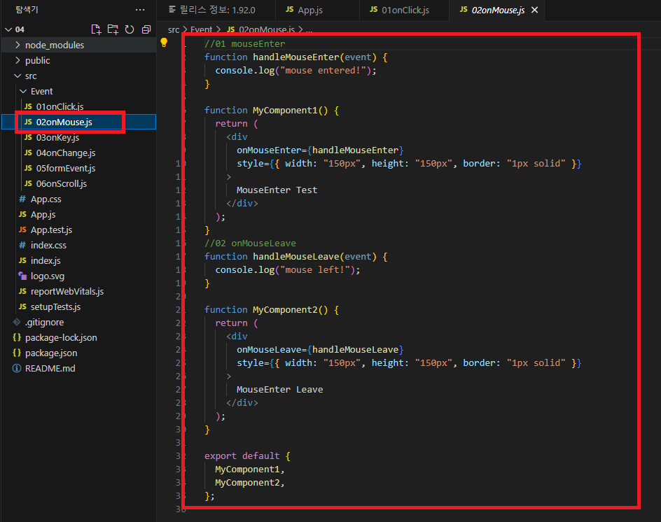
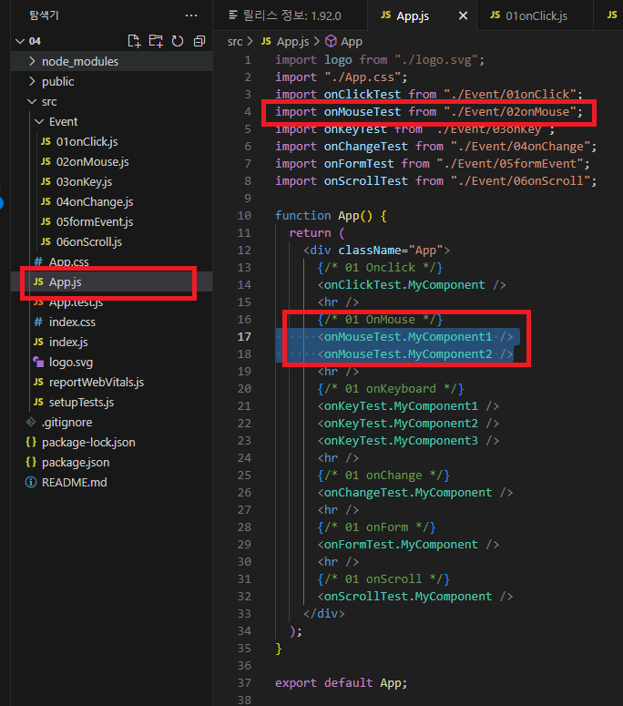
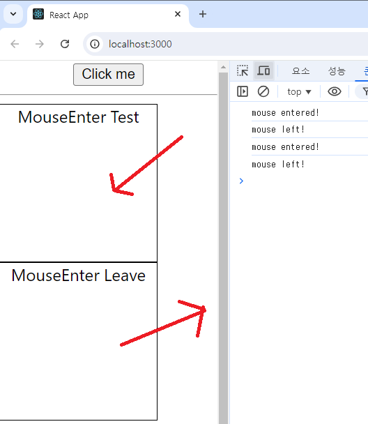
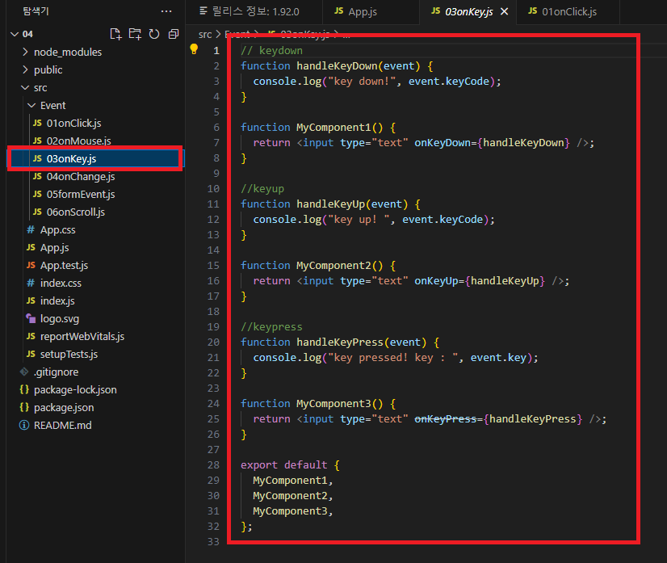
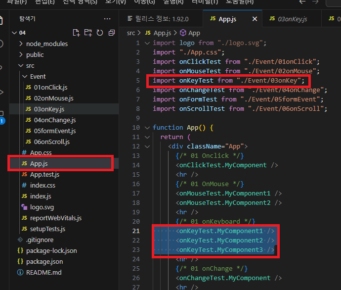
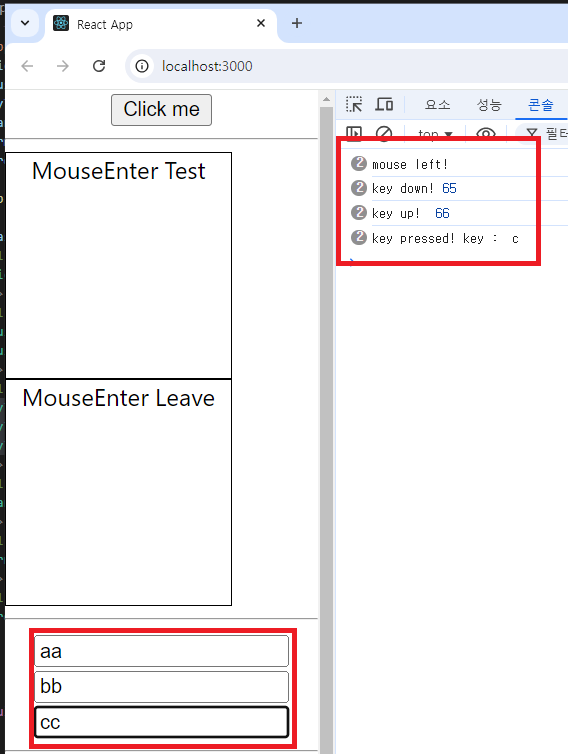
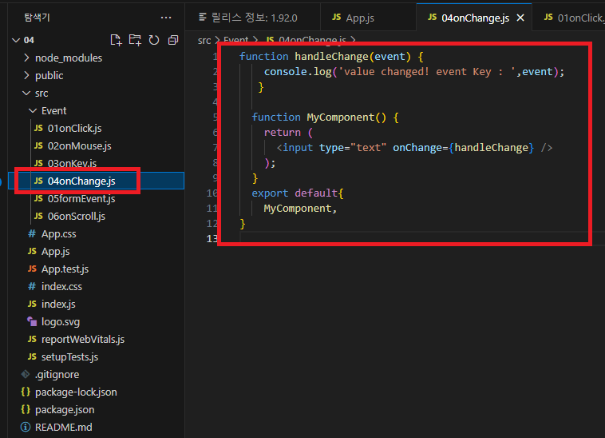
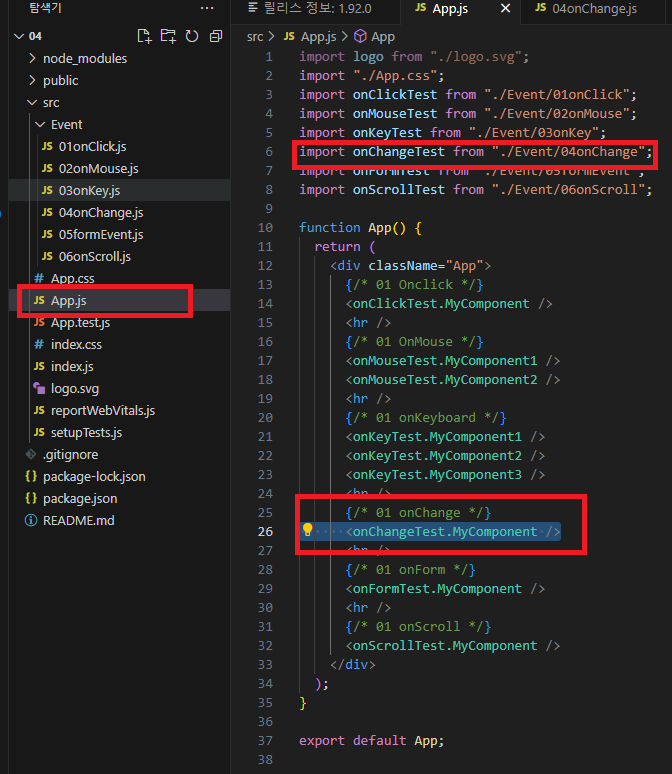
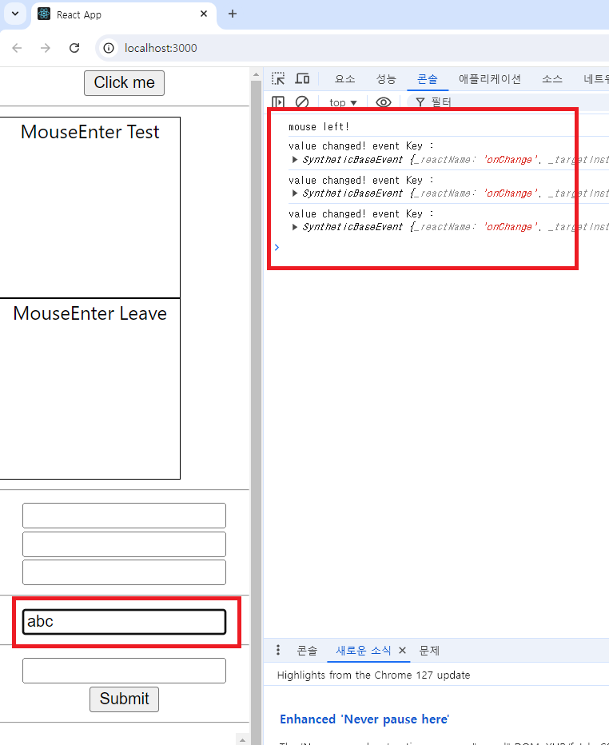
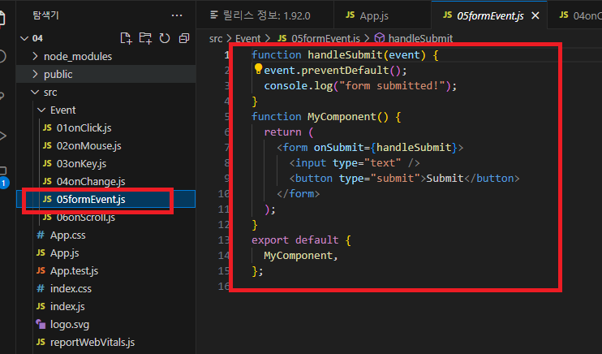
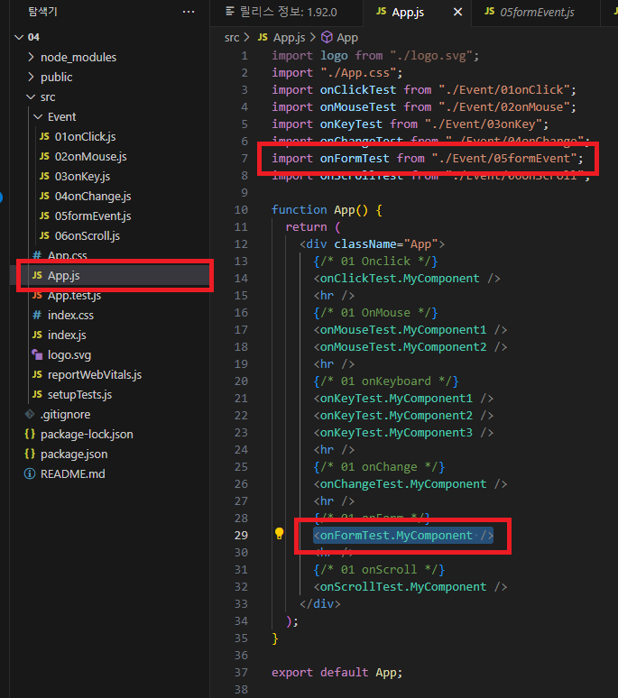
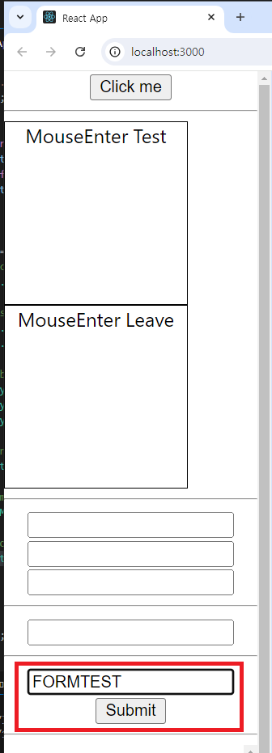
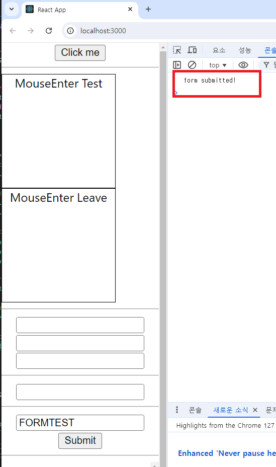
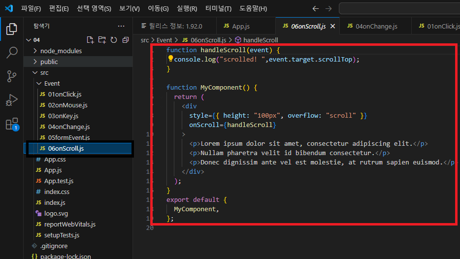
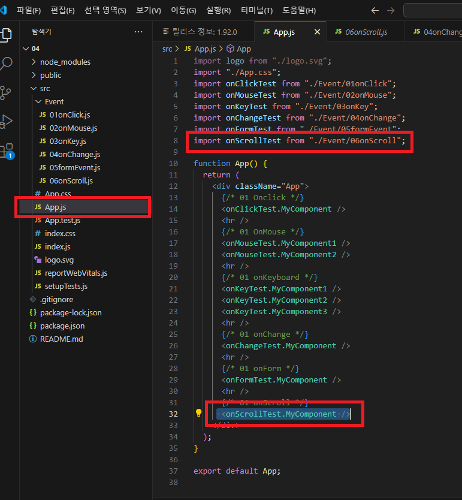
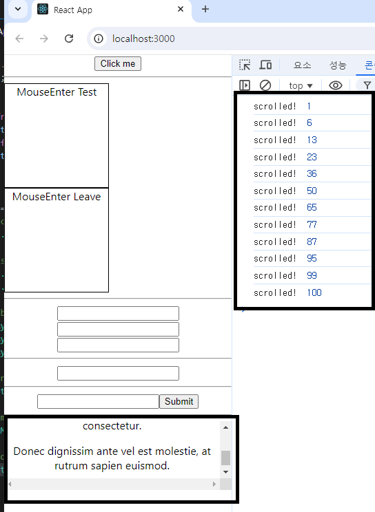
