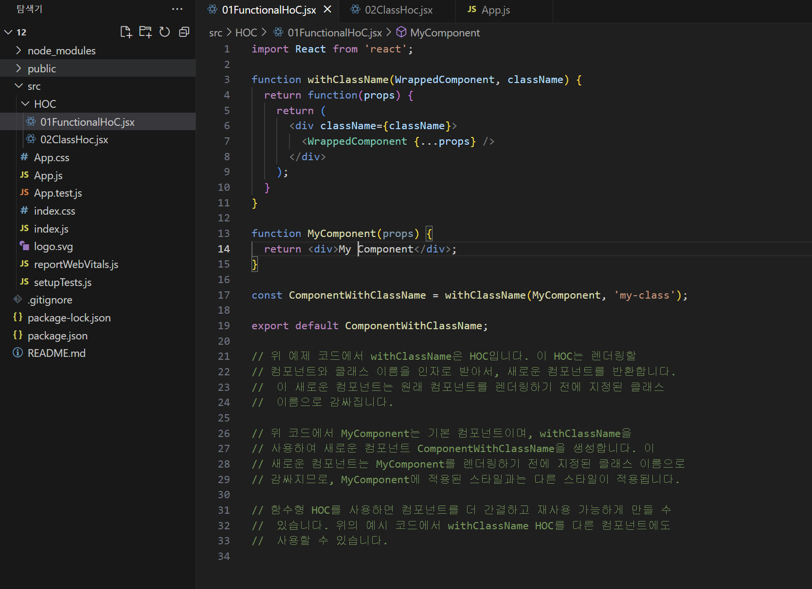
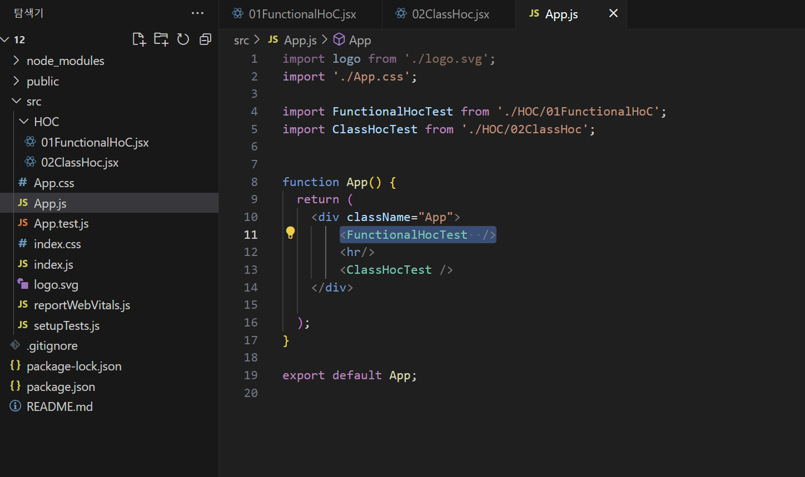
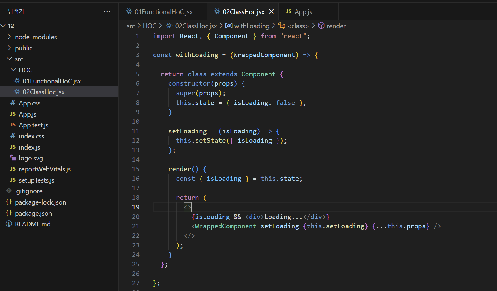
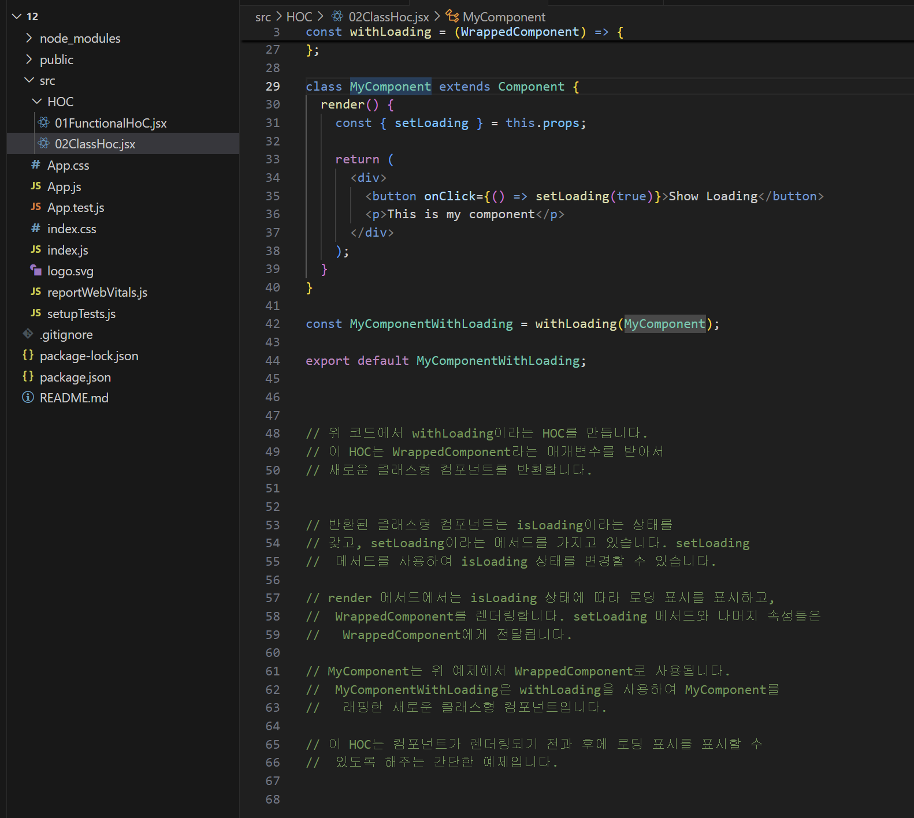
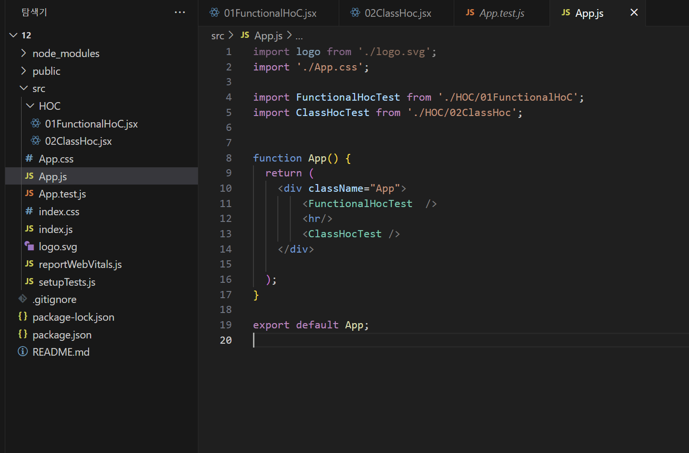
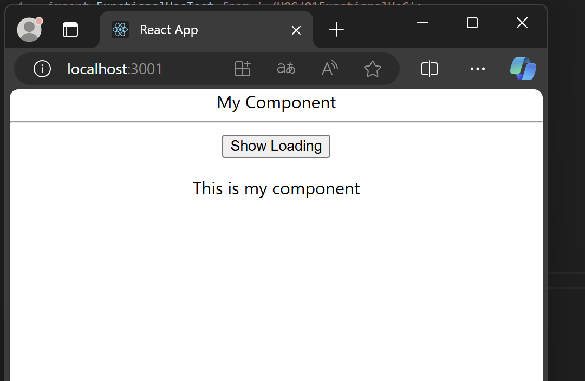
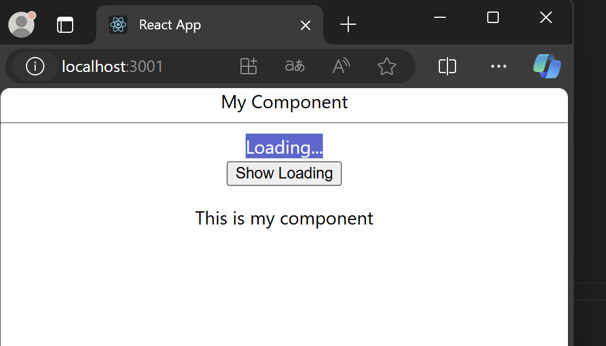

# 🧠 고차 컴포넌트 (Higher-Order Component, HOC) 정리

## 📌 개요

**고차 컴포넌트(HOC)**는 컴포넌트를 인자로 받아 새로운 컴포넌트를 반환하는 **컴포넌트 로직 재사용을 위한 고급 패턴**입니다.  
React API의 일부는 아니며, React의 **조합(Composition)** 개념에서 파생된 **함수형 프로그래밍 기법**입니다.

```jsx
const EnhancedComponent = higherOrderComponent(WrappedComponent);
```

---

## 🔁 왜 HOC를 사용하는가?

컴포넌트가 마운트될 때 공통적으로 처리하는 로직을 여러 컴포넌트에서 반복하게 되는 경우, 해당 로직을 **하나의 함수로 추상화**하여 재사용하기 위해 사용합니다.

---

## 🧩 HOC 기본 예시

```jsx
function withSubscription(WrappedComponent, selectData) {
  return class extends React.Component {
    constructor(props) {
      super(props);
      this.state = {
        data: selectData(DataSource, props)
      };
    }

    componentDidMount() {
      DataSource.addChangeListener(this.handleChange);
    }

    componentWillUnmount() {
      DataSource.removeChangeListener(this.handleChange);
    }

    handleChange = () => {
      this.setState({
        data: selectData(DataSource, this.props)
      });
    };

    render() {
      return <WrappedComponent data={this.state.data} {...this.props} />;
    }
  };
}
```

사용 예시:

```jsx
const CommentListWithSubscription = withSubscription(
  CommentList,
  (DataSource) => DataSource.getComments()
);

const BlogPostWithSubscription = withSubscription(
  BlogPost,
  (DataSource, props) => DataSource.getBlogPost(props.id)
);
```

---

## 💡 핵심 개념 요약

- 컴포넌트를 입력받아 새 컴포넌트를 반환하는 **순수 함수**
- 원본 컴포넌트를 수정하지 않고 **조합(Composition)** 을 통해 기능 확장
- Redux의 `connect`, Relay의 `createContainer` 등에서도 사용됨

---

## ⚠ 주의사항

| 항목 | 설명 |
|------|------|
|  render 내부에서 HOC 호출 금지 | 매 렌더링마다 새 컴포넌트를 생성하여 state가 유지되지 않음 |
|  정적 메서드는 복사 필요 | `hoist-non-react-statics` 라이브러리 활용 가능 |
|  ref는 전달되지 않음 | `React.forwardRef` 사용 필요 |
|  displayName 지정 | 디버깅 편의성을 위해 `WithHOC(ComponentName)` 형식 권장 |

---

## 🧪 비유

> HOC는 컴포넌트에 **필터나 기능을 씌우는 마법의 덮개**입니다.  
기본 가방(WrappedComponent)에 방수기능, 도난방지기능, 추적기능(HOC들)을 붙여서 새로운 스마트 가방(EnhancedComponent)을 만드는 것과 비슷합니다!

---

## 📃 한 줄 요약

**고차 컴포넌트(HOC)는 기존 컴포넌트를 래핑하여 새로운 기능을 주입하고 재사용 가능한 로직을 추상화하는 React 고급 패턴입니다.**

## 🧠 실습







