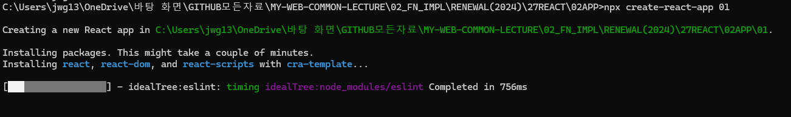
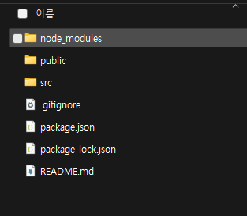

# ⚛️ React - PROJECTINIT 정리

## 📌 참고 링크

| 항목 | 링크 |
|------|------|
| React 공식 문서 | https://react.dev/ |
| Create React App 문서 | https://create-react-app.dev/docs/getting-started/ |

---

## 🛠 제목 1: CRA(Create React App) 프로젝트 생성

### Create App 생성

```bash
npx create-react-app 01
```

- `npx`: npm 5.2 이상부터 제공되는 패키지 실행 도구  
- `create-react-app`: React 프로젝트를 위한 초기 템플릿 생성 툴  
- `01`: 생성할 프로젝트 폴더 이름

---

### 📸 CRA 설치 과정 (터미널 출력 예시)



---

### 📁 생성된 파일 및 폴더 확인




---

### 📂 기본 파일 구조 설명

```
01/
│  .gitignore
│  package-lock.json
│  package.json
│  README.md
│
├─node_modules/          # 모든 의존성 모듈 저장소
├─public/                # 정적 파일 저장소
│   ├─ index.html        # 진입점 HTML
│   └─ 기타 이미지/설정 파일
└─src/                   # 실제 소스 코드 위치
    ├─ index.js          # React 진입점
    ├─ App.js            # 메인 컴포넌트
    ├─ App.css           # App 스타일
    └─ 기타 파일들
```

---

### 📌 주요 파일 설명

| 파일/폴더 | 설명 |
|-----------|------|
| `node_modules/` | 설치된 모든 의존성 모듈 저장소 |
| `public/` | 정적 리소스 위치 (HTML, 이미지 등) |
| `public/index.html` | 앱이 실제로 렌더링되는 HTML 진입점 |
| `src/` | 실제 React 소스 코드가 위치하는 폴더 |
| `src/index.js` | React 앱 시작 지점 (렌더링) |
| `src/App.js` | 화면에 표시되는 기본 컴포넌트 |
| `.gitignore` | Git 관리에서 제외할 파일 목록 |
| `package.json` | 의존성, 스크립트, 메타 정보 저장 |
| `package-lock.json` | 정확한 버전의 의존성 잠금 |
| `README.md` | 프로젝트 설명 파일 |

---

## 🚀 프로젝트 실행

```bash
cd 01
npm start
```

- `npm start`: 개발 서버 실행  
- 기본적으로 브라우저에서 `http://localhost:3000` 으로 접속됨

---

## 🧾 제목 2: 주요 코드 설명

### 📄 index.js

```js
import React from 'react';
import ReactDOM from 'react-dom/client';
import './index.css';
import App from './App';
import reportWebVitals from './reportWebVitals';

const root = ReactDOM.createRoot(document.getElementById('root'));

root.render(
  <React.StrictMode>
    <App />
  </React.StrictMode>
);

reportWebVitals();
```

- `ReactDOM.createRoot()`로 루트 DOM 노드를 지정하고 렌더링  
- `<React.StrictMode>`는 개발 중 경고 및 안전성 확보를 위한 래퍼

---

### 📄 App.js

```js
import logo from './logo.svg';
import './App.css';

function App() {
  return (
    <div className="App">
      <header className="App-header">
        
        <p>
          Edit <code>src/App.js</code> and save to reload.
        </p>
        <a
          className="App-link"
          href="https://reactjs.org"
          target="_blank"
          rel="noopener noreferrer"
        >
          Learn React
        </a>
      </header>
    </div>
  );
}

export default App;
```

- CRA에서 제공하는 기본 샘플 UI
- `로고 + 텍스트 + 링크` 구성의 간단한 시작 컴포넌트

---

## 📃 한 줄 요약 (1-Line Summary)

Create React App은 React 프로젝트를 빠르게 시작할 수 있게 해주는 공식 스타터 툴입니다.
