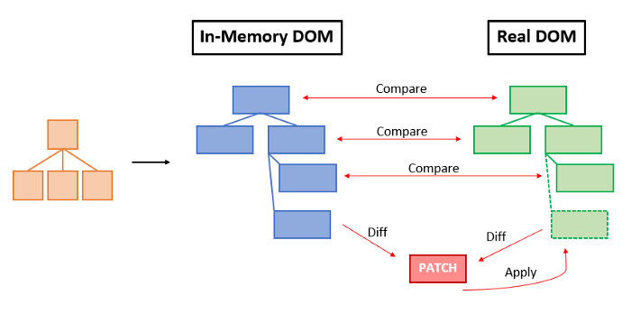

# ⚛️ React 기초 정리

## 📌 개요 (Overview)

**React**는 Facebook(현재 Meta)에서 개발한 오픈 소스 JavaScript 라이브러리로,  
**사용자 인터페이스(UI)**를 효율적으로 구축하기 위한 도구입니다.  
특히 단일 페이지 애플리케이션(SPA)에서 동적 UI를 빠르게 업데이트하는 데 강력한 기능을 제공합니다.

---

## 💡 React의 주요 특징 및 장점

### 1. 컴포넌트 기반 아키텍처
- UI를 **작고 독립적인 컴포넌트 단위**로 나눌 수 있음
- 각 컴포넌트는 **props(속성)**과 **state(상태)**로 동작을 제어함
- **재사용성**이 높아 유지보수 및 확장성이 뛰어남

### 2. Virtual DOM
- 실제 DOM 대신 **가상의 DOM**을 메모리 상에서 관리
- 변경사항을 이전 Virtual DOM과 비교(diff) → 실제 DOM은 꼭 필요한 부분만 업데이트  
- **성능 향상에 매우 중요**

### 3. 단방향 데이터 흐름
- 데이터는 **부모 → 자식 컴포넌트**로만 전달됨
- 데이터 흐름이 예측 가능하고 안정적

### 4. JSX (JavaScript + XML)
- HTML과 유사한 문법을 JavaScript 코드 내에서 작성 가능
- 실제로는 `React.createElement()`로 변환됨 (Babel이 처리함)
- 코드 가독성과 개발 생산성 향상

### 5. React Hooks
- 함수형 컴포넌트에서도 **상태 관리와 생명주기 관리** 가능
- 대표 Hook: `useState`, `useEffect`, `useContext` 등

### 6. 풍부한 생태계
- Redux, React Router, Styled-Components 등 다양한 라이브러리와 잘 어울림

### 7. 서버사이드 렌더링(SSR)
- **Next.js** 같은 프레임워크를 통해 SSR 구현 가능
- **SEO 친화적**, 초기 로딩 속도 개선

### 8. 지속적인 업데이트
- Facebook에 의해 **꾸준한 유지보수와 개선**이 이루어지고 있음

---

## 🧱 React 핵심 기술 요약

### 1) 컴포넌트 기반 구조
- 모든 UI는 컴포넌트 단위로 쪼개어 개발
- 각 컴포넌트는 독립적이고 재사용 가능
- 내부 상태(state)와 외부 데이터(props)를 통해 동작 제어

---

### 2) JSX (JavaScript XML)

> JSX는 JavaScript 코드에 HTML 구조를 작성할 수 있도록 해주는 문법입니다.

```jsx
<Component className='card'>
  <div>Hello world</div>
</Component>
```

위 코드는 다음과 같이 해석됩니다:

```js
React.createElement(
  Component,
  { className: 'card' },
  React.createElement('div', null, 'Hello world')
);
```

#### JSX vs React.createElement 비교 이미지


---

### 3) Virtual DOM

- React는 UI를 직접 DOM에 렌더링하지 않고 **가상의 트리 구조(Virtual DOM)**를 생성합니다.
- 이 구조를 기반으로 변경된 부분만 효율적으로 계산하여 실제 DOM에 적용합니다.
- 핵심 과정:
  1. **Virtual DOM 생성**
  2. **Diff 알고리즘을 통해 변경 비교**
  3. **필요한 부분만 실제 DOM에 반영 (Reconciliation)**

#### Virtual DOM의 동작 흐름


#### 실제 DOM과 비교 후 Patch 적용 구조



> 위 그림처럼 React는 Virtual DOM과 Real DOM을 비교하고 변경 사항(Diff)을 계산한 후, **Patch만 실제 DOM에 적용**하여 성능을 최적화합니다.

---

## 📚 참고 링크

| 항목 | 링크 |
|------|------|
| React 공식 문서 | https://react.dev/ |
| React GitHub | https://github.com/facebook/react |
| Create React App 문서 | https://create-react-app.dev/docs/getting-started/ |
| Virtual DOM 설명 1 | https://velog.io/@liso_o/React-Virtual-Dom-이란 |
| Virtual DOM 설명 2 | https://junilhwang.github.io/TIL/Javascript/Design/Vanilla-JS-Virtual-DOM/ |

---

## 📃 한 줄 요약 (1-Line Summary)

React는 컴포넌트와 Virtual DOM 기반으로 빠르고 유연하게 UI를 구성할 수 있는 JavaScript 라이브러리입니다.
