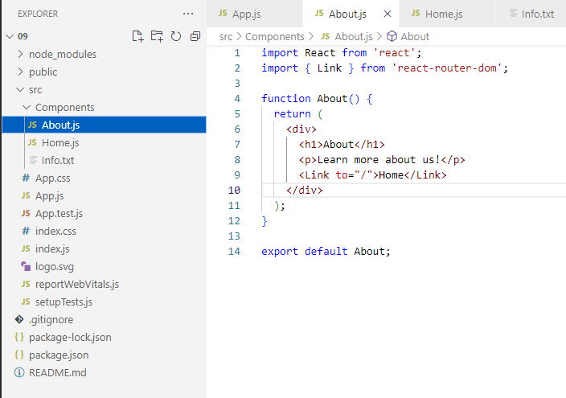
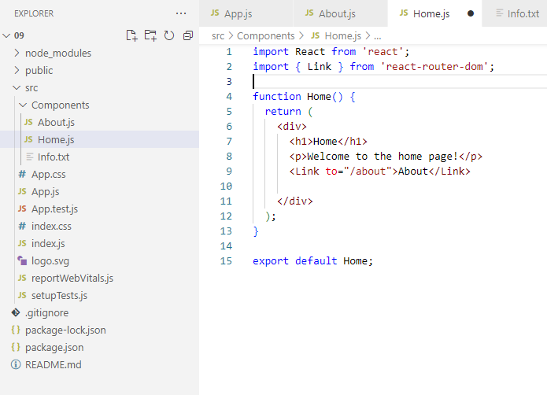
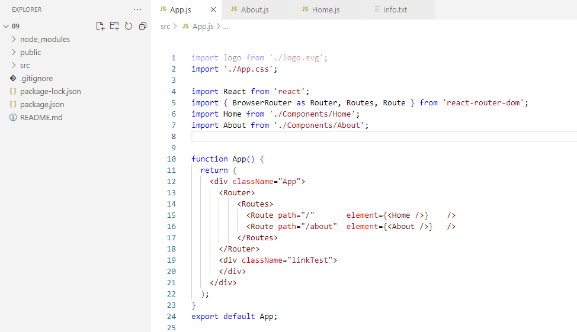
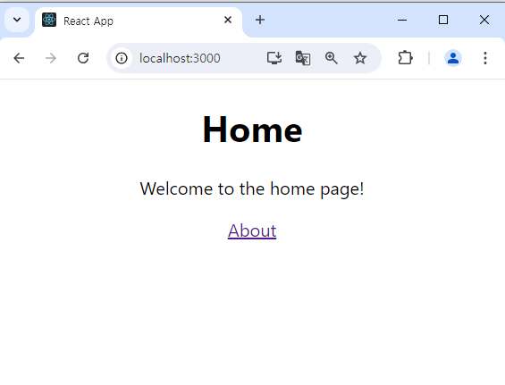
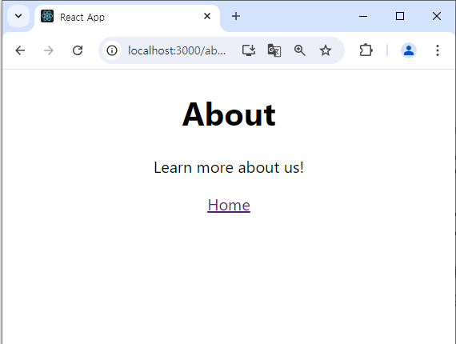

# 🚦 React Router 정리

## 📌 Routing 이란?

**Routing**은 브라우저의 URL 경로에 따라 **해당하는 화면(UI 컴포넌트)** 을 전송해주는 기능입니다.  
React는 SPA(Single Page Application)이므로, 기본적으로 라우팅 기능이 없습니다.

---

## ⚠ React Router를 사용하지 않은 라우팅의 한계

```jsx
<header>
  <button onClick={() => setComp(<Home />)}>Home</button>
  <button onClick={() => setComp(<About />)}>About</button>
</header>
<main>{comp}</main>
```

- ❌ 주소창(URL)이 변경되지 않음 → 즐겨찾기, 새로고침 불가
- ❌ 브라우저의 뒤로가기/앞으로가기 기능 사용 불가
- ❌ SEO(검색엔진 최적화) 불리

---

## React Router란?

React Router는 위 문제들을 해결하기 위해 만들어진 **React 전용 라우팅 라이브러리**입니다.  
→ 내부적으로 `history`, `location` API와 연동되어 URL에 따라 컴포넌트를 렌더링합니다.

---

## 📦 설치

```bash
npm install react-router-dom
```

---

## 🔌 핵심 컴포넌트 3가지

| 컴포넌트 | 설명 |
|----------|------|
| `<Router>` | 최상위 컴포넌트. 모든 라우팅 컴포넌트를 감싸야 함 |
| `<Route>` | URL 경로에 따라 보여줄 컴포넌트 지정 |
| `<Link>` | 사용자에게 보여지는 버튼/텍스트 (a 태그 대체) |

---

## 🧪 기본 사용 예시

```jsx
import { BrowserRouter as Router, Route, Link } from "react-router-dom";

<Router>
  <header>
    <Link to="/"><button>Home</button></Link>
    <Link to="/about"><button>About</button></Link>
    <Link to="/users"><button>User</button></Link>
  </header>

  <main>
    <Route exact path="/" component={Home} />
    <Route path="/about" component={About} />
    <Route path="/users" component={NotFound} />
  </main>
</Router>
```

---

### 🔍 exact의 의미

React Router는 `path="/"`가 `/about`, `/users` 등에도 매칭된다고 판단합니다.  
→ **`exact`** 를 붙이면 정확히 경로가 일치할 때만 매칭됩니다.

---

## 📁 전체 코드 예제

```jsx
// App.js
import React from 'react';
import { Link, Route, BrowserRouter as Router } from 'react-router-dom';
import Home from './Home';
import About from './About';
import NotFound from './NotFound';

function App() {
  return (
    <Router>
      <header>
        <Link to="/"><button>Home</button></Link>
        <Link to="/about"><button>About</button></Link>
        <Link to="/users"><button>User</button></Link>
      </header>
      <hr />
      <main>
        <Route exact path="/" component={Home} />
        <Route path="/about" component={About} />
        <Route path="/users" component={NotFound} />
      </main>
    </Router>
  );
}

export default App;
```

```jsx
// index.js
import React from 'react';
import ReactDOM from 'react-dom';
import App from './App';
import { BrowserRouter } from 'react-router-dom';

ReactDOM.render(
  <React.StrictMode>
    <BrowserRouter>
      <App />
    </BrowserRouter>
  </React.StrictMode>,
  document.getElementById('root')
);
```

---

## 📃 한 줄 요약 (1-Line Summary)

React Router는 SPA에서 URL 주소에 따라 동적으로 컴포넌트를 렌더링할 수 있게 해주는 React 전용 라우팅 라이브러리입니다.

## 🚦 실습





