# 📋 React 리스트 렌더링과 Key 정리

## 📌 개요 (Overview)

React에서는 배열을 활용해 여러 엘리먼트를 효율적으로 렌더링할 수 있으며,  
각 항목에 **key**를 부여함으로써 성능 최적화와 UI 안정성을 확보합니다.

---

## 💡 JavaScript 배열 map() 복습

```js
const numbers = [1, 2, 3, 4, 5];
const doubled = numbers.map((number) => number * 2);
console.log(doubled); // [2, 4, 6, 8, 10]
```

`map()` 함수는 배열 요소를 변형해 **새 배열을 생성**합니다.

---

## 🧱 React에서 배열을 JSX로 렌더링하기

```jsx
const numbers = [1, 2, 3, 4, 5];
const listItems = numbers.map((number) =>
  <li>{number}</li>
);

return <ul>{listItems}</ul>;
```

- JSX 내부에서는 `{}` 중괄호 안에 `listItems`를 넣어 배열 렌더링 가능

---

## 🧩 컴포넌트로 분리하기

```jsx
function NumberList(props) {
  const numbers = props.numbers;
  return (
    <ul>
      {numbers.map((number) =>
        <li>{number}</li>
      )}
    </ul>
  );
}

const numbers = [1, 2, 3, 4, 5];
root.render(<NumberList numbers={numbers} />);
```

- 코드 재사용성과 유지보수를 위해 컴포넌트화

---

## 🧷 Key의 필요성

- React는 리스트 렌더링 시 각 항목을 추적하기 위해 **key**를 사용
- 항목이 변경되었는지 판단할 수 있게 도와줌 (성능 최적화에 필수)

```jsx
const numbers = [1, 2, 3];
const listItems = numbers.map((number) =>
  <li key={number.toString()}>{number}</li>
);
```

---

## Key 작성 시 주의사항

| 항목 | 권장 방식 | 설명 |
|------|------------|------|
| 데이터 ID |  사용 | 가장 안전하고 일관된 key |
| 배열 인덱스 |  제한적 사용 | 요소 순서 변경 시 문제 발생 가능 |
| 중복 key |  사용 금지 | 렌더링 이상 현상 발생 가능 |

```jsx
const todoItems = todos.map((todo) =>
  <li key={todo.id}>{todo.text}</li>
);
```

---

## 잘못된 key 위치 (컴포넌트 내부에 key 지정)

```jsx
function ListItem(props) {
  return <li key={props.value}>{props.value}</li>; // 잘못된 위치!
}

function NumberList(props) {
  return (
    <ul>
      {props.numbers.map((number) =>
        <ListItem value={number} /> // key가 빠짐!
      )}
    </ul>
  );
}
```

---

## 올바른 key 위치 (map() 함수 내부)

```jsx
function ListItem(props) {
  return <li>{props.value}</li>; // 컴포넌트 내부에는 key 필요 없음
}

function NumberList(props) {
  return (
    <ul>
      {props.numbers.map((number) =>
        <ListItem key={number.toString()} value={number} />
      )}
    </ul>
  );
}
```

---

## 🔁 JSX 안에서 map() 직접 사용

```jsx
function NumberList(props) {
  return (
    <ul>
      {props.numbers.map((number) =>
        <li key={number.toString()}>{number}</li>
      )}
    </ul>
  );
}
```

> 인라인으로 사용할 수 있지만, 복잡한 경우 **listItems 변수로 분리하거나 컴포넌트로 추출**하는 것을 권장합니다.

---

## 🧠 Key에 대한 중요한 팁

- **형제 간에만 고유**하면 됨 (전체 앱에서 유일할 필요 없음)
- **컴포넌트에는 key가 전달되지 않음**  
  → key 값을 prop으로 사용하려면 별도 이름으로 전달

```jsx
<Post key={post.id} id={post.id} title={post.title} />
```

---

## 📝 복합 예시: Blog 컴포넌트

```jsx
function Blog(props) {
  const sidebar = (
    <ul>
      {props.posts.map((post) =>
        <li key={post.id}>{post.title}</li>
      )}
    </ul>
  );

  const content = props.posts.map((post) =>
    <div key={post.id}>
      <h3>{post.title}</h3>
      <p>{post.content}</p>
    </div>
  );

  return (
    <div>
      {sidebar}
      <hr />
      {content}
    </div>
  );
}

const posts = [
  {id: 1, title: 'Hello World', content: 'Welcome to learning React!'},
  {id: 2, title: 'Installation', content: 'You can install React from npm.'}
];

root.render(<Blog posts={posts} />);
```

---

## ⚠️ Key 관련 주의사항 요약

| 주의사항 | 설명 |
|----------|------|
| key는 유일해야 함 | 형제 간에만 고유하면 OK |
| key는 컴포넌트 props로 전달되지 않음 | 필요 시 별도 prop으로 전달 |
| 인덱스를 key로 사용하는 건 최후의 수단 | 요소 순서가 바뀌지 않는 경우만 허용 |

---

## 📃 한 줄 요약 (1-Line Summary)

React에서 리스트를 렌더링할 때는 map()을 사용하고, 각 항목에는 key를 지정하여 성능과 안정성을 확보합니다.

## 📋 실습

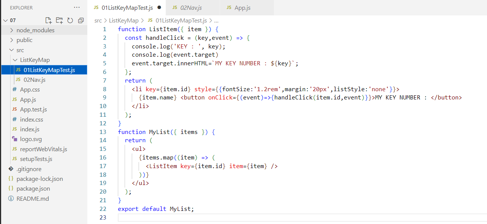
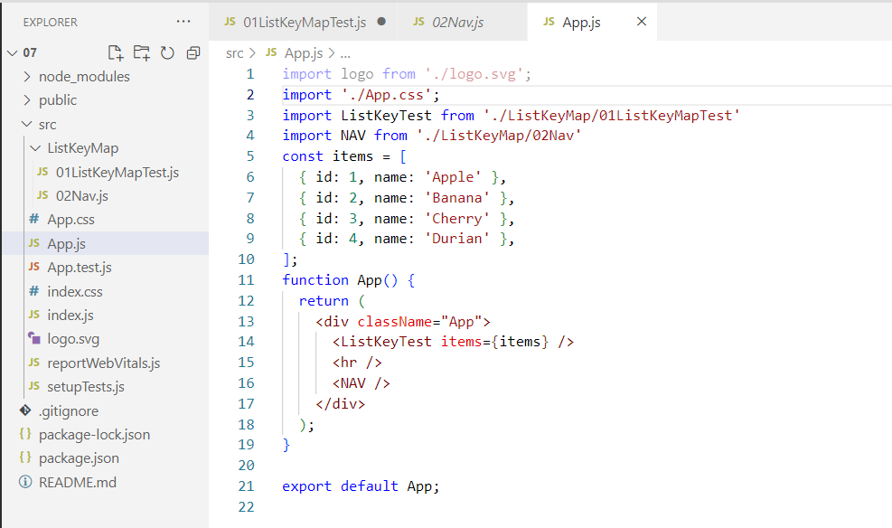
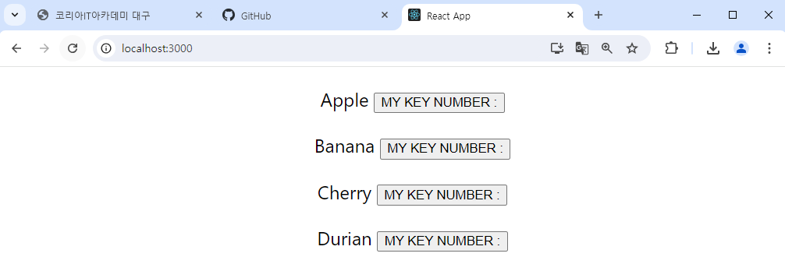
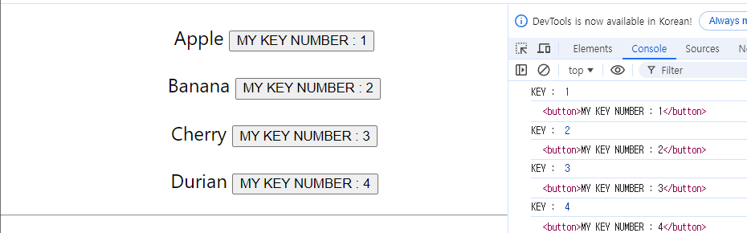


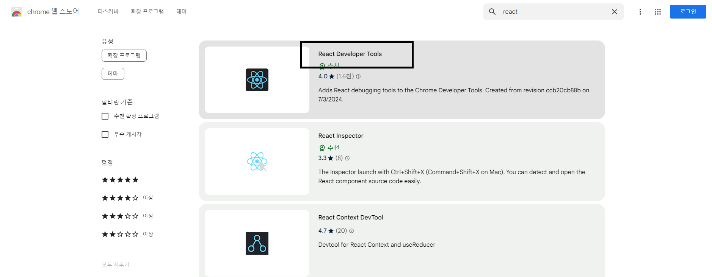
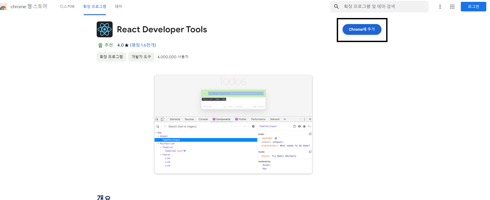
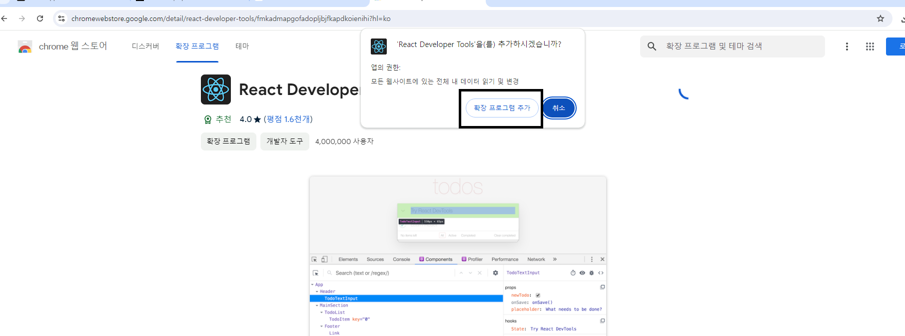
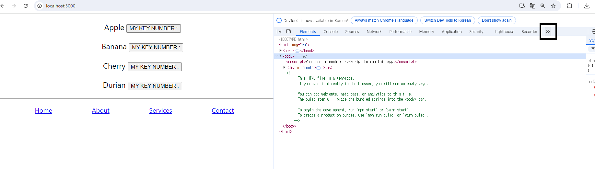
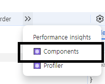
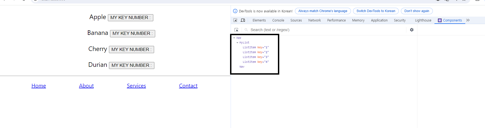
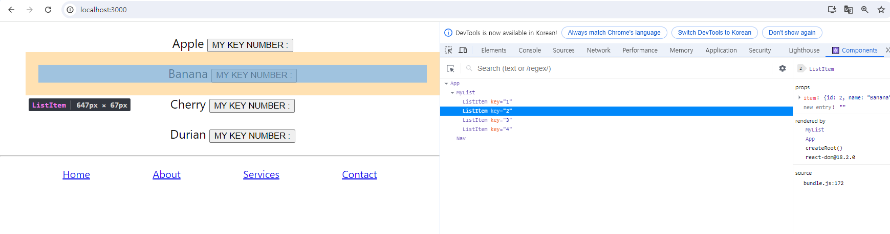