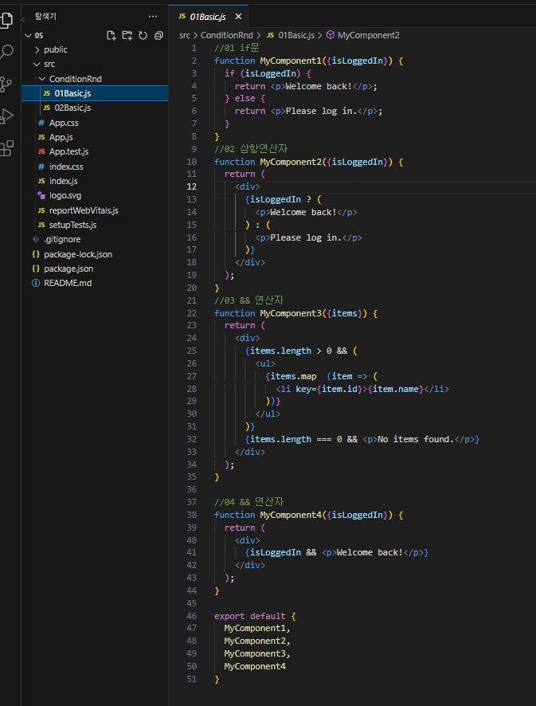
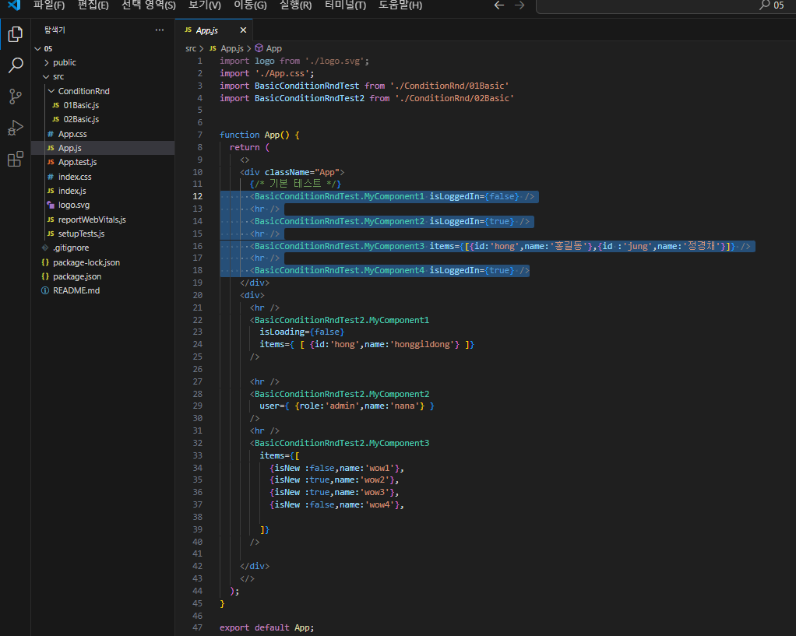
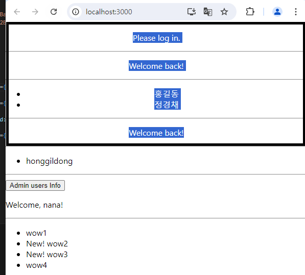
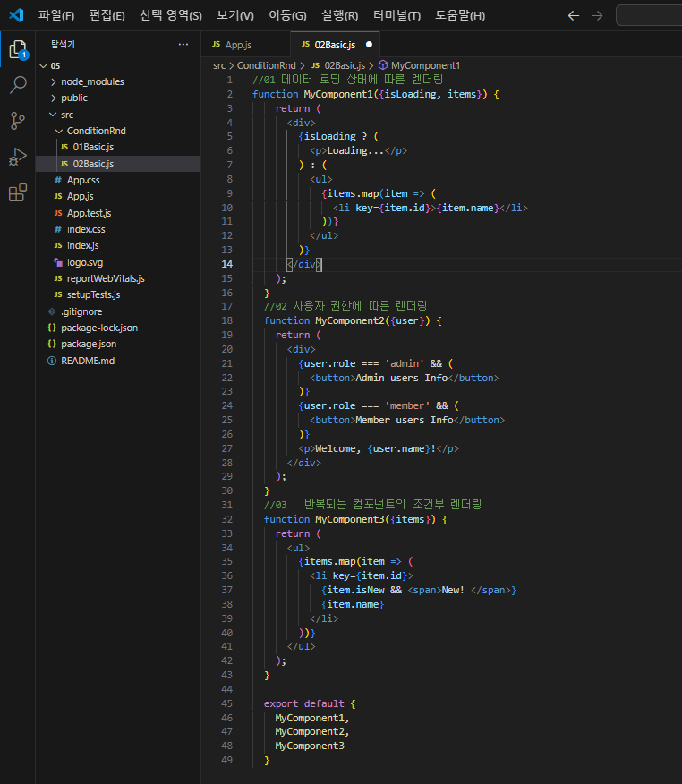
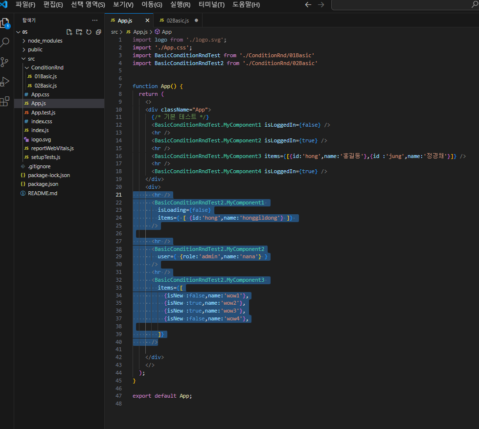
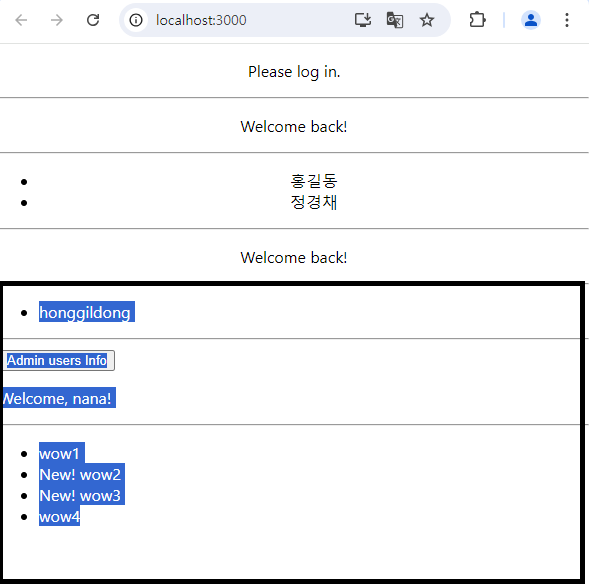

# ⚛️ React 조건부 렌더링 (Conditional Rendering) 정리

## 📌 개요 (Overview)

React에서는 **애플리케이션의 상태(state)**에 따라 **렌더링할 UI를 조건적으로 다르게** 만들 수 있습니다.  
이는 JavaScript의 조건 처리 방식 (`if`, `&&`, `? :`)과 거의 동일하게 JSX에서도 활용됩니다.

---

## 💡 기본 개념

- JSX는 JavaScript이기 때문에, 조건문(`if`, `? :`, `&&`)을 그대로 사용할 수 있음
- 조건에 따라 **특정 컴포넌트를 렌더링하거나 null을 반환**하여 렌더링을 막을 수 있음
- 복잡한 조건 로직은 컴포넌트 분리로 대체하는 것이 가독성에 좋음

---

## 🧪 기본 예제

### 👤 로그인 여부에 따라 다른 인삿말 출력

```jsx
function UserGreeting() {
  return <h1>Welcome back!</h1>;
}

function GuestGreeting() {
  return <h1>Please sign up.</h1>;
}

function Greeting(props) {
  const isLoggedIn = props.isLoggedIn;
  if (isLoggedIn) {
    return <UserGreeting />;
  }
  return <GuestGreeting />;
}

root.render(<Greeting isLoggedIn={false} />);
```

---

## 🧱 조건부 렌더링 패턴 5가지

### 1 if문 (JSX 외부)

```jsx
let button;
if (isLoggedIn) {
  button = <LogoutButton />;
} else {
  button = <LoginButton />;
}
return <div>{button}</div>;
```

- 가장 명확하고 가독성 높은 방식  
- JSX 외부에서 분기 처리

---

### 2 논리 연산자 `&&` (JSX 내부)

```jsx
{unreadMessages.length > 0 &&
  <h2>You have {unreadMessages.length} unread messages.</h2>
}
```

- 조건이 true일 때만 렌더링됨
- **false이면 아무것도 출력되지 않음**
- 주의: `0 && <div>` → `0`이 출력됨

---

### 3 삼항 연산자 `? :`

```jsx
<div>
  {isLoggedIn ? <LogoutButton /> : <LoginButton />}
</div>
```

- 짧고 유연한 인라인 조건 처리  
- **JSX 안에서 바로 사용할 수 있음**

---

### 4 엘리먼트 변수로 조건 분기

```jsx
let greeting;
if (isLoggedIn) {
  greeting = <UserGreeting />;
} else {
  greeting = <GuestGreeting />;
}
return <div>{greeting}</div>;
```

- JSX 안을 깔끔하게 만들고 싶을 때 적합

---

### 5 렌더링 안함 (null 반환)

```jsx
function WarningBanner(props) {
  if (!props.warn) {
    return null; // 렌더링 생략
  }

  return (
    <div className="warning">Warning!</div>
  );
}
```

- 특정 컴포넌트를 숨기고 싶을 때 `null` 반환
- **생명주기 메서드는 계속 호출됨**

---

## 🎮 실전 예제: 로그인 토글

```jsx
class LoginControl extends React.Component {
  constructor(props) {
    super(props);
    this.state = { isLoggedIn: false };
  }

  handleLogin = () => this.setState({ isLoggedIn: true });
  handleLogout = () => this.setState({ isLoggedIn: false });

  render() {
    const isLoggedIn = this.state.isLoggedIn;
    return (
      <div>
        <Greeting isLoggedIn={isLoggedIn} />
        {isLoggedIn
          ? <LogoutButton onClick={this.handleLogout} />
          : <LoginButton onClick={this.handleLogin} />
        }
      </div>
    );
  }
}
```

---

## ⚠️ 주의사항 요약

| 주의할 점 | 설명 |
|-----------|------|
| JSX 내부 if문 사용 불가 | JSX 안에서는 `if`문 직접 사용 불가. 외부에서 선언하거나 삼항, && 사용 |
| falsy 출력 주의 | `0 && <h1>` → `0` 출력됨 |
| 복잡한 조건 | 조건문이 복잡해지면 컴포넌트로 분리할 것 |
| null 반환 | `null`을 반환하면 렌더링 자체를 생략함 (숨기기용)

---

## 🔧 활용 팁

- **다중 조건**이 필요한 경우 `switch`, 별도 함수, 분리된 컴포넌트로 처리하는 것이 좋음
- **UI 숨김 처리**할 땐 CSS `display: none` 보다 `null 반환`이 더 효과적
- 조건 표현식 안에서 너무 많은 로직을 담지 말 것 (가독성 저하)

---

## 📃 한 줄 요약 (1-Line Summary)

React의 조건부 렌더링은 JS 조건문을 JSX에 자연스럽게 적용하여 UI를 상태에 따라 유연하게 구성할 수 있게 해줍니다.

## ⚛️ 실습






