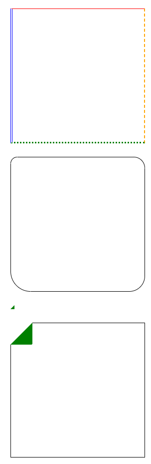

# 01

> **04Box_border.html**
> 



```jsx
<!DOCTYPE html>
<html lang="en">
<head>
    <meta charset="UTF-8">
    <meta name="viewport" content="width=device-width, initial-scale=1.0">
    <title>Document</title>

    <style>
        div{width: 300px; height: 300px; margin: 30px; border: 1px solid;}
        /* 테두리 선종류 확인 */
        .d1{
            border-top: 2px solid red;
            border-right: 3px dashed orange;
            border-bottom: 4px dotted green;
            border-left: 5px double blue;
        }
        /* 테두리 깍기 */
        .d2{
            /* border-radius: 15px; */
            /* border-radius: 15px 0px; */
            /* border-radius: 15px 25px 35px; */
            border-radius: 15px 25px 35px 45px;
        }
        /* 효과부여하기(삼각형만들기) */
        .d3{
            width: 0px;
            height: 0px;
            border-top: 5px solid transparent;
            border-right: 5px solid green;
            border-bottom: 5px solid green;
            border-left: 5px solid transparent;
        }
        *{
            box-sizing: border-box;
        }
        .d4{
            position: relative;
        }
        .d4::before{
            content: "";
            position: absolute;
            left: -1px;
            top: -1px;
            width: 0px;
            height: 0px;
            /* border: 1px solid red; */

            border-top: 25px solid white;
            border-right: 25px solid green;
            border-bottom: 25px solid green;
            border-left: 25px solid white;
            border-radius: 0px 0px 3px 0px;
        }

    </style>
</head>
<body>
    <div class="d1"></div>
    <div class="d2"></div>
    <div class="d3"></div>
    <div class="d4"></div>

</body>
</html>
```

---

> **05Box-overflow.html**
> 


```jsx
<!DOCTYPE html>
<html lang="en">
<head>
    <meta charset="UTF-8">
    <meta name="viewport" content="width=device-width, initial-scale=1.0">
    <title>Document</title>

    <style>
        .parent{
            width: 300px; height: 300px;
            background-color: orange;
            /* overflow: hidden; */
            /* overflow: scroll; */
            /* overflow-x: scroll; */
            /* overflow: visible; */
            overflow: auto;
        }
        .child{
            width: 450px; height: 150px;
            background-color: royalblue;

        }
    </style>
</head>
<body>
    <div class="parent">
        <div class="child"></div>
    </div>
</body>
</html>
```

---

> **06Box-sizing.html**
> 


```jsx
<!DOCTYPE html>
<html lang="en">
<head>
    <meta charset="UTF-8">
    <meta name="viewport" content="width=device-width, initial-scale=1.0">
    <title>Document</title>
    <style>
        *{
            box-sizing: border-box;
        }
        body{
            margin: 0px;
        }
        div{
            width: 100px;
            height: 100px;
            background-color: orange;
            padding: 10px;
            border: 10px;
            border: 5px solid;
            margin: 20px;
        }
    </style>
</head>
<body>

    <div></div>
    <div></div>
    <div></div>
    <div></div>
</body>
</html>
```

---

> **01Selector.html**
> 


```jsx
<!DOCTYPE html>
<html lang="en">

<head>
    <meta charset="UTF-8">
    <meta name="viewport" content="width=device-width, initial-scale=1.0">
    <title>Document</title>

    <style>
        /* 전체선택자 */
        * {
            margin: 20px;
        }

        /* 요소선택자 */
        div {
            width: 150px;
            height: 150px;
            border: 1px solid;
        }

        p {
            width: 100px;
            height: 100px;
            border: 1px solid;
        }

        /* id선택자 */
        #id_01 {
            background-color: orange;
        }

        /* class선택자 */
        .group{
            background-color: royalblue;
        }
        /* 그룹선택자 */
        #id_01,
        .group{
            border: 5px solid red;
        }
    </style>
</head>

<body>
    <div class="group"></div>
    <div id="id_01"></div>
    <div></div>
    <div>
        <p class="group"></p>
        <div class="group"></div>
    </div>

</body>

</html>
```

---

> **02Selector.html**
> 


```jsx
<!DOCTYPE html>
<html lang="en">

<head>
    <meta charset="UTF-8">
    <meta name="viewport" content="width=device-width, initial-scale=1.0">
    <title>Document</title>
    <style>
        /* 자식선택자 : > */
        .parent>div{
            border: 1px solid red;
            margin: 10px;
        }
        .parent>p{
            background-color: orange;
        }
        .parent>.child{
            background-color: green;
        }
        /* 자손선택자 : 공백 */
        .parent p{
            font-size: 2rem;
        }
        .parent div{
            color: blue;
        }
    </style>
</head>

<body>
    <div class="parent">
        <div class="child">
            <div>1 HELLOWORLD</div>
            <div>2 HELLOWORLD</div>
            <div>3 HELLOWORLD</div>
            <p>4 HELLOWORLD</p>
        </div>
        <div>5 HELLOWORLD</div>
        <p>6 HELLOWORLD</p>
    </div>

</body>

</html>
```

---

> **03Selector.html**
> 

```jsx
<!DOCTYPE html>
<html lang="en">
<head>
    <meta charset="UTF-8">
    <meta name="viewport" content="width=device-width, initial-scale=1.0">
    <title>Document</title>
    <style>
        /* 전체선택자 */
        *{box-sizing: border-box;}
        /* 요소선택자 */
        a{text-decoration: none;color: black;}
        ul{
            list-style: none;
            margin: 0;
            padding: 0;
        }
        body{
            margin: 0;
            font-family: sans-serif;
        }
        /* 헤더영역 */
        .wrapper{}
        .wrapper>header{}
        .wrapper>header>.top-header{}
        .wrapper>header>nav{}

        /* 메인영역 */
        .wrapper>main{}
        .wrapper>main>select{}
        
        /* 푸터영역 */
        .wrapper>footer{}
    </style>
</head>
<body>
    <div class="wrapper">
        <header>
            <div class="top"-header></div>
            <nav></nav>
        </header>
        <main>
            <select></select>
            <select></select>
            <select></select>
        </main>
        <footer></footer>
    </div>
</body>
</html>
```

---

> **04Selector_layout.html**
> 


```jsx
<!DOCTYPE html>
<html lang="en">
<head>
    <meta charset="UTF-8">
    <meta name="viewport" content="width=device-width, initial-scale=1.0">
    <title>Document</title>
    <style>
        *{margin-left: 50px;}
        .c1{border: 1px solid red;}
        .c2{border: 1px solid orange;}
        .c3{border: 1px solid green;}
        /* 
            ~ : 동위선택자(같은 Depth의 하위 모든 선택자)
            + : 동위선택자(같은 Depth의 하위 1개 선택자)
        */
        .c1>p{
            color: blueviolet;
        }
        .c2~p{
            border: 5px solid gray;
        }
        .c2+p{
            background-color: orange;
        }
        .c2 p{
            font-size: 1.5rem;
        }
    </style>
    
</head>
<body>
    <div class="c1">
        <p>1 HELLO WORLD</p>
        <div class="c2">
            <p>2 HELLO WORLD</p>
            <div class="c3">
                <p>3 HELLO WORLD</p>
                <p>4 HELLO WORLD</p>
                <p>5 HELLO WORLD</p>
            </div>
            <p>6 HELLO WORLD</p>
            <p>7 HELLO WORLD</p>
        </div>
        <p>8 HELLO WORLD</p>
        <p>9 HELLO WORLD</p>
    </div>
</body>
</html>
```

---

> **05CustomCheckbox.html**
> 


```jsx
<!DOCTYPE html>
<html lang="en">
<head>
    <meta charset="UTF-8">
    <meta name="viewport" content="width=device-width, initial-scale=1.0">
    <title>Document</title>
    <style>
        *{box-sizing: border-box;}
        input[type="checkbox"]{
            display: none;
        }
        input[type="checkbox"]+label{
            display: inline-block;
            width: 20px;
            height: 20px;
            border: 1px solid;
            margin-right: 5px;
        }
        input[type="checkbox"]:checked+label{
            background-color: lightgray;
            background-image: url(./05chk.svg);
            background-repeat: no-repeat;
            background-position: center;
            background-size: 15px 15px;
        }
        .chk-block{
            display: flex;
            align-items: center;
        }
    </style>
</head>
<body>
    
    <div class="chk-block">
        <input type="checkbox" id="chk">
        <label class="check-label" for="chk"></label>
        <span>체크박스</span>
    </div>
</body>
</html>
```

---

> **06Selector_의사선택자.html**
> 


```jsx
<!DOCTYPE html>
<html lang="en">
<head>
    <meta charset="UTF-8">
    <meta name="viewport" content="width=device-width, initial-scale=1.0">
    <title>Document</title>
    <style>
        a{
            text-decoration: none;
            color: black;
        }
        .btn{
            display: block;
            width: 130px;
            height: 45px;
            line-height: 45px;
            text-align: center;
            border-radius: 5px;
            color: white;
            font-weight: 400;
            font-size: 1.2rem;
            margin: 5px;
            opacity: .7;

            transition: .2s;
        }
        .btn--primary{background-color: royalblue;}
        .btn--secondray{background-color: orange;}
        .btn--success{background-color: blueviolet;}

        .btn:hover{
            opacity: 1;
            font-size: 1.4rem;
        }
        .btn:active{
            color: gray;
            font-size: 1.2rem;
        }
        .btn:visited{
            color: black;
            background-color: tomato;
        }
    </style>
</head>
<body>
    <a class="btn btn--primary" href="./01Selector.html">TESTA</a>
    <a class="btn btn--secondray" href="./02Selector.html">TESTB</a>
    <a class="btn btn--success" href="./03Selector_layout.html">TESTC</a>
    <a class="btn btn--success" href="./04Selector_동위.html">TESTD</a>
</body>
</html>
```

---

> **07Selector_layout.html**
> 


```jsx
<!DOCTYPE html>
<html lang="en">

<head>
    <meta charset="UTF-8">
    <meta name="viewport" content="width=device-width, initial-scale=1.0">
    <title>Document</title>
    <Style>
        /* 
            ::before : content영역 앞에 표시할 스타일
            ::after : content영역 뒤에 표시할 스타일
        */
        div {
            width: 400px;
            height: 200px;
            border: 1px solid;
            background-color: orange;
            text-align: center;
            line-height: 200px;
        }

        .d1::before {
            content: '👍';
        }

        .d1::after {
            content: '😊';
        }
    </Style>
</head>

<body>
    <div class="d1">HELLOWORLD</div>
</body>

</html>
```

---

> **08TopHeader-after구분선.html**
> 


```jsx
<!DOCTYPE html>
<html lang="en">

<head>
    <meta charset="UTF-8" />
    <meta name="viewport" content="width=device-width, initial-scale=1.0" />
    <title>Document</title>
    <style>
        /* 전체 선택자 */
        * {
            box-sizing: border-box;
        }

        /* 요소 선택자 */
        a {
            text-decoration: none;
            color: black;
        }

        ul {
            list-style: none;
            margin: 0;
            padding: 0;
        }

        body {
            margin: 0;
            font-family: sans-serif;
        }

        /* 자식 선택자 */

        /* 헤더영역 */
        .wrapper {}

        .wrapper>header {}

        .wrapper>header>.top-header {
            height: 25px;
            border: 1px solid;
        }

        .wrapper>header>.top-header>ul {
            border: 1px solid;
            display: flex;
            justify-content: right;
            align-items: center;
        }

        .wrapper>header>.top-header>ul>li {
            border: 1px solid;
            padding: 0 20px;

            position: relative;
        }

        .wrapper>header>.top-header>ul>li::after {
            content: "";
            color: red;

            position: absolute;
            left: 0px;
            top: 0px;
            width: 1px;
            height: 100%;
            display: flex;
            justify-content: center;
            align-items: center;
        }

        .wrapper>header>.top-header>ul>li>a {}

        .wrapper>header>nav {}

        /* 메인영역 */
        .wrapper>main {}

        .wrapper>main>section {}

        /* 푸터영역 */
        .wrapper>footer {}
    </style>
</head>

<body>
    <div class="wrapper">
        <header>
            <div class="top-header">
                <ul>
                    <li><a href="javascript:void(0)">로그인</a></li>
                    <li><a href="javascript:void(0)">회원가입</a></li>
                    <li><a href="javascript:void(0)">장바구니</a></li>
                    <li><a href="javascript:void(0)">마이옥션</a></li>
                    <li><a href="javascript:void(0)">고객센터</a></li>
                    <li><a href="javascript:void(0)">판매하기</a></li>
                </ul>
            </div>
            <nav></nav>
        </header>
        <main>
            <secion></secion>
        </main>
        <footer></footer>
    </div>
</body>

</html>
```

---