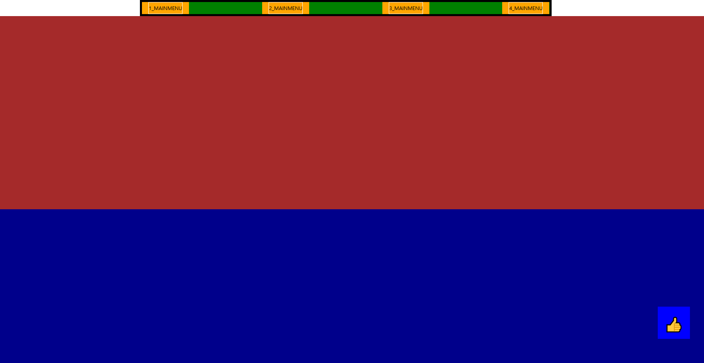

# 01

> **04Fixed.html**
> 



```jsx
<!DOCTYPE html>
<html lang="en">

<head>
    <meta charset="UTF-8">
    <meta name="viewport" content="width=device-width, initial-scale=1.0">
    <title>Document</title>
    <style>
        /*  */
        * {
            box-sizing: border-box;
        }

        /*  */
        a {
            text-decoration: none;
            color: black;
        }

        ul {
            list-style: none;
            margin: 0;
            padding: 0;
        }

        body {
            /* height : 4000px; */
            margin: 0;
        }

        /*  */

        .layout-padding-rem {
            padding: 0 3rem;
        }

        .layout-margin-rem {
            margin: 0 3rem;
        }

        .layout-width-1280 {
            width: 1280px;
            margin: 0 auto;
        }

        .layout-fixed-nav {
            position: fixed;
            left: 0;
            right: 0;
            margin: auto;
            z-index: 100;
            border: 5px solid black;
        }

        .wrapper {}

        /*  */
        .wrapper>header {}

        .wrapper>header>.top-header {}

        .wrapper>header>nav {
            height: 50px;
            background-color: green;

        }

        .wrapper>header>nav>ul.mainmenu {
            border: 1px solid;
            display: flex;
            justify-content: space-between;
            align-items: center;

            height: 100%;
        }

        .wrapper>header>nav>ul.mainmenu>li {
            background-color: orange;
            height: 100%;
            line-height: 50px;
            padding: 0 20px;
            position: relative;

        }

        .wrapper>header>nav>ul.mainmenu>li>a {
            border: 1px solid white;
            display: block;
            width: 100%;
            height: 100%;
            display: flex;
            justify-content: center;
            align-items: center;
        }

        .wrapper>header>nav>ul.mainmenu>li>ul.submenu {
            background-color: royalblue;
            position: absolute;
            width: 100%;
            left: 0;

            display: none;

        }

        .wrapper>header>nav>ul.mainmenu>li>ul.submenu>li {
            border: 1px solid red;
            padding: 0 20px;
            text-align: center;

        }

        .wrapper>header>nav>ul.mainmenu>li>ul.submenu>li>a {
            display: block;
        }

        /* hover event */
        .wrapper>header>nav>ul.mainmenu>li:hover>ul.submenu {
            display: block;
        }

        /*  */
        .wrapper>main {
            position: relative;
            top: 50px;
        }

        .wrapper>main>section {}

        .wrapper>main>section.section-01 {
            height: 600px;
            background-color: brown;
        }

        .wrapper>main>section.section-02 {
            height: 600px;
            background-color: darkblue;
        }

        .wrapper>main>section.section-03 {
            height: 600px;
            background-color: darkcyan;
        }

        .wrapper>main>section.section-04 {
            height: 600px;
            background-color: burlywood
        }

        /*  */
        .wrapper>footer {}

        /* quick menu */
        .quickmenu {
            width: 100px;
            height: 100px;
            background-color: blue;

            position: fixed;
            left: 90vw;
            top: 80vh;
            z-index: 999;

            display: flex;
            justify-content: center;
            align-items: center;
            font-size: 3rem;
        }
    </style>
</head>

<body>

    <div class="wrapper">
        <header>
            <div class="top-header"></div>
            <nav class="layout-width-1280 layout-fixed-nav">
                <ul class="mainmenu">
                    <li>
                        <a href="">1_MAINMENU</a>
                        <ul class="submenu">
                            <li><a href="">1_submenu</a></li>
                            <li><a href="">2_submenu</a></li>
                            <li><a href="">3_submenu</a></li>
                            <li><a href="">4_submenu</a></li>
                            <li><a href="">5_submenu</a></li>
                        </ul>
                    </li>
                    <li>
                        <a href="">2_MAINMENU</a>
                        <ul class="submenu">
                            <li><a href="">1_submenu</a></li>
                            <li><a href="">2_submenu</a></li>
                            <li><a href="">3_submenu</a></li>
                            <li><a href="">4_submenu</a></li>
                            <li><a href="">5_submenu</a></li>
                        </ul>
                    </li>
                    <li>
                        <a href="">3_MAINMENU</a>
                        <ul class="submenu">
                            <li><a href="">1_submenu</a></li>
                            <li><a href="">2_submenu</a></li>
                            <li><a href="">3_submenu</a></li>
                            <li><a href="">4_submenu</a></li>
                            <li><a href="">5_submenu</a></li>
                        </ul>
                    </li>
                    <li>
                        <a href="">4_MAINMENU</a>
                        <ul class="submenu">
                            <li><a href="">1_submenu</a></li>
                            <li><a href="">2_submenu</a></li>
                            <li><a href="">3_submenu</a></li>
                            <li><a href="">4_submenu</a></li>
                            <li><a href="">5_submenu</a></li>
                        </ul>
                    </li>
                </ul>
            </nav>
        </header>
        <main>
            <section class="section-01"></section>
            <section class="section-02"></section>
            <section class="section-03"></section>
            <section class="section-04"></section>
        </main>
        <footer></footer>
    </div>
    <div class="quickmenu">
        <a href="javascript:void(0)">
            👍
        </a>
    </div>
</body>
</html>
```

---

> **05Sticky.html**
> 


```jsx
<!DOCTYPE html>
<html lang="en">
<head>
    <meta charset="UTF-8">
    <meta name="viewport" content="width=device-width, initial-scale=1.0">
    <title>Document</title>
<style>
    body{
        height: 3000px;
    }
    .wrapper>main>section{
        height: 500px;
    }
    .wrapper>main>section>.parent{
        width: 500px;
        height: 500px;
        background-color: royalblue;
        
        position: relative;
        
        display: flex;
        justify-content: space-between;
        align-items: start;
        margin-top: 250px;
    }
    .wrapper>main>section>.parent>.son{
        width: 100px;
        height: 100px;
        background-color: orange;
        border: 1px solid;

        display: flex;
        justify-content: center;
        align-items: center;
    }
    /* relative */
    .wrapper>main>section>.parent>.son:nth-child(1){
        position: relative;
        left: 0px;
        top: 10px;
    }
    /* absolute */
    .wrapper>main>section>.parent>.son:nth-child(2){
        position: absolute;
        left: 100px;
        top: 0;
    }
    /* fixed */
    .wrapper>main>section>.parent>.son:nth-child(3){
        position: fixed;
        left: 250px;
        top: 250px;
    }
    /* sticky */
    .wrapper>main>section>.parent>.son:nth-child(4){
        position: sticky;
        left: 0;
        top: 0;
    }
</style>
</head>
<body>
    <div class="wrapper">
        <header>
            <div class="top-header"> </div>
            <nav></nav>
        </header>
        <main>
            <section>
                <div class="parent">
                    <div class="son">relative</div>
                    <div class="son">absolute</div>
                    <div class="son">fixed</div>
                    <div class="son">sticky</div>
                </div>
            </section>
        </main>
        <footer></footer>
    </div>
</body>
</html>
```

---

> **06Zindex.html**
> 


```jsx
<!DOCTYPE html>
<html lang="en">

<head>
    <meta charset="UTF-8">
    <meta name="viewport" content="width=device-width, initial-scale=1.0">
    <title>Document</title>
    <style>

        /* position이 설정이 안되어있는 요소의 스타일엔 z-index 는 설정할 수 없다. */
        /* z-index : auto 순서에 맞게 z-index 를 고려 */
        .parent {
            width: 500px;
            height: 500px;
            background-color: royalblue;
        }

        .parent>.son {
            width: 100px;
            height: 100px;
            background-color: orange;
            border: 1px solid;
        }

        .parent>.son:nth-child(1) {
            position: relative;
            z-index: 100;
        }
        .parent>.son:nth-child(2) {
            position: relative;
            top: -20px;
            left: 20px;
            background-color: aquamarine;
        }
    </style>
</head>

<body>
    <div class="parent">
        <div class="son">1</div>
        <div class="son">2</div>
        <div class="son">3</div>
        <div class="son">4</div>
    </div>
</body>

</html>
```

---

> **01Flex.html**
> 


```jsx
<!DOCTYPE html>
<html lang="en">
<head>
    <meta charset="UTF-8">
    <meta name="viewport" content="width=device-width, initial-scale=1.0">
    <title>Document</title>
    <style>
        /*  */
        *{box-sizing: border-box;}

        body{
            margin: 0;
        }
        .wrapper{
            width: 1280px;
            height: 1080px;
            margin: 0 auto;
            border: 1px solid;
            padding: 10px;
        }
        .parent{
            height: 150px;
            border: 1px solid;

            display: flex;

            /* 수평배치 center, right, left, space-beetween, space-evenly, space-around */
            justify-content: center;

            /* item간 여백지정없는 설정시 gap option 사용가능 */
            gap: 10px;

            /* 수직배치 start, end, center, flex-start, flex-end */
            align-items: center;

            /* 방향지정 : row, column row-revese, cloumn-reverse */
            flex-direction: row-reverse;
        }
        .parent>.child{
            width: 120px;
            /* height: 40px; */
            border: 1px solid;
        }
        .parent>.child:nth-child(1){
            /* height 설정 */
            align-self: stretch;
        }
        .parent>.child:nth-child(2){
            /* height 설정 */
            align-self: stretch;
        }
        .parent>.child:nth-child(3){
            /* height 설정 */
            align-self: flex-start;
            height: 50px;
        }
        .parent>.child:nth-child(4){
            /* height 설정 */
            align-self: flex-end;
        }

        /*  */
        .parent2{
            /* height: 150px; */
            border: 1px solid;

            display: flex;

            /* 수평배치 center, right, left, space-beetween, space-evenly, space-around */
            justify-content: space-between;

            /* item간 여백지정없는 설정시 gap option 사용가능 */
            gap: 15px;

            /* 수직배치 start, end, center, flex-start, flex-end */
            align-items: center;

            /* 방향지정 : row, column row-revese, cloumn-reverse */
            flex-direction: row;
            /* flex-wrap */
            flex-wrap: wrap;
            padding: 15px;
        }
        .parent2>.child2{
            border: 1px solid;
            width: 200px;
            height: 200px;

            display: flex;
            justify-content: center;
            align-items: center;
        }
    </style>
</head>
<body>
    <div class="wrapper">
        <div class="parent">
            <div class="child">1</div>
            <div class="child">2</div>
            <div class="child">3</div>
            <div class="child">4</div>
            <div class="child">5</div>
        </div>
        <div class="parent2">
            <div class="child2">1</div>
            <div class="child2">2</div>
            <div class="child2">3</div>
            <div class="child2">4</div>
            <div class="child2">5</div>
            <div class="child2">6</div>
            <div class="child2">7</div>
            <div class="child2">8</div>
            <div class="child2">9</div>
            <div class="child2">10</div>
            <div class="child2">11</div>
            <div class="child2">12</div>
            <div class="child2">13</div>
            <div class="child2">14</div>
            <div class="child2">15</div>
            <div class="child2">16</div>
            <div class="child2">17</div>
            <div class="child2">18</div>
            <div class="child2">19</div>
            <div class="child2">20</div>
        </div>
    </div>
    
</body>
</html>
```

---

> **02Flex.html**
> 


```jsx
<!DOCTYPE html>
<html lang="en">

<head>
    <meta charset="UTF-8">
    <meta name="viewport" content="width=device-width, initial-scale=1.0">
    <title>Document</title>
    <style>
        .wrapper {
            /* width: 1280px; */
            height: 900px;
            border: 1px solid;
            margin: 0 auto;
            padding: 10px;
        }
        .wrapper>.parent{
            width: 100%;
            height: 150px;
            border: 1px solid;

            display: flex;
            align-items: center;
            flex-wrap: wrap;
        }
        .wrapper>.parent>.child{
            border: 1px solid;
        }
        .wrapper>.parent>.child:nth-child(1){
            /* flex 아이템의 증가 비율 설정 0(기본값-증가하지 않음) */
            flex-grow: 2;

            /* flex 아이템의 감소 비율 설정 (0 : 감소하지 않음 1 : 기본값 너비에 따라 감소) */
            flex-shrink: 1;

            /* 기본크기 지정 */
            flex-basis: 200px;
        }
        .wrapper>.parent>.child:nth-child(2){
            flex-grow: 2;
            flex-shrink: 1;
            flex-basis: 200px;
        }
        .wrapper>.parent>.child:nth-child(3){
            flex-grow: 1;
            flex-shrink: 0;
            flex-basis: 200px;
        }
        .wrapper>.parent>.child:nth-child(4){
            flex-grow: 1;
            flex-shrink: 0;
            flex-basis: 200px;
        }
        .wrapper>.parent>.child:nth-child(5){
            flex-grow: 1; 
            flex-shrink: 0;
            flex-basis: 200px;
        }
    </style>
</head>

<body>
    <div class="wrapper">
        <div class="parent">
            <div class="child">1</div>
            <div class="child">2</div>
            <div class="child">3</div>
            <div class="child">4</div>
            <div class="child">5</div>
        </div>
    </div>
</body>

</html>
```

---

> **03Flex_Layout_Template.html**
> 


```
<!DOCTYPE html>
<html lang="en">

<head>
    <meta charset="UTF-8">
    <meta name="viewport" content="width=device-width, initial-scale=1.0">
    <title>Document</title>
    <style>
        * {
            box-sizing: border-box;

        }

        /* common */
        a {
            text-decoration: none;
            color: black;
        }

        ul {
            list-style: none;
            margin: 0;
            padding: 0;
        }

        body {
            margin: 0;

        }

        /* layout */
        .wrapper {}

        /* header */
        .wrapper>header {
            /* min-height : 150px; */
            /* border : 1px solid; */
        }

        .wrapper>header>.top-header {
            font-size: 1.5rem;
            font-weight: 600;
            height: 80px;
            line-height: 80px;
            padding: 0 15px;
        }

        .wrapper>header>nav {
            display: flex;
            justify-content: space-between;
            align-items: center;

            /* border : 1px solid; */
            background-color: rgb(37, 36, 36);
            color: white;
            padding: 0 15px;
            flex-wrap: wrap;
            height: 100%;
            min-height: 80px;
        }

        .wrapper>header>nav>.nav-logo {
            font-size: 2rem;
            font-weight: 600;

        }

        .wrapper>header>nav>.nav-menu {
            display: flex;
            justify-content: center;
            align-items: center;
        }

        .wrapper>header>nav>.nav-menu>li {
            padding: 0 20px;
        }

        /* main  */
        .wrapper>main {
            padding: 0 20px;
        }

        .wrapper>main>section {}

        .wrapper>main>section:nth-child(1) {}

        .wrapper>main>section:nth-child(1)>h2 {}

        .wrapper>main>section:nth-child(1)>.card-container {
            display: flex;
            justify-content: left;
            align-items: center;
            gap: 30px;

            flex-wrap: wrap;
        }

        .wrapper>main>section:nth-child(1)>.card-container>.card {
            border: 1px solid;
            padding: 20px;
            border-radius: 10px;
            flex-shrink: 0;
            flex-basis : 480px;
        }

        /*  */
        .wrapper>main>section:nth-child(2) {}

        .wrapper>main>section:nth-child(2)>h2 {}

        .wrapper>main>section:nth-child(2)>.container {
            border: 1px solid;
            border-radius: 10px;

        }

        .wrapper>main>section:nth-child(2)>.container>.media-item {
            display: flex;
            justify-content: left;
            align-items: start;
            gap: 20px;
            margin: 20px;
        }

        .wrapper>main>section:nth-child(2)>.container>.media-item>.media-img {
            height: 150px;
            width: 200px;
            background-color: lightgray;
        }

        .wrapper>main>section:nth-child(2)>.container>.media-item>.media-content {}

        .wrapper>main>section:nth-child(2)>.container>.media-item>.media-content>h3 {
            margin: 0;
        }

        .wrapper>main>section:nth-child(2)>.container>.media-item>.media-content>p {}

        /* footer */
        .wrapper>footer {}

        .wrapper>footer>h2 {
            padding: 0 20px;
        }

        .wrapper>footer>.footer-section-block {
            min-height: 150px;
            display: flex;
            justify-content: left;
            align-items: center;

            background-color: black;
            color: white;
            padding: 0 20px;
        }

        .wrapper>footer>.footer-section-block>.footer-section {
            width: 100%;
        }

        .wrapper>footer>.footer-section-block>.footer-section>h3 {
            font-size: 1.5rem;
            font-weight: 600;
            margin-bottom: 10px;
        }

        .wrapper>footer>.footer-section-block>.footer-section>p {
            margin-top: 0;
        }

        @media (max-width: 1080px) {
            .wrapper>header>nav {
                /* add */
                flex-direction: column;
            }

            .wrapper>header>nav>.nav-logo {}

            .wrapper>header>nav>.nav-menu {
                flex-direction: column;
            }

            .wrapper>header>nav>.nav-menu>li {
                min-height: 80px;
                line-height: 80px;
                font-size: 1.2rem;
            }

            .wrapper>main>section:nth-child(1)>.card-container>.card{
                flex-shrink: 0;
                flex-basis: 100%;
              
            }
        }
    </style>
</head>

<body>

    <div class="wrapper">
        <header>
            <div class="top-header">
                1. 네비게이션 바 레이아웃
            </div>
            <nav>
                <div class="nav-logo">Logo</div>
                <ul class="nav-menu">
                    <li>Home</li>
                    <li>About</li>
                    <li>Services</li>
                    <li>Contact</li>
                </ul>
            </nav>
        </header>
        <main>

            <section>
                <h2>2. 카드 레이아웃</h2>
                <div class="card-container">
                    <div class="card">
                        <h3>Product 1</h3>
                        <p>상품 설명이 들어갑니다. 실무에서 자주 사용되는 카드 형태의 레이아웃입니다.</p>
                    </div>
                    <div class="card">
                        <h3>Product 2</h3>
                        <p>반응형으로 구현되어 화면 크기에 따라 자동으로 배치가 조절됩니다.</p>
                    </div>
                    <div class="card">
                        <h3>Product 3</h3>
                        <p>flex-wrap과 flex-basis를 활용하여 유동적인 레이아웃을 구현했습니다.</p>
                    </div>
                </div>
            </section>
            <section>
                <h2>3. 미디어 컨텐츠 레이아웃</h2>
                <div class="container">
                    <div class="media-item">
                        <div class="media-img"></div>
                        <div class="media-content">
                            <h3>뉴스 제목</h3>
                            <p>뉴스 내용이 들어갑니다. 이미지와 텍스트가 나란히 배치되는 레이아웃입니다.</p>
                        </div>
                    </div>
                    <div class="media-item">
                        <div class="media-img"></div>
                        <div class="media-content">
                            <h3>블로그 포스트</h3>
                            <p>블로그 내용이 들어갑니다. 모바일에서는 세로로 배치됩니다.</p>
                        </div>
                    </div>
                </div>

            </section>

        </main>
        <footer>
            <h2>4. 반응형 푸터</h2>
            <div class="footer-section-block">
                <div class="footer-section">
                    <h3>About Us</h3>
                    <p>회사 소개 내용이 들어갑니다.</p>
                </div>
                <div class="footer-section">
                    <h3>Contact</h3>
                    <p>연락처 정보가 들어갑니다.</p>
                </div>
                <div class="footer-section">
                    <h3>Follow Us</h3>
                    <p>소셜 미디어 링크가 들어갑니다.</p>
                </div>
            </div>

        </footer>
    </div>
</body>

</html>
```

---

> **04Grid.html**
> 


```jsx
<!DOCTYPE html>
<html lang="ko">
<head>
    <meta charset="UTF-8">
    <meta name="viewport" content="width=device-width, initial-scale=1.0">
    <title>CSS Grid Layout</title>
    <style>
        /* 기본 스타일 */
        .grid-container {
            margin: 20px;                /* 컨테이너 외부 여백 20px 설정 */
            padding: 20px;               /* 컨테이너 내부 여백 20px 설정 */
            border: 1px solid #ccc;      /* 컨테이너 테두리 설정 */
        }
        .item {
            padding: 20px;               /* 아이템 내부 여백 20px 설정 */
            background-color: #f0f0f0;   /* 아이템 배경색 연한 회색으로 설정 */
            border: 1px solid #999;      /* 아이템 테두리 설정 */
            text-align: center;          /* 아이템 내 텍스트 중앙 정렬 */
        }

        /* 1단계: 기본 그리드 */
        .grid-basic {
            display: grid;                           /* 그리드 레이아웃 설정 */
            grid-template-columns: repeat(3, 1fr);   /* 3개의 동일한 너비(1fr)의 열 생성 */
            gap: 10px;                              /* 그리드 아이템 간 간격 10px 설정 */
            margin-bottom: 30px;                    /* 하단 여백 30px 설정 */
        }

        /* 2단계: 영역 지정 */
        .grid-areas {
            display: grid;                          /* 그리드 레이아웃 설정 */
            grid-template-areas:                    /* 그리드 영역 이름으로 레이아웃 정의 */
                'header header header'              /* 첫 줄: header가 3칸 차지 */
                'sidebar main main'                 /* 둘째 줄: sidebar 1칸, main 2칸 */
                'footer footer footer';             /* 셋째 줄: footer가 3칸 차지 */
            gap: 10px;                             /* 그리드 아이템 간 간격 10px 설정 */
            margin-bottom: 30px;                    /* 하단 여백 30px 설정 */
        }
        .header { grid-area: header; background-color: #ffeb3b; }    /* header 영역 정의 및 노란색 배경 설정 */
        .sidebar { grid-area: sidebar; background-color: #4caf50; }  /* sidebar 영역 정의 및 초록색 배경 설정 */
        .main { grid-area: main; background-color: #2196f3; }       /* main 영역 정의 및 파란색 배경 설정 */
        .footer { grid-area: footer; background-color: #ff9800; }    /* footer 영역 정의 및 주황색 배경 설정 */

        /* 3단계: 반응형 그리드 */
        .grid-responsive {
            display: grid;                                           /* 그리드 레이아웃 설정 */
            grid-template-columns: repeat(auto-fit, minmax(200px, 1fr)); /* 반응형 열 설정: 최소 200px, 남은 공간 균등 분할 */
            gap: 10px;                                              /* 그리드 아이템 간 간격 10px 설정 */
            margin-bottom: 30px;                                    /* 하단 여백 30px 설정 */
        }

        /* 4단계: 그리드 정렬 */
        .grid-alignment {
            display: grid;                          /* 그리드 레이아웃 설정 */
            grid-template-columns: repeat(3, 1fr);  /* 3개의 동일한 너비(1fr)의 열 생성 */
            gap: 10px;                             /* 그리드 아이템 간 간격 10px 설정 */
            height: 200px;                         /* 컨테이너 높이 200px 설정 */
            align-items: center;                   /* 수직 방향 중앙 정렬 */
            justify-items: center;                 /* 수평 방향 중앙 정렬 */
        }

        /* 미디어 쿼리 */
        @media (max-width: 768px) {                /* 화면 너비가 768px 이하일 때 적용 */
            .grid-areas {
                grid-template-areas:                /* 태블릿/모바일용 그리드 영역 재정의 */
                    'header header'                 /* 첫 줄: header가 2칸 차지 */
                    'sidebar main'                  /* 둘째 줄: sidebar와 main이 각각 1칸씩 */
                    'footer footer';                /* 셋째 줄: footer가 2칸 차지 */
                grid-template-columns: 1fr 2fr;     /* 첫 열은 1fr, 둘째 열은 2fr 비율로 설정 */
            }
        }
    </style>
</head>
<body>
    <h2>1. 기본 그리드 레이아웃</h2>
    <div class="grid-container grid-basic">
        <div class="item">Item 1</div>
        <div class="item">Item 2</div>
        <div class="item">Item 3</div>
        <div class="item">Item 4</div>
        <div class="item">Item 5</div>
        <div class="item">Item 6</div>
    </div>

    <h2>2. Grid Areas를 활용한 레이아웃</h2>
    <div class="grid-container grid-areas">
        <div class="item header">Header</div>
        <div class="item sidebar">Sidebar</div>
        <div class="item main">Main Content</div>
        <div class="item footer">Footer</div>
    </div>

    <h2>3. 반응형 그리드</h2>
    <div class="grid-container grid-responsive">
        <div class="item">Card 1</div>
        <div class="item">Card 2</div>
        <div class="item">Card 3</div>
        <div class="item">Card 4</div>
    </div>

    <h2>4. 그리드 아이템 정렬</h2>
    <div class="grid-container grid-alignment">
        <div class="item">Aligned 1</div>
        <div class="item">Aligned 2</div>
        <div class="item">Aligned 3</div>
    </div>

    <div style="margin: 20px;">
        <h3>Grid 속성 설명:</h3>
        <ul>
            <li>display: grid - 그리드 컨테이너 설정</li>
            <li>grid-template-columns - 열(column) 구조 정의</li>
            <li>grid-template-areas - 영역 이름으로 레이아웃 구성</li>
            <li>gap - 그리드 아이템 간격</li>
            <li>fr 단위 - 사용 가능한 공간의 비율</li>
            <li>repeat() - 반복되는 값을 간단히 표현</li>
            <li>minmax() - 최소/최대 크기 설정</li>
            <li>auto-fit - 반응형 그리드에 활용</li>
        </ul>
    </div>
</body>
</html> 
```