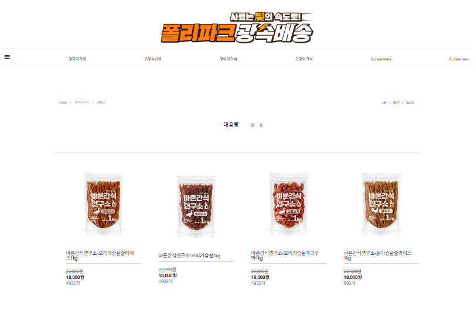

# 01

> **03전정현**
> 




```jsx
<!DOCTYPE html>
<html lang="en">

<head>
    <meta charset="UTF-8">
    <meta name="viewport" content="width=device-width, initial-scale=1.0">
    <title>Document</title>

    <!-- BS5 cdn -->
    <link href="https://cdn.jsdelivr.net/npm/bootstrap@5.0.2/dist/css/bootstrap.min.css" rel="stylesheet"
        integrity="sha384-EVSTQN3/azprG1Anm3QDgpJLIm9Nao0Yz1ztcQTwFspd3yD65VohhpuuCOmLASjC" crossorigin="anonymous">
    <script src="https://cdn.jsdelivr.net/npm/bootstrap@5.0.2/dist/js/bootstrap.bundle.min.js"
        integrity="sha384-MrcW6ZMFYlzcLA8Nl+NtUVF0sA7MsXsP1UyJoMp4YLEuNSfAP+JcXn/tWtIaxVXM"
        crossorigin="anonymous"></script>

    <!-- google icon -->
    <link rel="stylesheet"
        href="https://fonts.googleapis.com/css2?family=Material+Symbols+Outlined:opsz,wght,FILL,GRAD@20..48,100..700,0..1,-50..200" />

    <!-- reset.css cdn -->
    <link rel="stylesheet" href="https://cdn.jsdelivr.net/npm/reset-css@5.0.2/reset.min.css">

    <!-- common.css -->
    <link rel="stylesheet" href="../css/common.css">

    <!-- 개별 css적용 -->
    <link rel="stylesheet" href="./css/03.css">

</head>

<body>

    <div class="wrapper">
        <header>
            <div class="top-header"></div>
            <div class="logo">
                
            </div>
            <nav>
                <ul class="mainmenu">
                    <li>
                        <a href="">
                            <span class="material-symbols-outlined">
                                menu
                            </span>
                        </a>
                        <ul class="submenu">
                            <li>
                                <a href="">2_submenu</a>
                                <ul class="thirdmenu">
                                    <li><a href="">1_thirdmenu</a></li>
                                    <li><a href="">2_thirdmenu</a></li>
                                    <li><a href="">3_thirdmenu</a></li>
                                    <li><a href="">4_thirdmenu</a></li>
                                    <li><a href="">5_thirdmenu</a></li>
                                    <li><a href="">6_thirdmenu</a></li>
                                    <li><a href="">7_thirdmenu</a></li>
                                </ul>
                            </li>
                            <li>
                                <a href="">3_submenu</a>
                                <ul class="thirdmenu">
                                    <li><a href="">1_thirdmenu</a></li>
                                    <li><a href="">2_thirdmenu</a></li>
                                    <li><a href="">3_thirdmenu</a></li>
                                    <li><a href="">4_thirdmenu</a></li>
                                    <li><a href="">5_thirdmenu</a></li>
                                    <li><a href="">6_thirdmenu</a></li>
                                    <li><a href="">7_thirdmenu</a></li>
                                </ul>
                            </li>
                            <li>
                                <a href="">4_submenu</a>
                                <ul class="thirdmenu">
                                    <li><a href="">1_thirdmenu</a></li>
                                    <li><a href="">2_thirdmenu</a></li>
                                    <li><a href="">3_thirdmenu</a></li>
                                    <li><a href="">4_thirdmenu</a></li>
                                    <li><a href="">5_thirdmenu</a></li>
                                    <li><a href="">6_thirdmenu</a></li>
                                    <li><a href="">7_thirdmenu</a></li>
                                </ul>
                            </li>
                            <li>
                                <a href="">5_submenu</a>
                                <ul class="thirdmenu">
                                    <li><a href="">1_thirdmenu</a></li>
                                    <li><a href="">2_thirdmenu</a></li>
                                    <li><a href="">3_thirdmenu</a></li>
                                    <li><a href="">4_thirdmenu</a></li>
                                    <li><a href="">5_thirdmenu</a></li>
                                    <li><a href="">6_thirdmenu</a></li>
                                    <li><a href="">7_thirdmenu</a></li>
                                </ul>
                            </li>
                        </ul>
                    </li>
                    <li>
                        <a href="">강아지사료</a>
                        <ul class="submenu">
                            <li>
                                <a href="">
                                    브랜드별
                                </a>
                                <ul class="thirdmenu">
                                    <li><a href="">건강백서</a></li>
                                    <li><a href="">GO</a></li>
                                    <li><a href="">네츄럴시그니처</a></li>
                                    <li><a href="">추가해서작업!</a></li>
                                </ul>
                            </li>
                            <li>
                                <a href="">연령별</a>
                                <ul class="thirdmenu">
                                    <li><a href="">1_thirdmenu</a></li>
                                    <li><a href="">2_thirdmenu</a></li>
                                    <li><a href="">3_thirdmenu</a></li>
                                    <li><a href="">4_thirdmenu</a></li>
                                    <li><a href="">5_thirdmenu</a></li>
                                    <li><a href="">6_thirdmenu</a></li>
                                    <li><a href="">7_thirdmenu</a></li>
                                </ul>
                            </li>
                            <li>
                                <a href="">임박할인</a>
                                <ul class="thirdmenu">
                                    <li><a href="">1_thirdmenu</a></li>
                                    <li><a href="">2_thirdmenu</a></li>
                                    <li><a href="">3_thirdmenu</a></li>
                                    <li><a href="">4_thirdmenu</a></li>
                                    <li><a href="">5_thirdmenu</a></li>
                                    <li><a href="">6_thirdmenu</a></li>
                                    <li><a href="">7_thirdmenu</a></li>
                                </ul>
                            </li>
                            <li>
                                <a href="">4_submenu</a>
                                <ul class="thirdmenu">
                                    <li><a href="">1_thirdmenu</a></li>
                                    <li><a href="">2_thirdmenu</a></li>
                                    <li><a href="">3_thirdmenu</a></li>
                                    <li><a href="">4_thirdmenu</a></li>
                                    <li><a href="">5_thirdmenu</a></li>
                                    <li><a href="">6_thirdmenu</a></li>
                                    <li><a href="">7_thirdmenu</a></li>
                                </ul>
                            </li>
                            <li>
                                <a href="">5_submenu</a>
                                <ul class="thirdmenu">
                                    <li><a href="">1_thirdmenu</a></li>
                                    <li><a href="">2_thirdmenu</a></li>
                                    <li><a href="">3_thirdmenu</a></li>
                                    <li><a href="">4_thirdmenu</a></li>
                                    <li><a href="">5_thirdmenu</a></li>
                                    <li><a href="">6_thirdmenu</a></li>
                                    <li><a href="">7_thirdmenu</a></li>
                                </ul>
                            </li>
                        </ul>
                    </li>
                    <li>
                        <a href="">고양이사료</a>
                        <ul class="submenu">
                            <li>
                                <a href="">브랜드별</a>
                                <ul class="thirdmenu">
                                    <li><a href="">1_thirdmenu</a></li>
                                    <li><a href="">2_thirdmenu</a></li>
                                    <li><a href="">3_thirdmenu</a></li>
                                    <li><a href="">4_thirdmenu</a></li>
                                    <li><a href="">5_thirdmenu</a></li>
                                    <li><a href="">6_thirdmenu</a></li>
                                    <li><a href="">7_thirdmenu</a></li>
                                </ul>
                            </li>
                            <li>
                                <a href="">연령별</a>
                                <ul class="thirdmenu">
                                    <li><a href="">1_thirdmenu</a></li>
                                    <li><a href="">2_thirdmenu</a></li>
                                    <li><a href="">3_thirdmenu</a></li>
                                    <li><a href="">4_thirdmenu</a></li>
                                    <li><a href="">5_thirdmenu</a></li>
                                    <li><a href="">6_thirdmenu</a></li>
                                    <li><a href="">7_thirdmenu</a></li>
                                </ul>
                            </li>
                            <li>
                                <a href="">임박할인</a>
                                <ul class="thirdmenu">
                                    <li><a href="">1_thirdmenu</a></li>
                                    <li><a href="">2_thirdmenu</a></li>
                                    <li><a href="">3_thirdmenu</a></li>
                                    <li><a href="">4_thirdmenu</a></li>
                                    <li><a href="">5_thirdmenu</a></li>
                                    <li><a href="">6_thirdmenu</a></li>
                                    <li><a href="">7_thirdmenu</a></li>
                                </ul>
                            </li>
                            <li>
                                <a href="">4_submenu</a>
                                <ul class="thirdmenu">
                                    <li><a href="">1_thirdmenu</a></li>
                                    <li><a href="">2_thirdmenu</a></li>
                                    <li><a href="">3_thirdmenu</a></li>
                                    <li><a href="">4_thirdmenu</a></li>
                                    <li><a href="">5_thirdmenu</a></li>
                                    <li><a href="">6_thirdmenu</a></li>
                                    <li><a href="">7_thirdmenu</a></li>
                                </ul>
                            </li>
                            <li>
                                <a href="">5_submenu</a>
                                <ul class="thirdmenu">
                                    <li><a href="">1_thirdmenu</a></li>
                                    <li><a href="">2_thirdmenu</a></li>
                                    <li><a href="">3_thirdmenu</a></li>
                                    <li><a href="">4_thirdmenu</a></li>
                                    <li><a href="">5_thirdmenu</a></li>
                                    <li><a href="">6_thirdmenu</a></li>
                                    <li><a href="">7_thirdmenu</a></li>
                                </ul>
                            </li>
                        </ul>
                    </li>
                    <li>
                        <a href="">강아지간식</a>
                        <ul class="submenu">
                            <li>
                                <a href="">수제간식</a>
                                <ul class="thirdmenu">
                                    <li><a href="">1_thirdmenu</a></li>
                                    <li><a href="">2_thirdmenu</a></li>
                                    <li><a href="">3_thirdmenu</a></li>
                                    <li><a href="">4_thirdmenu</a></li>
                                    <li><a href="">5_thirdmenu</a></li>
                                    <li><a href="">6_thirdmenu</a></li>
                                    <li><a href="">7_thirdmenu</a></li>
                                </ul>
                            </li>
                            <li>
                                <a href="">육포/사시미</a>
                                <ul class="thirdmenu">
                                    <li><a href="">1_thirdmenu</a></li>
                                    <li><a href="">2_thirdmenu</a></li>
                                    <li><a href="">3_thirdmenu</a></li>
                                    <li><a href="">4_thirdmenu</a></li>
                                    <li><a href="">5_thirdmenu</a></li>
                                    <li><a href="">6_thirdmenu</a></li>
                                    <li><a href="">7_thirdmenu</a></li>
                                </ul>
                            </li>
                            <li>
                                <a href="">져키/트릿</a>
                                <ul class="thirdmenu">
                                    <li><a href="">1_thirdmenu</a></li>
                                    <li><a href="">2_thirdmenu</a></li>
                                    <li><a href="">3_thirdmenu</a></li>
                                    <li><a href="">4_thirdmenu</a></li>
                                    <li><a href="">5_thirdmenu</a></li>
                                    <li><a href="">6_thirdmenu</a></li>
                                    <li><a href="">7_thirdmenu</a></li>
                                </ul>
                            </li>
                            <li>
                                <a href="">대용량</a>
                                <ul class="thirdmenu">
                                    <li><a href="">1_thirdmenu</a></li>
                                    <li><a href="">2_thirdmenu</a></li>
                                    <li><a href="">3_thirdmenu</a></li>
                                    <li><a href="">4_thirdmenu</a></li>
                                    <li><a href="">5_thirdmenu</a></li>
                                    <li><a href="">6_thirdmenu</a></li>
                                    <li><a href="">7_thirdmenu</a></li>
                                </ul>
                            </li>
                            <li>
                                <a href="">껌</a>
                                <ul class="thirdmenu">
                                    <li><a href="">1_thirdmenu</a></li>
                                    <li><a href="">2_thirdmenu</a></li>
                                    <li><a href="">3_thirdmenu</a></li>
                                    <li><a href="">4_thirdmenu</a></li>
                                    <li><a href="">5_thirdmenu</a></li>
                                    <li><a href="">6_thirdmenu</a></li>
                                    <li><a href="">7_thirdmenu</a></li>
                                </ul>
                            </li>
                        </ul>
                    </li>
                    <li>
                        <a href="">고양이간식</a>
                        <ul class="submenu">
                            <li>
                                <a href="">캔</a>
                                <ul class="thirdmenu">
                                    <li><a href="">1_thirdmenu</a></li>
                                    <li><a href="">2_thirdmenu</a></li>
                                    <li><a href="">3_thirdmenu</a></li>
                                    <li><a href="">4_thirdmenu</a></li>
                                    <li><a href="">5_thirdmenu</a></li>
                                    <li><a href="">6_thirdmenu</a></li>
                                    <li><a href="">7_thirdmenu</a></li>
                                </ul>
                            </li>
                            <li>
                                <a href="">파우치</a>
                                <ul class="thirdmenu">
                                    <li><a href="">1_thirdmenu</a></li>
                                    <li><a href="">2_thirdmenu</a></li>
                                    <li><a href="">3_thirdmenu</a></li>
                                    <li><a href="">4_thirdmenu</a></li>
                                    <li><a href="">5_thirdmenu</a></li>
                                    <li><a href="">6_thirdmenu</a></li>
                                    <li><a href="">7_thirdmenu</a></li>
                                </ul>
                            </li>
                            <li>
                                <a href="">건어물/져키</a>
                                <ul class="thirdmenu">
                                    <li><a href="">1_thirdmenu</a></li>
                                    <li><a href="">2_thirdmenu</a></li>
                                    <li><a href="">3_thirdmenu</a></li>
                                    <li><a href="">4_thirdmenu</a></li>
                                    <li><a href="">5_thirdmenu</a></li>
                                    <li><a href="">6_thirdmenu</a></li>
                                    <li><a href="">7_thirdmenu</a></li>
                                </ul>
                            </li>
                            <li>
                                <a href="">통살</a>
                                <ul class="thirdmenu">
                                    <li><a href="">1_thirdmenu</a></li>
                                    <li><a href="">2_thirdmenu</a></li>
                                    <li><a href="">3_thirdmenu</a></li>
                                    <li><a href="">4_thirdmenu</a></li>
                                    <li><a href="">5_thirdmenu</a></li>
                                    <li><a href="">6_thirdmenu</a></li>
                                    <li><a href="">7_thirdmenu</a></li>
                                </ul>
                            </li>
                            <li>
                                <a href="">동결/스낵</a>
                                <ul class="thirdmenu">
                                    <li><a href="">1_thirdmenu</a></li>
                                    <li><a href="">2_thirdmenu</a></li>
                                    <li><a href="">3_thirdmenu</a></li>
                                    <li><a href="">4_thirdmenu</a></li>
                                    <li><a href="">5_thirdmenu</a></li>
                                    <li><a href="">6_thirdmenu</a></li>
                                    <li><a href="">7_thirdmenu</a></li>
                                </ul>
                            </li>
                        </ul>
                    </li>
                    <li>
                        <a href="">6_mainmenu</a>
                        <ul class="submenu">
                            <li>
                                <a href="">1_submenu</a>
                                <ul class="thirdmenu">
                                    <li><a href="">1_thirdmenu</a></li>
                                    <li><a href="">2_thirdmenu</a></li>
                                    <li><a href="">3_thirdmenu</a></li>
                                    <li><a href="">4_thirdmenu</a></li>
                                    <li><a href="">5_thirdmenu</a></li>
                                    <li><a href="">6_thirdmenu</a></li>
                                    <li><a href="">7_thirdmenu</a></li>
                                </ul>
                            </li>
                            <li>
                                <a href="">2_submenu</a>
                                <ul class="thirdmenu">
                                    <li><a href="">1_thirdmenu</a></li>
                                    <li><a href="">2_thirdmenu</a></li>
                                    <li><a href="">3_thirdmenu</a></li>
                                    <li><a href="">4_thirdmenu</a></li>
                                    <li><a href="">5_thirdmenu</a></li>
                                    <li><a href="">6_thirdmenu</a></li>
                                    <li><a href="">7_thirdmenu</a></li>
                                </ul>
                            </li>
                            <li>
                                <a href="">3_submenu</a>
                                <ul class="thirdmenu">
                                    <li><a href="">1_thirdmenu</a></li>
                                    <li><a href="">2_thirdmenu</a></li>
                                    <li><a href="">3_thirdmenu</a></li>
                                    <li><a href="">4_thirdmenu</a></li>
                                    <li><a href="">5_thirdmenu</a></li>
                                    <li><a href="">6_thirdmenu</a></li>
                                    <li><a href="">7_thirdmenu</a></li>
                                </ul>
                            </li>
                            <li>
                                <a href="">4_submenu</a>
                                <ul class="thirdmenu">
                                    <li><a href="">1_thirdmenu</a></li>
                                    <li><a href="">2_thirdmenu</a></li>
                                    <li><a href="">3_thirdmenu</a></li>
                                    <li><a href="">4_thirdmenu</a></li>
                                    <li><a href="">5_thirdmenu</a></li>
                                    <li><a href="">6_thirdmenu</a></li>
                                    <li><a href="">7_thirdmenu</a></li>
                                </ul>
                            </li>
                            <li>
                                <a href="">5_submenu</a>
                                <ul class="thirdmenu">
                                    <li><a href="">1_thirdmenu</a></li>
                                    <li><a href="">2_thirdmenu</a></li>
                                    <li><a href="">3_thirdmenu</a></li>
                                    <li><a href="">4_thirdmenu</a></li>
                                    <li><a href="">5_thirdmenu</a></li>
                                    <li><a href="">6_thirdmenu</a></li>
                                    <li><a href="">7_thirdmenu</a></li>
                                </ul>
                            </li>
                        </ul>
                    </li>
                    <li>
                        <a href="">7_mainmenu</a>
                        <ul class="submenu">
                            <li>
                                <a href="">1_submenu</a>
                                <ul class="thirdmenu">
                                    <li><a href="">1_thirdmenu</a></li>
                                    <li><a href="">2_thirdmenu</a></li>
                                    <li><a href="">3_thirdmenu</a></li>
                                    <li><a href="">4_thirdmenu</a></li>
                                    <li><a href="">5_thirdmenu</a></li>
                                    <li><a href="">6_thirdmenu</a></li>
                                    <li><a href="">7_thirdmenu</a></li>
                                </ul>
                            </li>
                            <li>
                                <a href="">2_submenu</a>
                                <ul class="thirdmenu">
                                    <li><a href="">1_thirdmenu</a></li>
                                    <li><a href="">2_thirdmenu</a></li>
                                    <li><a href="">3_thirdmenu</a></li>
                                    <li><a href="">4_thirdmenu</a></li>
                                    <li><a href="">5_thirdmenu</a></li>
                                    <li><a href="">6_thirdmenu</a></li>
                                    <li><a href="">7_thirdmenu</a></li>
                                </ul>
                            </li>
                            <li>
                                <a href="">3_submenu</a>
                                <ul class="thirdmenu">
                                    <li><a href="">1_thirdmenu</a></li>
                                    <li><a href="">2_thirdmenu</a></li>
                                    <li><a href="">3_thirdmenu</a></li>
                                    <li><a href="">4_thirdmenu</a></li>
                                    <li><a href="">5_thirdmenu</a></li>
                                    <li><a href="">6_thirdmenu</a></li>
                                    <li><a href="">7_thirdmenu</a></li>
                                </ul>
                            </li>
                            <li>
                                <a href="">4_submenu</a>
                                <ul class="thirdmenu">
                                    <li><a href="">1_thirdmenu</a></li>
                                    <li><a href="">2_thirdmenu</a></li>
                                    <li><a href="">3_thirdmenu</a></li>
                                    <li><a href="">4_thirdmenu</a></li>
                                    <li><a href="">5_thirdmenu</a></li>
                                    <li><a href="">6_thirdmenu</a></li>
                                    <li><a href="">7_thirdmenu</a></li>
                                </ul>
                            </li>
                            <li>
                                <a href="">5_submenu</a>
                                <ul class="thirdmenu">
                                    <li><a href="">1_thirdmenu</a></li>
                                    <li><a href="">2_thirdmenu</a></li>
                                    <li><a href="">3_thirdmenu</a></li>
                                    <li><a href="">4_thirdmenu</a></li>
                                    <li><a href="">5_thirdmenu</a></li>
                                    <li><a href="">6_thirdmenu</a></li>
                                    <li><a href="">7_thirdmenu</a></li>
                                </ul>
                            </li>
                        </ul>
                    </li>
                    <!-- <li>
                        <a href="">8_mainmenu</a>
                        <ul class="submenu">
                            <li>
                                <a href="">1_submenu</a>
                                <ul class="thirdmenu">
                                    <li><a href="">1_thirdmenu</a></li>
                                    <li><a href="">2_thirdmenu</a></li>
                                    <li><a href="">3_thirdmenu</a></li>
                                    <li><a href="">4_thirdmenu</a></li>
                                    <li><a href="">5_thirdmenu</a></li>
                                    <li><a href="">6_thirdmenu</a></li>
                                    <li><a href="">7_thirdmenu</a></li>
                                </ul>
                            </li>
                            <li>
                                <a href="">2_submenu</a>
                                <ul class="thirdmenu">
                                    <li><a href="">1_thirdmenu</a></li>
                                    <li><a href="">2_thirdmenu</a></li>
                                    <li><a href="">3_thirdmenu</a></li>
                                    <li><a href="">4_thirdmenu</a></li>
                                    <li><a href="">5_thirdmenu</a></li>
                                    <li><a href="">6_thirdmenu</a></li>
                                    <li><a href="">7_thirdmenu</a></li>
                                </ul>
                            </li>
                            <li>
                                <a href="">3_submenu</a>
                                <ul class="thirdmenu">
                                    <li><a href="">1_thirdmenu</a></li>
                                    <li><a href="">2_thirdmenu</a></li>
                                    <li><a href="">3_thirdmenu</a></li>
                                    <li><a href="">4_thirdmenu</a></li>
                                    <li><a href="">5_thirdmenu</a></li>
                                    <li><a href="">6_thirdmenu</a></li>
                                    <li><a href="">7_thirdmenu</a></li>
                                </ul>
                            </li>
                            <li>
                                <a href="">4_submenu</a>
                                <ul class="thirdmenu">
                                    <li><a href="">1_thirdmenu</a></li>
                                    <li><a href="">2_thirdmenu</a></li>
                                    <li><a href="">3_thirdmenu</a></li>
                                    <li><a href="">4_thirdmenu</a></li>
                                    <li><a href="">5_thirdmenu</a></li>
                                    <li><a href="">6_thirdmenu</a></li>
                                    <li><a href="">7_thirdmenu</a></li>
                                </ul>
                            </li>
                            <li>
                                <a href="">5_submenu</a>
                                <ul class="thirdmenu">
                                    <li><a href="">1_thirdmenu</a></li>
                                    <li><a href="">2_thirdmenu</a></li>
                                    <li><a href="">3_thirdmenu</a></li>
                                    <li><a href="">4_thirdmenu</a></li>
                                    <li><a href="">5_thirdmenu</a></li>
                                    <li><a href="">6_thirdmenu</a></li>
                                    <li><a href="">7_thirdmenu</a></li>
                                </ul>
                            </li>
                        </ul>
                    </li>
                    <li>
                        <a href="">9_mainmenu</a>
                        <ul class="submenu">
                            <li>
                                <a href="">1_submenu</a>
                                <ul class="thirdmenu">
                                    <li><a href="">1_thirdmenu</a></li>
                                    <li><a href="">2_thirdmenu</a></li>
                                    <li><a href="">3_thirdmenu</a></li>
                                    <li><a href="">4_thirdmenu</a></li>
                                    <li><a href="">5_thirdmenu</a></li>
                                    <li><a href="">6_thirdmenu</a></li>
                                    <li><a href="">7_thirdmenu</a></li>
                                </ul>
                            </li>
                            <li>
                                <a href="">2_submenu</a>
                                <ul class="thirdmenu">
                                    <li><a href="">1_thirdmenu</a></li>
                                    <li><a href="">2_thirdmenu</a></li>
                                    <li><a href="">3_thirdmenu</a></li>
                                    <li><a href="">4_thirdmenu</a></li>
                                    <li><a href="">5_thirdmenu</a></li>
                                    <li><a href="">6_thirdmenu</a></li>
                                    <li><a href="">7_thirdmenu</a></li>
                                </ul>
                            </li>
                            <li>
                                <a href="">3_submenu</a>
                                <ul class="thirdmenu">
                                    <li><a href="">1_thirdmenu</a></li>
                                    <li><a href="">2_thirdmenu</a></li>
                                    <li><a href="">3_thirdmenu</a></li>
                                    <li><a href="">4_thirdmenu</a></li>
                                    <li><a href="">5_thirdmenu</a></li>
                                    <li><a href="">6_thirdmenu</a></li>
                                    <li><a href="">7_thirdmenu</a></li>
                                </ul>
                            </li>
                            <li>
                                <a href="">4_submenu</a>
                                <ul class="thirdmenu">
                                    <li><a href="">1_thirdmenu</a></li>
                                    <li><a href="">2_thirdmenu</a></li>
                                    <li><a href="">3_thirdmenu</a></li>
                                    <li><a href="">4_thirdmenu</a></li>
                                    <li><a href="">5_thirdmenu</a></li>
                                    <li><a href="">6_thirdmenu</a></li>
                                    <li><a href="">7_thirdmenu</a></li>
                                </ul>
                            </li>
                            <li>
                                <a href="">5_submenu</a>
                                <ul class="thirdmenu">
                                    <li><a href="">1_thirdmenu</a></li>
                                    <li><a href="">2_thirdmenu</a></li>
                                    <li><a href="">3_thirdmenu</a></li>
                                    <li><a href="">4_thirdmenu</a></li>
                                    <li><a href="">5_thirdmenu</a></li>
                                    <li><a href="">6_thirdmenu</a></li>
                                    <li><a href="">7_thirdmenu</a></li>
                                </ul>
                            </li>
                        </ul>
                    </li>
                    <li>
                        <a href="">10_mainmenu</a>
                        <ul class="submenu">
                            <li>
                                <a href="">1_submenu</a>
                                <ul class="thirdmenu">
                                    <li><a href="">1_thirdmenu</a></li>
                                    <li><a href="">2_thirdmenu</a></li>
                                    <li><a href="">3_thirdmenu</a></li>
                                    <li><a href="">4_thirdmenu</a></li>
                                    <li><a href="">5_thirdmenu</a></li>
                                    <li><a href="">6_thirdmenu</a></li>
                                    <li><a href="">7_thirdmenu</a></li>
                                </ul>
                            </li>
                            <li>
                                <a href="">2_submenu</a>
                                <ul class="thirdmenu">
                                    <li><a href="">1_thirdmenu</a></li>
                                    <li><a href="">2_thirdmenu</a></li>
                                    <li><a href="">3_thirdmenu</a></li>
                                    <li><a href="">4_thirdmenu</a></li>
                                    <li><a href="">5_thirdmenu</a></li>
                                    <li><a href="">6_thirdmenu</a></li>
                                    <li><a href="">7_thirdmenu</a></li>
                                </ul>
                            </li>
                            <li>
                                <a href="">3_submenu</a>
                                <ul class="thirdmenu">
                                    <li><a href="">1_thirdmenu</a></li>
                                    <li><a href="">2_thirdmenu</a></li>
                                    <li><a href="">3_thirdmenu</a></li>
                                    <li><a href="">4_thirdmenu</a></li>
                                    <li><a href="">5_thirdmenu</a></li>
                                    <li><a href="">6_thirdmenu</a></li>
                                    <li><a href="">7_thirdmenu</a></li>
                                </ul>
                            </li>
                            <li>
                                <a href="">4_submenu</a>
                                <ul class="thirdmenu">
                                    <li><a href="">1_thirdmenu</a></li>
                                    <li><a href="">2_thirdmenu</a></li>
                                    <li><a href="">3_thirdmenu</a></li>
                                    <li><a href="">4_thirdmenu</a></li>
                                    <li><a href="">5_thirdmenu</a></li>
                                    <li><a href="">6_thirdmenu</a></li>
                                    <li><a href="">7_thirdmenu</a></li>
                                </ul>
                            </li>
                            <li>
                                <a href="">5_submenu</a>
                                <ul class="thirdmenu">
                                    <li><a href="">1_thirdmenu</a></li>
                                    <li><a href="">2_thirdmenu</a></li>
                                    <li><a href="">3_thirdmenu</a></li>
                                    <li><a href="">4_thirdmenu</a></li>
                                    <li><a href="">5_thirdmenu</a></li>
                                    <li><a href="">6_thirdmenu</a></li>
                                    <li><a href="">7_thirdmenu</a></li>
                                </ul>
                            </li>
                        </ul>
                    </li>
                    <li>
                        <a href="">11_mainmenu</a>
                        <ul class="submenu">
                            <li>
                                <a href="">1_submenu</a>
                                <ul class="thirdmenu">
                                    <li><a href="">1_thirdmenu</a></li>
                                    <li><a href="">2_thirdmenu</a></li>
                                    <li><a href="">3_thirdmenu</a></li>
                                    <li><a href="">4_thirdmenu</a></li>
                                    <li><a href="">5_thirdmenu</a></li>
                                    <li><a href="">6_thirdmenu</a></li>
                                    <li><a href="">7_thirdmenu</a></li>
                                </ul>
                            </li>
                            <li>
                                <a href="">2_submenu</a>
                                <ul class="thirdmenu">
                                    <li><a href="">1_thirdmenu</a></li>
                                    <li><a href="">2_thirdmenu</a></li>
                                    <li><a href="">3_thirdmenu</a></li>
                                    <li><a href="">4_thirdmenu</a></li>
                                    <li><a href="">5_thirdmenu</a></li>
                                    <li><a href="">6_thirdmenu</a></li>
                                    <li><a href="">7_thirdmenu</a></li>
                                </ul>
                            </li>
                            <li>
                                <a href="">3_submenu</a>
                                <ul class="thirdmenu">
                                    <li><a href="">1_thirdmenu</a></li>
                                    <li><a href="">2_thirdmenu</a></li>
                                    <li><a href="">3_thirdmenu</a></li>
                                    <li><a href="">4_thirdmenu</a></li>
                                    <li><a href="">5_thirdmenu</a></li>
                                    <li><a href="">6_thirdmenu</a></li>
                                    <li><a href="">7_thirdmenu</a></li>
                                </ul>
                            </li>
                            <li>
                                <a href="">4_submenu</a>
                                <ul class="thirdmenu">
                                    <li><a href="">1_thirdmenu</a></li>
                                    <li><a href="">2_thirdmenu</a></li>
                                    <li><a href="">3_thirdmenu</a></li>
                                    <li><a href="">4_thirdmenu</a></li>
                                    <li><a href="">5_thirdmenu</a></li>
                                    <li><a href="">6_thirdmenu</a></li>
                                    <li><a href="">7_thirdmenu</a></li>
                                </ul>
                            </li>
                            <li>
                                <a href="">5_submenu</a>
                                <ul class="thirdmenu">
                                    <li><a href="">1_thirdmenu</a></li>
                                    <li><a href="">2_thirdmenu</a></li>
                                    <li><a href="">3_thirdmenu</a></li>
                                    <li><a href="">4_thirdmenu</a></li>
                                    <li><a href="">5_thirdmenu</a></li>
                                    <li><a href="">6_thirdmenu</a></li>
                                    <li><a href="">7_thirdmenu</a></li>
                                </ul>
                            </li>
                        </ul>
                    </li>
                    <li>
                        <a href="">12_mainmenu</a>
                        <ul class="submenu">
                            <li>
                                <a href="">1_submenu</a>
                                <ul class="thirdmenu">
                                    <li><a href="">1_thirdmenu</a></li>
                                    <li><a href="">2_thirdmenu</a></li>
                                    <li><a href="">3_thirdmenu</a></li>
                                    <li><a href="">4_thirdmenu</a></li>
                                    <li><a href="">5_thirdmenu</a></li>
                                    <li><a href="">6_thirdmenu</a></li>
                                    <li><a href="">7_thirdmenu</a></li>
                                </ul>
                            </li>
                            <li>
                                <a href="">2_submenu</a>
                                <ul class="thirdmenu">
                                    <li><a href="">1_thirdmenu</a></li>
                                    <li><a href="">2_thirdmenu</a></li>
                                    <li><a href="">3_thirdmenu</a></li>
                                    <li><a href="">4_thirdmenu</a></li>
                                    <li><a href="">5_thirdmenu</a></li>
                                    <li><a href="">6_thirdmenu</a></li>
                                    <li><a href="">7_thirdmenu</a></li>
                                </ul>
                            </li>
                            <li>
                                <a href="">3_submenu</a>
                                <ul class="thirdmenu">
                                    <li><a href="">1_thirdmenu</a></li>
                                    <li><a href="">2_thirdmenu</a></li>
                                    <li><a href="">3_thirdmenu</a></li>
                                    <li><a href="">4_thirdmenu</a></li>
                                    <li><a href="">5_thirdmenu</a></li>
                                    <li><a href="">6_thirdmenu</a></li>
                                    <li><a href="">7_thirdmenu</a></li>
                                </ul>
                            </li>
                            <li>
                                <a href="">4_submenu</a>
                                <ul class="thirdmenu">
                                    <li><a href="">1_thirdmenu</a></li>
                                    <li><a href="">2_thirdmenu</a></li>
                                    <li><a href="">3_thirdmenu</a></li>
                                    <li><a href="">4_thirdmenu</a></li>
                                    <li><a href="">5_thirdmenu</a></li>
                                    <li><a href="">6_thirdmenu</a></li>
                                    <li><a href="">7_thirdmenu</a></li>
                                </ul>
                            </li>
                            <li>
                                <a href="">5_submenu</a>
                                <ul class="thirdmenu">
                                    <li><a href="">1_thirdmenu</a></li>
                                    <li><a href="">2_thirdmenu</a></li>
                                    <li><a href="">3_thirdmenu</a></li>
                                    <li><a href="">4_thirdmenu</a></li>
                                    <li><a href="">5_thirdmenu</a></li>
                                    <li><a href="">6_thirdmenu</a></li>
                                    <li><a href="">7_thirdmenu</a></li>
                                </ul>
                            </li>
                        </ul>
                    </li>
                    <li>
                        <a href="">13_mainmenu</a>
                        <ul class="submenu">
                            <li>
                                <a href="">1_submenu</a>
                                <ul class="thirdmenu">
                                    <li><a href="">1_thirdmenu</a></li>
                                    <li><a href="">2_thirdmenu</a></li>
                                    <li><a href="">3_thirdmenu</a></li>
                                    <li><a href="">4_thirdmenu</a></li>
                                    <li><a href="">5_thirdmenu</a></li>
                                    <li><a href="">6_thirdmenu</a></li>
                                    <li><a href="">7_thirdmenu</a></li>
                                </ul>
                            </li>
                            <li>
                                <a href="">2_submenu</a>
                                <ul class="thirdmenu">
                                    <li><a href="">1_thirdmenu</a></li>
                                    <li><a href="">2_thirdmenu</a></li>
                                    <li><a href="">3_thirdmenu</a></li>
                                    <li><a href="">4_thirdmenu</a></li>
                                    <li><a href="">5_thirdmenu</a></li>
                                    <li><a href="">6_thirdmenu</a></li>
                                    <li><a href="">7_thirdmenu</a></li>
                                </ul>
                            </li>
                            <li>
                                <a href="">3_submenu</a>
                                <ul class="thirdmenu">
                                    <li><a href="">1_thirdmenu</a></li>
                                    <li><a href="">2_thirdmenu</a></li>
                                    <li><a href="">3_thirdmenu</a></li>
                                    <li><a href="">4_thirdmenu</a></li>
                                    <li><a href="">5_thirdmenu</a></li>
                                    <li><a href="">6_thirdmenu</a></li>
                                    <li><a href="">7_thirdmenu</a></li>
                                </ul>
                            </li>
                            <li>
                                <a href="">4_submenu</a>
                                <ul class="thirdmenu">
                                    <li><a href="">1_thirdmenu</a></li>
                                    <li><a href="">2_thirdmenu</a></li>
                                    <li><a href="">3_thirdmenu</a></li>
                                    <li><a href="">4_thirdmenu</a></li>
                                    <li><a href="">5_thirdmenu</a></li>
                                    <li><a href="">6_thirdmenu</a></li>
                                    <li><a href="">7_thirdmenu</a></li>
                                </ul>
                            </li>
                            <li>
                                <a href="">5_submenu</a>
                                <ul class="thirdmenu">
                                    <li><a href="">1_thirdmenu</a></li>
                                    <li><a href="">2_thirdmenu</a></li>
                                    <li><a href="">3_thirdmenu</a></li>
                                    <li><a href="">4_thirdmenu</a></li>
                                    <li><a href="">5_thirdmenu</a></li>
                                    <li><a href="">6_thirdmenu</a></li>
                                    <li><a href="">7_thirdmenu</a></li>
                                </ul>
                            </li>
                        </ul>
                    </li>
                    <li>
                        <a href="">14_mainmenu</a>
                        <ul class="submenu">
                            <li>
                                <a href="">1_submenu</a>
                                <ul class="thirdmenu">
                                    <li><a href="">1_thirdmenu</a></li>
                                    <li><a href="">2_thirdmenu</a></li>
                                    <li><a href="">3_thirdmenu</a></li>
                                    <li><a href="">4_thirdmenu</a></li>
                                    <li><a href="">5_thirdmenu</a></li>
                                    <li><a href="">6_thirdmenu</a></li>
                                    <li><a href="">7_thirdmenu</a></li>
                                </ul>
                            </li>
                            <li>
                                <a href="">2_submenu</a>
                                <ul class="thirdmenu">
                                    <li><a href="">1_thirdmenu</a></li>
                                    <li><a href="">2_thirdmenu</a></li>
                                    <li><a href="">3_thirdmenu</a></li>
                                    <li><a href="">4_thirdmenu</a></li>
                                    <li><a href="">5_thirdmenu</a></li>
                                    <li><a href="">6_thirdmenu</a></li>
                                    <li><a href="">7_thirdmenu</a></li>
                                </ul>
                            </li>
                            <li>
                                <a href="">3_submenu</a>
                                <ul class="thirdmenu">
                                    <li><a href="">1_thirdmenu</a></li>
                                    <li><a href="">2_thirdmenu</a></li>
                                    <li><a href="">3_thirdmenu</a></li>
                                    <li><a href="">4_thirdmenu</a></li>
                                    <li><a href="">5_thirdmenu</a></li>
                                    <li><a href="">6_thirdmenu</a></li>
                                    <li><a href="">7_thirdmenu</a></li>
                                </ul>
                            </li>
                            <li>
                                <a href="">4_submenu</a>
                                <ul class="thirdmenu">
                                    <li><a href="">1_thirdmenu</a></li>
                                    <li><a href="">2_thirdmenu</a></li>
                                    <li><a href="">3_thirdmenu</a></li>
                                    <li><a href="">4_thirdmenu</a></li>
                                    <li><a href="">5_thirdmenu</a></li>
                                    <li><a href="">6_thirdmenu</a></li>
                                    <li><a href="">7_thirdmenu</a></li>
                                </ul>
                            </li>
                            <li>
                                <a href="">RIGHT_SITE_MENU</a>
                                <ul class="thirdmenu">
                                    <li><a href="">1_thirdmenu</a></li>
                                    <li><a href="">2_thirdmenu</a></li>
                                    <li><a href="">3_thirdmenu</a></li>
                                    <li><a href="">4_thirdmenu</a></li>
                                    <li><a href="">5_thirdmenu</a></li>
                                    <li><a href="">6_thirdmenu</a></li>
                                    <li><a href="">7_thirdmenu</a></li>
                                </ul>
                            </li>
                        </ul>
                    </li> -->
                </ul>
            </nav>
        </header>
        <main>
            <section>
                <!-- 네비게이션 -->
                <div class="dog-nev">
                    <ul class="top-header-left">
                        <li>HOME</li>
                        <li>></li>
                        <li>강아지간식</li>
                        <li>></li>
                        <li>대용량</li>
                    </ul>
                    <ul class="top-header-right">
                        <li>MY</li>
                        <li>|</li>
                        <li>HELP</li>
                        <li>|</li>
                        <li>QUICK</li>
                    </ul>
                </div>

                <!-- 타이틀 -->
                <div class="main_title">
                    <ul>
                        <li class="title_font">대용량</li>
                        <li class="good_img"></li>
                        <li class="good_count">0</li>
                    </ul>
                </div>
                <hr />
                <!-- 상품목록 -->
                <content>
                    <div class="item_store">
                        <div class="item_img">
                            <a href="https://www.polypark.kr/product/detail.html?product_no=7915"></a>

                        </div>
                        <div class="item_name">
                            <a
                                href="https://www.polypark.kr/product/detail.html?product_no=7915"><span>바른간식연구소-오리가슴살슬라이스1kg</span></a>
                        </div>
                        <div class="item_price">
                            <div class="consumer">22,000원</div>
                            <div class="seller">18,000원</div>
                            <div class="inventory">4932개</div>
                        </div>
                    </div>
                    <div class="item_store">
                        <div class="item_img">
                            <a href="https://www.polypark.kr/product/detail.html?product_no=7914"></a>

                        </div>
                        <div class="item_name">
                            <a
                                href="https://www.polypark.kr/product/detail.html?product_no=7914"><span>바른간식연구소-오리가슴살1kg</span></a>
                        </div>
                        <div class="item_price">
                            <div class="consumer">22,000원</div>
                            <div class="seller">18,000원</div>
                            <div class="inventory">4989개</div>
                        </div>
                    </div>
                    <div class="item_store">
                        <div class="item_img">
                            <a href="https://www.polypark.kr/product/detail.html?product_no=7913"></a>
                        </div>
                        <div class="item_name">
                            <a
                                href="https://www.polypark.kr/product/detail.html?product_no=7913"><span>바른간식연구소-오리가슴살과고구마1kg</span></a>
                        </div>
                        <div class="item_price">
                            <div class="consumer">22,000원</div>
                            <div class="seller">18,000원</div>
                            <div class="inventory">4932개</div>
                        </div>
                    </div>
                    <div class="item_store">
                        <div class="item_img">
                            <a href="https://www.polypark.kr/product/detail.html?product_no=7912"></a>
                        </div>
                        <div class="item_name">
                            <a
                                href="https://www.polypark.kr/product/detail.html?product_no=7912"><span>바른간식연구소-닭가슴살슬라이스1kg</span></a>
                        </div>
                        <div class="item_price">
                            <div class="consumer">22,000원</div>
                            <div class="seller">18,000원</div>
                            <div class="inventory">996개</div>
                        </div>
                    </div>
                    <div class="item_store">
                        <div class="item_img">
                            <a href="https://www.polypark.kr/product/detail.html?product_no=86623"></a>
                        </div>
                        <div class="item_name">
                            <a
                                href="https://www.polypark.kr/product/detail.html?product_no=86623"><span>한봉가득-오리목뼈500g</span></a>
                        </div>
                        <div class="item_price">
                            <div class="consumer">12,900원</div>
                            <div class="seller">10,000원</div>
                            <div class="inventory">984개</div>
                        </div>
                    </div>
                    <div class="item_store">
                        <div class="item_img">
                            <a href="https://www.polypark.kr/product/detail.html?product_no=84759"></a>
                        </div>
                        <div class="item_name">
                            <a
                                href="https://www.polypark.kr/product/detail.html?product_no=84759"><span>제로저키-황태&단호박1kg</span></a>
                        </div>
                        <div class="item_price">
                            <div class="seller">17,900원</div>
                            <div class="inventory">100개</div>
                        </div>
                    </div>
                    <div class="item_store">
                        <div class="item_img">
                            <a href="https://www.polypark.kr/product/detail.html?product_no=84748"></a>
                        </div>
                        <div class="item_name">
                            <a
                                href="https://www.polypark.kr/product/detail.html?product_no=84748"><span>제로저키-오리고기&블루베리1kg</span></a>
                        </div>
                        <div class="item_price">
                            <div class="seller">17,900원</div>
                            <div class="inventory">99개</div>
                        </div>
                    </div>
                    <div class="item_store">
                        <div class="item_img">
                            <a href="https://www.polypark.kr/product/detail.html?product_no=84737"></a>
                        </div>
                        <div class="item_name">
                            <a
                                href="https://www.polypark.kr/product/detail.html?product_no=84737"><span>제로저키-양고기&당근1kg</span></a>
                        </div>
                        <div class="item_price">
                            <div class="seller">17,900원</div>
                            <div class="inventory">100개</div>
                        </div>
                    </div>
                </content>
                <!-- 페이지 -->
                <div class="page">
                    <ul>
                        <li></li>
                        <li></li>
                        <li></li>
                        <li class="pages">2</li>
                        <li></li>
                        <li></li>
                    </ul>
                </div>
            </section>
        </main>
        <footer>
            <div class="info">
                <ul>
                    <li>주식회사 포파코</li>
                    <li>/</li>
                    <li>STORE  폴리파크 </li>
                    <li>/</li>
                    <li>OWNER  이용석</li>
                    <li>/</li>
                    <li>COMPANY REG.NO</li>
                    <li>/</li>
                    <li> 514-81-86049</li>
                    <li>/</li>
                    <li>NETWORK REG.NO</li>
                    <li>/</li>
                    <li>제2021-대구달서-0583호</li>
                    <li>/</li>
                    <li>CHECK</li>
                </ul>
            </div>
            <hr class="info_hr">
            <div class="footer_logo">
                <ul>
                    <li></li>
                    <li>Copyright © 2018 폴리파크 Inc. All rights reserved. / designed by pandassi ©</li>
                </ul>
            </div>
        </footer>
    </div>
</body>

</html>
```

---

> **01Transition.html**
> 


```jsx
<!DOCTYPE html>
<html lang="en">

<head>
    <meta charset="UTF-8">
    <meta name="viewport" content="width=device-width, initial-scale=1.0">
    <title>Document</title>
    <style>
        div {
            width: 100px;
            height: 50px;
            margin: 10px;
            background-color: orange;
        }

        div:hover {
            width: 500px;
        }

        div:nth-child(1) {
            transition: .5s;
        }

        div:nth-child(2) {
            transition: .5s;
        }

        div:nth-child(3) {
            transition: .5s;
        }

        p {
            border: 1px solid;
            height: 35px;
            width: 200px;
            box-sizing: border-box;
        }

        p>input[type="text"] {
            width: 100%;
            height: 100%;
            margin: 0;
            padding: 0;
            outline: none;
            border: 0;
            font-size: 1.3rem;
            padding-left: 10px;
            box-sizing: border-box;
        }

        p>span {
            display: block;
            width: 0px;
            height: 1px;
            background-color: lightgray;
            transition: 1s;
        }

        p>input[type="text"]:focus+span {
            width: 100%;
            background: linear-gradient(to right, red, orange, yellow, lightgreen);
        }
    </style>
</head>

<body>
    <div></div>
    <div></div>
    <div></div>
    <hr>
    <p>
        <input type="text">
        <span></span>
    </p>
</body>

</html>
```

---

> **02Transition.html**
> 


```jsx
<!DOCTYPE html>
<html lang="en">
<head>
    <meta charset="UTF-8">
    <meta name="viewport" content="width=device-width, initial-scale=1.0">
    <title>Document</title>
    <style>
        div{width: 100px;height: 500px;border: 1px solid;margin: 10px 30px;display: inline-block;}
        img{
            width: 100%; height: 100px;
            border: 1px solid gray;
            position: relative;
            left: 0px;
            top: 0px;
            transition: .3s;
        }
        div:hover img{
            top: 400px;
            transition: .5s;
        }
    </style>
</head>
<body>
    
    <div></div>
    <div></div>
    <div></div>
</body>
</html>
```

---

> **03Transition.html**
> 


```jsx
<!DOCTYPE html>
<html lang="en">

<head>
    <meta charset="UTF-8">
    <meta name="viewport" content="width=device-width, initial-scale=1.0">
    <title>Document</title>
    <style>
        .parent {
            width: 1000px;
            height: 1000px;
            border: 1px solid;
        }

        .parent>.son {
            width: 150px;
            height: 150px;
            border: 1px solid;
            background-color: orange;
            transition: 1s;
        }

        .parent:hover .son {
            /* 위치이동  */
            /* transform: translate(400px,400px); */
            /* transform: translateX(200px); */
            /* transform: translateY(200px); */

            /* 크기조절 */
            /* transform: scale(2,2); */
            /* transform: scale(1.5); */

            /* 회전 */
            /* transform: rotate(-45deg); */
            
            /* 기울이기 */
            /* transform: skew(45deg); */

            /* 동시적용 */
            transform: translate(300px,300px) rotate(360deg) scale(1.2);
        }
    </style>
</head>

<body>
    <div class="parent">
        <div class="son"></div>
    </div>
</body>

</html>
```

---

> **04Sitemenu.html**
> 


```jsx
<!DOCTYPE html>
<html lang="en">
<head>
    <meta charset="UTF-8">
    <meta name="viewport" content="width=device-width, initial-scale=1.0">
    <title>Document</title>
    <style>
        *{box-sizing: border-box;}
        .sitemenu{
            padding: 20px;
        }
        .sitemenu>input[type="checkbox"]{
            display: none;
        }
        .sitemenu>label{}
        .sitemenu>label>span{
            display: block;
            width: 35px;
            height: 2px;
            background-color: gray;
            margin: 8px;
            transition: .5s;
        }
        .sitemenu>input[type="checkbox"]:checked+label>span:nth-child(1){
            transform: translate(0px,10px) rotate(45deg);
        }
        .sitemenu>input[type="checkbox"]:checked+label>span:nth-child(2){
            width: 0;
            opacity: 0;
        }
        .sitemenu>input[type="checkbox"]:checked+label>span:nth-child(3){
            transform: translate(0px,-10px) rotate(-45deg);
        }
        .sitemenu>.site-block{
            width: 100%;
            height: 0;
            border: 2px solid gray;
            visibility: hidden;
            transition: .5s;
            margin-top: 25px;
        }
        .sitemenu>input[type="checkbox"]:checked~.site-block{
            visibility: visible;
            height: 500px;
        }
    </style>
</head>
<body>
    <div class="sitemenu">
        <input type="checkbox" id="chk">
        <label for="chk">
            <span></span>
            <span></span>
            <span></span>
        </label>
        <div class="site-block">
        </div>
    </div>
</body>
</html>
```

---

> 05Transform3D.html
> 


```jsx
<!DOCTYPE html>
<html lang="en">
<head>
    <meta charset="UTF-8">
    <meta name="viewport" content="width=device-width, initial-scale=1.0">
    <title>Document</title>
    <style>
        body{
            padding: 200px;
        }
        .container{
            width: 100px;
            height: 100px;
            background-color: royalblue;
            position: relative;

        }
        .container>.item{
            width: 100px;
            height: 100px;
            background-color: orange;
            transition: 1s;
            position: absolute;
            left: 0;
            top: 0;
        }

        .container:hover>.item{
            transform: perspective(20px) rotateY(180deg);
        }
    </style>
</head>
<body>
    <div class="container">
        <div class="item">
        </div>
    </div>
</body>
</html>
```

---

> **06Transform3D.html**
> 


```jsx
<!DOCTYPE html>
<html lang="en">

<head>
    <meta charset="UTF-8">
    <meta name="viewport" content="width=device-width, initial-scale=1.0">
    <title>Document</title>
    <style>
        *{
            box-sizing: border-box;
        }
        body {
            display:flex;
            justify-content: center;
            align-items: center;
            height:100vh;
        }
        .container {
            width: 150px;
            height: 150px;
            position: relative;
            /* 원근법 설정! */
            perspective: 1000px;
        }
        .item {
            position: absolute;
            left: 0;
            top: 0;
            width: 100%;
            height: 100%;
            /* background-color: orange; */
            transition: 1s;
            /* 자식요소들에게 3d효과를 전파 */
            transform-style:preserve-3d;
            transition: 1s;
        }
        .item>.front,
        .item>.back{
            width:100%;
            height:100%;
            position:absolute;
            left:0;
            top:0;
            border-radius: 50%;
            border:1px solid;
            /* 회전시 뒷면은 표시 안함 */
            backface-visibility: hidden;
        }
        .item>.front{
            background-color: orange;
        }
        .item>.back{
            background-color: royalblue;
            transform: rotateY(180deg);
        }
        .container:hover .item{
            transform: rotateY(180deg);
        }
    </style>
</head>

<body>

    <div class="container">
        <div class="item">
            <div class="front"></div>
            <div class="back"></div>
        </div>
    </div>

</body>

</html>
```

---

> **07Animation.html**
> 


```jsx
<!DOCTYPE html>
<html lang="en">

<head>
    <meta charset="UTF-8">
    <meta name="viewport" content="width=device-width, initial-scale=1.0">
    <title>Document</title>
    <style>
        body::-webkit-scrollbar
        {
            display:none;
        }
        div {
            width: 400px;
            height: 40px;
            background-color: orange;
            color: white;
            text-align: center;
            line-height: 40px;
            border: 1px solid black;
        }
        
        div:nth-child(1){
            animation-name:moving1;
            animation-duration: 2s;
            animation-iteration-count: infinite;
            animation-direction: alternate;
        }
        
        div:nth-child(2){

            position:relative;
            animation-name: moving2;
            animation-duration: 2s;
            animation-iteration-count: infinite;
            animation-direction: alternate;
        }

        body{
            margin : 0;
        }

        @keyframes moving1{
            from{margin-left:100%;}
            to{margin-left:0;}
        }

        @keyframes moving2{
            from{top:100vw;}
            to{top:0;}
        }
    </style>
</head>

<body>
    <div>HELLOWORLD</div>
    <div>HELLOWORLD</div>
</body>

</html>
```

---

> **08Animation.html**
> 


```jsx
<!DOCTYPE html>
<html lang="en">
  <head>
    <meta charset="UTF-8" />
    <meta name="viewport" content="width=device-width, initial-scale=1.0" />
    <title>Document</title>
    <style>
      body::-webkit-scrollbar {
        display: none;
      }
      div {
        width: 400px;
        height: 40px;
        background-color: orange;
        color: wheat;
        text-align: center;
        line-height: 40px;
        border: 1px solid black;
      }
      div:nth-child(1) {
        position: relative;
        animation-name: moving1;
        animation-duration: 2s;
        animation-iteration-count: infinite;
        animation-direction: alternate;
      }
      div:nth-child(2) {
        animation-name: moving2;
        animation-duration: 2s;
        animation-iteration-count: infinite;
        animation-direction: alternate;
      }
      div:nth-child(3) {
        animation-name: moving3;
        animation-duration: 2s;
        animation-iteration-count: infinite;
        animation-direction: alternate;
      }
      @keyframes moving1 {
        from {
          top: 100vh;
        }
        to {
          top: 0;
        }
      }
      @keyframes moving2 {
        from {
          margin-left: 100%;
        }
        to {
          margin-left: 0;
        }
      }
      @keyframes moving3 {
        from {
          transform: translate(100vw, 100vh);
        }
        to {
          transform: translate(0, 0);
        }
      }
    </style>
  </head>
  <body>
    <div>HELLOWORLD1</div>
    <div>HELLOWORLD2</div>
    <div>HELLOWORLD3</div>
  </body>
</html>

```

---

> **09Animation.html**
> 


```jsx
<!DOCTYPE html>
<html lang="en">
  <head>
    <meta charset="UTF-8" />
    <meta name="viewport" content="width=device-width, initial-scale=1.0" />
    <title>Document</title>
    <style>
      div {
        border: 1px solid;
        width: 150px;
        height: 150px;
        margin: 50px;
      }
      div:nth-child(1) {
        animation-name: moving1;
        animation-duration: 2s;
        animation-iteration-count: infinite;
        animation-direction: alternate;
      }
      div:nth-child(2) {
        animation-name: moving2;
        animation-duration: 2s;
        animation-iteration-count: infinite;
        animation-direction: alternate;
      }

      @keyframes moving1 {
        from {
          margin-left: 80%;
        }
        to {
          margin-left: 0;
        }
        0% {
          background-color: red;
        }
        25% {
          background-color: aqua;
        }
        50% {
          background-color: blueviolet;
        }
        75% {
          background-color: yellow;
        }
        100% {
          background-color: navy;
        }
      }
      @keyframes moving2 {
        from {
          margin-left: 80%;
        }
        to {
          margin-left: 0;
        }
        0% {
          background-color: red;
          transform: rotate(45deg);
        }
        25% {
          background-color: aqua;
          transform: rotate(90deg);
        }
        50% {
          background-color: blueviolet;
          transform: rotate(180deg) scale(2);
        }
        75% {
          background-color: yellow;
        }
        100% {
          background-color: navy;
        }
      }
    </style>
  </head>
  <body>
    <div></div>
    <div></div>
    <div></div>
  </body>
</html>

```