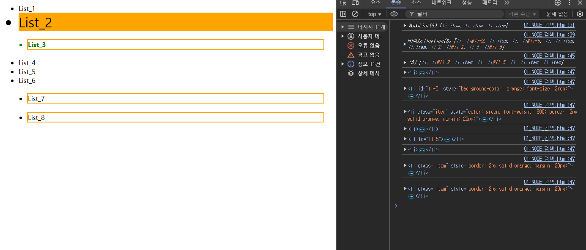

# 01

> **01_NODE_검색.html**
> 



```jsx
<!DOCTYPE html>
<html lang="en">
<head>
    <meta charset="UTF-8">
    <meta name="viewport" content="width=device-width, initial-scale=1.0">
    <title>Document</title>
</head>
<body>
    <ul>
        <li>List_1</li>
        <li id="li-2">List_2</li>
        <li class="item">List_3</li>
        <li>List_4</li>
        <li id="li-5">List_5</li>
        <li>List_6</li>
        <li class="item">List_7</li>
        <li class="item">List_8</li>
    </ul>

    <script>
        // getElemmentById('id명') #기호 필요 없다
        const li2El = document.getElementById('li-2')
        li2El.style.backgroundColor='orange'
        li2El.style.fontSize='2rem'
        // querySelector('선택자')
        const itemEl = document.querySelector('.item')
        itemEl.style.color='green'
        itemEl.style.fontWeight='900'
        // querySelectorAll('선택자')
        const itemEls = document.querySelectorAll('.item')
        console.log(itemEls)
        itemEls.forEach((item)=>{
            item.style.border='2px solid orange'
            item.style.margin='20px'
        })

        // 
        const liEls = document.getElementsByTagName('li')
        console.log(liEls)
        // 배열x - forEach 사용불가
        // liEls.forEach((item)=>{console.log(item)})

        //유사배열 -> 배열(Array.from())
        const liEls2 = Array.from(liEls)
        console.log(liEls2)
        liEls2.forEach((item)=>{
            console.log(item)
        })

    </script>
</body>
</html>
```

---

> **02_FORM_검색.html**
> 


```jsx
<!DOCTYPE html>
<html lang="en">

<head>
    <meta charset="UTF-8">
    <meta name="viewport" content="width=device-width, initial-scale=1.0">
    <title>Document</title>
</head>

<body>
    <form action="">
        <input type="text">
        <input type="text">
    </form>
    <form action="" name="joinForm">
        <input type="text" name="userid">
        <input type="text" name="username">
    </form>
    <form action="">
        <input type="text">
        <input type="text">
    </form>

    <script>
        //전체 form 찾기
        const formEls = document.forms
        console.log(formEls)

        //개별 form 접근([])
        console.log(formEls[0])
        console.log(formEls[1])
        console.log(formEls[2])
        console.log('----------')

        //개별 form 내의 자식노드접근([index][index])
        console.log(formEls[0][0])
        console.log(formEls[0][1])
        formEls[0][0].value='홍길동'
        formEls[0][1].value='15'
        console.log('----------')

        const formEl = document.joinForm
        formEl.userid.value='티모'
        formEl.username.value='렝가'

    </script>
</body>

</html>
```

---

> **03_Class_추가.html**
> 


```jsx
<!DOCTYPE html>
<html lang="en">
<head>
    <meta charset="UTF-8">
    <meta name="viewport" content="width=device-width, initial-scale=1.0">
    <title>Document</title>
    <style>
        .btn{
            width: 120px;
            height: 30px;
            line-height: 30px;
            text-align: center;
            margin: 5px;
            padding: 5px;
            border: 1px solid;
            border-radius: 5px;
            transition: .3s;
            cursor: pointer;
        }
        .btn--bg0{background-color: red;color: white;}
        .btn--bg1{background-color: orange;color: white;}
        .btn--bg2{background-color: yellow;color: black;}
        .btn--bg3{background-color: yellowgreen;color: white;}
        .btn--bg4{background-color: green;color: white;}
        .btn--bg5{background-color: skyblue;color: white;}
        .btn--bg6{background-color: blue;color: white;}
        .btn--bg7{background-color: navy;color: white;}
        .btn--bg8{background-color: purple;color: white;}
    </style>
</head>
<body>
    <div class="btn">BUTTON_1</div>
    <div class="btn">BUTTON_2</div>
    <div class="btn">BUTTON_3</div>
    <div class="btn">BUTTON_4</div>
    <div class="btn">BUTTON_5</div>
    <div class="btn">BUTTON_6</div>
    <div class="btn">BUTTON_7</div>
    <div class="btn">BUTTON_8</div>
    
    <script>
        const btnEls =document.querySelectorAll('.btn')
        btnEls.forEach((btn,idx)=>{
            console.log(idx,btn)
            btn.addEventListener('mouseover',()=>{
                btn.classList.add(`btn--bg${idx}`)
            })
            btn.addEventListener('mouseleave',()=>{
                btn.classList.remove(`btn--bg${idx}`)
            })
        })
    </script>
</body>
</html>
```

---

> **04_EL_CRUD.html**
> 


```jsx
<!DOCTYPE html>
<html lang="en">

<head>
    <meta charset="UTF-8">
    <meta name="viewport" content="width=device-width, initial-scale=1.0">
    <title>Document</title>

    <!-- google icon -->
    <link rel="stylesheet"
        href="https://fonts.googleapis.com/css2?family=Material+Symbols+Outlined:opsz,wght,FILL,GRAD@20..48,100..700,0..1,-50..200&icon_names=delete" />
    <style>
        .material-symbols-outlined {
            font-variation-settings:
                'FILL' 0,
                'wght' 300,
                'GRAD' 0,
                'opsz' 24
        }
    </style>

    <style>
        .item {
            min-width: 300px;
            height: 35px;
            margin: 5px;
            padding: 5px;
            border: 1px solid;
            display: flex;
            justify-content: space-between;
            align-items: center;
            ;
            gap: 10px;
        }

        .item>.left {
            width: calc(100% - 30px);
            height: 100%;
            border: 1px solid;

            display: flex;
            justify-content: left;
            align-items: center;
        }

        .item>.right {
            width: 30px;
            height: 100%;
            border: 1px solid;

            display: flex;
            justify-content: center;
            align-items: center;
        }

        .item>.right>span {
            cursor: pointer;
        }
    </style>
</head>

<body>
    <input type="text" class="input"><span> | </span><button class="btn">입력</button>
    <hr>
    <div class="container"></div>

    <script>
        // DOM LOAD EVENT
        document.addEventListener('DOMContentLoaded', () => {

            // 요소 검색
            const inputEl = document.querySelector('.input');
            const btnEl = document.querySelector('.btn');
            const containerEl = document.querySelector('.container');

            // 이벤트 처리
            btnEl.addEventListener('click', () => {
                console.log('clicked');
                const text = inputEl.value;
                createNode(text);
                inputEl.value = '';
            });

            // 함수
            function createNode(text) {
                //유효성 검사
                if (!isValid(text)) {
                    return;
                }

                //div, > left(text),right(icon)
                //노드 생성
                const divEl = document.createElement('div');
                const leftEl = document.createElement('div');
                const rightEl = document.createElement('div');
                //<span class="material-symbols-outlined">delete</span>
                const deleteEl = document.createElement('span');
                deleteEl.classList.add('material-symbols-outlined');
                deleteEl.innerHTML = 'delete';

                //데이터 처리
                leftEl.innerHTML = text;

                //이벤트 처리
                deleteEl.addEventListener('click', (e) => {
                    console.log('delete btn clicked..', e.target);
                    deleteNode(e.target);
                });

                //스타일링(class 추가)
                divEl.classList.add('item');
                leftEl.classList.add('left');
                rightEl.classList.add('right');

                //노드 연결
                rightEl.appendChild(deleteEl);
                divEl.appendChild(leftEl);
                divEl.appendChild(rightEl);
                containerEl.appendChild(divEl);

            }
            function deleteNode(btn) {
                const itemEl = btn.parentNode.parentNode;
                console.log('delete target item..', itemEl);
                itemEl.remove();
            }
            //유효성 체크 함수
            function isValid(text) {
                const regex = /^[0-9]/; //첫문자가 숫자값이 나오는 경우

                if (text.trim() === '' || text.trim() === null) {
                    console.error('inValid error', '공백을 입력하면 안됩니다.');
                    alert("공백을 입력하면 안됩니다.");
                    return false;
                } else if (regex.test(text)) {
                    console.error('inValid error', '첫문자는 숫자가 들어오면 안됩니다.');
                    alert("첫문자는 숫자가 들어오면 안됩니다.");
                    return false;
                }
                return true;
            }

        })

    </script>
</body>

</html>
```

---

> **05_[문제] EL_CRUD.html**
> 


```jsx
<!DOCTYPE html>
<html lang="en">

<head>
    <meta charset="UTF-8">
    <meta name="viewport" content="width=device-width, initial-scale=1.0">
    <title>Document</title>

    <!-- google icon -->
    <link rel="stylesheet"
        href="https://fonts.googleapis.com/css2?family=Material+Symbols+Outlined:opsz,wght,FILL,GRAD@20..48,100..700,0..1,-50..200&icon_names=delete" />
    <style>
        .material-symbols-outlined {
            font-variation-settings:
                'FILL' 0,
                'wght' 300,
                'GRAD' 0,
                'opsz' 24
        }
    </style>

    <style>
        * {
            font-size: 1rem;
        }

        .material-symbols-outlined {
            font-variation-settings:
                'FILL' 0,
                'wght' 300,
                'GRAD' 0,
                'opsz' 24;
            font-size: 1.5rem;
        }

        input {
            height: 35px;
        }

        .btn {
            width: 75px;
            height: 35px;
            border-radius: 5px;
            background-color: white;
            cursor: pointer;
        }

        th,
        td {
            width: 50px;
            height: 35px;
            border: 1px solid;
            margin: 2px;
        }

        th:nth-child(1),
        td:nth-child(1) {
            width: 150px;
        }

        th:nth-child(3),
        td:nth-child(3) {
            width: 700px;
        }

        td.delete{
            display: flex;
            justify-content: center;
            align-items: center;
            
        }
        td.delete>span{
            cursor: pointer;
        }
    </style>

</head>

<body>
    <form action="" name="joinForm" onsubmit="return false">
        <input name="username" placeholder="이름을 입력하세요">
        <input name="age" placeholder="나이를 입력하세요">
        <input name="address" placeholder="주소를 입력하세요">
        <button class="btn">입력</button>
    </form>
    <hr>
    <table>
        <thead>
            <tr>
                <th>이름</th>
                <th>나이</th>
                <th>주소</th>
                <th>삭제</th>
            </tr>
        </thead>
        <tbody>

        </tbody>

    </table>

    </div>
    <script>
        // form의 기본기능은 비활성화합니다
        //입력버튼을 눌렀을때 table의 tbody에 입력된 (이름/나이/주소/삭제버튼)이 생성될수 있도록합니다
        //입력된 노드의 이름/나이/주소를 수정할수 있도록합니다.
        //특정행의 삭제버튼을 클릭했을때 해당 행이 삭제 될수 있도록 합니다.

        //특정행의 위치를 위로이동/아래로 이동이 가능하도록 합니다(나중에)

        const btnEl = document.querySelector('.btn');
        const formEl = document.joinForm;
        const usernameEl = formEl.username;
        const ageEl = formEl.age;
        const addressEl = formEl.address;
        const tableBodyEl = document.querySelector('table tbody');

        //이벤트 
        btnEl.addEventListener('click', () => {
            const name = usernameEl.value;
            const age = ageEl.value;
            const addr = addressEl.value;
            createNode({ "name": name, "age": age, "addr": addr })
            usernameEl.value="";
            ageEl.value="";
            addressEl.value="";
        })

        //노드 추가
        const createNode = (profile) => {
            
            //유효성 체크 
            if(!isValid(profile)) return ;

            //새노드 생성
            const trEl = document.createElement("tr");

            const nameEl = document.createElement("td");
            const ageEl = document.createElement("td");
            const addrEl = document.createElement("td");
            const deleteEl = document.createElement("td");
            
            const deleteIconEl = document.createElement('span');
            deleteIconEl.classList.add('material-symbols-outlined');
            deleteIconEl.innerHTML = 'delete';

            //데이터 삽입 
            nameEl.innerHTML = profile.name;
            ageEl.innerHTML = profile.age;
            addrEl.innerHTML = profile.addr;

            //스타일링
            trEl.classList.add('item');
            nameEl.classList.add('name')
            ageEl.classList.add('age')
            addrEl.classList.add('addr')
            deleteEl.classList.add('delete')

            //이벤트 처리(삭제)
            deleteIconEl.addEventListener('click',deleteNode)

            //노드 연결
            deleteEl.appendChild(deleteIconEl);

            trEl.appendChild(nameEl);
            trEl.appendChild(ageEl);
            trEl.appendChild(addrEl);
            trEl.appendChild(deleteEl);

            tableBodyEl.appendChild(trEl);

        }

        //노드 삭제
        const deleteNode = (e) => { 
            console.log('delete clicked',e);
            const parentNode = e.target.parentNode.parentNode;
            parentNode.remove();
        }

        //유효성 체크
        function isValid(profile){
            console.log('typeof',profile)
            if(
                profile.name.trim()==="" &&
                profile.age.trim()==="" &&
                profile.addr.trim()===""
            ){
                alert("사용자 정보를 입력하세요");
                return false;
            }
            if(profile.name.trim()===""){
                alert("이름을 입력하세요");
                return false;
            }
            if(profile.age.trim()===""){
                alert("나이를 입력하세요");
                return false;
            }
            if(profile.addr.trim()===""){
                alert("주소를 입력하세요");
                return false;
            }
            return true;
        }

    </script>
</body>

</html>
```

---

> **06_EL_CRUD_DRAG.html**
> 


```jsx

```

---

> **00_INFO.txt**
> 

```
------------------------------------------------
동기(Synchronous)   /   비동기(ASynchronous) 방식
------------------------------------------------

=================
동기(Synchronous) 
=================
코드가 위에서 아래로 순차적으로 실행
이전 작업이 끝나야 다음 작업이 실행
실행 흐름이 직관적이지만 처리시간이 오래걸리는 작업이 있으면 전체 프로그램이 지연 될수 있음

====================
비동기(ASynchronous)
====================
특정 작업이 끝날 때까지 기다리지 않고 다음 코드가 먼저 실행됨
시간이 오래 걸리는 작업(예: 네트워크 요청, 파일 읽기 등)을 수행할 때 유용함
콜백(callback), 프로미스(Promise), async/await 등을 이용해 처리함
```

---

> **00_INFO.html**
> 

```
<!DOCTYPE html>
<html lang="en">z
<head>
    <meta charset="UTF-8">
    <meta name="viewport" content="width=device-width, initial-scale=1.0">
    <title>Document</title>
</head>
<body>

    <script>
        // 스크립트 내 코드에서의 동기(약속) : 메인코드라인(메인Thread)대로 코드를 실행 처리
        // 스크립트 내 코드에서의 비동기 : 메인코드라인(메인Thread)에서 분할된(Worker Thread)에서 독립적으로 코드를 실행 처리
        // [주의] 스크립트내에서 스레드를 분할처리하는 것은 실제로 스레드가 분할되는것은아니라 그렇게 보이도록(가상) 처리하는것이다
        // [주의] 자바스크립트는 싱글스레드 방식을 사용,실제로 스레드를 나눌수는 없다

        //첫번째 for문이 끝나야 두번째 for문이 끝나는 구조(동기-약속되어있음 , 메인스레드에서 동작)
        for(let i=0;i<10;i++){
            console.log("Main thread 첫번째 for ...",i);
        }
        for(let j=0;j<10;j++){
            console.log("Main thread 두번째 for...",j);
        }
    </script>
    
</body>
</html>
```