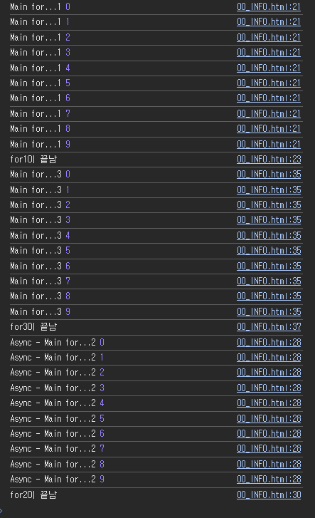

# 01

> 00_INFO.txt
> 

```jsx
------------------------------------------------
동기(Synchronous)   /   비동기(ASynchronous) 방식
------------------------------------------------

=================
동기(Synchronous) 
=================
코드가 위에서 아래로 순차적으로 실행
이전 작업이 끝나야 다음 작업이 실행
실행 흐름이 직관적이지만 처리시간이 오래걸리는 작업이 있으면 전체 프로그램이 지연 될수 있음

====================
비동기(ASynchronous)
====================
특정 작업이 끝날 때까지 기다리지 않고 다음 코드가 먼저 실행됨
시간이 오래 걸리는 작업(예: 네트워크 요청, 파일 읽기 등)을 수행할 때 유용함
콜백(callback), 프로미스(Promise), async/await 등을 이용해 처리함

동기(약속)
- javascript : 절차대로 처리(Main Thread)
- network : 속도 / 데이터단위 / 혼잡 제어에 대한 약속
- web server : 한 페이지당 한번에 하나의 요청 / 응답 흐름

비동기
- javascript : 절차를 지키지 않음(Worker Thread 생성 후 독자적으로 처리 - 실제로 스레드를 나누진 않음)
- network : 미리 만들어놓은 약속대로 데이터 전속을 하지않고 임의로 지정한대로 전송
- web server : 한 페이지당 여러 개의 요청 / 여러 개의 응답(xhr, promise, fetch, ajax, axios...) 

스레드 : 코드를 처리하는 실행흐름

비동기 처리간 우선순위 : async(함수의 헤더에 부여), await(함수 내 비동기 처리 로직에 부여)

```

---

> **00_INFO.html**
> 



```jsx
<!DOCTYPE html>
<html lang="en">

<head>
    <meta charset="UTF-8">
    <meta name="viewport" content="width=device-width, initial-scale=1.0">
    <title>Document</title>
</head>

<body>

    <script>
        // 스크립트 내 코드에서의 동기(약속) : 메인코드라인(메인Thread)대로 코드를 실행 처리
        // 스크립트 내 코드에서의 비동기 : 메인코드라인(메인Thread)에서 분할된(Worker Thread)에서 독립적으로 코드를 실행 처리
        // [주의] 스크립트내에서 스레드를 분할처리하는 것은 실제로 스레드가 분할되는것은아니라 그렇게 보이도록(가상) 처리하는것이다
        // [주의] 자바스크립트는 싱글스레드 방식을 사용,실제로 스레드를 나눌수는 없다

        // 메인스레드에서의 동작 확인
        for (let i = 0; i < 10; i++) {
            console.log("Main for...1", i);
        }
        console.log("for1이 끝남")

        // 비동기 처리(스레드를 분할 처리 - (JS에서는 실제로는 분할되지는 않음)) 
        setTimeout(() => {
            for (let i = 0; i < 10; i++) {
                console.log("Async - Main for...2", i);
            }
            console.log("for2이 끝남")
        }, 10)

        for (let i = 0; i < 10; i++) {
            console.log("Main for...3", i);
        }
        console.log("for3이 끝남")
    </script>

</body>

</html>
```

---

> **01_set&clearTImeout.html**
> 


```jsx
<!DOCTYPE html>
<html lang="en">
<head>
    <meta charset="UTF-8">
    <meta name="viewport" content="width=device-width, initial-scale=1.0">
    <title>Document</title>
</head>
<body>
    <div class="d1"></div>
    <button onclick="start()">예약실행</button>
    <button onclick="stop()">예약취소</button>

    <script>
        let id = null
        const start = () => {
            const dlEl = document.querySelector('.d1')

            id = setTimeout(()=>{
                dlEl.innerHTML='setTimeOut Result..'
            },3000)
            console.log('id',id)
        }
        const stop = () => {
            clearTimeout(id)
        }
    </script>
</body>
</html>
```

---

> **02_set&clearTImeout.html**
> 


```jsx
<!DOCTYPE html>
<html lang="en">

<head>
    <meta charset="UTF-8">
    <meta name="viewport" content="width=device-width, initial-scale=1.0">
    <title>Document</title>
</head>

<body>
    <div class="d1"></div>
    <button onclick="start()">반복실행</button>
    <button onclick="stop()">반복취소</button>

    <script>
        let id = null
        let cnt =0
        const start = () => {
            const dlEl = document.querySelector('.d1')

            id = setInterval(() => {
                dlEl.innerHTML=(++cnt);
            }, 1000)
            console.log('id', id)
        }
        const stop = () => {
            clearInterval(id)
        }
    </script>
</body>

</html>
```

---

> **03_Async&Await.html**
> 


```jsx
<!DOCTYPE html>
<html lang="en">

<head>
    <meta charset="UTF-8">
    <meta name="viewport" content="width=device-width, initial-scale=1.0">
    <title>Document</title>

    <style>
        .box {
            width: 1280px;
            height: 800px;
            border: 1px solid;
            margin: 0 auto;
            display: flex;
            justify-content: space-between;
        }

        .box>.main-thread {
            width: 300px;
            border: 1px solid;
            height: 100%;
        }

        .box>.sub1-thread {
            width: 300px;
            border: 1px solid;
            height: 100%;
        }

        .box>.sub2-thread {
            width: 300px;
            border: 1px solid;
            height: 100%;
        }
    </style>
</head>

<body>
    <div class="box">
        <div class="main-thread"></div>
        <div class="sub1-thread"></div>
        <div class="sub2-thread"></div>
    </div>

    <script>
        const mainThreadEl = document.querySelector('.main-thread')
        const sub1ThreadEl = document.querySelector('.sub1-thread')
        const sub2ThreadEl = document.querySelector('.sub2-thread')

        // MAIN Thread 반복 동작
        let cnt = 0;
        setInterval(() => {
            mainThreadEl.innerHTML += `MAIN THREAD...${++cnt}<br/>`
        },1500)

        // Promise 비동기 처리객체
        // function sub_process_executor(val) {
        //     return new Promise((resolve, reject) => {
        //         setTimeout(() => {
        //             resolve(val);   // 비동기요청 성공시에 전달되는값(then이하로 받기)
        //         }, 3000)
        //     })
        // }
        // sub1-thread 동작
        // sub_process_executor(1)
        //     .then((response) => {
        //         console.log(response)
        //         sub1ThreadEl.innerHTML = `sub-thread ${response}`
        //     })
        //     .catch((error) => { console.log(error) })
        // sub2-thread 동작
        // sub_process_executor(2)
        //     .then((response) => {
        //         console.log(response)
        //         sub2ThreadEl.innerHTML = `sub-thread ${response}`
        //     })
        //     .catch((error) => { console.log(error) })

        // async , aswit - 비동기처리 순서를 지정
        // async 예약어 : 해당 함수가 비동기적인 처리를 하는 프로세스임을 암시
        // await 예약어 : async 블럭 내부에서 사용되며 비동기 작업이 완료시까지 대기하는 예약어

        function sub_process_executor(val) {
            return new Promise((resolve, reject) => {
                setTimeout(() => {
                    resolve(val);   // 비동기요청 성공시에 전달되는값(then이하로 받기)
                }, 3000)
            })
        }
        async function sub_process_func() {
            await sub_process_executor(1)
            .then((response)=>{sub1ThreadEl.innerHTML = `sub-thread ${response}`})
            .catch(()=>{})
            await sub_process_executor(2)
            .then((response)=>{sub2ThreadEl.innerHTML = `sub-thread ${response}`})
            .catch(()=>{})
        }
        sub_process_func()
    </script>
</body>

</html>
```

---

> **01SWIPER.html**
> 


```jsx
<!DOCTYPE html>
<html lang="en">

<head>
    <meta charset="UTF-8">
    <meta name="viewport" content="width=device-width, initial-scale=1.0">
    <title>Document</title>

    <!-- SWIPER CDN -->
    <link rel="stylesheet" href="https://cdn.jsdelivr.net/npm/swiper@11/swiper-bundle.min.css" />
    <script src="https://cdn.jsdelivr.net/npm/swiper@11/swiper-bundle.min.js"></script>

    <style>
        * {
            box-sizing: border-box;
        }

        body {
            margin: 0;
        }

        .wrapper {}

        .wrapper>header {
            height: 100px;
            border: 1px solid;
        }

        .wrapper>main {}

        .wrapper>main>section {}

        /*  */
        .wrapper>main>section.banner-section {
            min-height: 720px;
            border: 1px solid;
        }

        .wrapper>main>section.banner-section>.swiper {
            height: 100%;
        }

        .wrapper>main>section.banner-section>.swiper>.swiper-wrapper {
            height: 100%;
        }

        .wrapper>main>section.banner-section>.swiper>.swiper-wrapper>.swiper-slide {
            height: 100%;
        }

        .banner-section>.swiper .swiper-pagination {}
        .banner-section>.swiper .swiper-pagination>.swiper-pagination-bullet {
            width: 25px;
            height: 10px;
            border-radius: 2px;
            background-color: rgb(177, 177, 177);
        }
        .banner-section>.swiper .swiper-pagination>.swiper-pagination-bullet-active {
            background-color: orange;
        }

        .banner-section>.swiper .swiper-button-prev,
        .banner-section>.swiper .swiper-button-next{
            color: white;
            background-color: gray;
            width: 50px;
            height: 100px;
            padding: 5px;
            font-size: 1rem;
            opacity: 50%;
        }
        .banner-section>.swiper .swiper-button-prev::after,
        .banner-section>.swiper .swiper-button-next::after{
            font-size: 1.3rem;
        }
        .banner-section>.swiper .swiper-scrollbar{
            /* background-color: red; */
        }
    </style>
</head>

<body>

    <div class="wrapper">
        <header></header>
        <main>
            <section class="banner-section">

                <!-- Slider main container -->
                <div class="swiper">
                    <!-- Additional required wrapper -->
                    <div class="swiper-wrapper">
                        <!-- Slides -->
                        <div class="swiper-slide"></div>
                        <div class="swiper-slide"></div>
                        <div class="swiper-slide"></div>
                        <div class="swiper-slide"></div>
                    </div>
                    <!-- If we need pagination -->
                    <div class="swiper-pagination"></div>

                    <!-- If we need navigation buttons -->
                    <div class="swiper-button-prev"></div>
                    <div class="swiper-button-next"></div>

                    <!-- If we need scrollbar -->
                    <div class="swiper-scrollbar"></div>
                </div>

            </section>
        </main>
        <footer></footer>
    </div>

    <script>
        const swiper_banner = new Swiper('.wrapper>main>section.banner-section>.swiper', {

            // Optional parameters
            direction: 'horizontal',
            autoplay: {
                delay: 2000,
                // pauseOnMouseEnter : true,
            },
            loop: true,

            effect: "slide",   // slide(기본) , fade , scroll , cube , coverflow ,flip 
            mousewheel: true,

            // slidesPerview:2,
            // spaceBetween:30,    // 시야간격
            // speed : 400,        // 애니메이션 전환속도
            // centeredSlides : true,

            // // If we need pagination
            pagination: {
                el: '.wrapper>main>section.banner-section .swiper-pagination',
                clickable: true,
                type: 'bullets', // bullets(기본), fraction(숫자형), progressbar(막대형)
            },

            // // Navigation arrows
            navigation: {
                nextEl: '.wrapper>main>section.banner-section .swiper-button-next',
                prevEl: '.wrapper>main>section.banner-section .swiper-button-prev',
            },

            // // And if we need scrollbar
            // scrollbar: {
            //     el: '.swiper-scrollbar',
            // },
        });
    </script>
</body>

</html>
```

---

> **02SWIPER.html**
> 


```jsx
<!DOCTYPE html>
<html lang="en">

<head>
    <meta charset="UTF-8">
    <meta name="viewport" content="width=device-width, initial-scale=1.0">
    <title>Document</title>

    <!-- SWIPER CDN -->
    <link rel="stylesheet" href="https://cdn.jsdelivr.net/npm/swiper@11/swiper-bundle.min.css" />
    <script src="https://cdn.jsdelivr.net/npm/swiper@11/swiper-bundle.min.js"></script>

    <style>
        * {
            box-sizing: border-box;
        }

        body {
            margin: 0;
        }

        .wrapper {}

        .wrapper>header {
            height: 100px;
            border: 1px solid;
        }

        .wrapper>header>.top-header {
            height: 40px;
            border: 1px solid;

            display: flex;
            justify-content: space-between;
        }

        .wrapper>header>.top-header>.left {
            border: 1px solid;
            width: 300px;
            height :100%;
        }
        .wrapper>header>.top-header>.left>.swiper{
            height : 100%;
            width : 100%;
        }
        
        .wrapper>header>.top-header>.right {
            border: 1px solid;
        }

        .wrapper>header>nav {
            height: calc(100% - 40px);
        }

        .wrapper>main {}

        .wrapper>main>section {}

        /*  */
        .wrapper>main>section.banner-section {
            min-height: 720px;
            border: 1px solid;

            background-color: black;
        }

        .wrapper>main>section.banner-section>.swiper {
            height: 100%;
        }

        .wrapper>main>section.banner-section>.swiper>.swiper-wrapper {
            height: 100%;
        }

        .wrapper>main>section.banner-section>.swiper>.swiper-wrapper>.swiper-slide {
            height: 100%;
        }

        .banner-section>.swiper .swiper-pagination {}

        .banner-section>.swiper .swiper-pagination>.swiper-pagination-bullet {
            width: 15px;
            height: 15px;
            background-color: transparent;
            /* opacity: .8; */
        }

        .banner-section>.swiper .swiper-pagination>.swiper-pagination-bullet-active {

            background-color: orange;

            opacity: 1 !important;
        }

        .banner-section>.swiper .swiper-button-prev,
        .banner-section>.swiper .swiper-button-next {
            color: white;
            width: 50px;
            height: 50px;
            background-color: black;
            padding: 5px;
            border-radius: 50%;
            font-size: 1rem;
        }

        .banner-section>.swiper .swiper-button-prev::after,
        .banner-section>.swiper .swiper-button-next::after {
            font-size: 1.3rem;
            font-weight: 800;
        }

        .banner-section>.swiper .swiper-scrollbar {
            /* background-color:red; */
        }

        .multi-slide-banner {
            height: 300px;
            border: 1px solid;

        }

        .multi-slide-banner>.swiper {
            height: 100%;
            /* border: 1px solid; */

        }

        .multi-slide-banner>.swiper>.swiper-wrapper {
            height: 100%;
            /* border: 1px solid; */

        }

        .multi-slide-banner>.swiper>.swiper-wrapper>.swiper-slide {
            height: 100%;
            border: 1px solid;

            display: flex;
            justify-content: center;
            align-items: center;
        }
    </style>
</head>

<body>

    <div class="wrapper">
        <header>
            <div class="top-header">
                <div class="left">
                    <div class="swiper">
                        <div class="swiper-wrapper">
                            <div class="swiper-slide">[공지] 공지사항1</div>
                            <div class="swiper-slide">[공지] 공지사항2</div>
                            <div class="swiper-slide">[공지] 공지사항3</div>
                            <div class="swiper-slide">[공지] 공지사항4</div>
                            <div class="swiper-slide">[공지] 공지사항5</div>
                            <div class="swiper-slide">[공지] 공지사항6</div>
                        </div>
                    </div>
                </div>
                <div class="right"></div>
            </div>
            <nav></nav>
        </header>
        <main>
            <section class="banner-section">

                <!-- Slider main container -->
                <div class="swiper">
                    <!-- Additional required wrapper -->
                    <div class="swiper-wrapper">
                        <!-- Slides -->
                        <div class="swiper-slide"></div>
                        <div class="swiper-slide"></div>
                        <div class="swiper-slide"></div>
                        <div class="swiper-slide"></div>
                    </div>
                    <!-- If we need pagination -->
                    <div class="swiper-pagination"></div>

                    <!-- If we need navigation buttons -->
                    <div class="swiper-button-prev"></div>
                    <div class="swiper-button-next"></div>

                    <!-- If we need scrollbar -->
                    <div class="swiper-scrollbar"></div>
                </div>

            </section>

            <section class="multi-slide-banner">
                <div class="swiper">
                    <div class="swiper-wrapper">
                        <div class="swiper-slide">Slide 1</div>
                        <div class="swiper-slide">Slide 2</div>
                        <div class="swiper-slide">Slide 3</div>
                        <div class="swiper-slide">Slide 4</div>
                        <div class="swiper-slide">Slide 5</div>
                        <div class="swiper-slide">Slide 6</div>
                        <div class="swiper-slide">Slide 7</div>
                        <div class="swiper-slide">Slide 8</div>
                        <div class="swiper-slide">Slide 9</div>
                        <div class="swiper-slide">Slide 10</div>
                        <div class="swiper-slide">Slide 11</div>
                        <div class="swiper-slide">Slide 12</div>
                    </div>
                    <div class="swiper-button-prev"></div>
                    <div class="swiper-button-next"></div>
                </div>
            </section>

        </main>
        <footer></footer>
    </div>

    <script>

        // main-banner
        const swiper_banner = new Swiper('.wrapper>main>section.banner-section>.swiper', {

            // Optional parameters
            direction: 'horizontal',
            autoplay: {
                delay: 2000,
                // pauseOnMouseEnter : true,
                // disableOnInteraction : true,
            },
            loop: true,

            effect: "slide",   // slide(기본) , fade , scroll , cube , coverflow ,flip 
            mousewheel: true,

            // slidesPerView:3,
            // spaceBetween:30,    // 사이간격
            // speed :300,         // 애니메이션 전환속도
            // centeredSlides : true,

            // If we need pagination
            pagination: {
                el: '.wrapper>main>section.banner-section .swiper-pagination',
                clickable: true,
                type: 'bullets',   //bullets(기본), fraction , progressbar
            },

            // // Navigation arrows
            navigation: {
                nextEl: '.wrapper>main>section.banner-section .swiper-button-next',
                prevEl: '.wrapper>main>section.banner-section .swiper-button-prev',
            },

            // // And if we need scrollbar
            scrollbar: {
                el: '.swiper-scrollbar',
            },
        });

        //
        const swiper_multi_banner = new Swiper('.multi-slide-banner .swiper', {

            // Optional parameters
            direction: 'horizontal',
            autoplay: {
                delay: 2000,
                // pauseOnMouseEnter : true,
            },
            loop: true,

            effect: "slide",   // slide(기본) , fade , scroll , cube , coverflow ,flip 
            // mousewheel: true,

            slidesPerView: 5,
            // spaceBetween:30,    // 사이간격
            // speed :300,         // 애니메이션 전환속도
            centeredSlides: true,

            // // Navigation arrows
            navigation: {
                nextEl: '.multi-slide-banner .swiper-button-next',
                prevEl: '.multi-slide-banner .swiper-button-prev',
            },

        });
        //
        const notice_slider = new Swiper('header>.top-header>.left .swiper', {
            direction: 'vertical',
            autoplay: {
                delay: 2000,
            },
            loop: true,
            effect: "slide",   // slide(기본) , fade , scroll , cube , coverflow ,flip 
            mousewheel: true,
            slidesPerView: 1,
        });
    </script>
</body>

</html>
```

---

> **LODASH 01.html**
> 


```jsx
<!DOCTYPE html>
<html lang="en">
<head>
    <meta charset="UTF-8">
    <meta name="viewport" content="width=device-width, initial-scale=1.0">
    <title>Document</title>
    <!-- lodash cdn -->
    <script src="https://cdnjs.cloudflare.com/ajax/libs/lodash.js/4.17.21/lodash.min.js" integrity="sha512-WFN04846sdKMIP5LKNphMaWzU7YpMyCU245etK3g/2ARYbPK9Ub18eG+ljU96qKRCWh+quCY7yefSmlkQw1ANQ==" crossorigin="anonymous" referrerpolicy="no-referrer"></script>
    <style>
        body{height: 8000px; margin: 0;}
    </style>
</head>
<body>
    <script>
        console.log("_",_);
        window.addEventListener('scroll', _.throttle((e)=>{console.log(window.scrollY)},50))
    </script>
</body>
</html>
```

---

> **SCROLLMAGIC 01.html**
> 


```jsx

```

---

```jsx
<!DOCTYPE html>
<html lang="en">
<head>
    <meta charset="UTF-8">
    <meta name="viewport" content="width=device-width, initial-scale=1.0">
    <title>Document</title>

    <!-- SCROLLMAGIC CDN -->
    <script src="https://cdnjs.cloudflare.com/ajax/libs/ScrollMagic/2.0.8/ScrollMagic.min.js" integrity="sha512-8E3KZoPoZCD+1dgfqhPbejQBnQfBXe8FuwL4z/c8sTrgeDMFEnoyTlH3obB4/fV+6Sg0a0XF+L/6xS4Xx1fUEg==" crossorigin="anonymous" referrerpolicy="no-referrer"></script>

    <style>
        section{
            width : 1200px;
            margin : 0 auto;
            height : 500px;
            border : 1px solid;
            margin-bottom : 20px;

            position:relative;
        }
        .ball{
            width:100px;
            height:100px;
            border : 1px solid;
            border-radius: 50%;

            display:flex;
            justify-content: center;
            align-items: center;

            position:absolute;
            left:0;
            top:0;
            transition:.5s;
        }
        .move{
            left:calc(100% - 100px);
            top:calc(100% - 100px);
        }
    </style>
</head>
<body>

    
    <section></section>

    <section class="scroll-section scroll-spy">
        <div class="ball">BALL</div>
    </section>

    <section></section>

    <script>
        const spyedEl = document.querySelector('.scroll-spy');
        const ballEl = document.querySelector('.scroll-spy .ball');

        const scrollMagicObj = new ScrollMagic.Scene({
                                        triggerElement : spyedEl,   //감시할 요소 선택
                                        triggerHook : .5,           //스크롤의 위치값(0-1, 0:최상단,.5:화면중앙,1:화면최하단)
                                    })
                                    .setClassToggle(ballEl,'move')  //Hook대상EL , 효과적용 class명
                                    .addTo(new ScrollMagic.Controller());
    </script>
</body>
</html>
```