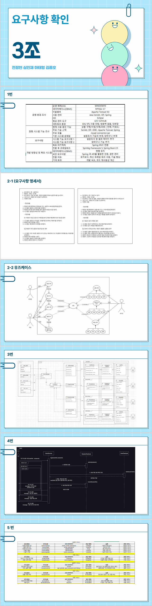

# 01

> PPT 제작
> 



---

### controller

---

> HomeController
> 

```jsx
package com.example.app.controller;

import java.text.DateFormat;
import java.util.Date;
import java.util.Locale;

import org.slf4j.Logger;
import org.slf4j.LoggerFactory;
import org.springframework.stereotype.Controller;
import org.springframework.ui.Model;
import org.springframework.web.bind.annotation.RequestMapping;
import org.springframework.web.bind.annotation.RequestMethod;

import lombok.extern.slf4j.Slf4j;

/**
 * Handles requests for the application home page.
 */
@Controller
@Slf4j
public class HomeController {
	
	private static final Logger logger = LoggerFactory.getLogger(HomeController.class);
	
	/**
	 * Simply selects the home view to render by returning its name.
	 */
	@RequestMapping(value = "/", method = RequestMethod.GET)
	public String home(Locale locale, Model model) {
//		logger.info("Welcome home! The client locale is {}.", locale);
		
		log.trace("TRACE LOG TEST");
		log.debug("DEBUG LOG TEST");
		log.info("INFO LOG TEST");
		log.warn("WARN LOG TEST");
		log.error("ERROR LOG TEST");
		
		Date date = new Date();
		DateFormat dateFormat = DateFormat.getDateTimeInstance(DateFormat.LONG, DateFormat.LONG, locale);
		
		String formattedDate = dateFormat.format(date);
		
		model.addAttribute("serverTime", formattedDate );
		
		return "home";
	}
	
}

```

---

> ParameterTestController
> 

```jsx
package com.example.app.controller;

import javax.servlet.http.HttpServletRequest;
import javax.servlet.http.HttpServletResponse;
import javax.servlet.http.HttpSession;

import org.springframework.stereotype.Controller;
import org.springframework.ui.Model;
import org.springframework.web.bind.annotation.GetMapping;
import org.springframework.web.bind.annotation.ModelAttribute;
import org.springframework.web.bind.annotation.PathVariable;
import org.springframework.web.bind.annotation.PostMapping;
import org.springframework.web.bind.annotation.RequestBody;
import org.springframework.web.bind.annotation.RequestMapping;
import org.springframework.web.bind.annotation.RequestMethod;
import org.springframework.web.bind.annotation.RequestParam;
import org.springframework.web.servlet.ModelAndView;
import org.springframework.web.servlet.mvc.support.RedirectAttributes;

import com.example.app.domain.dto.PersonDto;

import lombok.extern.slf4j.Slf4j;

@Controller
@Slf4j
@RequestMapping("/param")
public class ParameterTestController {
	
	@RequestMapping(value="/p01",method=RequestMethod.GET)
	public void p01(@RequestParam(value="name", required=false) String name) {
		log.info("GET /param/p01..." + name);
	}
	
	@GetMapping("/p02")
	public void p02(@RequestParam(value="name", required=true) String name) {
		log.info("GET /param/p02..." + name);
	}
	
	@PostMapping(value="/p03")
	public void p03(@RequestParam(value="name", required=true) String name) {
		log.info("POST /param/p03..." + name);
	}
	// @RequestParam	: 동기요청 파라미터 처리 	/ form 기반 전달되는 파라미터 받기 
	// @RequestBody		: 비동기요청 파라미터 처리 / form / json 등 파라미터 받기 
	@PostMapping(value="/p04")
	public void p04(@RequestBody String name) {
		log.info("POST /param/p04..." + name);
	}
	@RequestMapping(value="/p05",method=RequestMethod.GET)
	public void p05(@RequestParam(value="name",defaultValue="홍길동") String name) {
		log.info("GET /param/p05..." + name);	
	}
	
	@RequestMapping(value="/p06",method=RequestMethod.GET)
	public void p06( 
					@RequestParam(value="name") 	String name,
					@RequestParam(value="age") 		int age , 
					@RequestParam(value="addr")  	String addr
					) 
	{
		log.info("GET /param/p06..." + name + " " + age + " " + addr);	
	}
	
	@RequestMapping(value="/p07",method=RequestMethod.GET)
	public void p07( @ModelAttribute PersonDto dto) 
	{
		log.info("GET /param/p07..." + dto);	
	}
	
	@RequestMapping(value="/p08/{username}/{age}/{addr}",method=RequestMethod.GET)
	public void p08(
				@PathVariable("username") String name,
				@PathVariable int age,
				@PathVariable String addr
			) 
	{
		log.info("GET /param/p08..." + name+" " + age + " " + addr);	
	}
	
	@RequestMapping(value="/p09/{username}/{age}/{addr}",method=RequestMethod.GET)
	public void p09(PersonDto dto) 
	{
		log.info("GET /param/p09..." + dto);	
	}
	
	@GetMapping("/page01")
	public void page01(PersonDto dto,Model model) {
		log.info("GET /param/page01..."+ dto);
		//반환자료형이 void 일때 /WEB-INF/views/param/page01.jsp와 매핑 

		//파라미터
		//유효성
		//서비스
		//뷰이동 + 데이터 전달(Model객체 - DispatherServlet(FC))
		model.addAttribute("dto",dto);
		model.addAttribute("test","test1Value");
		
	}
	@GetMapping("/page02")
	public String page02(PersonDto dto,Model model) {
		log.info("GET /param/page02..."+ dto);
		model.addAttribute("dto",dto);
		model.addAttribute("test","test2Value");
		
		//반환자료형 void : /WEB-INF/views/param/page02.jsp와 매핑
		//위치변경시 String  + return "path"
		
		return "param/page01";	
	}
	@GetMapping("/page03/{username}/{age}/{addr}")
	public String page03(PersonDto dto,Model model) {
		log.info("GET /param/page03..." + dto);
		model.addAttribute("dto",dto);
		model.addAttribute("test","test_value_3");		
		return "param/page01";
	}
	@GetMapping("/page04/{username}/{age}/{addr}")
	public ModelAndView page04(PersonDto dto) {
		log.info("GET /param/page04..." + dto);
		
		ModelAndView modelAndView = new ModelAndView();
		modelAndView.addObject("dto",dto);
		modelAndView.setViewName("param/page01");
		
		return modelAndView;
	}
	
	//SERVLET 방식 
	@GetMapping("/page05")
	public String page05(HttpServletRequest req,HttpServletResponse resp) {
		log.info("GET /param/page05...");
		//파라미터 받기
		String name = req.getParameter("username");
		int age =  Integer.parseInt(req.getParameter("age"));
		String addr = req.getParameter("addr");
		log.info(name+" "  + age);
		PersonDto dto = new PersonDto(name,age,addr);

		//내용담기
		req.setAttribute("dto", dto);
		
		HttpSession session = req.getSession();
		log.info("session : "  + session);
		return "param/page01";
	}
	
	
	//Forward
	@GetMapping("/forward1")
	public String f1(Model model) {
		log.info("param/forward1..");
		model.addAttribute("f1","f1Value");
		return "forward:/param/forward2";
	}
	//Forward
	@GetMapping("/forward2")
	public String f2(Model model) {
		log.info("/param/forward2..");
		model.addAttribute("f2","f2Value");
		return "forward:/param/forward3";
	}	
	//Forward
	@GetMapping("/forward3")
	public String f3(Model model) {
		log.info("/param/forward3..");
		model.addAttribute("f3","f3Value");
		return "param/forward_result";
	}	
	
	//Redirect
	@GetMapping("/redirect1")
	public String r1(Model model,RedirectAttributes redirectAttributes) {
		log.info("/param/redirect1..");
//		model.addAttribute("r1","r1Value");			
		redirectAttributes.addAttribute("r1", "r1Value");//쿼리스트링
		return "redirect:/param/redirect2";
	}	
	@GetMapping("/redirect2")
	public String r2(
			Model model,
			@RequestParam("r1") String r1,
			RedirectAttributes redirectAttributes
			) {
		log.info("/param/redirect2..r1 : " + r1);
//		model.addAttribute("r2","r2Value");
		
		redirectAttributes.addAttribute("r1", r1);//쿼리스트링
		redirectAttributes.addAttribute("r2", "r2Value");//쿼리스트링
		return "redirect:/param/redirect_result";
	}	
	@GetMapping("/redirect_result")
	public void r_result(
			Model model,
			@RequestParam("r1") String r1,
			@RequestParam("r2") String r2
			) {
		model.addAttribute("r1",r1);
		model.addAttribute("r2",r2);
		model.addAttribute("r3","r3Value");
		log.info("/param/redirect_result..:");
	}	
	
	
	
}

```

---

> SimpleController
> 

```jsx
package com.example.app.controller;

import org.springframework.stereotype.Controller;
import org.springframework.web.bind.annotation.RequestMapping;
import org.springframework.web.bind.annotation.RequestMethod;

import lombok.extern.slf4j.Slf4j;

@Controller
@Slf4j
@RequestMapping("/test")
public class SimpleController {

	@RequestMapping( value = "/test1" ,method=RequestMethod.GET)
	public void test1() {
		log.info("GET /test/test1...");
		// 파라미터
		// 유효성
		// 서비스
		// 뷰이동(x)
	}
	@RequestMapping( value = "/test2" ,method=RequestMethod.GET)
	public String test2() {
		log.info("GET /test/test2...");
		return "test/abcd";
	}
	
	@RequestMapping( value = "/test3" ,method= {RequestMethod.GET,RequestMethod.POST})
	public void test3() {
		log.info("GET /test/test3...");
	}
	
}

```

---

### main/resources

---

> log4j.xml
> 

```jsx
<?xml version="1.0" encoding="UTF-8"?>
<!DOCTYPE log4j:configuration PUBLIC "-//APACHE//DTD LOG4J 1.2//EN" "log4j.dtd">
<log4j:configuration xmlns:log4j="http://jakarta.apache.org/log4j/">

	<!-- Appenders -->
	<appender name="console" class="org.apache.log4j.ConsoleAppender">
		<param name="Target" value="System.out" />
		<layout class="org.apache.log4j.PatternLayout">
			<param name="ConversionPattern" value="%-5p: %c - %m%n" />
		</layout>
	</appender>
	
	<!-- Application Loggers -->
	<logger name="com.example.app">
		<level value="info" />
	</logger>
	
	<!-- 3rdparty Loggers -->
	<logger name="org.springframework.core">
		<level value="info" />
	</logger>
	
	<logger name="org.springframework.beans">
		<level value="info" />
	</logger>
	
	<logger name="org.springframework.context">
		<level value="info" />
	</logger>

	<logger name="org.springframework.web">
		<level value="info" />
	</logger>

	<!-- Root Logger -->
	<root>
		<priority value="warn" />
		<appender-ref ref="console" />
	</root>
	
</log4j:configuration>

```

---

### views/param

---

> forward_result.jsp
> 

```jsx
<%@ page language="java" contentType="text/html; charset=UTF-8"
    pageEncoding="UTF-8"%>
<!DOCTYPE html>
<html>
<head>
<meta charset="UTF-8">
<title>Insert title here</title>
</head>
<body>
	<h1>FORWARD_RESULT PAGE</h1>
	${f1}<br>
	${f2}<br>
	${f3}<br>
	
</body>
</html>
```

---

> page01.jsp
> 

```jsx
<%@ page language="java" contentType="text/html; charset=UTF-8"
    pageEncoding="UTF-8"%>
<!DOCTYPE html>
<html>
<head>
<meta charset="UTF-8">
<title>Insert title here</title>
</head>
<body>
	<h1>PAGE01</h1>
	USERNAME : ${dto.username}<br/>
	AGE : ${dto.age}<br/>
	ADDR : ${dto.addr}<br/>
	
	${test}
</body>
</html>
```

---

> redirect_result.jsp
> 

```jsx
<%@ page language="java" contentType="text/html; charset=UTF-8"
    pageEncoding="UTF-8"%>
<!DOCTYPE html>
<html>
<head>
<meta charset="UTF-8">
<title>Insert title here</title>
</head>
<body>
	<h1>REDIRECT_RESULT PAGE</h1>
	${r1}<br>
	${r2}<br>
	${r3}<br>
	
</body>
</html>
```

---