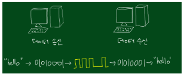

# 02

> **물리계층**
> 



```jsx
데이터를 전송할 수 있도록 전기적, 기계적 신호로 변환하여 송수신하는 네트워크의 가장 낮은 계층
```

> 신호(SIGNAL)이란?
> 

```jsx
부호(CODE) = 의미를 가지는 약속된 기호
디지털 부호 = 0,1로 이루어진 약속된 기호
```

> 신호전달에 필요한 요소
> 

```jsx
**에너지** : 전기에너지
**인프라** : 통신망
```

> Cable이란?
> 

```jsx
전선(전기선) : 전기를 이용해서 신호를 전달하는 선
```

> 리피터
> 

```jsx
전기신호를 증폭시키는 장치
```

> 허브
> 

```jsx
데이터를 여러 장치에 동시에 전달하는 네트워크 장비
```

> 문제
> 

```jsx
1 물리계층 역할/약속/관련 장치는?
역할 : 장치의 물리적 연결
약속 : 전기적 신호전달(PUD : Bit)
장치 : 리피터, 케이블, 허브, RJ45...

2 Cable 이란
전기를 이용해서 신호를 전달하는 선

3 LAN Cable 종류
STP, UTP(많이 사용됨), FTP

4 부호(Code) 란?
의미를 가진 약속된 기호

5 신호(Signal)이란?
부호의 전달형태 

6 신호전달에 필요한 요소?
통신망, 통신기기, 에너지원

7 리피터란?
신호를 증폭시켜주는 장비

8 허브란?
집선장치 = 데이터를 여러 장치에 동시에 전달하는 네트워크 장비
```
