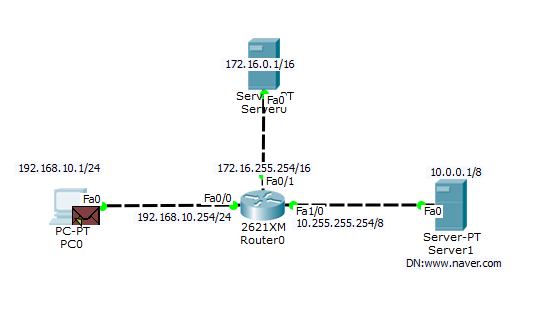

# 02

> Sever
> 




```jsx
Gateway : 다음으로 넘어갈 주소
```


```jsx
DNS Service : On
name : www.naver.com
address : 10.0.0.1 (서버 주소)
```


| Server |  | Client |
| --- | --- | --- |
| ~제공하다 | 제공 →
 ←요청  | ~요구하다 |
| 제공할 수 있는 주체 |  | 요구하는 주체 |

> DNS Server(컴퓨터) , Service(프로그램) , System(환경)
> 

```jsx
문자 주소/숫자 주소를 저장하는 서버
DN : www.naver.com - IP 223.130.200.236
문자<->숫자 = 정매칭
숫자<->문자 = 역매칭
```

> HTTP
> 

```jsx
Hyper text, Transfer, protocol
하이퍼텍스트 형 문서파일을 전달하기 위해 사용되는 네트워크 프로토콜 
HTML : Hyper Text, Markup, Language
```