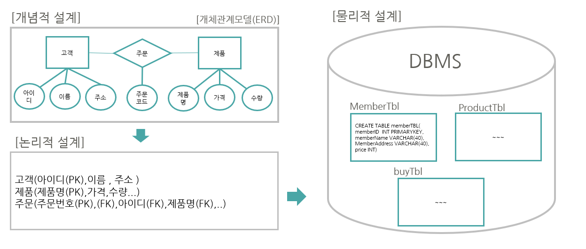

# 02

> 데이터 베이스 구축 절차
> 

```jsx
1. 요구사항 분석(무엇을?)
2. 설계(어떻게?)
	- 개념 = E-R모델
	- 논리 = 데이터 모델링
	- 물리 = 데이터 구조화
3. DB 구축(구현)
4. DB 튜닝(인덱스, 뷰, 저자프로시져, 트리거..)
5. 응용프로그램과의 연
```



---


---

> 1:1관계
> 


---

> 1:N 관계
> 


---

> N:M 관계
> 


---

> 예제
> 


---

> 문제 01
> 


---

> 문제 02
> 


---

> 문제 03
> 


---

> 1:N 예제
> 

