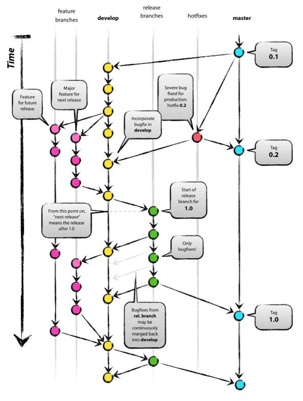

# 01

> **Git Branch 종류**
> 



---

> **Master Branch**
> 


---

> **Develop Branch**
> 


---

> **Feature Branch**
> 


---

> 문제
> 

```jsx
1.SOURCE_TREE_3 GITHUB 생성
2.sourcetree 에서 Clone 하기
3.main V0.0 main.txt 생성 후 V0.0 main Commit
4.깃플로우 기능 이용해서 dev 생성
5.dev V0.1 dev.txt 생성 후 V0.1 dev Commit
6.feature/board branch 생성
7.feature/auth branch 생성
8.feature/auction branch 생성
9.각 feature branch 에서 여러작업들 하고 각각 V0.1 feature/개별브랜치 명으로 commit
10. dev branch 에 rebase merge로 정리할 것
11. main branch 에 새커밋 추가 병합 할것
```


---

> **유스케이스**
> 


