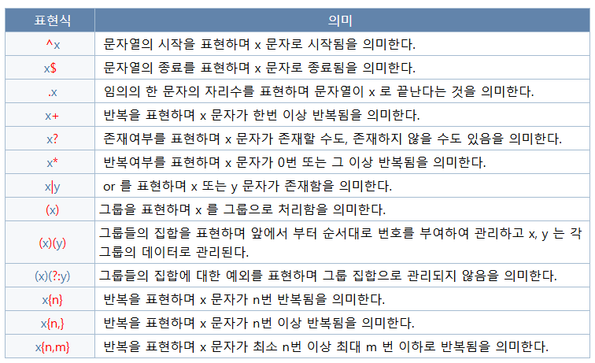

# 01

> **정규표현식**
> 




---

> **정규표현식 패스워드**
> 


---

> **18Form.html**
> 

```jsx
<!DOCTYPE html>
<html lang="en">

<head>
    <style>
        /* common 설정 */
        * {
            font-size: .9r;
        }

        a {
            text-decoration: none;
            color: black;
            border: 1px solid gray;
            display: block;
            height: 100%;
            width: 100%;
            line-height: 35px;
            text-align: center;
            font-size: .8rem;
            max-width: 80px;
        }

        body {
            margin: 0;
            padding: 0;
        }

        form {
            width: 380px;
            border: 1px solid gray;
            margin: 50px auto;
            padding: 0px;
        }

        form>.row {
            margin-bottom: 10px;
            display: flex;
            justify-content: left;
            align-items: center;
            gap: 5px;
            height: 35px;
            margin-left: 10px;
            margin-right: 10px;
        }

        form>.row>label {
            min-width: 85px;
            /* border: 1px solid; */
            height: 100%;
            line-height: 35px;
        }

        form>.row>input[type="text"],
        form>.row>input[type="password"],
        form>.row>select {
            height: 100%;
            width: 100%;
            outline: none;
            border-radius: 0;
            border: 1px solid gray;
        }

        form>.row.header {
            height: 15px;
            border: 1px solid;
            margin: 0;
            background-color: black;
        }

        form>.row.title {
            text-align: center;
            justify-content: center;
        }

        form>.row-line {
            border: 0px solid gray;
            height: 1px;
            background-color: gray;
            margin: 10px 0;
            margin-bottom: 25px;
        }

        form>.row.agreement {
            height: 15px;
        }

        form>.row.agreement>label {
            height: 100%;
            line-height: 12px;
        }

        form>.row.btn-group {
            display: flex;
            justify-content: center;
            align-items: center;
        }

        form>.row.btn-group>button,
        form>.row.btn-group>input[type="submit"] {
            width: 100%;
            height: 100%;
            border-radius: 0;
            border: 1px solid gray;
            outline: none;
            cursor: pointer;
        }
    </style>
</head>

<body>
    <!-- 
    form : 사용자로부터 특정정보를 받아 서버로 전달하는데 사용되는 태그
    action Attribute : 전달받는 서버 URI
    method Attribute : 서버로 요청하는 방식
        - GET        : 사용자 요청 정보를 Query String으로 전달(Default)
        - GET        : 사용자 요청 정보를 Request body(payload)으로 전달(Default)
        - PUT        :
        - PATCH      :
        - DELETE     :
    -->
    <form action="/test.jsp" method="get">
        <div class="row header">
            <!-- 헤더(검정색) -->
        </div>

        <div class="row title">
            <!-- title -->
            <h4> 회원가입</h4>
        </div>
        <hr>
        <div class="row">
            <label for="">아이디</label>
            <input type="text" name="userid">
            <!-- javascript:void(0)를 해야 새로고침 꺼지게하는 기능 -->
            <a href="javascript:void(0)">중복확인</a>
        </div>
        <div class="row">
            <label for="">비밀번호</label>
            <!-- type ="password" = "*" 표시됨  -->
            <input type="text" 
            pattern="^(?=.*[a-zA-Z])(?=.*[0-9]).{8,25}$" 
            name="password" 
            oninvalid="this.setCustomValidity('8자이상 25자 이하 영문소문자 혹은 대문자,숫자를 1개이상 포함하셔야됩니다.')"
            required>
            <!--
             ^(?=.*[a-zA-Z])(?=.*[0-9]).{8,25}$
             ^ : 시작
             $ : 끝
             () : 하나의식(묶는단위)
             {8,25} : 길이(8자이상 25자 이하)
             ?= : 전방탐색
             . : 모든문자(길이 1)
             * : 모든문자(길이 제한 없음)
             [a-zA-Z] : 알파벳 a-z or A-Z 까지 탐색
             [0-9] : 숫자0-9 까지 탐색
             -->
        </div>
        <div class="row">
            <label for=""></label>
            <!-- placeholder="비밀번호 재확인" = 박스안에 적힘 -->
            <input type="password" name="re-password" placeholder="비밀번호 재확인" readonly>
        </div>
        <div class="row">
            <label for="">이름</label>
            <input type="text" name="username">
        </div>
        <div class="row">
            <label for="">주소</label>
            <input type="text" name="zipcode">
            <!-- javascript:void(0)를 해야 새로고침 꺼지게하는 기능 -->
            <a href="javascript:void(0)">우편번호</a>
        </div>
        <div class="row">
            <label for=""></label>
            <input type="text" name="addr1">
        </div>
        <div class="row">
            <label for=""></label>
            <input type="text" name="addr2">
        </div>
        <div class="row">
            <label for="">휴대전화</label>
            <select name="phone1">
                <option value="">010</option>
                <option value="">011</option>
            </select>
            <input type="text" pattern="[0-9]{3.4}">
            <input type="text" pattern="[0-9]{4,4}">
        </div>
        <div class="row">
            <label for="">전화번호</label>
            <select name="phone2">
                <option value="">082</option>
                <option value="">053</option>
            </select>
            <input type="text">
            <input type="text">
        </div>
        <div class="row">
            <label for="">이메일</label>
            <input type="text" name="email">
            <select>
                <option value="">@naver.com</option>
                <option value="">@daum.net</option>
            </select>
        </div>
        <div class="row">
            <label for="">생년월일</label>
            <input type="radio" name="cal" value="1"> 양
            <input type="radio" name="cal" value="0"> 음
            <br>
            <select>
                <option value="">2001</option>
                <option value="">2002</option>
            </select>
            <select>
                <option value="">01</option>
                <option value="">12</option>
            </select>
            <select>
                <option value="">01</option>
                <option value="">30</option>
            </select>
        </div>
        <hr>
        <div class="row agreement">
            <input type="checkbox" name="email-recv">
            <label for="">**회사의 이메일을 수신합니다</label>
        </div>
        <div class="row agreement">
            <input type="checkbox" name="sns-recv">
            <label for="">**회사의 SMS을 수신합니다</label>
        </div>
        <div class="row btn-group">
            <input type="submit" value="가입 취소">
            <button>회원 가입</button>
        </div>
    </form>
</body>

</html>
```

---

> **19Data.html**
> 

```jsx
<!DOCTYPE html>
<html lang="en">
<head>
    <meta charset="UTF-8">
    <meta name="viewport" content="width=device-width, initial-scale=1.0">
    <title>Document</title>
</head>
<body>
    <div data-username="user1234" data-a="AAA">계정명</div>
    <div data-address="대구">주소</div>
    <div data-phone="01012345678">연락처</div>

    <!-- 스크립트는 항상 바디 마지막부분 -->
    <script>
        const El1= document.querySelectorAll('div');
        Els.forEach(el=>{console.log(el.dataset)})
    </script>
</body>
</html>
```

---

> **01BlockVsInline.html**
> 

```jsx
<!DOCTYPE html>
<html lang="en">
<head>
    <meta charset="UTF-8">
    <meta name="viewport" content="width=device-width, initial-scale=1.0">
    <title>Document</title>

    <style>
        div,span{
            border: 1px solid;
        }
        div{
            width: 300px;
            height: 200px;
            margin: 20px;
        }
        span{
            width: 300px;
            height: 200px;
            margin: 20px;
            padding: 20px;
        }
    </style>

</head>
<body>
    <!-- 
    블럭형태그(ex.div) : 하나의 라인전체를 사용하는 태그
    width,height,border,margin,padding : 적용가능
    인라인형태그(ex.span) : 한 라인안에 포함되어 있는 태그
    width : x
    height : x
    border : o
    margin : left,right
    padding : o
    -->
    <div>HELLOWWORLD</div>
    <div>HELLOWWORLD</div>
    <hr>
    <span>HELLOWWORLD</span>
    <span>HELLOWWORLD</span>
</body>
</html>
```


---

> **02StylePriority.html**
> 

```jsx
<!DOCTYPE html>
<html lang="en">
<head>
    <meta charset="UTF-8">
    <meta name="viewport" content="width=device-width, initial-scale=1.0">
    <title>Document</title>

    <style>
        h1{
            background-color: orange !important;
            color:white;

        }
    </style>
    <link rel="stylesheet" href="./common.css">
</head>
<body>
    <!-- 
    문서내 style 태그
    외부 css 생성 이후 link 설정(권장)
    inline style(권장 x)
    !important(권장 x)
    -->
    <h1 style="background-color: red; color: black;">HELLO WORLD</h1>
</body>
</html>
```


---

> **03Width&Height.html**
> 

```jsx
<!DOCTYPE html>
<html lang="en">

<head>
    <meta charset="UTF-8">
    <meta name="viewport" content="width=device-width, initial-scale=1.0">
    <title>Document</title>

    <style>
        .parent {
            background-color: royalblue;
            width: 100%;
            max-width: 1280px;
            min-width: 380px;
            height : 300px;
            border : 5px solid;
        }

        .son {
            background-color: orange;
            width: 150px;
            /* height: 150px; */
            height: 100%;
        }
    </style>
</head>

<body>
    <!-- 
        width : auto(기본값 : 최대너비를 가지려는 성질)
        max-width  : 최대너비
        min-width  : 최소너비
        max-height : 최대너비
        min-height : 최소너비
        height : auto(기본값 : 최소높이를 가지려는 성질)
    -->
    <div class="parent">
        <div class="son"></div>
    </div>
</body>

</html>
```


---

> **04Color.html**
> 

```jsx
<!DOCTYPE html>
<html lang="en">
<head>
    <meta charset="UTF-8">
    <meta name="viewport" content="width=device-width, initial-scale=1.0">
    <title>Document</title>
    <style>
        h1{color: blueviolet;}
        h2{color:rgb(165, 52, 52)}
        h3{color: rgba(0,0,0,0.5)}
        h4{color: #FF0000}

    </style>
</head>
<body>
    <h1>HELLOWORLD</h1>
    <h2>HELLOWORLD</h2>
    <h3>HELLOWORLD</h3>
    <h4>HELLOWORLD</h4>
</body>
</html>
```


---

> **05단위.html**
> 

```jsx
<!DOCTYPE html>
<html lang="en">

<head>
    <meta charset="UTF-8">
    <meta name="viewport" content="width=device-width, initial-scale=1.0">
    <title>Document</title>
    <style>
        div {
            height: 100px;
            margin-bottom: 10px;
            background-color: orange;
        }

        body {
            margin: 0;
        }
    </style>
</head>

<body>
    <!-- px : 고정크기 지정 -->
    <div style="width: 700px;"></div>
    <div style="width: 700px;">
        <p style="width: 900px; height: 50px; background-color: royalblue;"></p>
    </div>
    <!-- % : 가변크기, 상위태그(부모태그)를 기준으로 %만큼의 크기 지정 -->
    <div style="width: 50%;">
        <p style="width: 75%; height: 50px; background-color: royalblue;"></p>
    </div>
    <!-- vw,vh : 가변크기, 뷰포트를 기준으로 백분율만큼 크기 지정 -->
    <div style="width: 50%;">
        <p style="width: 75vw; height: 50px; background-color: royalblue;"></p>
    </div>
    <div style="height: 200vh;">TEST</div>

    <!-- em,rem(글자크기 지정시 확인) -->
</body>

</html>
```


---

> **06Background.html**
> 

```jsx
<!DOCTYPE html>
<html lang="en">
<head>
    <meta charset="UTF-8">
    <meta name="viewport" content="width=device-width, initial-scale=1.0">
    <title>Document</title>

    <style>
        *{box-sizing: border-box;}
        body{
            margin: 0; padding: 0;
        }
        .wrapper{
            height: 3000px;border: 5px solid red;
        }
        .bg{
            position: absolute;
            left: 0;
            top: 500px;

            /* width: auto; */
            width: 100vw;
            height: 400px;
            border: 1px solid;
            /* 배경이미지 지정 */
            background-image: url('https://cdn.pixabay.com/photo/2020/03/18/06/06/street-4942809_1280.jpg');
            /* 이미지 사이즈 */
            /* auto: 이미지 크기대로 지정 ,cover:전체 채우기, contain:이미지 비율을 유지하면서 채우기 */
            background-size: contain;
            /* 반복처리 */
            background-repeat: no-repeat;
            /* 배치 */
            /* 스크롤이동시에 이미지를 고정 */
            background-attachment: fixed;
        }
    </style>
</head>
<body>
    <div class="wrapper">
        <div class="bg"></div>
    </div>
</body>
</html>
```


---

> **07Text.html**
> 

```jsx
<!DOCTYPE html>
<html lang="en">

<head>
    <meta charset="UTF-8">
    <meta name="viewport" content="width=device-width, initial-scale=1.0">
    <title>Document</title>
</head>

<body>
    <!-- 글자간격 -->
    <div style="letter-spacing: 10px;">TEXT</div>
    <div style="word-spacing: 50px;">TEXT TEXT</div>

    <!-- 글자위치 -->
    <div style="margin-bottom:20px; width: 300px; height: 200px; border: 1px solid; text-align: center; line-height: 200px;">TEXT</div>

    <!-- text-decoration -->
    <div style="text-decoration:overline">TEXT</div>
    <div style="text-decoration:underline">TEXT</div>
    <div style="text-decoration:line-through">TEXT</div>
    <div>
       <a href="" style="text-decoration:none">TEXT</a>
    </div>
    
    <!-- 글자굵기  -->
     <div style="font-weight:100">HELLOWORLD</div>
     <div style="font-weight:200">HELLOWORLD</div>
     <div style="font-weight:300">HELLOWORLD</div>
     <div style="font-weight:400">HELLOWORLD</div>
     <div style="font-weight:500">HELLOWORLD</div>
     <div style="font-weight:600">HELLOWORLD</div>
     <div style="font-weight:700">HELLOWORLD</div>
     <div style="font-weight:800">HELLOWORLD</div>
     <div style="font-weight:900">HELLOWORLD</div>
</body>

</html>
```


---

> **08FontSize.html**
> 

```
<!DOCTYPE html>
<html lang="en">

<head>
    <meta charset="UTF-8">
    <meta name="viewport" content="width=device-width, initial-scale=1.0">
    <title>Document</title>
</head>
<style>
    :root{
        font-size: 14px;
    }
</style>

<body>
    <!-- px : 고정크기(기본크기 : 16px) -->
     <hr/>
     <div style="font-size: 64px;">
        <div style="font-size: 32px;">HELLOWORLD</div>
        <div>HELLOWORLD</div>
        <div style="font-size: 8px;">HELLOWORLD</div>
        <div style="font-size: 16px;">HELLOWORLD</div>
     </div>
     <hr/>
    <!-- em : 상대크기(부모태그의 font-size를 기준) -->
    <hr/>
    <div style="font-size: 24px;">
       <div>HELLOWORLD</div>
       <div style="font-size: 2em;">HELLOWORLD</div>
       <div style="font-size: 2rem;">HELLOWORLD</div>
       <div>HELLOWORLD</div>
    </div>
    <hr/>
    <!-- rem : 상대크기(기본글자크기(:root : 16px를 기준)) -->
    <hr/>
    <div style="font-size: 2rem;">
       <div style="font-size: 0.5rem;">HELLOWORLD</div>
       <div>HELLOWORLD</div>
       <div style="font-size: 1rem;">HELLOWORLD</div>
       <div>HELLOWORLD</div>
    </div>
    <hr/>
    <!-- % : 상대크기(상위태그크기를 기준) --> <hr/>
     <div style="font-size: 34px;">
        <div>HELLOWORLD</div>
        <div style="font-size: 200%;">HELLOWORLD</div>
        <div>HELLOWORLD</div>
        <div style="font-size: 50%;">HELLOWORLD</div>
     </div>
     <hr/>

     <!-- vw : 상대크기(뷰포트를 기준으로) -->
      <div style="width:100vw; height: 200px; border: 1px solid; margin: 0 auto;">
        <div style="text-align: center; line-height: 200px; font-size: clamp(3rem,5vw,6rem);">
            HELLOWORLD
        </div>
      </div>
</body>

</html>
```


---

> **09REMWidth.html**
> 

```
<!DOCTYPE html>
<html lang="en">
<head>
    <meta charset="UTF-8">
    <meta name="viewport" content="width=device-width, initial-scale=1.0">
    <title>Document</title>
    <style>
        :root{
            font-size: 48px;
        }
        div{
            text-align: center;
            margin: 20px; padding: 20px;
            border: 1px solid;
        }
        .block1{
            /* px */
            width: 250px;
            height: 250px;
            font-size: 16px;
        }
        .block2{
            /* rem */
            width: 15.625rem;
            height: 15.625rem;
            font-size: 1rem;
        }
        .block3{
            /* vw,vh */
            width: clamp(15.625rem,50vw,50rem);
            height: 25vh;
            min-height: 3rem;
            font-size: clamp(1.5rem,5vw,5rem);
        }

    </style>
</head>
<body>
    <div class="block1">HELLOWORLD</div>
    <hr/>
    <div class="block2">HELLOWORLD</div>
    <hr/>
    <div class="block3">HELLOWORLD</div>
</body>
</html>
```


---

> **10FontFamily.html**
> 

```jsx
<!DOCTYPE html>
<html lang="en">

<head>
    <meta charset="UTF-8">
    <meta name="viewport" content="width=device-width, initial-scale=1.0">
    <title>Document</title>

    <!-- 구글 폰트 -->
    <link rel="preconnect" href="https://fonts.googleapis.com">
    <link rel="preconnect" href="https://fonts.gstatic.com" crossorigin>
    <link href="https://fonts.googleapis.com/css2?family=Roboto+Condensed:ital,wght@0,100..900;1,100..900&display=swap"
        rel="stylesheet">

    <style>
        .block1{
            font-family: "Roboto Condensed", serif;
            font-optical-sizing: auto;
            font-weight: 100;
            font-style: normal;
        }
        /* 글꼴 등록 */
        @font-face{
            font-family: "custom-font-01";
            src: url(./fonts/42dot_Sans/static/42dotSans-Regular.ttf);
            font-style: normal;
        }
        @font-face{
            font-family: "custom-font-02";
            src: url("./fonts/NanumGaRamYeonGgoc.ttf");
            font-style: normal;
        }        
        @font-face{
            font-family: "custom-font-03";
            src: url("./fonts/Tenada.ttf");
            font-style: normal;
        }    
        body{
            font-family: 'custom-font-01 custom-font-02 custom-font-03';
        }
    </style>
</head>

<body>
    <div style="font-family: 'Times New Roman', Times, serif;">HELLOWORLD</div>
    <div class="block1">HELLOWORLD</div>
    <div style="font-family: custom-font-01; font-weight: 200;">HELLOWORLD</div>
    <div style="font-family: custom-font-02; font-weight: 800;">HELLOWORLD</div>
    <div style="font-family: custom-font-03; font-weight: 400;">HELLOWORLD</div>

    <hr/>
    <div>HELLOWORLD</div>
    <div>HELLOWORLD</div>
    <div>HELLOWORLD</div>
    <div>HELLOWORLD</div>
    <div>HELLOWORLD</div>
</body>

</html>
```


---

> **01Box-margin.html**
> 

```jsx
<!DOCTYPE html>
<html lang="en">

<head>
    <meta charset="UTF-8">
    <meta name="viewport" content="width=device-width, initial-scale=1.0">
    <title>Document</title>

    <style>
        body {
            margin: 0;
        }

        div {
            width: 300px;
            height: 300px;
            background-color: orange;
        }

        .d1 {
            /* top,right,bottom,left:10px */
            /* margin: 10px; */

            /* top,bottom:20px left,right:40px */
            /* margin: 20px 40px; */

            /* top:10px; right:20px; bottom:30px; left:20px */
            /* margin: 10px 20px 30px; */

            /* top:10px; right:20px; bottom:30px; left:40px */
            /* margin: 10px 20px 30px 40px; */

            margin-top: 10px;
            margin-left: 20px;
            margin-bottom: 30px;
            margin-right: 40px;
        }

        .d2 {
            margin: 0 auto;
        }

        .parent{
            width : 80vw;
            height : 250px;
            margin : 20px;
        }

        .son{
            background-color: royalblue;
            width: 150px;
            height: 150px;
        }
        /* position + margin */
        .parent1{
            position: relative;
        }
        .son1{
            position: absolute;
            left: 0;right: 0;
            top:0;bottom: 0;
            margin:auto
        }
        /* display flex */
        .parent2{
            display: flex;
            justify-content: center;
            align-items: center;
        }
        .son2{
      
        }

    </style>
</head>

<body>
    <div class="d1">HELLOWORLD</div>
    <div class="d2">HELLOWORLD</div>
    <div class="parent parent1">
        <div class="son son1"></div>
    </div>
    <div class="parent parent2">
        <div class="son son2"></div>
    </div>
</body>

</html>
```


---

> **02Box-padding.html**
> 

```jsx
<!DOCTYPE html>
<html lang="en">
<head>
    <meta charset="UTF-8">
    <meta name="viewport" content="width=device-width, initial-scale=1.0">
    <title>Document</title>
    <style>
        div{
            width: 200px;height: 200px;background-color: orange;border: 1px solid black;
            /* padding: 10px; */

            /* padding: 10px 20px; */

            /* padding: 10px 20px 30px; */
            
            padding: 10px 20px 30px 40px;
        }
    </style>
</head>
<body>
    <div>HELLOWORLD</div>
</body>
</html>
```


---

> 03MarginPadding예시.html
> 

```jsx
<!DOCTYPE html>
<html lang="en">

<head>
    <meta charset="UTF-8">
    <meta name="viewport" content="width=device-width, initial-scale=1.0">
    <title>Document</title>
    <style>
        body {
            margin: 0;
            height: 100vh;
            display: flex;
            justify-content: center;
            align-items: center;
        }

        form {
            width: 380px;
            border: 1px solid;
            padding: 10px;

            /* position: absolute;
            left: 0;right: 0;top: 0;bottom: 0;
            margin: auto;
            height: 500px; */
        }
        form>div{
            margin: 10px;
            border: 1px solid blue;
            padding: 5px;
        }
        form>div>label{
            display: inline-block;
            min-width: 120px;
            border: 1px solid red;
        }
    </style>
</head>

<body>

    <form action="/test.jsp" method="get">
        <div>
            <label for="">아이디</label>
            <input type="text" name="userid">
            <!-- javascript:void(0)를 해야 새로고침 꺼지게하는 기능 -->
            <a href="javascript:void(0)">중복확인</a>
        </div>
        <div>
            <label for="">비밀번호</label>
            <!-- type ="password" = "*" 표시됨  -->
            <input type="password" name="password">
        </div>
        <div>
            <label for=""></label>
            <!-- placeholder="비밀번호 재확인" = 박스안에 적힘 -->
            <input type="password" name="re-password" placeholder="비밀번호 재확인">
        </div>
        <div>
            <label for="">이름</label>
            <input type="text" name="username">
        </div>
        <div>
            <label for="">주소</label>
            <input type="text" name="zipcode">
            <!-- javascript:void(0)를 해야 새로고침 꺼지게하는 기능 -->
            <a href="javascript:void(0)">우편번호</a>
        </div>
        <div>
            <label for=""></label>
            <input type="text" name="addr1">
        </div>
        <div>
            <label for=""></label>
            <input type="text" name="addr2">
        </div>
        <div>
            <label for="">휴대전화</label>
            <select name="phone1">
                <option value="">010</option>
                <option value="">011</option>
            </select>
            <input type="text">
            <input type="text">
        </div>
        <div>
            <label for="">전화번호</label>
            <select name="phone2">
                <option value="">082</option>
                <option value="">053</option>
            </select>
            <input type="text">
            <input type="text">
        </div>
        <div>
            <label for="">이메일</label>
            <input type="text" name="email">
            <select>
                <option value="">@naver.com</option>
                <option value="">@daum.net</option>
            </select>
        </div>
        <div>
            <label for="">생년월일</label>
            <input type="radio" name="cal" value="1"> 양
            <input type="radio" name="cal" value="0"> 음
            <br>
            <select>
                <option value="">2001</option>
                <option value="">2002</option>
            </select>
            <select>
                <option value="">01</option>
                <option value="">12</option>
            </select>
            <select>
                <option value="">01</option>
                <option value="">30</option>
            </select>
        </div>
        <hr>
        <div>
            <input type="checkbox" name="email-recv">
            <label for="">**회사의 이메일을 수신합니다</label>
        </div>
        <div>
            <input type="checkbox" name="sns-recv">
            <label for="">**회사의 SMS을 수신합니다</label>
        </div>
        <div>
            <input type="submit" value="가입 취소">
            <button>회원 가입</button>
        </div>
    </form>
</body>

</html>
```

