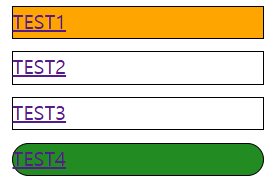

# 01

> **09NthChild.html**
> 



```jsx
<!DOCTYPE html>
<html lang="en">
  <head>
    <meta charset="UTF-8" />
    <meta name="viewport" content="width=device-width, initial-scale=1.0" />
    <title>Document</title>
    <style>
      /* 
            :first-child : 첫번째 자식요소
            :last-child : 마지막 자식요소
            :nth-child(n) : n번째 자식요소
        
        */

      ul {
        list-style: none;
        margin: 0;
        padding: 0;
      }
      ul > li {
        width: 200px;
        height: 25px;
        border: 1px solid;
        margin: 10px;
      }
      ul > li:first-child {
        background-color: orange;
      }
      ul > li:last-child {
        background-color: forestgreen;
      }
      ul > li:nth-child(4) {
        border-radius: 15px;
      }
    </style>
  </head>
  <body>
    <div>
      <ul>
        <li><a href="">TEST1</a></li>
        <li><a href="">TEST2</a></li>
        <li><a href="">TEST3</a></li>
        <li><a href="">TEST4</a></li>
      </ul>
    </div>
  </body>
</html>

```

---

> **01Relative.html**
> 


```jsx
<!DOCTYPE html>
<html lang="en">
  <head>
    <meta charset="UTF-8" />
    <meta name="viewport" content="width=device-width, initial-scale=1.0" />
    <title>Document</title>
    <style>
      div {
        width: 50px;
        height: 50px;
        border: 1px solid;
        background-color: orange;
      }
      div:nth-child(1) {
        position: relative;
        left: 10px;
        top: 10px;
        /* right: 0;
        bottom: 0; */
      }
      div:nth-child(2) {
        position: relative;
        left: -10px;
        top: -10px;
      }
      div:nth-child(3) {
        position: relative;
        left: calc(50vw - 25px);
        top: 25vh;
      }
      div:nth-child(4) {
        position: relative;
        left: 0;
        right: 0;
        top: 0;
        bottom: 0;
        margin: auto;
      }
      body {
        margin: 0;
      }
    </style>
  </head>
  <body>
    <div>1</div>
    <div>2</div>
    <div>3</div>
    <div>4</div>
  </body>
</html>

```

---

> **02Absolute.html**
> 


```jsx
<!DOCTYPE html>
<html lang="en">
  <head>
    <meta charset="UTF-8" />
    <meta name="viewport" content="width=device-width, initial-scale=1.0" />
    <title>Document</title>
    <style>
      div {
        border: 1px solid;
      }
      .ancestor {
        width: 750px;
        height: 750px;
        background-color: aqua;
        border: 1px solid;
        margin-top: 50px;
        position: relative;
      }
      .parent {
        width: 500px;
        height: 500px;
        background-color: royalblue;
        margin: 100px;
        /* position: relative; */
      }
      .son {
        width: 50px;
        height: 50px;
        background-color: orange;
      }
      .son:nth-child(1) {
        position: absolute; /*absolute는 상위태그를 기준으로 position이 잡혀있는 곳으로 올라간다. 아무것도 안 잡혀있으면 viewport로 이동한다.*/
        left: 0px;
        top: 0px;
        background-color: violet;
      }
    </style>
  </head>
  <body>
    <div class="ancestor">
      <div class="parent">
        <div class="son">1</div>
        <div class="son">2</div>
        <div class="son">3</div>
        <div class="son">4</div>
      </div>
    </div>
  </body>
</html>

```

---

> **03_01GNB(메뉴만들기).html**
> 


```jsx
<!DOCTYPE html>
<html lang="en">
  <head>
    <meta charset="UTF-8" />
    <meta name="viewport" content="width=device-width, initial-scale=1.0" />
    <title>Document</title>
    <style>
      * {
        box-sizing: border-box;
      }
      a {
        text-decoration: none;
        color: black;
      }
      ul {
        list-style: none;
        margin: 0;
        padding: 0;
      }
      body {
        margin: 0;
      }

      .layout-margin-360 {
        min-width: 1280px;
        margin: 0 360px;
      }
      .layout-padding-360 {
        min-width: 1280px;
        padding: 0 360px;
      }
      /* layout */
      .wrapper {
      }
      /* header */
      .wrapper > header {
      }
      .wrapper > header > .top-header {
      }
      .wrapper > header > nav {
        height: 50px;
      }

      /* main-menu */
      .wrapper > header > nav > ul.main-menu {
        border: 1px solid red;
        display: flex;
        justify-content: space-between;
        height: 100%;
      }
      .wrapper > header > nav > ul.main-menu > li {
        border: 1px solid green;
        width: 100%;
        height: 100%;
        line-height: 50px;
        text-align: center;
        position: relative;
      }
      .wrapper > header > nav > ul.main-menu > li > a {
        background-color: yellowgreen;
        display: block;
      }

      /* sub-menu */
      .wrapper > header > nav > ul.main-menu > li > ul.sub-menu {
        background-color: aqua;
        position: absolute;
        left: 0;
        top: 0;
        width: 100%;
        display: none;
      }
      .wrapper > header > nav > ul.main-menu > li > ul.sub-menu > li {
        border: 1px solid rosybrown;
      }
      .wrapper > header > nav > ul.main-menu > li > ul.sub-menu > li > a {
        background-color: red;
        display: block;
      }

      /* hover event */
      .wrapper > header > nav > ul.main-menu > li:hover > ul.sub-menu {
        display: block;
      }
      /* main */
      .wrapper > main {
      }
      .wrapper > main > section {
      }

      /* footer */
      .wrapper > footer {
      }
    </style>
  </head>
  <body>
    <div class="wrapper">
      <header>
        <div class="top-header"></div>
        <nav class="layout-margin-360">
          <ul class="main-menu">
            <li>
              <a href="javascript:void(0)">1_mainmenu</a>
              <ul class="sub-menu">
                <li><a href="javascript:void(0)">1submenu</a></li>
                <li><a href="javascript:void(0)">2submenu</a></li>
                <li><a href="javascript:void(0)">3submenu</a></li>
                <li><a href="javascript:void(0)">4submenu</a></li>
                <li><a href="javascript:void(0)">5submenu</a></li>
              </ul>
            </li>
            <li>
              <a href="javascript:void(0)">2_mainmenu</a>
              <ul class="sub-menu">
                <li><a href="javascript:void(0)">1submenu</a></li>
                <li><a href="javascript:void(0)">2submenu</a></li>
                <li><a href="javascript:void(0)">3submenu</a></li>
                <li><a href="javascript:void(0)">4submenu</a></li>
                <li><a href="javascript:void(0)">5submenu</a></li>
              </ul>
            </li>
            <li>
              <a href="javascript:void(0)">3_mainmenu</a>
              <ul class="sub-menu">
                <li><a href="javascript:void(0)">1submenu</a></li>
                <li><a href="javascript:void(0)">2submenu</a></li>
                <li><a href="javascript:void(0)">3submenu</a></li>
                <li><a href="javascript:void(0)">4submenu</a></li>
                <li><a href="javascript:void(0)">5submenu</a></li>
              </ul>
            </li>
            <li>
              <a href="javascript:void(0)">4_mainmenu</a>
              <ul class="sub-menu">
                <li><a href="javascript:void(0)">1submenu</a></li>
                <li><a href="javascript:void(0)">2submenu</a></li>
                <li><a href="javascript:void(0)">3submenu</a></li>
                <li><a href="javascript:void(0)">4submenu</a></li>
                <li><a href="javascript:void(0)">5submenu</a></li>
              </ul>
            </li>
          </ul>
        </nav>
      </header>
      <main>
        <section></section>
      </main>
      <footer></footer>
    </div>
  </body>
</html>

```

---

> **03_02GNB(메뉴만들기).html**
> 


```jsx
<!DOCTYPE html>
<html lang="en">
  <head>
    <meta charset="UTF-8" />
    <meta name="viewport" content="width=device-width, initial-scale=1.0" />
    <title>Document</title>
    <style>
      * {
        box-sizing: border-box;
      }
      a {
        text-decoration: none;
        color: black;
      }
      ul {
        list-style: none;
        margin: 0;
        padding: 0;
      }
      body {
        margin: 0;
      }

      .layout-margin-360 {
        margin: 0 360px;
      }
      .layout-padding-360 {
        padding: 0 360px;
      }
      /* layout */
      .wrapper {
      }
      /* header */
      .wrapper > header {
      }
      .wrapper > header > .top-header {
      }
      .wrapper > header > nav {
        height: 50px;
      }

      /* main-menu */
      .wrapper > header > nav > ul.main-menu {
        border: 1px solid red;
        display: flex;
        justify-content: space-between;
        height: 100%;
      }
      .wrapper > header > nav > ul.main-menu > li {
        border: 1px solid green;
        width: 100%;
        height: 100%;
        line-height: 50px;
        text-align: center;
        position: relative;
      }
      .wrapper > header > nav > ul.main-menu > li > a {
        background-color: yellowgreen;
        display: block;
      }

      /* sub-menu */
      .wrapper > header > nav > ul.main-menu > li > ul.sub-menu {
        background-color: aqua;
        position: absolute;
        left: 0;
        top: 0;
        width: 100%;
        display: none;
      }
      .wrapper > header > nav > ul.main-menu > li > ul.sub-menu > li {
        border: 1px solid rosybrown;
      }
      .wrapper > header > nav > ul.main-menu > li > ul.sub-menu > li > a {
        background-color: rgba(0, 249, 29, 0.789);
        display: block;
      }

      /* hover event */
      .wrapper > header > nav > ul.main-menu:hover > li > ul.sub-menu {
        display: block;
      }
      /* main */
      .wrapper > main {
      }
      .wrapper > main > section {
      }

      /* footer */
      .wrapper > footer {
      }
    </style>
  </head>
  <body>
    <div class="wrapper">
      <header>
        <div class="top-header"></div>
        <nav class="layout-margin-360">
          <ul class="main-menu">
            <li>
              <a href="javascript:void(0)">1_mainmenu</a>
              <ul class="sub-menu">
                <li><a href="javascript:void(0)">1submenu</a></li>
                <li><a href="javascript:void(0)">2submenu</a></li>
                <li><a href="javascript:void(0)">3submenu</a></li>
                <li><a href="javascript:void(0)">4submenu</a></li>
                <li><a href="javascript:void(0)">5submenu</a></li>
              </ul>
            </li>
            <li>
              <a href="javascript:void(0)">2_mainmenu</a>
              <ul class="sub-menu">
                <li><a href="javascript:void(0)">1submenu</a></li>
                <li><a href="javascript:void(0)">2submenu</a></li>
                <li><a href="javascript:void(0)">3submenu</a></li>
                <li><a href="javascript:void(0)">4submenu</a></li>
                <li><a href="javascript:void(0)">5submenu</a></li>
              </ul>
            </li>
            <li>
              <a href="javascript:void(0)">3_mainmenu</a>
              <ul class="sub-menu">
                <li><a href="javascript:void(0)">1submenu</a></li>
                <li><a href="javascript:void(0)">2submenu</a></li>
                <li><a href="javascript:void(0)">3submenu</a></li>
                <li><a href="javascript:void(0)">4submenu</a></li>
                <li><a href="javascript:void(0)">5submenu</a></li>
              </ul>
            </li>
            <li>
              <a href="javascript:void(0)">4_mainmenu</a>
              <ul class="sub-menu">
                <li><a href="javascript:void(0)">1submenu</a></li>
                <li><a href="javascript:void(0)">2submenu</a></li>
                <li><a href="javascript:void(0)">3submenu</a></li>
                <li><a href="javascript:void(0)">4submenu</a></li>
                <li><a href="javascript:void(0)">5submenu</a></li>
              </ul>
            </li>
          </ul>
        </nav>
      </header>
      <main>
        <section></section>
      </main>
      <footer></footer>
    </div>
  </body>
</html>

```

---

> **03_03GNB(메뉴만들기).html**
> 


```
<!DOCTYPE html>
<html lang="en">
  <head>
    <meta charset="UTF-8" />
    <meta name="viewport" content="width=device-width, initial-scale=1.0" />
    <title>Document</title>
    <style>
      * {
        box-sizing: border-box;
      }
      a {
        text-decoration: none;
        color: black;
      }
      ul {
        list-style: none;
        margin: 0;
        padding: 0;
      }
      body {
        margin: 0;
      }

      /* layout */
      .wrapper {
      }
      /* header */
      .wrapper > header {
      }
      .wrapper > header > .top-header {
      }
      .wrapper > header > nav {
        height: 50px;
      }

      /* main-menu */
      .wrapper > header > nav > ul.main-menu {
        border: 1px solid red;
        display: flex;
        justify-content: space-between;
        height: 100%;
      }
      .wrapper > header > nav > ul.main-menu > li {
        border: 1px solid green;
        width: 100%;
        height: 100%;
        line-height: 50px;
        text-align: center;
      }
      .wrapper > header > nav > ul.main-menu > li > a {
        background-color: yellowgreen;
        display: block;
      }

      /* sub-menu */
      .wrapper > header > nav > ul.main-menu > li > ul.sub-menu {
        background-color: aqua;
      }
      .wrapper > header > nav > ul.main-menu > li > ul.sub-menu > li {
        border: 1px solid rosybrown;
      }
      .wrapper > header > nav > ul.main-menu > li > ul.sub-menu > li > a {
        background-color: red;
        display: block;
      }

      /* main */
      .wrapper > main {
      }
      .wrapper > main > section {
      }

      /* footer */
      .wrapper > footer {
      }
    </style>
  </head>
  <body>
    <div class="wrapper">
      <header>
        <div class="top-header"></div>
        <nav>
          <ul class="main-menu">
            <li>
              <a href="javascript:void(0)">1_mainmenu</a>
              <ul class="sub-menu">
                <li><a href="javascript:void(0)">1submenu</a></li>
                <li><a href="javascript:void(0)">2submenu</a></li>
                <li><a href="javascript:void(0)">3submenu</a></li>
                <li><a href="javascript:void(0)">4submenu</a></li>
                <li><a href="javascript:void(0)">5submenu</a></li>
              </ul>
            </li>
            <li>
              <a href="javascript:void(0)">2_mainmenu</a>
              <ul class="sub-menu">
                <li><a href="javascript:void(0)">1submenu</a></li>
                <li><a href="javascript:void(0)">2submenu</a></li>
                <li><a href="javascript:void(0)">3submenu</a></li>
                <li><a href="javascript:void(0)">4submenu</a></li>
                <li><a href="javascript:void(0)">5submenu</a></li>
              </ul>
            </li>
            <li>
              <a href="javascript:void(0)">3_mainmenu</a>
              <ul class="sub-menu">
                <li><a href="javascript:void(0)">1submenu</a></li>
                <li><a href="javascript:void(0)">2submenu</a></li>
                <li><a href="javascript:void(0)">3submenu</a></li>
                <li><a href="javascript:void(0)">4submenu</a></li>
                <li><a href="javascript:void(0)">5submenu</a></li>
              </ul>
            </li>
            <li>
              <a href="javascript:void(0)">4_mainmenu</a>
              <ul class="sub-menu">
                <li><a href="javascript:void(0)">1submenu</a></li>
                <li><a href="javascript:void(0)">2submenu</a></li>
                <li><a href="javascript:void(0)">3submenu</a></li>
                <li><a href="javascript:void(0)">4submenu</a></li>
                <li><a href="javascript:void(0)">5submenu</a></li>
              </ul>
            </li>
          </ul>
        </nav>
      </header>
      <main>
        <section></section>
      </main>
      <footer></footer>
    </div>
  </body>
</html>

```

---

> **03_04GNB(메뉴만들기).html**
> 


```jsx
<!DOCTYPE html>
<html lang="en">
  <head>
    <meta charset="UTF-8" />
    <meta name="viewport" content="width=device-width, initial-scale=1.0" />
    <title>Document</title>
    <style>
      * {
        box-sizing: border-box;
      }
      /* common */
      a {
        text-decoration: none;
        color: black;
      }
      ul {
        list-style: none;
        margin: 0;
        padding: 0;
      }
      body {
        margin: 0;
      }

      /* layout */
      .wrapper {
      }
      /* header */
      .wrapper > header {
      }
      .wrapper > header > .top-header {
      }

      .wrapper > header > nav {
        height: 50px;
      }
      /* main-menu */
      .wrapper > header > nav > ul.main-menu {
        border: 1px solid red;

        /* display:flex;
            justify-content: space-between; */
        width: 200px;
        height: 100%;
      }
      .wrapper > header > nav > ul.main-menu > li {
        border: 1px solid green;
        width: 100%;
        height: 100%;
        line-height: 50px;
        text-align: center;
        position: relative;
      }
      .wrapper > header > nav > ul.main-menu > li > a {
        background-color: yellowgreen;
        display: block;
      }

      /* sub-menu */
      .wrapper > header > nav > ul.main-menu > li > ul.sub-menu {
        background-color: aqua;
        position: absolute;
        width: 100%;
        left: 200px;
        top: 0;
        display: none;
      }
      .wrapper > header > nav > ul.main-menu > li > ul.sub-menu > li {
        border: 1px solid rosybrown;
      }
      .wrapper > header > nav > ul.main-menu > li > ul.sub-menu > li > a {
        background-color: red;
        display: block;
      }

      /* hover event */
      .wrapper > header > nav > ul.main-menu > li:hover > ul.sub-menu {
        display: block;
      }

      /* main  */
      .wrapper > main {
      }
      .wrapper > main > section {
      }
      /* footer */
      .wrapper > footer {
      }
    </style>
  </head>
  <body>
    <div class="wrapper">
      <header>
        <div class="top-header"></div>
        <nav>
          <ul class="main-menu">
            <li>
              <a href="javascript:void(0)">1_mainmenu</a>
              <ul class="sub-menu">
                <li><a href="javascript:void(0)">1_submenu</a></li>
                <li><a href="javascript:void(0)">2_submenu</a></li>
                <li><a href="javascript:void(0)">3_submenu</a></li>
                <li><a href="javascript:void(0)">4_submenu</a></li>
                <li><a href="javascript:void(0)">5_submenu</a></li>
              </ul>
            </li>
            <li>
              <a href="javascript:void(0)">2_mainmenu</a>
              <ul class="sub-menu">
                <li><a href="javascript:void(0)">1_submenu</a></li>
                <li><a href="javascript:void(0)">2_submenu</a></li>
                <li><a href="javascript:void(0)">3_submenu</a></li>
                <li><a href="javascript:void(0)">4_submenu</a></li>
                <li><a href="javascript:void(0)">5_submenu</a></li>
              </ul>
            </li>
            <li>
              <a href="javascript:void(0)">3_mainmenu</a>
              <ul class="sub-menu">
                <li><a href="javascript:void(0)">1_submenu</a></li>
                <li><a href="javascript:void(0)">2_submenu</a></li>
                <li><a href="javascript:void(0)">3_submenu</a></li>
                <li><a href="javascript:void(0)">4_submenu</a></li>
                <li><a href="javascript:void(0)">5_submenu</a></li>
              </ul>
            </li>
            <li>
              <a href="javascript:void(0)">4_mainmenu</a>
              <ul class="sub-menu">
                <li><a href="javascript:void(0)">1_submenu</a></li>
                <li><a href="javascript:void(0)">2_submenu</a></li>
                <li><a href="javascript:void(0)">3_submenu</a></li>
                <li><a href="javascript:void(0)">4_submenu</a></li>
                <li><a href="javascript:void(0)">5_submenu</a></li>
              </ul>
            </li>
          </ul>
        </nav>
      </header>
      <main>
        <section></section>
      </main>
      <footer></footer>
    </div>
  </body>
</html>

```

---

> **03Template.html**
> 

```jsx
<!DOCTYPE html>
<html lang="en">
  <head>
    <meta charset="UTF-8" />
    <meta name="viewport" content="width=device-width, initial-scale=1.0" />
    <title>Document</title>
    <style>
      * {
        box-sizing: border-box;
      }
      a {
        text-decoration: none;
        color: black;
      }
      ul {
        list-style: none;
        margin: 0;
        padding: 0;
      }
      body {
        margin: 0;
      }

      /* layout */
      .wrapper {
      }
      /* header */
      .wrapper > header {
      }
      .wrapper > header > .top-header {
      }
      .wrapper > header > nav {
      }

      /* main */
      .wrapper > main {
      }
      .wrapper > main > section {
      }

      /* footer */
      .wrapper > footer {
      }
    </style>
  </head>
  <body>
    <div class="wrapper"></div>
  </body>
</html>

```