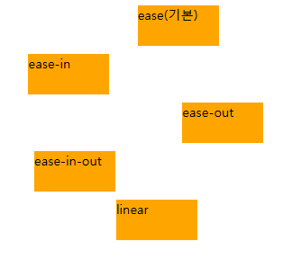

# 01

> **10Animation.html**
> 



```jsx
<!DOCTYPE html>
<html lang="en">
<head>
    <meta charset="UTF-8">
    <meta name="viewport" content="width=device-width, initial-scale=1.0">
    <title>Document</title>
    <style>
        div{
            width:100px;height:50px;background-color: orange;margin:10px;position:relative;

            /* animation */
            animation-name: moving;
            animation-duration: 5s;
            animation-iteration-count: infinite;
            animation-direction: alternate;
        }
        .d1{
            /* 천천히 - 빠름 - 천천히*/
            animation-timing-function: ease;
        }
        .d2{
            /* 천천히 - 빠름 */
            animation-timing-function: ease-in ;
        }
        .d3{
            /* 빠름 - 천천히 */
            animation-timing-function: ease-out;
        }
        .d4{
            /* 천천 - 보통 - 천천 */
            animation-timing-function: ease-in-out;
        }
        .d5{
            /* 일정속도 */
            animation-timing-function: linear;
        }
        @keyframes moving {
            from{left:0px} to{left:1000px;}
        }
    </style>
</head>
<body>
    

    <div class="d1">ease(기본)</div>
    <div class="d2">ease-in</div>
    <div class="d3">ease-out</div>
    <div class="d4">ease-in-out</div>
    <div class="d5">linear</div>
</body>
</html>
```

---

> **11Ball.html**
> 


```jsx
<!DOCTYPE html>
<html lang="en">
<head>
    <meta charset="UTF-8">
    <meta name="viewport" content="width=device-width, initial-scale=1.0">
    <title>Document</title>
    <style>
        .box{
            border : 1px solid ;
            width:150px;
            height:800px;
            display:flex;
            justify-content: center;
            align-items: center;
            position:relative;
        }
        .box>.ball{
            width:100px;
            height:100px;
            border-radius: 50%;
            background-color: orange;
            position:absolute;
            top:0;
        }

        @keyframes moving {
               0%{top:0px;    animation-timing-function: ease-in;  width:100px;height:100px;}
               50%{top:700px;  animation-timing-function: ease-out; width:100px;height:100px; } 
               51%{width:125px;height:75px}
               52%{width:100px;height:100px}
        }
        .box>.ball{
            animation: moving;
            animation-duration: 2s;
            animation-iteration-count: infinite;
        }
    </style>
</head>
<body>

    <div class="box">
        <div class="ball"></div>
    </div>
    
</body>
</html>
```

---

> **12Slider.html**
> 


```jsx
<!DOCTYPE html>
<html lang="en">

<head>
    <meta charset="UTF-8">
    <meta name="viewport" content="width=device-width, initial-scale=1.0">
    <title>Document</title>
    <style>
        *{box-sizing: border-box;}
        body{margin : 0;}
        .slider-block{
            width:1200px;
            height : 300px;
            margin : 50px auto;
            border : 1px solid;
            
            overflow : hidden;
            
            display:flex;
            align-items: center;
        }
        .slider-block>.slider-wrapper{
            height:150px;
            width : 3000px;
            border:1px solid;

            display:flex;
            align-items: center;
          
            position:relative;

            animation-name: moving;
            animation-duration: 25s;
            animation-timing-function: linear;
            animation-iteration-count: infinite;
            animation-direction: alternate;

        }
        .slider-block>.slider-wrapper>.item{
            width:200px;
            height : 150px;
            border : 1px solid;
            margin : 10px;
            background-color: white;

            transition:.5s;
            overflow:hidden;
        }
        .slider-block>.slider-wrapper>.item>img{
            width:100%;
            height:100%;
            object-fit: cover;
            opacity: .7;
            transition: .5s;
        }
        .slider-block>.slider-wrapper>.item:first-child{
            margin-left:0;
        }

        .slider-block>.slider-wrapper:hover{
            animation-play-state: paused;
        }
        .slider-block>.slider-wrapper>.item:hover{
            transform: scale(1.5);
        }
        .slider-block>.slider-wrapper>.item:hover img{
            opacity: 1;
            width : 100%;
            height : 100%;
            transform: scale(1.5);
           
        }
        @keyframes moving{
            from{left:0px;}
            to{left:-2000px;}
        }
    </style>
</head>

<body>

    <div class="slider-block">
        <div class="slider-wrapper">
            <div class="item">
                
            </div>
            <div class="item">
                
            </div>
            <div class="item">3</div>
            <div class="item">4</div>
            <div class="item">5</div>
            <div class="item">6</div>
            <div class="item">7</div>
            <div class="item">8</div>
            <div class="item">9</div>
            <div class="item">10</div>
        </div>
    </div>
</body>

</html>
```

---

> **13Slider.html**
> 


```jsx
<!DOCTYPE html>
<html lang="en">
<head>
    <meta charset="UTF-8">
    <meta name="viewport" content="width=device-width, initial-scale=1.0">
    <title>Document</title>

    <!-- 구글 아이콘 -->
    <link rel="stylesheet" href="https://fonts.googleapis.com/css2?family=Material+Symbols+Outlined:opsz,wght,FILL,GRAD@20..48,100..700,0..1,-50..200" />
    
    <style>
        .material-symbols-outlined {
          font-variation-settings:
          'FILL' 0,
          'wght' 400,
          'GRAD' 0,
          'opsz' 24
        }
        </style>

        <style>
            .slider-block{
                width: 1200px;
                height: 100px;
                border: 1px solid;
                margin: 0 auto;

                display: flex;
                align-items: center;
                overflow: hidden;
                position: relative;

                padding: 0 16px;
            }
            .slider-block>.slider-wrapper{
                width: 3000px;
                height: 80px;
                /* border: 1px solid; */

                display: flex;
                justify-content: left;
                align-items: center;
                gap: 10px;

                position: relative;
                transition: 5s;
            }
            .slider-block>.slider-wrapper>.item{
                width: 120px;
                height: 45px;
                border: 1px solid;
                border-radius: 5px;
            }

            .slider-block>input[type='radio']{
                display: none;
            }
            .slider-block>label{
                width: 25px;
                height: 25px;
                background-color: orange;
                border-radius: 50%;
                color: white;
                padding: 5px;

                position: absolute;
                z-index: 10;
                cursor: pointer;
            }
            .slider-block>label.prev{
                left: 0;
            }
            .slider-block>label.next{
                right: 0;
            }
            .slider-block>input[type="radio"]#r-next:checked~.slider-wrapper{
                left: -1000px;
            }
            .slider-block>input[type="radio"]#r-prev:checked~.slider-wrapper{
                left: 0px;
            }

        </style>
</head>
<body>
    <div class="slider-block">
        <input type="radio" id="r-prev" name="sliderbutton" checked>
        <input type="radio" id="r-next" name="sliderbutton">
        <label for="r-prev" class="prev"><span class="material-symbols-outlined">arrow_left</span></label>
        <label for="r-next" class="next"><span class="material-symbols-outlined">arrow_right</span></label>
        <div class="slider-wrapper">
            <div class="item">1</div>
            <div class="item">2</div>
            <div class="item">3</div>
            <div class="item">4</div>
            <div class="item">5</div>
            <div class="item">6</div>
            <div class="item">7</div>
            <div class="item">8</div>
            <div class="item">9</div>
            <div class="item">10</div>
            <div class="item">11</div>
            <div class="item">12</div>
            <div class="item">13</div>
            <div class="item">14</div>
            <div class="item">15</div>
        </div>
    </div>
</body>
</html>
```

---

> **14Slider.html**
> 


```jsx
<!DOCTYPE html>
<html lang="en">
<head>
    <meta charset="UTF-8">
    <meta name="viewport" content="width=device-width, initial-scale=1.0">
    <title>Document</title>

    <!-- 구글 아이콘 -->
    <link rel="stylesheet" href="https://fonts.googleapis.com/css2?family=Material+Symbols+Outlined:opsz,wght,FILL,GRAD@20..48,100..700,0..1,-50..200" />
    
    <style>
        .material-symbols-outlined {
          font-variation-settings:
          'FILL' 0,
          'wght' 400,
          'GRAD' 0,
          'opsz' 24
        }
        </style>
        
    <style>
        .slider-block{
            width: 1200px;
            height: 500px;
            margin: 50px auto;
            border: 1px solid;

            overflow: hidden;
        }
        .slider-block>.slider-wrapper{
            width: 3600px;
            height: 500px;
            border: 1px solid;

            display: flex;
            justify-content: center;
            align-items: center;

            position: relative;
            left: 0;
            transition: .5s;
        }

        .slider-block>.slider-wrapper>.item{
            width: 1200px;
            height: 500px;
            /* border: 1px solid red; */
            position: relative;
        }

        .slider-block>.slider-wrapper>.item:nth-child(1){background-color: orange;}
        .slider-block>.slider-wrapper>.item:nth-child(2){background-color: lightcoral;}
        .slider-block>.slider-wrapper>.item:nth-child(3){background-color: lightgreen;}
        .slider-block>.slider-wrapper>.item>label{
            width: 50px;
            height: 50px;
            border: 5px solid white;
            border-radius: 50%;

            display: flex;
            justify-content: center;
            align-items: center;
            
            color: white;

            position: absolute;
            top: -25px;
            bottom: 0;
            margin: auto;
        }
        .slider-block>.slider-wrapper>.item>label.material-symbols-outlined{
            font-size: 3rem;
            display: block;
            cursor: pointer;
        }
        .slider-block>.slider-wrapper>.item>label.prev{
            left: 10px;
        }
        .slider-block>.slider-wrapper>.item>label.next{
            right: 10px;
        }

        .slider-block>input[type="radio"]{display: none;}
        .slider-block>input[type="radio"]#forward-2:checked~.slider-wrapper{
            left: -1200px;
        }
        .slider-block>input[type="radio"]#forward-3:checked~.slider-wrapper{
            left: -2400px;
        }
        .slider-block>input[type="radio"]#backend-2:checked~.slider-wrapper{
            left: -1200px;
        }
        .slider-block>input[type="radio"]#backend-1:checked~.slider-wrapper{
            left: 0px;
        }
    </style>
</head>
<body>
    <div class="slider-block">
        <input type="radio" id="forward-2" name="slideradio">
        <input type="radio" id="forward-3" name="slideradio">
        <input type="radio" id="backend-1" name="slideradio" checked>
        <input type="radio" id="backend-2" name="slideradio">
        <div class="slider-wrapper">
            <!-- 1번 슬라이드 -->
            <div class="item">
                <label for="" class="prev"><span class="material-symbols-outlined">arrow_left</span></label>
                <label for="forward-2" class="next"><span class="material-symbols-outlined">arrow_right</span></label>
                <div class="show one">SLIDER-01</div>
            </div>
               <!-- 2번 슬라이드 -->
               <div class="item">
                <label for="backend-1" class="prev"><span class="material-symbols-outlined">arrow_left</span></label>
                <label for="forward-3" class="next"><span class="material-symbols-outlined">arrow_right</span></label>
                <div class="show two">SLIDER-02</div>
            </div>
               <!-- 3번 슬라이드 -->
               <div class="item">
                <label for="backend-2" class="prev"><span class="material-symbols-outlined">arrow_left</span></label>
                <label for="" class="next"><span class="material-symbols-outlined">arrow_right</span></label>
                <div class="show one">SLIDER-03</div>
            </div>
        </div>
    </div>
</body>
</html>
```

---

> **Media Query**
> 

```jsx
데스크탑 width : 1024px 이상
태블릿 768px - 1024px
모바일 400px - 768px
```

---

> **1MQ.html**
> 


```jsx
<!DOCTYPE html>
<html lang="en">

<head>
    <meta charset="UTF-8">
    <meta name="viewport" content="width=device-width, initial-scale=1.0">
    <title>Document</title>
    <style>
        div {
            height: 150px;
            background-color: orange;
        }

        /*
         미디어 쿼리 장치 옵션
         all : 모든 미디어 유형에 적용
         print : 인쇄를 위한 미디어 타입
         screen : 화면 기반의 미디어 타입(주로 컴퓨터, 태블릿...)
         speech : 음성 출력 장치를 위한 미디어 타입
         */
        /* 태블릿 width : 1024px */
        @media all and (max-width:1024px) {
            div {
                background-color: lightgreen;
            }
        }

        /* 모바일 width : 480px */
        @media all and (max-width:480px) {
            div {
                background-color: lightblue;
            }
        }
    </style>
</head>

<body>
    <div></div>
</body>

</html>
```

---

> **2MQ.html**
> 

```jsx
<!DOCTYPE html>
<html lang="en">
<head>
    <meta charset="UTF-8">
    <meta name="viewport" content="width=device-width, initial-scale=1.0">
    <title>Document</title>

    <!-- common -->
    <link rel="stylesheet" href="./css/common.css"> 
    
    <!-- desktop -->
    <link rel="stylesheet" href="./css/desktop.css">

    <!-- tablet -->
    <link rel="stylesheet" href="./css/tablet.css" media="all and (max-width:1024px)">
    
    <!-- mobile -->
    <link rel="stylesheet" href="./css/mobile.css" media="all and (max-width:380px)">
</head>
<body>
    
    <div></div>
</body>
</html>
```

---

> **3MQ.html**
> 


```jsx
<!DOCTYPE html>
<html lang="en">

<head>
    <meta charset="UTF-8">
    <meta name="viewport" content="width=device-width, initial-scale=1.0">
    <title>Document</title>
    <style>
        * {
            box-sizing: border-box;
        }

        /* common */
        a {
            text-decoration: none;
            color: black;
        }

        ul {
            list-style: none;
            margin: 0;
            padding: 0;
        }

        body {
            margin: 0;

        }

        /* layout */
        .wrapper {}

        /* header */
        .wrapper>header {
            /* min-height : 150px; */
            /* border : 1px solid; */
        }

        .wrapper>header>.top-header {
            font-size: 1.5rem;
            font-weight: 600;
            height: 80px;
            line-height: 80px;
            padding: 0 15px;
        }

        .wrapper>header>nav {
            display: flex;
            justify-content: space-between;
            align-items: center;

            /* border : 1px solid; */
            background-color: rgb(37, 36, 36);
            color: white;
            padding: 0 15px;
            flex-wrap: wrap;
            height: 100%;
            min-height: 80px;
        }

        .wrapper>header>nav>.nav-logo {
            font-size: 2rem;
            font-weight: 600;

        }

        .wrapper>header>nav>.nav-menu {
            display: flex;
            justify-content: center;
            align-items: center;
        }

        .wrapper>header>nav>.nav-menu>li {
            padding: 0 20px;
        }

        /* main  */
        .wrapper>main {
            padding: 0 20px;
        }

        .wrapper>main>section {}

        .wrapper>main>section:nth-child(1) {}

        .wrapper>main>section:nth-child(1)>h2 {}

        .wrapper>main>section:nth-child(1)>.card-container {
            display: flex;
            justify-content: left;
            align-items: center;
            gap: 30px;

            flex-wrap: wrap;
        }

        .wrapper>main>section:nth-child(1)>.card-container>.card {
            border: 1px solid;
            padding: 20px;
            border-radius: 10px;
            flex-shrink: 0;
            flex-basis: 480px;
        }

        /*  */
        .wrapper>main>section:nth-child(2) {}

        .wrapper>main>section:nth-child(2)>h2 {}

        .wrapper>main>section:nth-child(2)>.container {
            border: 1px solid;
            border-radius: 10px;

        }

        .wrapper>main>section:nth-child(2)>.container>.media-item {
            display: flex;
            justify-content: left;
            align-items: start;
            gap: 20px;
            margin: 20px;
        }

        .wrapper>main>section:nth-child(2)>.container>.media-item>.media-img {
            height: 150px;
            width: 200px;
            background-color: lightgray;
        }

        .wrapper>main>section:nth-child(2)>.container>.media-item>.media-content {}

        .wrapper>main>section:nth-child(2)>.container>.media-item>.media-content>h3 {
            margin: 0;
        }

        .wrapper>main>section:nth-child(2)>.container>.media-item>.media-content>p {}

        /* footer */
        .wrapper>footer {}

        .wrapper>footer>h2 {
            padding: 0 20px;
        }

        .wrapper>footer>.footer-section-block {
            min-height: 150px;
            display: flex;
            justify-content: left;
            align-items: center;

            background-color: black;
            color: white;
            padding: 0 20px;
        }

        .wrapper>footer>.footer-section-block>.footer-section {
            width: 100%;
        }

        .wrapper>footer>.footer-section-block>.footer-section>h3 {
            font-size: 1.5rem;
            font-weight: 600;
            margin-bottom: 10px;
        }

        .wrapper>footer>.footer-section-block>.footer-section>p {
            margin-top: 0;
        }

        /* 태블릿 */
        @media (max-width: 1080px) {
            .wrapper>header>nav {
                /* add */
                flex-direction: column;
            }

            .wrapper>header>nav>.nav-logo {}

            .wrapper>header>nav>.nav-menu {}

            .wrapper>header>nav>.nav-menu>li {
                min-height: 80px;
                line-height: 80px;
                font-size: 1.2rem;
            }

            .wrapper>main>section:nth-child(1)>.card-container>.card {
                flex-shrink: 0;
                width: 100%;

            }
        }

        /* 모바일 */
        @media (max-width: 380px) {
            .wrapper>header>nav {
                /* add */
                flex-direction: column;
            }
        }

        .wrapper>header>nav>.nav-logo {
            font-size: 1.5rem;
        }

        .wrapper>header>nav>.nav-menu {
            flex-direction: column;

        }

        .wrapper>header>nav>.nav-menu>li {
            min-height: 50px;
            line-height: 50px;
            font-size: .9rem;
        }

        .wrapper>main>section:nth-child(1)>.card-container {
            flex-direction: column;
        }

        .wrapper>main>section:nth-child(1)>.card-container>.card {
            flex-shrink: 0;
            flex-grow: 0;
            flex-basis: 100%;
        }

        .wrapper>main>section:nth-child(2)>.container>.media-item {
            flex-direction: column;
        }

        .wrapper>main>section:nth-child(2)>.container>.media-item>.media-img {}

        footer>.footer-section-block {
            flex-direction: column;
        }

        footer>.footer-section-block>.footer-section {
            width: 100%;
            text-align: center;
        }
    </style>
</head>

<body>

    <div class="wrapper">
        <header>
            <div class="top-header">
                1. 네비게이션 바 레이아웃
            </div>
            <nav>
                <div class="nav-logo">Logo</div>
                <ul class="nav-menu">
                    <li>Home</li>
                    <li>About</li>
                    <li>Services</li>
                    <li>Contact</li>
                </ul>
            </nav>
        </header>
        <main>

            <section>
                <h2>2. 카드 레이아웃</h2>
                <div class="card-container">
                    <div class="card">
                        <h3>Product 1</h3>
                        <p>상품 설명이 들어갑니다. 실무에서 자주 사용되는 카드 형태의 레이아웃입니다.</p>
                    </div>
                    <div class="card">
                        <h3>Product 2</h3>
                        <p>반응형으로 구현되어 화면 크기에 따라 자동으로 배치가 조절됩니다.</p>
                    </div>
                    <div class="card">
                        <h3>Product 3</h3>
                        <p>flex-wrap과 flex-basis를 활용하여 유동적인 레이아웃을 구현했습니다.</p>
                    </div>
                </div>
            </section>
            <section>
                <h2>3. 미디어 컨텐츠 레이아웃</h2>
                <div class="container">
                    <div class="media-item">
                        <div class="media-img"></div>
                        <div class="media-content">
                            <h3>뉴스 제목</h3>
                            <p>뉴스 내용이 들어갑니다. 이미지와 텍스트가 나란히 배치되는 레이아웃입니다.</p>
                        </div>
                    </div>
                    <div class="media-item">
                        <div class="media-img"></div>
                        <div class="media-content">
                            <h3>블로그 포스트</h3>
                            <p>블로그 내용이 들어갑니다. 모바일에서는 세로로 배치됩니다.</p>
                        </div>
                    </div>
                </div>

            </section>

        </main>
        <footer>
            <h2>4. 반응형 푸터</h2>
            <div class="footer-section-block">
                <div class="footer-section">
                    <h3>About Us</h3>
                    <p>회사 소개 내용이 들어갑니다.</p>
                </div>
                <div class="footer-section">
                    <h3>Contact</h3>
                    <p>연락처 정보가 들어갑니다.</p>
                </div>
                <div class="footer-section">
                    <h3>Follow Us</h3>
                    <p>소셜 미디어 링크가 들어갑니다.</p>
                </div>
            </div>

        </footer>
    </div>
</body>

</html>
```