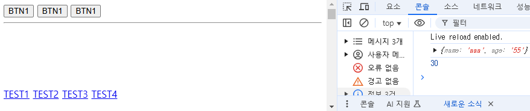

# 01

> **JavaScript**
> 

```jsx
인터프리터 : 실시간 번역기
일급 함수 : 정제된 함수

자바스크립트 : 웹브라우저 기능
데이터 저장 가능

데이터 = 선저장 후처리

${this.값} = 문자를 숫자로 변환할 때

```

---

> **01JS.html**
> 



```jsx
<!DOCTYPE html>
<html lang="en">

<head>
    <meta charset="UTF-8">
    <meta name="viewport" content="width=device-width, initial-scale=1.0">
    <title>Document</title>
    <style>
        body {
            height: 3000px;
        }

        .test {
            position: fixed;
            width: 100%;
            bottom: 20px;
        }
    </style>
</head>

<body>

    <button onclick="alert('helloworld')">BTN1</button>
    <button onclick="alert(10+20)">BTN1</button>
    <button onclick="alert('helloworld\nhelloworld\nhelloworld\nhelloworld\nhelloworld\nhelloworld')">BTN1</button>
    <hr />
    <div class="test">
        <a href="javascript:void(0)">TEST1</a>
        <a href="javascript:alert(10+20)">TEST2</a>
        <a href="javascript:console.log(10+20)">TEST3</a>
        <a href="javascript:console.log(obj)">TEST4</a>
    </div>

    <!-- 스크립트는 항상 맨마지막 /body 윗부분 -->
    <script>
        const obj = {"name":"aaa","age":"55"};
    </script>

</body>

</html>
```

---

> **02JS.html**
> 


```jsx
<!DOCTYPE html>
<html lang="en">
<head>
    <meta charset="UTF-8">
    <meta name="viewport" content="width=device-width, initial-scale=1.0">
    <title>Document</title>
</head>
<body>
    <button onclick="document.write('ABCD')">ADD</button>
    <script>
        document.write("<h1>HELLOWORLD</h1>");
        document.write("<h2>HELLOWORLD</h2>");
        document.write("<h3>HELLOWORLD</h3>");
    </script>
</body>
</html>
```

---

> **03JS.html**
> 


```jsx
<!DOCTYPE html>
<html lang="en">
<head>
    <meta charset="UTF-8">
    <meta name="viewport" content="width=device-width, initial-scale=1.0">
    <title>Document</title>
</head>
<body>
    <button onclick="document.getElementById('d1').innerHTML='ABCD'">BTN</button>
    <div id="d1">HELLO WORLD</div>

    <script>
        const d1E1 = document.getElementById('d1')
        console.log(d1E1)
        // d1E1.innerHTML='ABCD';
    </script>
</body>
</html>
```

---

> **04JS.html**
> 


```jsx
<!DOCTYPE html>
<html lang="en">
<head>
    <meta charset="UTF-8">
    <meta name="viewport" content="width=device-width, initial-scale=1.0">
    <title>Document</title>
</head>
<body>
    <script>
        console.log(typeof "HELLO WORLD");
        console.log(typeof'HELLO WORLD');
        console.log(typeof (10+20+30));
        console.log(typeof ("10+20+30"));
        console.log(typeof true);
        console.log(typeof null);
        console.log(typeof undefined);

        
        let test;
        console.log(typeof undefined);
        let test2 = null;
        console.log('test2',typeof test2);

        if(test2){
            console.log("test2 TRUE");
        }else{
            console.log("test2 FALSE");
        }
        if(test){
            console.log("test TRUE");
        }else{
            console.log("test FALSE");
        }
    </script>
    
</body>
</html>
```

---

> **05JS.html**
> 


```jsx
<!DOCTYPE html>
<html lang="en">
<head>
    <meta charset="UTF-8">
    <meta name="viewport" content="width=device-width, initial-scale=1.0">
    <title>Document</title>

    <script defer src="./js/main.js"></script>
    <!-- 스크립트를 헤더에 사용할려면 defer를 써야됨 -->

</head>
<body>
    <div class="box" style="width: 50px;height: 50px;background-color: royalblue;">

    </div>
    <!-- <script>
        const boxE1 = document.querySelector('.box');
        boxE1.addEventListener('click',()=>{
            boxE1.style.backgroundColor='black';
        }); 
    </script>-->
</body>
</html>
```

---

> **01 기본자료형.html**
> 

```jsx
<!DOCTYPE html>
<html lang="en">
<head>
    <meta charset="UTF-8">
    <meta name="viewport" content="width=device-width, initial-scale=1.0">
    <title>Document</title>
</head>
<body>
    <script>
        // Number
        document.write(typeof 10 + "<br/>");
        document.write(typeof 10.5 + "<br/>");
        document.write('<hr/>');

        // String
        document.write(typeof "HELLO WORLD" + "<br/>"); // 큰따옴표
        document.write(typeof 'HELLO WORLD' + "<br/>"); // 작은따옴표
        document.write(typeof `HELLO WORLD` + "<br/>"); // 벡틱
        document.write('<hr/>');

        // Object : { key : value, key : value}
        document.write(typeof { name:"홍길동",age:55} + "<br/>");
        document.write(typeof JSON.stringify ({ name:'홍길동',age:55}) + "<br/>");
        document.write('<hr/>');
        /* JSON.stringify : JSON 타입으로 만들어주는 함수
        {"key" : "value"} 이 형태로 만들어준다
        JSON 타입에는 key에도 "" 가 있어야한다 */

        // null
        let value1 = null;          // 변수초기화 (공간형성 + 기본값 삽입(개발자가 의도한 값null 삽입)) - 조건식
        document.write(typeof value1 + "<br/>");
        // undefined 
        let value2;                 // 변수 선언 (공간형성 + 기본값은 생략(undefined자료형의 값 저장)) - 조건식(false)
        document.write(typeof value1 + "<br/>");
        // boolean
        document.write(typeof true + "<br/>");

    </script>
</body>
</html>
```

---

> **02 보간법.html**
> 

```jsx
<!DOCTYPE html>
<html lang="en">
<head>
    <meta charset="UTF-8">
    <meta name="viewport" content="width=device-width, initial-scale=1.0">
    <title>Document</title>
</head>
<body>
    
    <script>
        // 변수 지정 let, 상수지정 : const
        let str1 = "hello";
        let str2 = "world";
        console.log(str1 + str2);

        let str3 = `TEST1 : ${str1}/${str2}`;
        let str4 = `TEST2 : ${10+20+30}`;
        let str5 = `TEST2 : ${10>20}`;
        console.log(str3);
        console.log(str4);
        console.log(str5);

        //　보간법
        // 변수, 함수 호출 및 산술 표현식을 문자열에 직접 삽입할 수 있는 기능
        // ${value} 형식을 사용, 백틱(``)에만 사용 가능
        // ${보간법 적용 범위}
    </script>
</body>
</html>
```

---

> **03 Object.html**
> 


```jsx
<!DOCTYPE html>
<html lang="en">

<head>
    <meta charset="UTF-8">
    <meta name="viewport" content="width=device-width, initial-scale=1.0">
    <title>Document</title>
    <style>
        .status-block {
            width: 500px;
            height: 50px;
            border: 1px solid;
            padding: 5px;
            margin-top: 10px;
        }

        .status-block .gauge {
            width: 0px;
            height: 49px;
            background-color: orange;
            transition: .5s;
        }
    </style>
</head>

<body>
    <button onclick="poppi.sound()">짖어!</button>
    <button onclick="poppi.toStirng()">확인</button>
    <hr />
    <button onclick="myCar.accel()">가속</button>
    <button onclick="myCar.break()">감속</button>
    <button onclick="myCar.status()">상태확인</button>

    <div class="status-block">
        <div class="gauge"></div>
    </div>

    <script>
        // object(사물) < 객체
        // 객체의 구성요소
        // 속성(객체의 고유Data - 저장대상) / 기능

        const poppi = {
            // 속성
            name: "뽀삐",
            kind: "포메라니안",
            age: 1,
            birthday: "2025-01-01",

            // 기능
            sound: function () {
                alert(this.name + "이(가) 짖습니다.");
            },
            toStirng: function () {
                alert(`이름 : ${this.name}\n나이 : ${this.age}\n견종 : ${this.kind}`);
            }
        }
        poppi.name = "티모";
        // console.log(poppi)
        // 차        
        const gaugeE1 = document.querySelector('.gauge');
        const myCar = {
            // 속성
            owner: "홍길동",
            category: "세단",
            fueltype: "디젤",
            max_speed: 200,
            min_spedd: 0,
            speed: 0,
            fuelamount: 100,
            // 기능
            accel: function () {
                if ((this.speed + 10) > this.max_speed) {
                    this.speed = this.max_speed;
                    gaugeE1.style.width = `${this.speed*2}px`;
                    alert(`accel .. 최대속도에 도달했습니다. 현재속도 : ${this.max_speed}`);
                } else {
                    this.speed = this.speed + 10;
                    gaugeE1.style.width = `${this.speed*2}px`;
                    console.log(`${this.owner} 님의 차량 현재속도 : ${this.speed}`);
                }
            },
            break: function () {
                this.speed = this.speed - 10;
                gaugeE1.style.width = `${this.speed}px`;
                console.log(`${this.owner} 님의 차량 현재속도 : ${this.speed}`);
            },
            status: function () {
                alert(`소유자:${this.owner}\n차종:${this.category}\n현재속도:${this.speed}\n연료량:${this.fuelamount}`);
            }

        }
        console.log(myCar);
        myCar.accel();

    </script>

</body>

</html>
```

---

> **04 Object.html**
> 


```jsx
<!DOCTYPE html>
<html lang="en">

<head>
    <meta charset="UTF-8">
    <meta name="viewport" content="width=device-width, initial-scale=1.0">
    <title>Document</title>
</head>

<body>

    <div>
        <label>국어점수 : </label>
        <input class="korea" type="text" name="국어"><button onclick="myScore.save국어()">저장</button>
    </div>
    <div>
        <label>영어점수 : </label>
        <input class="english" type="text" name="국어"><button onclick="myScore.save영어()">저장</button>
    </div>
    <div>
        <label>수학점수 : </label>
        <input class="math" type="text" name="국어"><button onclick="myScore.save수학()">저장</button>
    </div>
    <hr />
    총합 : <div class="sum-block"></div> <button onClick="myScore.sum()">확인</button><br />
    평균 : <div class="avg-block"></div> <button onClick="myScore.avg()">확인</button><br />

    <script>

        const myScore = {
            국어: 0,
            영어: 0,
            수학: 0,
            총점: 0,
            평균: 0,
            save국어: function () {
                const 국어input = document.querySelector(`.korea`); //적절한 selector를 확인해서 입력하세요
                console.log('국어점수 : ', 국어input.value); //국어 input 요소안의 값을 확인
                this.국어 = parseInt(국어input.value);//코드추가 - 현재 객체에 input 국어에 입력된 내용을 저장합니다
                console.log('myScore object',myScore)
            },
            save영어: function () {
                const 영어input = document.querySelector('.english'); //적절한 selector를 확인해서 입력하세요
                console.log('영어점수 : ', 영어input.value);//영어 input 요소안의 값을 확인
                this.영어 = parseInt(영어input.value);//코드추가 - 현재 객체에 input 영어에 입력된 내용을 저장합니다
                console.log('myScore object',myScore)
            },
            save수학: function () {
                const 수학input = document.querySelector('.math'); //적절한 selector를 확인해서 입력하세요
                console.log('수학점수 : ', 수학input.value);//수학 input 요소안의 값을 확인
                this.수학 = parseInt(수학input.value);//코드추가 - 현재 객체에 input 수학에 입력된 내용을 저장합니다
                console.log('myScore object',myScore)
            },
            sum: function () {
                this.총점 = this.수학 + this.국어 +this.영어;//코드추가 - 객체내 저장되어 있는 국어,영어,수학점수의 합을 '총점' 속성에 저장합니다
                
                //아래코드완성 - 속성에 저장되어 있는 값을 '총합' 확인 버튼을 눌렀을때  .sum-block 안의 값으로 넣어줍니다
                const sumBlock = document.querySelector('.sum-block');
                sumBlock.innerHTML = this.총점;
                console.log('myScore object',myScore)

            },
            avg: function () {
                this.평균 = (this.총점)/3; //코드추가 - 객체내 저장되어 있는 총점을 나눈 값을 '평균' 속성에 저장합니다(나누기연산자 :'/')
                
                //아래코드완성 - 속성에 저장되어 있는 값을 '평균'을 확인 버튼을 눌렀을때  .avg-block 안의 값으로 넣어줍니다
                const sumBlock = document.querySelector('.avg-block');
                sumBlock.innerHTML = this.평균;
                console.log('myScore object',myScore)
            },
        }
    </script>
</body>

</html>
```

---

> **05 ArrayObject.html**
> 


```
<!DOCTYPE html>
<html lang="en">

<head>
    <meta charset="UTF-8">
    <meta name="viewport" content="width=device-width, initial-scale=1.0">
    <title>Document</title>
</head>

<body>
    <script>
        // 배열 ?
        let arr = ['str1', 'str2', null, true, false, undefined, { name: "홍길동", age: 15 }];
        console.log(typeof arr);
        console.log(typeof arr[0]);
        console.log(typeof arr[1]);
        console.log(typeof arr[2]);
        console.log(typeof arr[3]);
        console.log(typeof arr[4]);
        console.log(typeof arr[5]);
        console.log(typeof arr[6], arr[6]);

        //----------------------------------------
        //            배열의 동적 확장 확인
        //----------------------------------------
        arr[7] = 100;
        arr[10] = 'helloworld';
        console.log(arr);
        console.log(arr[8], arr[9], arr[10]);
        console.log('길이 : ', arr.length);

        //----------------------------------------
        //  배열 함수 사용해보기(forEach) - 반복문
        //----------------------------------------
        arr.forEach((item) => {
            console.log('item', item);
        });

        //----------------------------------------
        //  배열 함수 사용해보기
        // push - 마지막 idx에 요소추가
        // pop - 마지막 idx에 요소 제거
        //----------------------------------------
        arr.push('aaa');arr.push('bbb');arr.push('ccc');
        console.log(arr);
        arr.pop(),arr.pop();
        console.log(arr);

        // 정렬(sort), 누적(reduce), 필터(fileter), 재구성(map)

    </script>

</body>

</html>
```

---

> **06 ArrayObject.html**
> 

```jsx

```