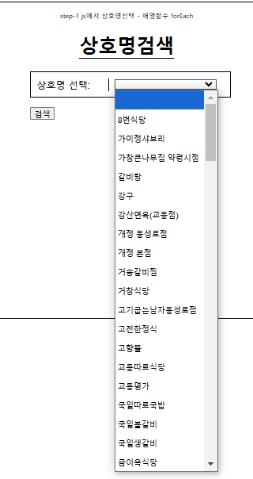

# 01

> **07[문제]주문받기-step1.html**
> 



```jsx
<!DOCTYPE html>
<html lang="en">

<head>
    <meta charset="UTF-8">
    <meta name="viewport" content="width=device-width, initial-scale=1.0">
    <title>Document</title>

    <link rel="stylesheet" href="./css/주문받기.css">

    <script src="./js/중구맛집.js"></script>
    <script>

        const 중구맛집_data = 중구맛집.data;

        const 중구맛집_한식 = 중구맛집_data.filter((item) => { return item.FD_CS == '한식' })

        let 중구맛집_한식_상호명메뉴주소 =
            중구맛집_한식
                .sort((a, b) => { return a.BZ_NM.localeCompare(b.BZ_NM) })
                .map((item) => {
                    return { "BZ_NM": item.BZ_NM, "MNU": item.MNU, "GNG_CS": item.GNG_CS };
                })

        //------------------------------------
        // 중구맛집_한식_상호명메뉴주소 에서 MNU(메뉴) 의 값을 메뉴명:가격(숫자)으로 분리
        //------------------------------------
        const RenewaledMenu = 중구맛집_한식_상호명메뉴주소.map((item) => {
            // <br /> 제거
            let replcedBrMenu = item.MNU.replaceAll('<br />', "\n")
            // console.log("replcedBrMenu",replcedBrMenu);
            // \n를 기준으로 배열로 자르기
            let menu_arr = replcedBrMenu.trim().split("\n");
            // console.log(menu_arr);
            // \n를 기준으로 잘린 배열의 재구성
            const renewaled_menu =
                // 메뉴중 가격에 있는 요소의 '원', ',' 제거하기
                menu_arr.map((menu) => {
                    //공백 기준 자르기(배열)
                    let splited_space = menu.trim().split(/[\s~]+/g);    // ' ', ~ 를 기준으로 자르기
                    // splited_space.splice(' ');
                    // console.log(splited_space)
                    // 가격에 '원'제거, ','제거
                    let removed_arr = splited_space.map((menu_2) => {
                        const renewalItem = menu_2.trim().replace(/(\d{1,3})(?:,\d{3})*(?:원)?/g, (match, str) => {
                            // console.log(match,str);
                            const num = match.replace(',', '').replace('원', '');
                            // console.log('num',num);
                            return num;
                        });
                        return renewalItem.match(/\d/) ? Number(renewalItem) : renewalItem;
                    })
                    return removed_arr;
                })
            // console.log("renewaled_menu",renewaled_menu);
            return { "BZ_NM": item.BZ_NM, "GNG_CS": item.GNG_CS, "MNU": renewaled_menu };
        })

    </script>
</head>

<body>

    <div class="show-block search-block">
        <span style="font-size:.7rem">step-1 js에서 상호명선택 - 배열함수 forEach</span>
        <h1>상호명검색</h1>
        <form name="form1" onsubmit="return false">
            <div class="item">
                <label>상호명 선택: </label>
                <select class="select-restorant">
                    <option value=""></option>
                </select>
            </div>
            <div>
                <button>검색</button>
            </div>
        </form>
    </div>

    <div class="show-block order-input-block">
        <span style="font-size:.7rem">step-2 상호명 선택시 활성화(object생성 및 저장 및 노드CRUD)</span>
        <h1>주문 입력</h1>
        <form name="form2" onsubmit="return falses">
            <div class="item">
                <label>주문번호 : </label>
                <input type="text" name="주문번호" />
            </div>
            <div class="item">
                <label>상호명 : </label>
                <input type="text" name="주문번호" />
            </div>
            <div class="item">
                <label>메뉴명 : </label>
                <input type="text" name="주문번호" />
            </div>
            <div class="item">
                <label>가격 : </label>
                <input type="text" name="주문번호" />
            </div>
            <div class="item">
                <label>수량 : </label>
                <input type="text" name="주문번호" />
            </div>
            <div>
                <button>주문하기</button>
            </div>

        </form>

    </div>

    <hr />
    <div class="show-block order-result-block">
        <span style="font-size:.7rem">주문요청시 추가되는 항목들(object생성 및 저장 및 노드CRUD)</span>
        <h1>주문 확인</h1>
        <div class="items">
            <div class="item">
                <label>주문번호 : </label>
                <input type="text" name="주문번호" />
            </div>
            <div class="item">
                <label>메뉴명 : </label>
                <input type="text" name="주문번호" />
            </div>
            <div class="item">
                <label>가격 : </label>
                <input type="text" name="주문번호" />
            </div>
            <div class="item">
                <label>수량 : </label>
                <input type="text" name="주문번호" />
            </div>
            <div class="item">
                <label>지불금액</label>
                <input type="text" name="주문번호" />
            </div>
        </div>
    </div>

    <script>
        // 사전작업

        //---------------------------------------
        // step-1 - 상호명 선택하기
        // (RenewaledMenu안의 모든 상호명을 select이하 option으로 넣어보세요 - forEach사용해서 - )
        //---------------------------------------
        console.log("RenewaledMenu", RenewaledMenu);
        //--------------------
        // 예시
        //--------------------
        const selectRestorant = document.querySelector('.select-restorant'); // SelectNode탐색
        RenewaledMenu.forEach((item) => {
            console.log(item);
            const opNode = document.createElement("option"); // 새노드생성
            opNode.innerHTML = item.BZ_NM       //option 내의 content에 내용저장(식당명)
            selectRestorant.appendChild(opNode)   //selectNode의 자식으로 붙이기
        });
        // const opNode = document.createElement("option"); // 새노드생성
        // opNode.innerHTML = '레스토랑명'       //option 내의 content에 내용저장(식당명)
        // selectRestorant.appendChild(opNode)   //selectNode의 자식으로 붙이기
        // 

        // 

        // step-2

        // 

        // step-3

        // 

        // 주문 리스트 아이템 추가하기
        const addOrderItem = () => {

        }
    </script>
</body>

</html>
```

---

> **08ProtoType.html**
> 


```jsx
<!DOCTYPE html>
<html lang="en">

<head>
    <meta charset="UTF-8">
    <meta name="viewport" content="width=device-width, initial-scale=1.0">
    <title>Document</title>
</head>

<body>
    <script>
        //-----------------------------------------
        //Object 객체 : 객체를 다루는 기본함수 제공
        //-----------------------------------------
        const obj = { name: "홍길동", age: 55 };
        // 소문자object : 자료형
        console.log(obj);
        console.log(null);
        console.log(Object);

        console.log(Object.keys(obj));          // obj의 key를 배열로 반환
        console.log(Object.values(obj));        // obj의 value를 배열로 반환
        console.log(Object.entries(obj));       // 열거가능한 속성([k:v])형태의 배열로 반환

        let ob1 = { addr: "대구" };
        let ob2 = { gender: "M" };

        console.log(Object.assign(obj, ob1, ob2));          // obj에 ob1 , ob2 K:V를 복사

        Object.freeze(obj);     // 객체수정불가
        obj.name = "남길동";
        obj["age"] = 100;
        console.log("!!!!", obj);

        Object.seal(obj);       // 새속성 추가불가

        console.log(Object.prototype)

        //----------------------------------------
        // Object.prototype  : 객체가 상속을 구현하는데 사용되는 메커니즘,Object객체 내에 구성
        //----------------------------------------
        //    Object.prototype
        //    자바스크립트의 모든 객체가 상속하는 프로토타입 체인의 최상위에 있는 객체입니다.
        //    따라서 Object.prototype에는 다양한 함수들이 정의되어 있습니다.
        //    일부 중요한 함수들은 다음과 같습니다:

        //     toString(): 객체를 문자열로 변환하여 반환합니다.
        //     hasOwnProperty(): 객체가 특정 속성을 직접 소유하고 있는지 여부를 확인합니다.
        //     isPrototypeOf(): 객체가 다른 객체의 프로토타입 체인에 존재하는지 여부를 확인합니다.
        //     valueOf(): 객체의 원시 값 표현을 반환합니다.
        //     toLocaleString(): 객체를 지역화된 문자열로 변환하여 반환합니다.
        //     propertyIsEnumerable(): 특정 속성이 열거 가능한 속성인지 여부를 확인합니다.
        //     constructor: 객체를 생성한 생성자 함수를 참조합니다.

        // 프로토타입 함수 정의
        function Person(name){
            this.name=name;
        }

        // Person 프로토타입으로 객체 생성
        const person1 = new Person('홍길동');
        console.log(person1);
        person1.toString();

        // Person 프로토타입에 기능 추가
        Person.prototype.hello=function(){
            console.log(`안녕하세요! 저는 ${this.name} 입니다`);
        };

        //
        const person2 = new Person('남길동');
        console.log(person2);
        person2.hello();

    </script>
</body>

</html>
```

---

> **09ProtoType상속.html**
> 


```jsx
<!DOCTYPE html>
<html lang="en">

<head>
    <meta charset="UTF-8">
    <meta name="viewport" content="width=device-width, initial-scale=1.0">
    <title>Document</title>
</head>

<body>

    <script>
        // 상위프로토타입 함수 
        function Animal(name) {
            console.log('Animal 생성자 호출!');
            this.name = name;   //속성추가(name)
        }
        // 상위프로토타입에 기능추가
        Animal.prototype.getName = function () { console.log(`My name is ${this.name}`) }

        // 하위프로토타입 함수
        function Dog(name, kind) {
            Animal.call(this, name); //상위 프로토타입 생성자 호출! 
            console.log("Dog 생성자 호출!");
            this.kind = kind;   //Dog에 속성 추가
        }

        Dog.prototype = Object.create(Animal.prototype); //프로토타입간 상속

        function 포메라니안(name, kind, color) {
            Dog.call(this, name, kind);
            console.log("포메라니안 생성자 호출!");
            this.color = color;
        }
        포메라니안.prototype = Object.create(Dog.prototype);//프로토타입간 상속

        //Dog 객체 생성
        const dog1 = new Dog('POPPI', "골든리트리버");
        console.log(dog1);
        dog1.getName();

        console.log("-----------------------")
        const dog2 = new 포메라니안('티모', '포메라니안', 'WHITE');
        console.log(dog2)

    </script>
</body>

</html>
```

---

> **00_INFO.html**
> 


```jsx
<!DOCTYPE html>
<html lang="en">
<head>
    <meta charset="UTF-8">
    <meta name="viewport" content="width=device-width, initial-scale=1.0">
    <title>Document</title>
</head>
<body>
    
    <!DOCTYPE html>
<html lang="en">

<head>
    <meta charset="UTF-8">
    <meta name="viewport" content="width=device-width, initial-scale=1.0">
    <title>Document</title>
</head>

<body>
    <!-- 
        산술 연산자 (Arithmetic Operators):

        + (덧셈)
        - (뺄셈)
        * (곱셈)
        / (나눗셈)
        % (나머지)  - 짝홀수 구분 , 배수구분 , 끝자리수 확인 , 수범위 제한
        ++ (증가)
        -- (감소)
    -->
    <script>
        // console.log("---------기본 산술 연산");
        // console.log( 4%2 == 0 && '짝수입니다.' );
        // console.log(5%2 == 0 && '짝수입니다.');
        // console.log(6%2 == 0 && '짝수입니다.');
        // console.log(7%2 == 0 && '짝수입니다.');

        // console.log(123456%10)
        // console.log(123456%100)

        // setInterval(()=>{
        //     console.log(   (parseInt(Math.random()*100)%45 + 1)   );
        // },500);
        // console.log("----------------------");

        // 증감연산자
        // let n1 = 10;
        // n1+1;
        // console.log("1",n1)
        // n1 = n1 + 1;
        // console.log("2",n1)
        // n1++; // 후치 연산자(다른 연산처리 우선)
        // console.log("3",n1)
        // ++n1; // 전치 연산자(이 연산처리를 우선)
        // console.log("4",n1)

        // let a = 10;
        // let b = 20;
        // let c = 30;
        // let d = (a++ + ++b) && (++c + a++);
        // console.log(a,b,c,d);

    </script>

    <!--
        할당 연산자 (Assignment Operators):
        = (할당)
        += (더해서 할당)
        -= (빼서 할당)
        *= (곱해서 할당)
        /= (나눠서 할당)
        %= (나머지를 할당)
    -->
    <script>
        // let n1 = 10;
        // let n2 = 20;
        // n1+=n2;     //n1 = n1 + n2;
        // console.log(n1)
    </script>

    <!--
    비교 연산자 (Comparison Operators):

        == (동등 비교)
        === (일치 비교)
        != (부등 비교)
        !== (불일치 비교)
        > (크다)
        < (작다)
        >= (크거나 같다)
        <= (작거나 같다)
    -->

    <script>

        //비교연산자(이항연산자) - 조건식 생성가능
        // let n1=100;
        // let n2=200;
        // console.log(n1=n2);  //대입연산자
        // console.log(n1==n2); //동등비교연산자

        // // // == vs ===
        // console.log('1'+2);
        // console.log('123' == 123);
        // console.log('123' === 123); //value와 자료형을 함께 일치여부 확인
    </script>

    <!--
    논리 연산자 (Logical Operators):

    && (논리 AND)
    || (논리 OR)
    ! (논리 NOT)
    비트 연산자 (Bitwise Operators):

    & (비트 AND)
    | (비트 OR)
    ^ (비트 XOR)
    ~ (비트 NOT)
    << (왼쪽 시프트)
    >> (오른쪽 시프트)
    >>> (부호 없는 오른쪽 시프트)
    -->

    <script>
        let n1 = 100;
        let n2 = true;
        let n3 = false;
        let n4 = null;
        let n5 = undefined;
        let n6 = 0;
        
        //조건식 && 조건식  : AND 연산자 : 왼쪽조건식의 수행결과가 true일때 오른쪽 조건식을 실행
        //
        // console.log((n1>10) && (n6==0) )
        // console.log(n1 && 'n1안의 정수값은 true를 의미합니다.');
        // console.log(!n4 && 'n4안의 값은 null입니다.');
        // console.log(!n5 && 'n5안의 값이 지정되지않은 undefined입니다');
        // console.log(!n6 && 'n6안의 값은 0입니다');

        // console.log(true&&true);
        // console.log(true&&false);
        // console.log(false&&true);
        // console.log(false&&false);
 
        //or 연산자 : 두피연산자중 하나만 true 라도 true
        //조건식 || 조건식  : || 연산자 : 왼쪽조건식의 수행결과가 false일때 오른쪽 조건식을 실행

        // console.log(true||true);
        // console.log(true||false);
        // console.log(false||true);
        // console.log(false||false);        
        // console.log('------');
        // console.log((n1>10) || (n6=0) )
        // console.log(!n1 || 'n1안의 정수값은 true를 의미합니다.');
        // console.log(!n4 || 'n4안의 값은 null입니다.');
        // console.log(!n5 || 'n5안의 값이 지정되지않은 undefined입니다');
        // console.log(!n6 || 'n6안의 값은 0입니다');

    </script>

    <!--
        삼항 조건 연산자 (Ternary Operator):
        condition ? expression1 : expression2
        타입 연산자 (typeof Operator):
     -->

     <div class="box" style="width:100%;height:100px;background-color: orange;"></div>
     <script>
        //조건식 ? true인경우실행 : 거짓인경우실행 ;
        
        // const data = prompt("값을 입력하세요");
        // (data>10) ? console.log("참입니다") : console.log("거짓입니다");

        
        console.log(window.innerWidth);
        const boxEl = document.querySelector(".box");
        (window.innerWidth<380) ? 
            // console.log("참입니다")
            (boxEl.style.backgroundColor='green') && (boxEl.style.height="50px")
            : 
            console.log("거짓입니다");

     </script>

    <!--
        typeof (피연산자의 타입을 문자열로 반환)
        인스턴스 검사 연산자 (instanceof Operator):
    -->

</body>

</html>
</body>
</html>
```

---

> **01_IF.html**
> 


```jsx
<!DOCTYPE html>
<html lang="en">
<head>
    <meta charset="UTF-8">
    <meta name="viewport" content="width=device-width, initial-scale=1.0">
    <title>Document</title>
</head>
<body>
    <div class="box" style="width:200px;height:100px;background-color: orange;"></div>
    <script>
        const boxEl = document.querySelector('.box');
        // if(조건식){종속문장}
        let box_style = prompt("기본스타일을 입력하세요\n';'단위로 '가로/세로'width,height,color,background-color 입력하세요");
        const style_arr = box_style.split(';');
        if(style_arr[0]==='가로')
        {
            console.log('가로스타일')
            boxEl.setAttribute('style',`width:${style_arr[1]};height:${style_arr[2]};color:${style_arr[3]};background-color:${style_arr[4]}`);
            // document.write(`<h1>${number} 는 짝수입니다.</h1>`);//true(참)인 경우 실행할 코드
        }
        else
        {
            console.log('세로스타일')
            boxEl.setAttribute('style',`width:${style_arr[2]};height:${style_arr[1]};color:${style_arr[3]};background-color:${style_arr[4]}`);
            // document.write(`<h1>${number} 는 홀수입니다.</h1>`);//false(거짓)인 경우 실행할 코드
        }

    </script>
</body>
</html>
```

---

> **02_FOR.html**
> 


```jsx
<!DOCTYPE html>
<html lang="en">
<head>
    <meta charset="UTF-8">
    <meta name="viewport" content="width=device-width, initial-scale=1.0">
    <title>Document</title>
</head>
<body>
    <script>
        // 반복문 : 조건식이 참인동안에 반복실행되도록 허용된 문법
        // while (조건식) {참인동안 실행되는 종속문장}
        // let i=0;        // 반복 탈출용 변수
        // while(i<=5){    // 반복을 벗어나게 하기 위한 탈출용 조건식
        //     alert(`무한루프 반복 ${i}`); //동기 처리함수
        //     i++;        //반복 탈출을 위한 연산
        // }
        // alert("반복문을 벗어나 종료합니다.");
        
        // for(초기값;조건식;연산식){참인동안 실행되는 종속문장}
        for(let i=0;i<=5;i++){   
            alert(`무한루프 반복 ${i}`); 
            i++;        
        }
        alert("반복문을 벗어나 종료합니다.");
    </script>
</body>
</html>
```