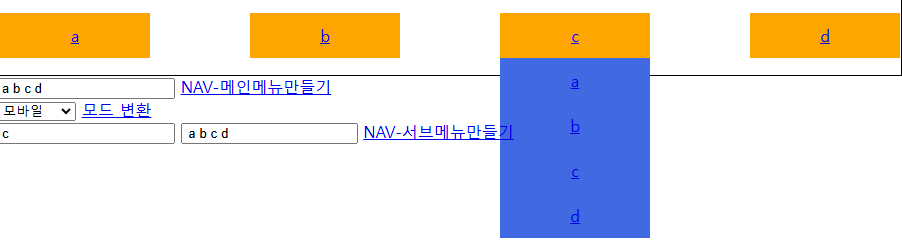

# 01

> **03_예제.html**
> 



```jsx
<!DOCTYPE html>
<html lang="en">

<head>
    <meta charset="UTF-8">
    <meta name="viewport" content="width=device-width, initial-scale=1.0">
    <title>Document</title>
    <style>
        body {
            margin: 0;
        }

        nav {
            height: 80px;
            border: 1px solid;
        }

        nav>.main-menu {
            list-style: none;
            margin: 0;
            padding: 0;
            height: 100%;
            display: flex;
            justify-content: space-between;
            align-items: center;
            flex-wrap: wrap;
            width : 100%;
        }
        nav>.main-menu>li{
            background-color: orange;
            color:white;
            text-align: center;
            border: 1px solid;;
            min-width : 120px;
            max-width : 150px;
            width : 100%;
            height : 45px;
            line-height: 45px;
        }
        nav>.main-menu>li>a{
            display:block;
        }
        nav>.main-menu>li>.sub-menu{
            list-style: none;
            margin: 0; padding : 0;
            background-color: royalblue;
            display:none;
        }
        nav>.main-menu>li>.sub-menu>li{}
        nav>.main-menu>li>.sub-menu>li>a{}

        nav>.main-menu>li:hover>.sub-menu{
            display:block;
        }

    </style>
</head>

<body>

    <div class="wrapper">
        <header>
            <div class="top-header"></div>
            <nav>
                <ul class="main-menu"></ul>
            </nav>
        </header>

        <footer>

            <form name="navForm" onsubmit="return false">
                <input type="text" name="menuname">
                <a href="javascript:void(0)" class="nav-btn">NAV-메인메뉴만들기</a>
            </form>
            <form name="modeForm" onsubmit="return false">
                <select name="setViewMode" id="">
                    <option value="mobile">모바일</option>
                    <option value="desktop">데스크탑</option>
                </select>
                <a href="javascript:void(0)" class="view-mode-btn">모드 변환</a>
            </form>

            <form name="submenuForm" onsubmit="return false">
                <input type="text" name="mainname" placeholder="메인 메뉴명을 입력하세요">
                <input type="text" name="subname" placeholder="서브 메뉴명을 입력하세요(띄어쓰기)">
                <a href="javascript:void(0)" class="sub-menu-btn">NAV-서브메뉴만들기</a>
            </form>
            
        </footer>
    </div>

    <script>
        const mainMenuEl = document.querySelector('.main-menu');
        // const settings = prompt('NAV메뉴를 입력하세요 띄어쓰기로 구분합니다');
        const navBtn = document.querySelector('.nav-btn');
        navBtn.addEventListener('click', () => {
            const form = document.navForm;
            const settings = form.menuname.value;
            const menuArr = settings.split(' ');
            console.log(menuArr);
            
            // 기존 자식 노드(li) 제거
            while(mainMenuEl.firstChild){
                mainMenuEl.removeChild(mainMenuEl.firstChild);
            }
            // 새로운 자식 노드(li) 추가
            // for (let i = 0; i < menuArr.length; i++) {
            //     // 요소생성
            //     const liEl = document.createElement('li');
            //     liEl.innerHTML = menuArr[i];
            //     mainMenuEl.appendChild(liEl);
            // }

            // 배열함수를 이용(forEach)해서 자식 노드(li) 추가
            menuArr.forEach((str)=>{
                const liEl = document.createElement('li');
                // 
                const aEl = document.createElement('a');
                aEl.setAttribute('href','javascript:void(0)');
                aEl.innerHTML = str;
                
                // li - a(자식) 추가
                liEl.appendChild(aEl);
                
                mainMenuEl.appendChild(liEl);
            });

        });
       
        //[중요!] 배열함수 / 노드CRUD / 이벤트 / 동기&비동기
        // VIWE MODE BTN 
        const viewModeBtnEl = document.querySelector('.view-mode-btn');
        viewModeBtnEl.addEventListener('click',()=>{

            const form = document.modeForm;
            const modeOption = form.setViewMode.value;
            console.log('modeOption',modeOption);
           
            const wrapperEl = document.querySelector('.wrapper');
            if(modeOption === "mobile"){
                //모바일 화면
                wrapperEl.style.width="380px";
                wrapperEl.style.margin="0 auto";
            }else if(modeOption ==="desktop"){
                //데스크탑 화면
                wrapperEl.style.width="100%";
                wrapperEl.style.margin="0 auto";
            }else{

            }

        });

        // 서브메뉴 만들기
        const subMenuBtnEl = document.querySelector('.sub-menu-btn');
        subMenuBtnEl.addEventListener('click',()=>{
            const form = document.submenuForm;
            const mainname = form.mainname.value;
            const subname = form.subname.value;
            console.log(mainname,subname);

            // 메인메뉴 찾기
            const mainMenuLiEls = document.querySelectorAll('.main-menu>li>a');
            console.log(mainMenuLiEls);

            // const findAEl =  mainMenuLiEls.find((el)=>el.textContent.trim() === mainname );
            // console.log("findAEl",findAEl);
            
            mainMenuLiEls.forEach((el)=>{
                if(el.textContent.trim() === mainname){
                    console.log('find!!',el);
                    const liEl =  el.parentNode;
                    console.log(liEl);
                    
                    // 서브메뉴 만들기
                    const submenuArr = subname.split(' ');
                    // ul 생성 , li 생성 , a 생성 - 연결
                    const ulEl = document.createElement('ul');
                    ulEl.classList.add('sub-menu');
                    submenuArr.forEach(str=>{
                        const newLi = document.createElement('li');
                        const newA = document.createElement('a');
                        newA.setAttribute('href','javascript:void(0)');
                        newA.innerHTML=str;

                        newLi.appendChild(newA);
                        ulEl.appendChild(newLi);
                    })

                    liEl.appendChild(ulEl);

                }
            })

            

        });

    </script>

</body>

</html>
```

---

> **04[문제]주문받기.html**
> 


```jsx
<!DOCTYPE html>
<html lang="en">

<head>
    <meta charset="UTF-8">
    <meta name="viewport" content="width=device-width, initial-scale=1.0">
    <title>Document</title>

    <link rel="stylesheet" href="./css/주문받기.css">

    <script src="./js/중구맛집.js"></script>
    <script>

        const 중구맛집_data = 중구맛집.data;

        const 중구맛집_한식 = 중구맛집_data.filter((item) => { return item.FD_CS == '한식' })

        let 중구맛집_한식_상호명메뉴주소 =
            중구맛집_한식
                .sort((a, b) => { return a.BZ_NM.localeCompare(b.BZ_NM) })
                .map((item) => {
                    return { "BZ_NM": item.BZ_NM, "MNU": item.MNU, "GNG_CS": item.GNG_CS };
                })

        //------------------------------------
        // 중구맛집_한식_상호명메뉴주소 에서 MNU(메뉴) 의 값을 메뉴명:가격(숫자)으로 분리
        //------------------------------------
        const RenewaledMenu = 중구맛집_한식_상호명메뉴주소.map((item) => {
            // <br /> 제거
            let replcedBrMenu = item.MNU.replaceAll('<br />', "\n")
            // console.log("replcedBrMenu",replcedBrMenu);
            // \n를 기준으로 배열로 자르기
            let menu_arr = replcedBrMenu.trim().split("\n");
            // console.log(menu_arr);
            // \n를 기준으로 잘린 배열의 재구성
            const renewaled_menu =
                // 메뉴중 가격에 있는 요소의 '원', ',' 제거하기
                menu_arr.map((menu) => {
                    //공백 기준 자르기(배열)
                    let splited_space = menu.trim().split(/[\s~]+/g);    // ' ', ~ 를 기준으로 자르기
                    // splited_space.splice(' ');
                    // console.log(splited_space)
                    // 가격에 '원'제거, ','제거
                    let removed_arr = splited_space.map((menu_2) => {
                        const renewalItem = menu_2.trim().replace(/(\d{1,3})(?:,\d{3})*(?:원)?/g, (match, str) => {
                            // console.log(match,str);
                            const num = match.replace(',', '').replace('원', '');
                            // console.log('num',num);
                            return num;
                        });
                        return renewalItem.match(/\d/) ? Number(renewalItem) : renewalItem;
                    })
                    return removed_arr;
                })
            // console.log("renewaled_menu",renewaled_menu);
            return { "BZ_NM": item.BZ_NM, "GNG_CS": item.GNG_CS, "MNU": renewaled_menu };
        })

    </script>
</head>

<body>

    <div class="show-block search-block">
        <span style="font-size:.7rem">step-1 js에서 상호명선택 - 배열함수 forEach</span>
        <h1>상호명검색</h1>
        <form name="form1" onsubmit="return false">
            <div class="item">
                <label>상호명 선택: </label>
                <select class="select-restorant" name="selectRestorant">
                    <option value="" selected>식당을 선택하세요</option>
                    <!-- <option value=""></option> -->
                </select>
            </div>
            <div>
                <a href="javascript:void(0)" class="show-menu-btn">검색</a>
            </div>
        </form>
        <!-- 상단 폼에서 선택한 식당의 메뉴를 표시 -->
        <div class="restorant-menu-block">
                [문제]선택한 레스토랑에 대한 메뉴가 표시되어야 합니다!
        </div>

    </div>

    <div class="show-block order-input-block">
        <span style="font-size:.7rem">step-2 상호명 선택시 활성화(object생성 및 저장 및 노드CRUD)</span>
        <h1>주문 입력</h1>
        <form name="form2" onsubmit="return falses">
            <div class="item">
                <label>주문번호 : </label>
                <input type="text" name="주문번호" />
            </div>
            <div class="item">
                <label>상호명 : </label>
                <input type="text" name="주문번호" />
            </div>
            <div class="item">
                <label>메뉴명 : </label>
                <input type="text" name="주문번호" />
            </div>
            <div class="item">
                <label>가격 : </label>
                <input type="text" name="주문번호" />
            </div>
            <div class="item">
                <label>수량 : </label>
                <input type="text" name="주문번호" />
            </div>
            <div>
                <button>주문하기</button>
            </div>

        </form>

    </div>

    <hr />
    <div class="show-block order-result-block">
        <span style="font-size:.7rem">주문요청시 추가되는 항목들(object생성 및 저장 및 노드CRUD)</span>
        <h1>주문 확인</h1>
        <div class="items">
            <div class="item">
                <label>주문번호 : </label>
                <input type="text" name="주문번호" />
            </div>
            <div class="item">
                <label>메뉴명 : </label>
                <input type="text" name="주문번호" />
            </div>
            <div class="item">
                <label>가격 : </label>
                <input type="text" name="주문번호" />
            </div>
            <div class="item">
                <label>수량 : </label>
                <input type="text" name="주문번호" />
            </div>
            <div class="item">
                <label>지불금액</label>
                <input type="text" name="주문번호" />
            </div>
        </div>
    </div>

    <script>
        // 사전작업

        //---------------------------------------
        // step-1 - 상호명 선택하기
        // (RenewaledMenu안의 모든 상호명을 select이하 option으로 넣어보세요 - forEach사용해서 - )
        //---------------------------------------
        console.log("RenewaledMenu", RenewaledMenu);
        //--------------------
        // 예시
        //--------------------
        const selectRestorant = document.querySelector('.select-restorant'); // SelectNode탐색
        RenewaledMenu.forEach((item) => {
            // console.log(item);
            const opNode = document.createElement("option"); // 새노드생성
            opNode.innerHTML = item.BZ_NM;       //option 내의 content에 내용저장(식당명)
            selectRestorant.appendChild(opNode)   //selectNode의 자식으로 붙이기

        });

        // step-1-1
        const showMenuBtn = document.querySelector('.show-menu-btn');
        showMenuBtn.addEventListener('click',()=>{

            const form = document.form1;
            const selectedRestorant = form.selectRestorant.value;
            console.log(selectedRestorant); 

            const restorantEl= RenewaledMenu.find((item)=>{return item.BZ_NM===selectedRestorant})

            console.log('find!!',restorantEl);

            // 식당정보 표시하기
            const restorantMenuBlockEl = document.querySelector('.restorant-menu-block');
            restorantMenuBlockEl.innerHTML=restorantEl.MNU;

        });

        // 

        // step-2

        // 

        // step-3

        // 

        // 주문 리스트 아이템 추가하기
        const addOrderItem = () => {

        }
    </script>
</body>

</html>
```

---

> **함수**
> 

```jsx
함(담다)수(Data) : 외부로부터 Data를 받아와 처리하는 논리적 공간

-함수의 형태
인자o , 리턴값o
인자x , 리턴값o
인자o , 리턴값x
인자x , 리턴값x

재사용성 증가
모듈(탈부착이 가능한 프로그램/장치)화
```

---

> **01_기본.html**
> 


```jsx
<!DOCTYPE html>
<html lang="en">

<head>
    <meta charset="UTF-8">
    <meta name="viewport" content="width=device-width, initial-scale=1.0">
    <title>Document</title>
</head>

<body>

    <script>
        // 기본 형태(ECMA6 이전)

        // 1 인자 o 리턴 o
        function sum1(n1,n2){
            return n1+n2;
        };
         // 2 인자 o 리턴 x
         function sum2(n1,n2){
            console.log('sum2',n1+n2);
        };
         // 1 인자 x 리턴 o
         function sum3(){
            const n1 = 10;
            const n2 = 20;
            return n1+n2;
        };
         // 1 인자 x 리턴 x
         function sum4(){
            const n1 = 10;
            const n2 = 20;
            console.log("sum4",n1+n2)
        };

        const v1 = sum1(10,20);
        console.log('v1',v1);

        const v2 = sum2(100,200)
        console.log('v2',v2);

        const v3 = sum3();
        console.log('v3',v3);

        
        // 기본 형태(ECMA6 이후)
        const f1 =(n1,n2)=>{
            return n1+n2;
        };
        const f2 =(n1,n2)=>{
            console.log('f2',n1+n2)
        };
        const f3 =()=>{
            const n1=10;
            const n2=20;
            return n1+n2;
            
        };
        const f4 =()=>{
            const n1=10;
            const n2=20;
            console.log('f4',n1+n2)
        };
        
        console.log("=======")
        const v_1 = f1(10,20); console.log('v_1',v_1);
        const v_2 = f2(10,20); console.log('v_2',v_2);
        const v_3 = f3(); console.log('v_3',v_3);
        const v_4 = f4(); console.log('v_4',v_4);

        // 인자의 개수? 메모리 허용범위내에서 무제한
        // 반환값의 개수? 1개
        const f5 = (n1,n2,n3)=>{
            return{
                // 속성
                arg1:n1,
                arg2:n2,
                arg3:n3,

                // 기능
                toString : function(){
                    console.log(`이름 : ${this.arg1},나이 : ${this.arg2},주소 : ${this.arg3}`)
                }
            }
        }

        const v_5 = f5("홍길동",15,"대구");
        console.log('v_5',v_5)
        v_5.toString();

        // 가변인자(...args)
        const f6 = (n1,n2,n3,...args)=>{
            console.log("n1",n1);
            console.log("n2",n2);
            console.log("n3",n3);
            console.log("args",args);
        };
        f6(100,200,300,400,500,600,700,800,900);

    </script>
</body>

</html>
```

---

> **02_HOISTING.html**
> 


```jsx
<!DOCTYPE html>
<html lang="en">
<head>
    <meta charset="UTF-8">
    <meta name="viewport" content="width=device-width, initial-scale=1.0">
    <title>Document</title>
</head>
<body>
    <script>
        // 호이스팅(HOISTING)
        // 변수와 함수의 선언이 코드 실행전에 메모리에 미리 저장되는 현상
        // function 예약어 사용시 호이스팅 처리됨
        // var 예약이 사용시 호이스팅 처리됨

        // var a = 10;
        // console.log('a',a);

        // let b = 20;
        // console.log('b',b);

        // ----------------
        //  함수 호이스팅 확인
        // ----------------
        hello1();
        function hello1(){
            console.log('hello1 world');
        }

        // 작동안됨 예)
        hello2();
        const hello2 = () => {console.log("hello2 world")}

        // var변수는 가급적 사용은 지양(사용하지 않는게 좋음)
        // function 은 목적에 따라 사용여부 결정(처음에 만든 효과를 주고싶으면 사용)
        // function 은 기본으로 이름부여도 가능하다(익명함수 or 이름부여된 함수 선택가능)
        // 화살표함수(()={}) 는 기본적으로 익명함수로 처리된다
        
    </script>
    
</body>
</html>
```

---

> **03_SCOPE.html**
> 


```jsx
<!DOCTYPE html>
<html lang="en">
<head>
    <meta charset="UTF-8">
    <meta name="viewport" content="width=device-width, initial-scale=1.0">
    <title>Document</title>
</head>
<body>
    
    <script>
        // 스코프(SCOPE)란
        // 변수나 함수가 접근할 수 있는 범위
        // 전역스코프(Global Scope)와 지역 스코프(Local Scope)로 구별

        // 전역스코프 : 모든 지역에서 접근이 가능

        // 지역스코프 : 특정 영역( {} ) 에서만 접근 가능
        // - 함수스코프 : 함수 내에서 선언된 변수는 해당 함수내에서만 접근 가능(var)
        // - 블록스코프 : 블록 내부에서만 접근 가능 (ex , if, for , while...,object..)(let,const)
        // - 렉시컬(Lexical)스코프  : 변수를 선언한 위치에 따라서 스코프 결정

        // 전역 스코프
        // var g_val = "전역변수 확인!";

        // function a(){
        //     console.log('a func()..',g_val);
        // }
        // a();
        // if(true){
        //     console.log('if..',g_val);
        // }
        // console.log({key1:g_val});

        //--------------------------
        //함수 스코프 내의 지역변수
        //--------------------------
        // f1();
        // f2();
        // function f1(){
        //     var f1_v = 'f1_val';
        //     console.log('f1_v',f1_v);
        // }
        // function f2(){
        //     var f2_v = 'f2_val';
        //     console.log('f2_v',f2_v);
        // }
        // console.log(f1_v);
        // console.log(f2_v);
        //--------------------------
        //블록 스코프 내의 지역변수 - let , const(상수)
        //--------------------------
        // if(true){
        //     let v_1 = "블럭 내에 사용되는 지역변수"
        //     console.log('v_1',v_1);
        //     var v_2 = "블럭 내에 사용한 var변수"
        // }
        // console.log('v_2',v_2);
        // console.log('v_1',v_1);
        
        //--------------------------
        //렉시컬 스코프(화살표 함수) 확인 - this
        //--------------------------
        // const f1 = ()=>{
        //     console.log('f1...',this);  // 상위스코프(window객체) 의 'this' 를 가져옴
        // }
        // f1();
        //--------------------------
        //렉시컬 스코프(Object내의 기능에서의) 확인 - this
        //--------------------------
        
        const person = {
            name:"홍길동",
            age:15,
            addr : "대구",
            getName : function(){
                console.log(this);
            },
            getAge : ()=>{
                console.log(this);
            }
        }   
        console.log('person',person);
        person.getName();
        person.getAge();
    </script>
</body>
</html>
```

---

> **04_CLOSURE.html**
> 


```jsx
<!DOCTYPE html>
<html lang="en">

<head>
    <meta charset="UTF-8">
    <meta name="viewport" content="width=device-width, initial-scale=1.0">
    <title>Document</title>
</head>

<body>

    <script>
        // 클로저
        // 클로저는 내부 함수가 외부 함수의 변수에 접근할 수 있는 것을 의미
        // 정보 은닉(Information Hiding): 클로저를 사용하여 외부에서 접근할 수 없도록 변수를 보호하고, 
        // 함수를 통해서만 접근 가능하도록 만들 수 있습니다.

        // 데이터 보존(Data Persistence): 클로저를 사용하여 함수가 생성될 당시의 환경을 유지하면서, 
        // 데이터를 영구적으로 보존할 수 있습니다.
        // 비동기 처리(Asynchronous Operations): 클로저를 사용하여 비동기적인 작업에서 결과를 유지하고, 
        // 필요할 때에 접근할 수 있도록 할 수 있습니다.

        // //01 

        // //외부 함수
        // function outer(){
        //     //상태값 보관
        //     let state = 0;
        //     //내부 함수 
        //     function addOne(){
        //         state++;
        //         console.log('state..',state);  //렉시컬 스코프 적용
        //         console.dir(addOne);
        //     }
        //     return addOne;  //함수이름이 리턴되면 만들어진 함수의 위치정보(함수의 메모리주소)가 반환
        // }

        // const clousureFunc = outer();
        // // console.log('clousureFunc',clousureFunc);   
        // clousureFunc();

        // 전역 스코프
        var x = 'global x'
        var n1 = 10;

        // outer 함수 지역 스코프
        function outer() {
            var x = 'outer x'
            var y = 0

            // inner 함수 지역 스코프
            function inner() {
                var x = 'inner x'

                // if 블록 지역 스코프
                if (x) {
                    const x = 'if block scope'
                    console.log(x) // if block scope
                    y++;
                    console.log('y',y) // outer y
                    n1++;
                    console.log('n1',n1) // window n1
                    // console.log(z) // Uncaught ReferenceError: z is not defined
                }
                console.dir(inner);
            }
            return inner;
        }
        const clousureFunc2=outer()
        clousureFunc2();
        clousureFunc2();
        clousureFunc2();
    </script>
</body>

</html>
```