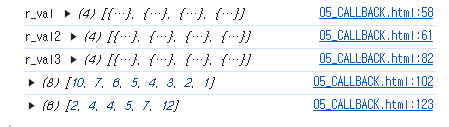

# 01

> **05_CALLBACK.html**
> 



```
<!DOCTYPE html>
<html lang="en">

<head>
    <meta charset="UTF-8">
    <meta name="viewport" content="width=device-width, initial-scale=1.0">
    <title>Document</title>
</head>

<body>

    <script>
        //콜백함수(Call back)
        //함수를 호출하는 시점이 바뀌어진 형태의 함수
        //기존방식 : 사용자(개발자)가 함수를 직접정의 ->정의된 함수를 호출(Call)하여 결과를 반환받는 방식
        //Callback: 콜백함수에 인자로 로직이담긴 함수를(함수주소)를 전달하여 콜백함수로부터 처리된 결과를
        //반환받는 방식  

        //일반함수
        function func(n1, n2) {
            console.log("func(n1,n2)...call!");
            return n1 + n2;
        }

        // const v1 = func(10,20); //call-by-value     //값(value)전달을 통한 함수 직접 실행(call)
        // console.log("v1",v1);

        //콜백함수
        // function callBackFunc(n1,n2,logic){
        //     console.log('callBackFunc....start...');
        //     const v =  logic(n1,n2);
        //     console.log("v",v);
        //     console.log('callBackFunc....start...');
        // }

        // callBackFunc(100,200,func);

        // Callback함수로 map 만들기
        function customMap(array, func) {
            let tmp = [];

            for (let i = 0; i < array.length; i++) {
                const item = array[i];
                const reNewItem = func(item);
                tmp.push(reNewItem);
            }
            return tmp;
        }
        arr = [
            { id: '1111', name: '홍길동', age: 30, addr: "대구" },
            { id: '2222', name: '티모', age: 555, addr: "인천" },
            { id: '3333', name: '렝가', age: 44, addr: "울산" },
            { id: '4444', name: '다리우스', age: 777, addr: "구미" },
        ];

        const r_val = customMap(arr, (item) => { return { id: item.id, name: item.name } });
        console.log("r_val", r_val);

        const v_val2 = customMap(arr, (item) => { return { name: item.name, addr: item.addr } });
        console.log("r_val2", v_val2);

        // CALLBACK + CLOSURE
        function callbackFunc3(array) {
            let tmp = [];   //state

            // inner function
            function map(func) {
                for (let i = 0; i < array.length; i++) {
                    const item = array[i];
                    const reNewItem = func(item);
                    tmp.push(reNewItem);
                }
                return tmp;
            }
            return {
                map: map
            }
        }
        const r_val3 = callbackFunc3(arr).map((item) => { return { '아이디': item.id, '나이': item.age } });
        console.log('r_val3', r_val3);

        // 정렬
        //Sort(삽입정렬)
        function callback3(array, func) {
            let tmp = 0; //임시저장 
            for (i = 0; i < array.length - 1; i++) {

                for (j = i + 1; j < array.length; j++) {
                    if (func(array[j], array[i]) <= 0) {
                        tmp = array[i];
                        array[i] = array[j];
                        array[j] = tmp;
                    }
                }
            }
        }
        arr2 = [10, 2, 4, 5, 1, 3, 7, 6]

        callback3(arr2, (a, b) => { return b - a })
        console.log(arr2)

        function callback4(array) {
            let tmp = 0; //임시저장 

            function sort(func) {
                for (i = 0; i < array.length - 1; i++) {
                    for (j = i + 1; j < array.length; j++) {
                        if (func(array[j], array[i]) <= 0) {
                            tmp = array[i];
                            array[i] = array[j];
                            array[j] = tmp;
                        }
                    }
                }
            }
            return { sort: sort }
        }
        arr3 = [4, 2, 12, 5, 4, 7]
        callback4(arr3).sort((a, b) => a - b)
        console.log(arr3)

        // 필터 만들기(Callback + closure)

    </script>
</body>

</html>
```

---

> **01_마우스.html**
> 


```jsx
<!DOCTYPE html>
<html lang="en">
<head>
    <meta charset="UTF-8">
    <meta name="viewport" content="width=device-width, initial-scale=1.0">
    <title>Document</title>
    <style>
        div{
            width: 300px; height: 200px; border: 1px solid;
        }
    </style>
</head>
<body>
    <div class="d1"></div>
    <hr/>
    <div class="d2"></div>
    <hr/>
    <div class="d3"></div>

    <script>
        const d1El = document.querySelector('.d1');
        var cnt=0;
        d1El.addEventListener('click',(e)=>{
            // console.log('clicked...',e)
            console.log('clicked...',e.target)
            d1El.innerHTML=`<h1>${++cnt}</h1>`
        });

        // 클로저 이용 상태관리
        function clickhandler(){
            let cnt=0;
            function addCnt(node){
                cnt++;
                node.innerHTML=`<h2>클로저내 CNT : ${cnt}</h2>`
                console.log("clicked...",cnt)
            } 
            return addCnt;
        }
        const addCnt = clickhandler();
        const d2El = document.querySelector('.d2')
        d2El.addEventListener('click',()=>{
            addCnt(d2El);
        })

        // mouseEnter   : 마우스 진입
        // mouseOver    : 마우스 머무를시
        // mouseLeave   : 마우스 나갈때
        // click        : 마우스 1 클릭
        // dblclick      : 마우스 2 클릭
        // contextmenu  : 마우스 우클릭
        const d3El = document.querySelector('.d3')
        // d3El.addEventListener('mouseenter',()=>{d3El.innerHTML=`<h1>MOUSE_ENTER</h1>`})
        d3El.addEventListener('mouseover',()=>{d3El.innerHTML=`<h1>MOUSE_OVER</h1>`})
        d3El.addEventListener('mouseleave',()=>{d3El.innerHTML=`<h1>MOUSE_LEAVE</h1>`})
        // d3El.addEventListener('click',()=>{d3El.innerHTML=`<h1>MOUSE_CLICK</h1>`})
        d3El.addEventListener('dblclick',()=>{d3El.innerHTML=`<h1>MOUSE_DbLCLICK</h1>`})
        d3El.addEventListener('contextmenu',()=>{d3El.innerHTML=`<h1>MOUSE_CONTEXTMENU</h1>`})
    </script>
</body>
</html>
```

---

> **프로젝트 화면구현 - 메인**
> 


