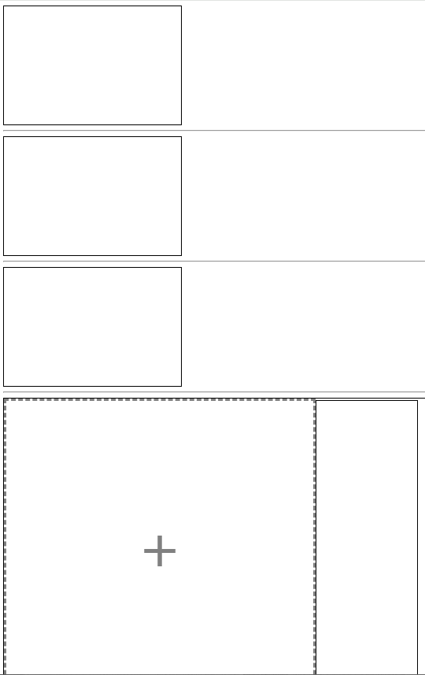

# 01

> **01_마우스.html**
> 



```jsx
<!DOCTYPE html>
<html lang="en">

<head>
    <meta charset="UTF-8">
    <meta name="viewport" content="width=device-width, initial-scale=1.0">
    <title>Document</title>
    <style>
        div {
            width: 300px;
            height: 200px;
            border: 1px solid;
        }

        .drag-block {
            display: flex;
            justify-content: left;
            align-items: center;

            flex-wrap: wrap;
            width: 100%;
            height: 100%;
        }

        .d4 {
            width: 500px;
            height: 500px;
            padding: 10px;
            border: 5px dashed gray;
            position: relative;
            color: gray;
        }

        .d4::after {
            content: "+";
            font-size: 7rem;

            display: flex;
            justify-content: center;
            align-items: center;
            margin: 0;
            width: 100%;
            height: 100%;
            position: relative;
            top: -20px;
        }

        .preview {
            width: 150px;
            height: 500px;
            border: 1px solid;
            padding: 10px;

            display: flex;
            justify-content: start;
            align-items: center;
            overflow-y: auto;
            overflow-x: hidden;
            gap: 5px;
            flex-direction: column;
        }

        .preview::-webkit-scrollbar {
            display: none;
        }
    </style>
</head>

<body>

    <div class="d1"></div>
    <hr />
    <div class="d2"></div>
    <hr />
    <div class="d3"></div>
    <hr />
    <div class="drag-block">
        <div class="d4"></div>
        <div class="preview"></div>
    </div>
    <script>
        const d1El = document.querySelector('.d1');
        var cnt = 0;
        d1El.addEventListener('click', (e) => {
            // console.log('clicked...',e);
            console.log('clicked...', e.target);
            d1El.innerHTML = `<h1>${++cnt}</h1>`
        });

        // 클로저 이용 상태관리
        function clickHandler() {
            let cnt = 0;
            function addCnt(node) {
                cnt++;
                node.innerHTML = `<h2>클로저내 CNT : ${cnt}</h2>`;
                console.log("clicked...", cnt);
            }
            return addCnt;
        }
        const addCnt = clickHandler();
        const d2El = document.querySelector('.d2');
        d2El.addEventListener('click', () => {
            addCnt(d2El);
        });

        // mouseEnter   : 마우스 진입
        // mouseOver    : 마우스 머무를시
        // mouseLeave   : 마우스 나갈때
        // click        : 마우스 1 클릭
        // dblclick      : 마우스 2 클릭
        // contextmenu  : 마우스 우클릭
        const d3El = document.querySelector('.d3');
        // d3El.addEventListener('mouseenter',()=>{d3El.innerHTML=`<h1>MOUSE_ENTER</h1>`});
        // d3El.addEventListener('mouseover',()=>{d3El.innerHTML=`<h1>MOUSE_OVER</h1>`});
        // d3El.addEventListener('mouseleave',()=>{d3El.innerHTML=`<h1>MOUSE_LEAVE</h1>`});
        // d3El.addEventListener('click',()=>{d3El.innerHTML=`<h1>MOUSE_CLICK</h1>`});
        d3El.addEventListener('dblclick', () => { d3El.innerHTML = `<h1>MOUSE_DBCLICK</h1>` });
        d3El.addEventListener('contextmenu', (e) => {
            e.preventDefault();
            d3El.innerHTML = `<h1>MOUSE_우클릭</h1>`
        });
        document.addEventListener('contextmenu', e => {
            e.preventDefault();
        })

        //드래그 드랍 이벤트
        // dragstart    : 드래그 시작(마우스를 클릭해서 끌어당김.. 데이터 전달 설정)
        // drag         : 드래그 중
        // dragenter    : 드래그가 대상 영역 위로 이동시(요소가 드랍의 대상이 될때)
        // dragover     : 드래그가 대상 영역 위에 있는 동안(요소가 드랍의 대상이 될때)
        // dragleave    : 드래그가 대상 영역 에서 벗어남 (요소가 드랍의 대상이 될때)
        // dragend      : 드래그 종료
        // drop         : 드랍처리(마우스를 뗌.. 데이터를 가져와 처리)

        let maxSize = 1024 * 1024 * 1   // 최대 업로드 가능 사이즈 (1Mb)
        function isValid(file)              // 유효성 체크 함수 
        {

            if (!file.type.startsWith("image/")) {
                //이미지 파일인지
                alert("이미지 파일만 업로드 가능합니다.")
                return false;
            }
            else if (file.size >= (1024 * 1024 * 1)) {
                //사이즈가 maxSize를 초과하는지
                alert("파일 업로드의 최대 사이즈는 1 MB입니다.")
                return false;
            } else {
                return true;
            }
        }

        const d4El = document.querySelector('.d4');
        d4El.addEventListener('dragenter', (e) => {
            e.preventDefault();
            console.log('dragenter', e)
        })
        d4El.addEventListener('dragover', (e) => {
            e.preventDefault();
            d4El.style.border = "5px dashed lightgray";
            d4El.style.color = "lightgray";
            console.log('dragover', e)
        })
        d4El.addEventListener('dragleave', (e) => {
            d4El.style.border = "5px dashed gray";
            d4El.style.color = "gray";
            e.preventDefault();

            console.log('dragleave', e)
        })
        d4El.addEventListener('dragend', (e) => {
            e.preventDefault();

            console.log('dragend', e)
        })
        d4El.addEventListener('drop', (e) => {
            e.preventDefault();
            d4El.style.border = "5px dashed gray";
            d4El.style.color = "gray";

            console.log('drop', e)
            console.log('drop', e.target)
            console.log('drop', e.dataTransfer)
            console.log('drop', e.dataTransfer.files)

            const files = e.dataTransfer.files;
            for (let i = 0; i < files.length; i++) {
                console.log('drop', e.dataTransfer.files[i])
                const file = e.dataTransfer.files[i];

                //유효성 확인(FN)
                if (!isValid(file)) return;

                //미리보기로 이미지 보여주기
                const previewEl = document.querySelector('.preview');
                const newImgEl = document.createElement('img');
                newImgEl.src = URL.createObjectURL(file);
                newImgEl.setAttribute('style', 'width:100%;height:100%;object-fit:contain;height:150px;border:1px solid;padding:2px;');
                previewEl.prepend(newImgEl);
            }

        })

    </script>

</body>

</html>
```

---

> **02_마우스.html**
> 


```jsx
<!DOCTYPE html>
<html lang="en">
<head>
    <meta charset="UTF-8">
    <meta name="viewport" content="width=device-width, initial-scale=1.0">
    <title>Document</title>
    <style>
        *{box-sizing: border-box;}
        ul{list-style: none;margin:0;padding:0;}
        a{text-decoration: none;color:gray;}
        body{margin:0};

        .wrapper{}
        .wrapper>header{}
        
        .wrapper>main{
            height :100vh;
        }
        .wrapper>main>section{
            height:100%;
            display:flex;
            justify-content: left;
            align-items: start;
            gap:15px;
        }
        .wrapper>main>section>aside{
            border : 1px solid;
            height:100%;
            width:200px;
        }
        .wrapper>main>section>aside>ul.items{
            padding : 10px;
        }
        .wrapper>main>section>aside>ul.items>li{
            height:35px;
            text-align: center;
            line-height:35px;
            border : 1px solid;
            margin-bottom:5px;

        }
        .wrapper>main>section>aside>ul.items>li>a{
            display:block;
        }

        .wrapper>main>section>article{
            border : 1px solid;
            height:100%;
            width:calc(100% - 200px);
            position:relative;
            left:0;
            top:0;
        }
        .wrapper>main>section>article .item{
            border : 1px solid;
            position:absolute;
        }
        .wrapper>main>section>article .item.item-style-1{
            width : 100px;
            height : 100px;
            background-color: aquamarine;
        }
        .wrapper>main>section>article .item.item-style-2{
            width : 150px;
            height : 150px;
            background-color:royalblue
        }
        .wrapper>main>section>article .item.item-style-3{
            width : 200px;
            height : 200px;
            background-color:orange;
            /* border-radius: 25%; */
        }
        .wrapper>main>section>article .item.item-style-4{
            width : 300px;
            height : 300px;
            background-color:green;
            /* border-radius: 50%; */
        }

    </style>
</head>
<body>
    
    <div class="wrapper">
        <header></header>
        <main>
            <section>
                <aside>

                    <ul class="items">
                        <li><a href="" draggable="true" class="item-style-1">ITEM_1</a></li>
                        <li><a href="" draggable="true" class="item-style-2">ITEM_2</a></li>
                        <li><a href="" draggable="true" class="item-style-3">ITEM_3</a></li>
                        <li><a href="" draggable="true" class="item-style-4">ITEM_4</a></li>
                    </ul>

                </aside>
                <article class="board">

                </article>
            </section>
            <footer></footer>
        </main>
    </div>

    <script>
        //상태정보 저장
        let isMoving = false;
        let offsetX = 0;
        let offsetY = 0;
        let targetNode = false;

        // 1 아이템 드래그 & 드랍
        const liEls = document.querySelectorAll('.items li');
        let dragedNode = null;
        liEls.forEach((liEl)=>{
            liEl.addEventListener('dragstart',(e)=>{
                // console.log('dragstart',e.target);
                dragedNode = e.target;
                console.log("dragedNode",dragedNode);
            });
        })

        const boardEl = document.querySelector('.board'); 

        boardEl.addEventListener('dragover',(e)=>{
            e.preventDefault();
        });
        boardEl.addEventListener('drop',(e)=>{
            e.preventDefault();
            console.log('dropevent',e);
            console.log('ClientXY',e.clientX,e.clientY);
            console.log('OffsetXY',e.offsetX,e.offsetY);

            
            const newDivEl = document.createElement('div');
            
            // 2 요소 옮기기 이벤트 추가
            newDivEl.addEventListener('mousedown',movingHandler);
            
            newDivEl.classList.add('item');
            newDivEl.setAttribute('style',`left:${e.offsetX}px;top:${e.offsetY}px;`)
            const itemAllClassArr=Object.values(dragedNode.classList);
            itemAllClassArr.forEach((className)=>{
                newDivEl.classList.add(className);
            })
            console.log('dragedNode',itemAllClassArr);

            boardEl.appendChild(newDivEl);
        });

        // 우클릭 시 이동 처리
        boardEl.addEventListener('contextmenu',(e)=>{
            e.preventDefault();
        });

        const movingHandler = (e)=>{
            console.log(e.button);
            if(e.button==2) //우 클릭시
            {
                if(!isMoving){
                    //옮기는 시작 위치에서 우클릭
                    isMoving = true;
                    e.target.style.opacity=".6";
                    
                    targetNode=e.target;
                    //마우스좌표 저장 이벤트 추가
                    boardEl.addEventListener('mousemove',mouseXYsaveHandler);
                }
                else{
                    //옮기는 끝 위치에서 우클릭
                    isMoving = false;
                    e.target.style.opacity="1";
                    
                    targetNode=null;
                    //마우스좌표 저장 이벤트 제거
                    boardEl.removeEventListener('mousemove',mouseXYsaveHandler);
                }
            }
        };

        //마우스 이동 처리 핸들러
        const mouseXYsaveHandler = (e)=>{
            // console.log('mouseXYsaveHandler',e);
            // 타겟노드의 위치 및 크기 가져오기
            const rect = targetNode.getBoundingClientRect();
            const width = rect.width;
            const height = rect.height;
            
            const centerX = rect.left + rect.width / 2;
            const centerY = rect.top + rect.height / 2;
            console.log(centerX,centerY);

            

            console.log(rect);
            targetNode.style.left=`${e.clientX - 200 - 20}px`;
            targetNode.style.top=`${e.clientY - 10}px`;
        }
    </script>
</body>
</html>
```